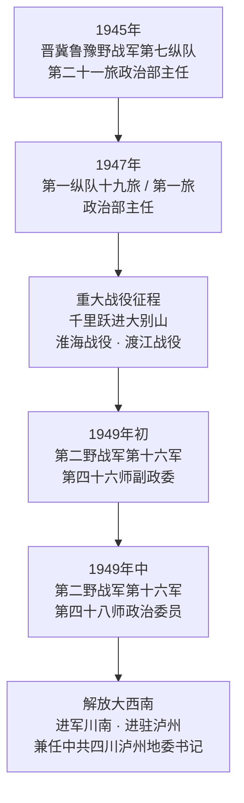

# 姜思毅将军数字化纪念档案与生平文献库
**General Jiang Siyi (1920–2009) Digital Memorial Archive & Comprehensive Biographical Dossier**

本项目是关于中国人民解放军原军事科学院副院长**姜思毅中将（1920—2009）**的数字化纪念档案库、生平事迹长篇全景报告与公开史料文献汇编。

---

## 目录 (Table of Contents)
- [1. 人物档案与生平概览 (Profile & Executive Summary)](#1-人物档案与生平概览-profile--executive-summary)
- [2. 早年求索与投身革命 (Early Life & Revolutionary Awakening, 1920–1937)](#2-早年求索与投身革命-early-life--revolutionary-awakening-19201937)
- [3. 烽火抗战与政工实践 (Anti-Japanese War Period, 1937–1945)](#3-烽火抗战与政工实践-anti-japanese-war-period-19371945)
- [4. 解放战争的重大征程 (War of Liberation, 1945–1949)](#4-解放战争的重大征程-war-of-liberation-19451949)
- [5. 建国后军政领导与军队院校建设 (Post-1949 Military Leadership & Political Academy, 1949–1985)](#5-建国后军政领导与军队院校建设-post-1949-military-leadership--political-academy-19491985)
- [6. 军事科学院领导与战略科研开拓 (Leadership at the Academy of Military Sciences, 1985–1990s)](#6-军事科学院领导与战略科研开拓-leadership-at-the-academy-of-military-sciences-19851990s)
- [7. 核心学术贡献与代表性著述 (Academic Contributions & Major Publications)](#7-核心学术贡献与代表性著述-academic-contributions--major-publications)
- [8. 国内外历史评价与学术声誉 (Historical Evaluations & International Reception)](#8-国内外历史评价与学术声誉-historical-evaluations--international-reception)
- [9. 姜思毅将军生平大事年表 (Chronological Timeline 1920–2009)](#9-姜思毅将军生平大事年表-chronological-timeline-19202009)
- [10. 仓库结构与文献索引 (Repository Structure)](#10-仓库结构与文献索引-repository-structure)
- [11. 本地预览与站点运行 (Local Development)](#11-本地预览与站点运行-local-development)

---

## 1. 人物档案与生平概览 (Profile & Executive Summary)

```
================================================================================
【中文姓名】姜思毅
【曾 用 名】姜耀曾
【英文译名】Jiang Siyi
【生卒日期】1920年 － 2009年1月1日（享年89岁）
【籍    贯】天津市
【入党时间】1936年
【参军时间】1937年
【最终军衔】中国人民解放军中将（1988年授予）
【主要职务】中国人民解放军军事科学院副院长、解放军政治学院副院长、
            总政治部宣传部部长、总政治部副秘书长
【代表勋章】二级独立自由勋章、二级解放勋章、二级红星功勋荣誉章
【政治兼职】第五、六届全国政协委员
【学术社会兼职】全国中共党史学会副会长、中华人民共和国国史学会顾问、
                中华炎黄文化研究会常务副会长、中国军事科学学会副会长
================================================================================
```

姜思毅（1920—2009），中国人民解放军杰出的政治工作领导者、著名军事理论家和军史学家，中国人民解放军中将。他青年时期投身“一二·九”学生爱国运动，抗日战争和解放战争期间长期战斗在敌后战区和主力野战军前线，主持战时思想动员与政治工作；建国后历任总政治部宣传部部长、解放军政治学院副院长、军事科学院副院长等高级领导职务。

在20世纪80至90年代中国国防和军队建设的“战略性转变”时期，姜思毅将军主持编纂了一系列奠基性的军史、政工史与战史巨著（如《中国共产党军队政治工作七十年史》《中印边境自卫反击作战史》《中国人民解放军大事典》等），为毛泽东军事思想研究、解放军政治工作学构建以及现代条件下局部战争理论的探索作出了不可磨灭的学术贡献。

---

## 2. 早年求索与投身革命 (Early Life & Revolutionary Awakening, 1920–1937)

### 2.1 青年求学与思想启蒙
姜思毅于1920年出生于天津市一个具有文化氛围的家庭，原名姜耀曾。20世纪30年代初，华北局势风云变幻，日本帝国主义步步进逼，华北之大已安放不下一张平静的书桌。在天津求学期间，姜思毅深受进步思想与马克思主义理论的影响，积极追求救国救民的真理。

### 2.2 “一二·九”运动与入党经历
* **投身学生爱国浪潮（1935年）**：1935年12月，北平爆发著名的“一二·九”运动并迅速波及全国。在天津，姜思毅以极大的热忱投身爱国学生运动，参与组织示威游行、抗日宣传和抵制日货斗争。
* **加入中国共产党（1936年）**：经过学生斗争的淬炼，姜思毅于1936年正式加入中国共产党，走上职业革命家道路。
* **担任基层党组织领导**：他曾担任天津扶轮中学党支部书记等职务，在严密的白色恐怖下负责青年学生运动和地下党团的组织与宣传工作，展现出卓越的组织才能和思想宣传天赋。

---

## 3. 烽火抗战与政工实践 (Anti-Japanese War Period, 1937–1945)

### 3.1 奔赴抗日前线与八路军初建
1937年7月卢沟桥事变爆发后，全国抗日战争全面展开。姜思毅毅然投笔从戎：
* 1937年10月，参加华北抗日联军冀东第一支队；
* 同年转入中国共产党领导的八路军，出任**八路军第一一五师支队宣传股股长**。

### 3.2 挺进冀鲁边与开辟敌后根据地
* **东进抗日挺进纵队（1938年）**：1938年，八路军成立东进抗日挺进纵队（由萧华等率领）开辟冀鲁边抗日根据地。姜思毅出任**纵队政治部宣教科科长**，在极其残酷的反“扫荡”斗争中负责战地动员、民运宣传和战士文化教育。
* **鲁西军区与主力旅（1939年）**：1939年，姜思毅调任**鲁西军区兼八路军第一一五师第三四三旅政治部宣传部副部长**，协助旅首长加强部队思想政治建设，筑牢官兵克敌制胜的精神支柱。

### 3.3 冀鲁豫根据地的宣传重任
抗战中后期，姜思毅历任**冀鲁豫军区政治部宣传部部长**等职。冀鲁豫根据地地处中原要冲，面临日伪频繁残酷的“清剿”“蚕食”和国民党顽固派的摩擦。姜思毅在此期间创造性地总结并推行了一套战时政治工作机制，包括：
1. **战前士气动员与战中随军鼓动**；
2. **瓦解敌伪军的政治心理战**；
3. **军民鱼水深情的宣教纽带建设**。

这些扎实而富有成效的政治工作实践，为日后他系统总结解放军政治工作史积累了第一手宝贵经验。

---

## 4. 解放战争的重大征程 (War of Liberation, 1945–1949)

在第三次国内革命战争（解放战争）中，姜思毅历经晋冀鲁豫野战军、中原野战军与第二野战军的历次重大战役，历任旅政治部主任、师副政委、师政委，成长为主力部队的军政高级指挥员。



### 4.1 晋冀鲁豫野战军时期的征战
* **1945年11月**：担任晋冀鲁豫野战军第七纵队第二十一旅政治部主任。
* **1947年起**：调任晋冀鲁豫野战军第一纵队第十九旅政治部主任、第一旅政治部主任。
* **千里跃进大别山**：在刘伯承、邓小平率领下，第一纵队作为主力强渡黄河，千里挺进大别山，实施无后方依托的战略突进。姜思毅在极端严酷的战局中，深入一线连队稳定思想，严格执行群众纪律，保障了部队高度的凝聚力与战斗力。

### 4.2 决战中原与席卷大西南
* **淮海战役与渡江战役**：姜思毅参与了歼灭黄维兵团的双堆集血战等战役战斗；随后随第二野战军主力参加渡江战役，突破长江天险，向华东南进军。
* **出任师政委与解放西南**：1949年初，姜思毅任中国人民解放军第二野战军第五兵团第十六军第四十六师副政治委员，随后升任**第四十八师政治委员**。在大西南战役中，第四十八师进军川南、黔北，有力击溃了国民党残部，解放了泸州等重要重镇。
* **兼任地方党政领导**：在接管与清剿匪患期间，姜思毅兼任**中共四川省泸州地委书记**，领导了建立新生人民政权、剿匪反霸、土地改革前置准备及地方经济社会恢复工作，展现出军政双全的领导能力。

---

## 5. 建国后军政领导与军队院校建设 (Post-1949 Military Leadership & Political Academy, 1949–1985)

### 5.1 军政院校的教育拓荒
新中国成立初期，大批军队干部亟需提升现代军事素养与政治理论水平。姜思毅调任**西南军政大学第五分校副政治委员**，投身军队干部的正规化教育培训，为新中国西南边疆的建设培养输送了大批军政骨干。

### 5.2 总政治部的高层任职
调入中央军委和解放军总部后，姜思毅在解放军政治工作最高领导中枢担负重任：
* **中国人民解放军总政治部副秘书长**；
* **中国人民解放军总政治部宣传部部长**。

在主持全军思想宣传期间，他深入贯彻“政治工作是人民军队生命线”的根本原则，组织编撰全军思想政治教育大纲，抓好军队宣传媒体建设，推动官兵理论学习和英模宣传。

### 5.3 领导解放军政治学院
20世纪70年代末至80年代初，姜思毅出任**中国人民解放军政治学院副院长**。在拨乱反正、解放思想的历史关头，他积极主持恢复和发展军队政治教育学科体系，大力推动教材重构、学科建设与师资培养，亲自主持编撰了具有里程碑意义的《中国人民解放军政治工作史》（1984年版），填补了军校系统教学科研的重大空白。

---

## 6. 军事科学院领导与战略科研开拓 (Leadership at the Academy of Military Sciences, 1985–1990s)

### 6.1 出任军事科学院副院长与授予中将军衔
* **1985年底**：姜思毅出任**中国人民解放军军事科学院副院长**，成为全军最高军事科研学府的核心领导成员之一。
* **1988年9月**：在解放军恢复军衔制的大典上，姜思毅被授予**中国人民解放军中将军衔**。

### 6.2 推动国防与军队建设指导思想的“战略性转变”
1985年，中央军委扩大会议作出军队建设指导思想实行战略性转变的重大决策（从立足于“早打、大打、打核战争”转变为和平时期现代化建设轨道）。姜思毅将军在军事科学院积极组织并领导全军科研力量开展理论攻关：
1. **现代局部战争理论研究**：紧跟世界新军事变革趋势，深入探索高技术条件下现代局部战争的制胜机理；
2. **战史经验的科学总结**：强调战史研究必须坚持实事求是、经世致用，为未来作战提供历史智慧与战略启示；
3. **抗美援朝战争文献影视指导**：指导拍摄了全景式大型文献纪录片《抗美援朝战争》，并对第二次战役（如长津湖战役）等重大历史节点进行了深刻的战略剖析与历史定位。

---

## 7. 核心学术贡献与代表性著述 (Academic Contributions & Major Publications)

姜思毅将军既是战功卓著的高级将领，也是享誉军内外的杰出学者。他的著述涵盖军史、战史、政工理论、毛泽东军事思想及辞书编纂等多个领域。

### 7.1 主要代表性著作一览

| 著作名称 | 出版时间 / 社 | 担任角色 | 核心学术价值与历史地位 |
| :--- | :--- | :--- | :--- |
| **《中国共产党军队政治工作七十年史》**<br>*(全六卷本)* | 1991年<br>解放军出版社 | **主编** | 全景式梳理建党建军70年来政治工作的演进脉络与历史规律，是全军政治工作史研究的奠基性、权威性巨著。 |
| **《中印边境自卫反击作战史》** | 1994年<br>军事科学出版社 | **主编**<br>*(与李惠等)* | 基于官方解密档案与战地实录编写的权威战史，被国内外军界与学术界公认为研究1962年中印战争最核心的一手文献。 |
| **《中国人民解放军大事典》**<br>*(上下册)* | 1992年<br>天津人民出版社 | **主编** | 系统收录解放军从建军到现代化建设各历史时期的重大事件，具有极高的文献检索与工具书考据价值。 |
| **《中国人民解放军政治工作史》** | 1984年<br>解放军政治学院出版社 | **主编** | 改革开放初期首部系统化军校政治工作史权威教材，规范了军队政工史的学科范式。 |
| **《生命线的探索》** | 专著 / 论集 | **著者** | 深刻阐释“政治工作是人民军队生命线”的理论内涵与新时期实践路径。 |
| **《战略性的大转变》** | 专著 / 论集 | **著者** | 系统论述邓小平新时期军队建设思想与国防战略转型的重大意义与实践逻辑。 |
| **《毛泽东军事思想的世界地位》** | 1993年<br>《南京政治学院学报》等 | **著者** | 站在世界军事思想史与哲学高度，论证毛泽东军事辩证法与人民战争理论对全球战略思想的深远贡献。 |

### 7.2 核心理论贡献概述
* **军队政治工作学体系的奠基**：姜思毅通过七十年史的编纂，首次系统确立了“党指挥枪”、思想政治工作基本原则与优良传统在各个历史时期的演变规律，为解放军政治工作学科奠定了理论基石。
* **毛泽东军事思想的系统阐发**：他坚持历史与逻辑相统一的方法论，深入挖掘毛泽东军事思想在当代反侵略作战和局部战争中的指导价值。
* **权威军事辞书与战史编纂规范**：在军事科学院任职期间，他推动并规范了重大战史、大典和百科辞书的编纂体例，强调档案考据与战术战略复盘相结合。

---

## 8. 国内外历史评价与学术声誉 (Historical Evaluations & International Reception)

### 8.1 官方与党军评价
2009年1月1日姜思毅同志逝世后，新华社发布通稿，给予了高度的历史评价：
> **“中国共产党的优秀党员，久经考验的忠诚的共产主义战士，中国人民解放军的高级将领，中国人民解放军军事科学院原副院长姜思毅同志……为部队的革命化、现代化、正规化建设，为繁荣发展军事科研事业和繁荣党史军史研究作出了重要贡献。”**

* 党和国家领导人温家宝、李克强、王刚、王岐山、刘延东、张高丽、徐才厚、郭伯雄、李瑞环、刘华清、曾庆红、吴官正等同志，分别以不同方式对姜思毅同志的逝世表示深切哀悼，并对其亲属表示亲切慰问。

### 8.2 军史与学术界评价
* **“学者型将军”的典范**：学术界公认姜思毅将军是将帅之才与学者之风融于一体的典范。他一生笔耕不辍，治学严谨求实，勇于在理论上探索创新。
* **离休后的奉献**：1998年离休后，他先后担任全国中共党史学会副会长、中华人民共和国国史学会顾问、中华炎黄文化研究会常务副会长、冀鲁豫地区革命纪念馆陈列委员会主任等职，为弘扬革命传统与中华优秀传统文化倾注了毕生心血。

### 8.3 国际汉学与军事战略学界评价 (International Academic Reception)
在西方中国军事研究（PLA Studies）及中印关系史研究领域，姜思毅的名字具有极高的学术引用率：
* **剑桥大学出版社 (Cambridge University Press)、加州大学出版社 (UC Press) 及美国陆军战争学院 (US Army War College)** 在多部关于中国国防战略演进、解放军政委制度（Political Commissar System）及1962年中印边境冲突的权威学术专著中，均将姜思毅主编的《中印边境自卫反击作战史》与《中国共产党军队政治工作七十年史》列为最重要的权威引证来源（Core Primary Reference）。
* 国际学者普遍认为，姜思毅在军事科学院任职期间代表了中国军界高层在和平时期推动军事学向正规化、现代化和国际化战略对接的关键理论力量。

---

## 9. 姜思毅将军生平大事年表 (Chronological Timeline 1920–2009)

| 年份 | 关键生平事件与任职 (Biographical & Career Milestones) |
| :--- | :--- |
| **1920年** | 出生于天津市，原名姜耀曾。 |
| **1935年** | 在天津积极投身著名的“一二·九”学生爱国运动。 |
| **1936年** | 加入中国共产党，任天津扶轮中学党支部书记，从事地下党团与学生宣传工作。 |
| **1937年** | 全面抗战爆发后奔赴前线，10月参加冀东抗日联军第一支队；同年参加八路军，任第115师支队宣传股长。 |
| **1938年** | 任八路军东进抗日挺进纵队政治部宣教科科长，深入冀鲁边敌后开展斗争。 |
| **1939年** | 任鲁西军区兼第115师第343旅政治部宣传部副部长。 |
| **抗战中后期** | 任冀鲁豫军区政治部宣传部部长，主持根据地军民思想动员与抗日宣传。 |
| **1945年** | 抗日战争胜利，11月起任晋冀鲁豫野战军第七纵队第二十一旅政治部主任。 |
| **1947年** | 任晋冀鲁豫野战军第一纵队第十九旅、第一旅政治部主任，参加千里跃进大别山等重大战役。 |
| **1948–1949年** | 参加淮海战役、渡江战役；任第二野战军第十六军第四十六师副政委、第四十八师政委。进军大西南，兼任中共四川省泸州地委书记。 |
| **1950年代** | 任西南军政大学第五分校副政委，从事军队院校干部培训。 |
| **1955年** | 获授中国人民解放军大校军衔；荣获**二级独立自由勋章**、**二级解放勋章**。 |
| **1960–1970年代** | 历任中国人民解放军总政治部副秘书长、总政治部宣传部部长。 |
| **1970年代末–1980年代初** | 任中国人民解放军政治学院副院长；当选第五、六届全国政协委员；1984年主编出版《中国人民解放军政治工作史》。 |
| **1985年** | 出任**中国人民解放军军事科学院副院长**，领导全军高层军事科学理论研究。 |
| **1988年** | 在解放军恢复军衔制大典上，被授予**中国人民解放军中将军衔**；荣获**二级红星功勋荣誉章**。 |
| **1991–1994年** | 主编出版《中国共产党军队政治工作七十年史》（1991）、《中国人民解放军大事典》（1992）、《中印边境自卫反击作战史》（1994）等传世巨著。 |
| **1998年** | 正式离休；继续担任全国中共党史学会副会长、国史学会顾问、中华炎黄文化研究会常务副会长等职。 |
| **2009年1月1日** | 因病医治无效在北京逝世，享年89岁。党和国家及军队领导人致以深切哀悼。 |

---

## 10. 仓库结构与文献索引 (Repository Structure)

```
general-jiang-archive/
├── content/                     # 档案内容与文献页面 (Markdown)
│   ├── timeline/                # 生平年谱与关键历史阶段
│   ├── works/                   # 主编军事历史巨著与代表性著述
│   └── gallery/                 # 勋章荣誉与历史影像资料
├── static/                      # 静态资源（历史照片、扫描件等）
│   └── images/
├── themes/PaperMod/             # Hugo 极简现代文献主题
├── hugo.toml                    # 站点核心配置文件
├── jiang_siyi_biography.md      # 姜思毅中将生平事迹、学术贡献与历史评价全景报告
├── jiang_siyi_wikipedia.md      # 符合 Wikipedia 标准规范的条目源码 (Wikitext)
└── README.md                    # 仓库主索引与生平全景档案 (本文件)
```

---

## 11. 本地预览与站点运行 (Local Development)

本数字化纪念站点基于静态站点生成器 [Hugo (Extended)](https://gohugo.io/) 与 `PaperMod` 主题构建。

### 运行步骤：
1. **克隆本仓库**：
   ```bash
   git clone https://github.com/fordeepbasics/Siyi.git
   cd Siyi
   ```
2. **启动本地实时预览服务器**：
   ```bash
   hugo server -D
   ```
3. 在浏览器中打开 `http://localhost:1313` 即可浏览纪念档案站点。
