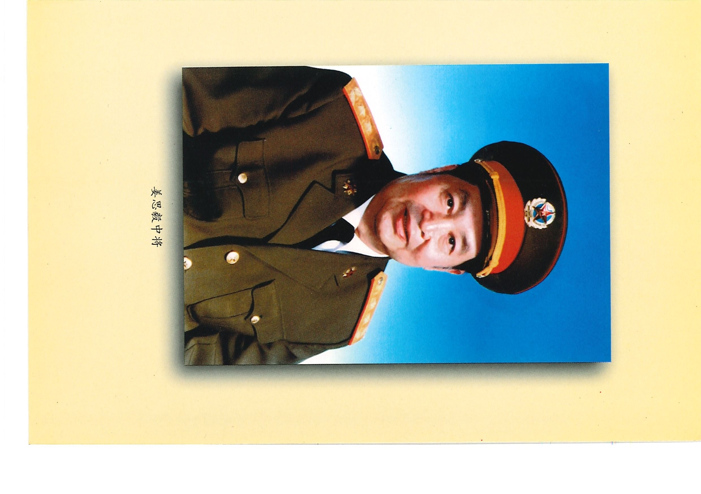
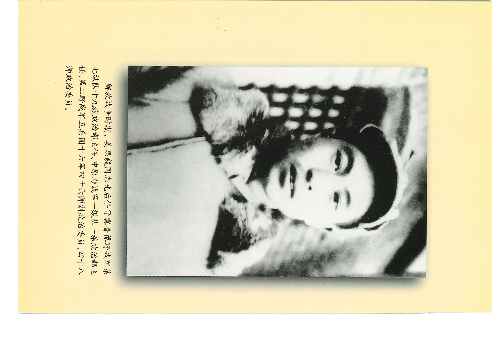
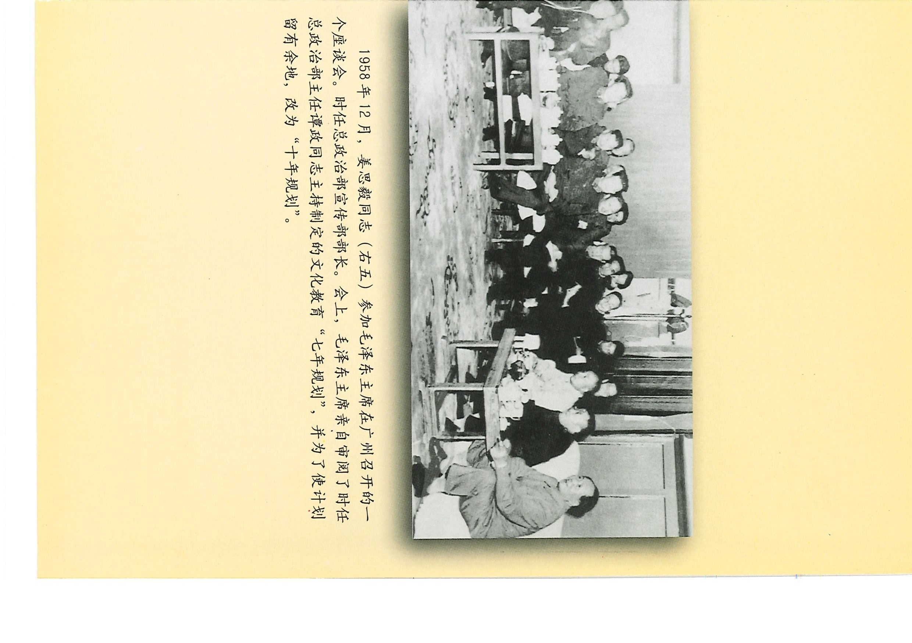
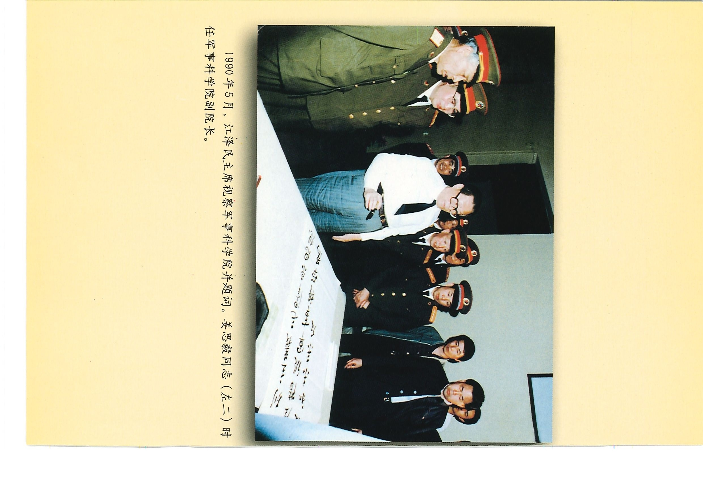
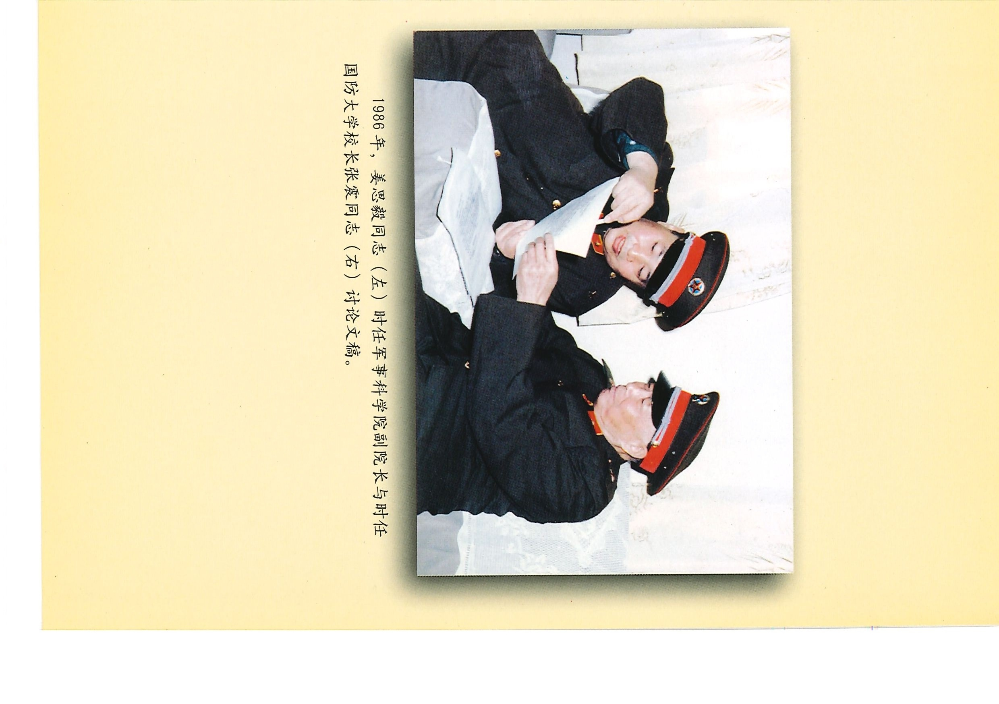
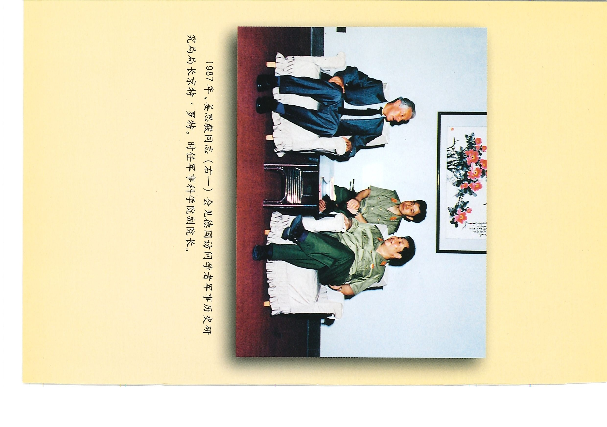
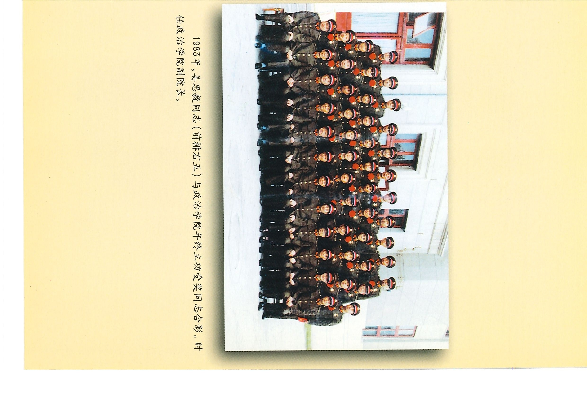
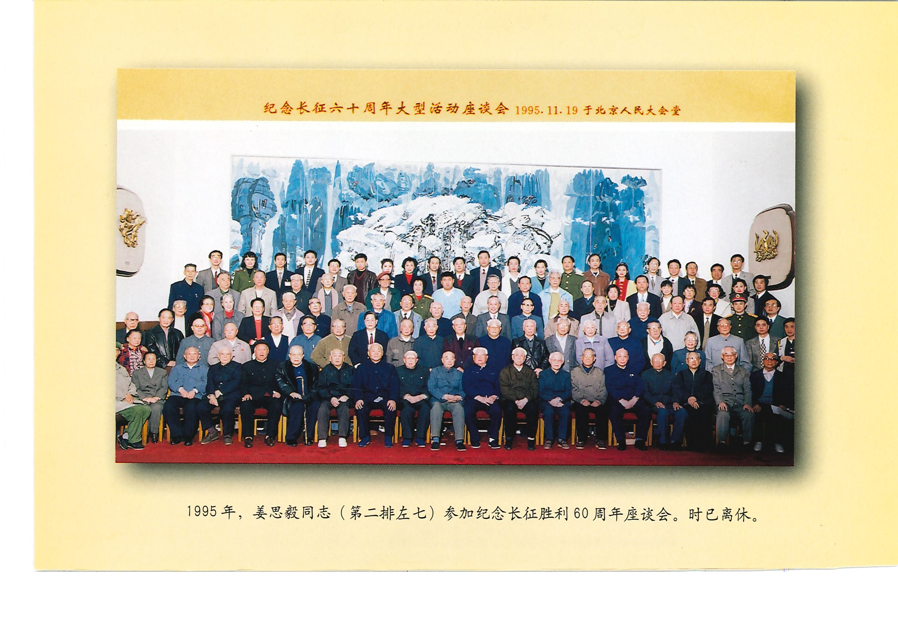

<!-- Page 封面 -->
# 生命线之歌

**祝庭勋 著****长征出版社**

<!-- Page 扉页折口 -->
### 作者简介

**祝庭勋**, 1932年6月生,江苏省淮阴市人。南京金陵中学高中肄业。1949年6月参加革命,1950年9月加入中国共产党。历任新华社随军记者,16军47师宣传干事;沈阳军区政治部编辑,副科长,副秘书长;总政治部秘书处副处长、处长、副秘书长、群众工作部部长,解放军报社社长。1955年授上尉军衔,1988年授少将军衔,1994年离休。

---

<!-- Page 插图1 -->

姜思毅中将

<!-- Page 插图2 -->

解放战争时期,姜思毅同志先后任晋冀鲁豫野战军第七纵队十九旅政治部主任、中原野战军一纵队一旅政治部主任、第二野战军五兵团十六军四十六师副政治委员、四十八师政治委员。

<!-- Page 插图3 -->

1958年12月,姜思毅同志(右五)参加毛泽东主席在广州召开的一个座谈会。时任总政治部宣传部部长。会上,毛泽东主席亲自审阅了时任总政治部主任谭政同志主持制定的文化教育“七年规划”,并为了使计划留有余地,改为“十年规划”。

<!-- Page 插图4 -->

1990年5月,江泽民主席视察军事科学院并题词。姜思毅同志(左二)时任军事科学院副院长。

<!-- Page 插图5 -->

1986年,姜思毅同志(左)时任军事科学院副院长与时任国防大学校长张震同志(右)讨论文稿。

<!-- Page 插图6 -->

1987年,姜思毅同志(右一)会见德国访问学者军事历史研究局局长京特·罗特。时任军事科学院副院长。

<!-- Page 插图7 -->

1983年,姜思毅同志(前排右五)与政治学院年终立功受奖同志合影。时任政治学院副院长。

<!-- Page 插图8 -->

1995年,姜思毅同志(第二排左七)参加纪念长征胜利60周年座谈会。时已离休。(纪念长征六十周年大型活动座谈会 1995.11.19于北京人民大会堂)

---

<!-- Page 1 -->

# 生命线之歌
### ——记军队政治工作者姜思毅

祝庭勋 著

长征出版社
2002年3月·北京

<!-- Page 2 -->

责任编辑：吴纪学 王亚宁
封面设计：周小玮

**图书在版编目（CIP）数据**

生命线之歌 / 祝庭勋著. —北京：长征出版社, 2002
ISBN 7-80015-744-X

Ⅰ. 生… Ⅱ. 祝… Ⅲ. 姜思毅 - 生平事迹Ⅳ. K825.2

中国版本图书馆 CIP 数据核字 (2001) 第 098720 号

---

长征出版社出版发行
（北京阜外大街 34 号；邮编：100832）
电话：68586781
天利华印刷厂印刷 新华书店经销2002 年 3 月第 1 版 2002 年 3 月第 1 次印刷
开本：850×1168 毫米 1/32 13 印张 4 插页
250 千字 印数：1-3000 册
定价：26.60 元

ISBN 7-80015-744-X/D·177
（本书如有印装错误，我社负责调换）

<!-- Page 3 -->

# 目录

- 小引：政治工作是我军的生命线 …… (1)
- 第一章 知识分子的革命洗礼 …… (7)
  - 16 岁的天津市地下党支部书记 …… (7)
  - 到工农兵中宣传抗日 …… (13)
  - 在市委书记的直接领导下 …… (16)
  - 少年的成长 …… (20)
- 第二章 革命军队的宣传工作 …… (22)
  - 从研究连队教育开始 …… (24)
  - 连队政治教育的六条经验 …… (27)
  - 战斗的歌声 …… (35)
  - 连队“没有课本子的教育” …… (41)
  - 一个调查研究报告活动 …… (48)
  - 班长高贵连的带兵方法 …… (52)
  - 《班长梁顺礼的管理学》 …… (56)
  - 把政治工作贯穿在战斗战役的全过程 …… (64)
  - 战场鼓动的核心是激扬英雄主义 …… (73)
  - 不尽的战士情怀 …… (84)

<!-- Page 4 -->

  - 为工农干部知识化尽心尽力 …… (87)
  - 在整风运动中 …… (91)
  - 毛泽东思想的早期宣传者 …… (98)
  - 战斗的 7 年 …… (101)
- 第三章 旅政治机关的领导工作 …… (104)
  - 参与 21 旅作战指挥 …… (105)
  - 为邓小平政委称道的袁占梅班——战士之家 …… (111)
  - 自我教育的新方法——诉苦运动 …… (114)
  - 学好记好和门板报活动——立功运动普及提高的好形式 …… (120)
  - 旅政治部主任在作战中立功 …… (129)
  - 淮海战役战壕里的报告 …… (135)
  - 渡江战役中的师船舶委员会主任 …… (145)
  - 纪律，革命无不胜的条件 …… (149)
  - 进军大西南的师党委书记 …… (153)
  - 《八月的扎佐》 …… (168)
- 第四章 在政治工作的最高领导机关 …… (174)
  - 爱国主义思想的第一课 …… (176)
  - 在文化教育战线上 …… (185)
  - 两个典型的推广——祁建华和常青 …… (190)
  - 华南军区的文化教育经验 …… (196)
  - 十年大计的良好开端 …… (200)
  - 林彪指责“方向偏”，姜思毅据理力争 …… (208)
  - 理论的勇气 …… (211)

<!-- Page 1 -->

  - 文艺战线的“两条腿走路” …… (226)
  - 向雷锋同志学习 …… (237)
  - 军事训练中的政治工作 …… (240)
  - 贬居生活 …… (254)
- 第五章 探索生命线的科学理论 …… (258)
  - 从拨乱反正开始 …… (258)
  - 论述生命线同“突出政治”的根本对立 …… (265)
  - 政治工作是一门科学 …… (274)
  - 政治工作的继承和创新 …… (290)
- 第六章 深入研究毛泽东军事思想 …… (294)
  - 毛泽东思想的地位 …… (294)
  - 毛泽东军事思想论纲 …… (300)
  - 毛泽东军事思想的世界地位 …… (313)
  - 毛泽东思想与中国传统文化 …… (320)
- 第七章 战斗在教学与科研战线 …… (330)
  - 随军学校的经验 …… (330)
  - 以基本理论为指导 以研究实际为中心 …… (333)
  - 编一部政治工作教程 …… (338)
  - 军事科学研究的方法 …… (341)
  - 向江泽民主席的一次汇报 …… (347)
  - 姜思毅的科研课题——国防现代化论纲 …… (348)
  - 科学研究的方方面面 …… (359)
  - 研究中华传统文化 …… (366)
- 第八章 回忆与学习 …… (370)
  - 回忆学习刘帅的政治艺术 …… (370)

<!-- Page 2 -->

  - 回忆学习邓小平：“正确地宣传毛泽东思想” …… (382)
  - 回忆学习罗荣桓：“政治工作的帅” …… (387)
  - 回忆学习谭政：“政治工作的巨匠” …… (390)
  - 回忆学习钟期光：“政治工作大师” …… (400)
- 后记 …… (404)
- 附：姜思毅主要编著书目 …… (406)

<!-- Page 3 -->

# 小引：政治工作是我军的生命线

什么是军队的生命线？政治工作是我们人民军队的生命线。这个命题，是毛泽东、周恩来、朱德在 20 世纪二三十年代中国工农红军初创不久提出来的。它是伴随我军成长壮大的一条红线。中国人民解放军，在中国共产党的领导下，有了革命的政治工作，就成为一支不同于古今中外任何军队的新型人民军队。

让我们简要地回顾一下这一命题的历史：1929 年，毛泽东在古田会议决议中强调加强思想政治工作，克服种种非无产阶级思想；1934 年，周恩来、朱德在红军政治工作会议上指出，“政治工作是红军的生命线”；1938 年，毛泽东把“研究军事的理论，研究战略和战术，研究军队政治工作”，作为不可或缓的三件事，并且指出，“政治工作研究有第一等的成绩”；1944 年，毛泽东在修改谭政关于军队政治工作报告时再次指出，“共产党领导的革命的政治工作是革命军队的生命线”；1954 年，毛泽东在审定中国人民解放军政治工作条例时，再次肯定了“政治工作<!-- Page 4 -->是我军的生命线”；1955 年，他进而提出“政治工作是一切经济工作的生命线”。

我们可以说，军队政治工作，在第一次国内革命战争中萌芽，在第二次国内革命战争中奠基，在抗日战争中成熟，在解放战争中丰富发展。新中国成立后，在建设现代化革命军队中，又有了很大的发展，已经成为一门重要的科学了。

然而，政治工作是我军的生命线，它是就其重要性所做的形象化的比喻。也就是说，政治工作是保证我军生存和发展的最根本的因素，是指加强党对军队的绝对领导、加强军队的思想政治建设、加强军内外团结、完成各项任务等，起“保证作用”而言的；它不能也不应该同党的领导并列，不是起“领导作用”的。把握好这一基本观点，坚持正确的方向，防止“左”和右的影响，对军队建设至关重要。

政治工作的地位和作用究竟应当怎样认识呢？按照毛泽东的经典说法，政治工作在革命军队中“都应有其适当的地位，都应适当地强调它的作用”；同时他又指出，“对于政治工作地位的过分强调是不对的，但是没有必要的强调，没有必要的地位，也是不对的。”

几十年来，我军的政治工作是在党的领导下，在战争和建军的实践中丰富发展的，又是在同“左”的和右的倾向斗争中前进的。战争年代如此，和平建设时期，“左”的危害很是严重，斗争也更复杂。自从 1958 年毛泽东提出“思想和政治又是统帅，是灵魂”后，林彪把它推向极端，<!-- Page 1 -->在他主持军委工作时，广泛使用“政治挂帅”，“思想政治工作挂帅”，进而提出“突出政治”，政治可以冲击一切，一切要给思想政治工作让路。说这是“符合社会主义发展规律的真理”，甚至荒谬地说，我军两条路线的斗争，一条是突出政治，一条是突出军事。这就把政治工作的作用推到一个极不适当的地位，尤其在“文革”期间，给军队建设，给人们的思想，造成混乱，带来危害，是极其严重的。直到党的十一届三中全会，拨乱反正，军政治工作才重新恢复和发扬了我军的优良传统。

研究历史，离不开研究历史上的代表人物。研究革命历史，离不开研究革命领袖和其他有代表性的人物。研究革命军队政治工作 70 多年的历史，同样离不开研究政治工作中重要的人物。除了革命领袖人物有关政治工作的思想和实践外，本书传主姜思毅，作为政治干部重要的一员，60 多年，经历白区斗争、战争年代与和平时期，从事过政治工作实践与政治工作研究，是曾经在我军政治工作创始人直接领导下，又对我军政治工作有着重要贡献的代表人物，很值得学习研究。

姜思毅在我军政治工作中有独特的经历。他少年时期开始接受马克思主义，在天津参加“12·9”运动，由于突出的表现，1936 年他 16 岁时加入中国共产党，很快成为天津扶轮中学地下党支部书记，从事学生运动和冀东的武装斗争。1938 年党派他进入冀南鲁北，参加八路军，整个抗日战争时期，先后在旅和冀鲁豫军区担任宣传科长、宣传部长，在战时政治工作、宣传毛泽东思想、干部<!-- Page 2 -->理论文化教育等方面有很多创造，被誉为“军中才子”。解放战争中，他担任旅、师政治工作领导职务，在战争中立过功，这在旅级政治领导干部中是少有的。中华人民共和国成立后，他调到我军政治工作最高领导机关，不久即担任总政治部宣传部长，在总政治部主任罗荣桓、谭政直接领导下工作。由于他坚持实事求是，不随风摆动，坚定地创造性地执行政治工作的正确路线，遭到林彪一伙嫉恨，被诬陷为“谭政反党宗派集团”重要成员。“文化大革命”开始，江青直接点名，说他是“文艺黑线人物”，被批判、抄家。直到 1979 年重新工作，在解放军政治学院、军事科学院，从事院校教育、军事科学研究的领导工作。在此期间，他在教学、科研的同时，冷静地回顾探索我军几十年政治工作历史经验，深入进行理性的思考，有许多独到的见解，先后发表论文、演说、专著 100 多万字，编著和参加编著党史、军史、政治工作史数千万字，集政治工作之大成，可谓著作等身。

60 多年来，他刻苦地从事政治工作是我军生命线的理论和实践的探索与追求。1993 年，他曾将他部分政治工作论文 62 万字汇集成册，书名《生命线的探索》。在自序中，他谈到对生命线学习、实践、探索的历程；谈到学习毛泽东思想的体会；谈到他调查研究的甘苦；谈到他如何将马列主义毛泽东思想同政治工作实践结合，研究毛泽东政治工作思想；谈到他如何考察政治工作历史，继承和发展政治工作传统；谈到将政治工作同各方面的实际工作结合，使政治工作发挥保证作用，颇发人深思。他有着<!-- Page 3 -->军队政治工作宣传、实践、领导、教学、研究的多方面的经历和丰富经验，是我军政治工作理论家、教育家、实践家。

战争年代，他从宣传部长到师政治委员，成长为我军高级指挥员，是一位首长，但他也是学者型的首长。因为在戎马生涯中，他始终保持挤时间读书、写总结、记笔记、记日记，甚至作曲填词的习惯，各个时期的报刊、书籍都有他的文章，还有许多没有整理出版的。“文革”中被抄家，侥幸保存下来的，只有 40 余篇文稿。全国解放，党中央、中央军委领导机关进入北京城以后，他在我军高级领导机关工作，更是经常深入部队，调查研究，非常熟悉部队的实际情况；同时又博览群书，嗜书如命。“文革”抄家之后，家徒四壁，什么都没有了，“文革”后重新工作，又买书、读书、写书，现在到他家里，只见四壁皆书，几乎可以说书报之外别无长物，其中，由他写作、主编的书，占了满满一面墙。至今，他仍然担任一些研究机构的领导职务，担任一些高等院校的兼职教授、研究员，从事一些社会学术活动，常常讲学、发表论文，俨然是一位学者。但他不是书院式的学者，而是长期从事实践活动，有深厚的实践功底，是一位“首长型”的学者。

姜思毅的为人，正如他在 1994 年写的短文《谈做人》中所说：“在人生的征途中，最重要的不是官位，不是钱财，而是胸中的一颗为人民服务的心。”这一至理名言，可以说是“夫子自道”。他热心于党的事业，忠实于自己的理想；对于政治工作，毕生潜心钻研，刻苦实践。他鄙视物欲横流，官气十足，鄙视群居终日，言不及义。你无论<!-- Page 4 -->把他视为首长或者是视为学者，他都是一个朴实无华的人。他参加各种活动，没有一点架子，普通得很；他做报告，娓娓而谈，从不装腔作势；他写的文章，摆事实、讲道理，极少用形容词。即使在生活上，一日三餐，粗茶淡饭，毫不讲究。这就是姜思毅！这就是我军理论家姜思毅！

综观姜思毅一生的历史，对于如何做政治工作，如何做革命军人，如何做人，都有很好的学习借鉴作用。

<!-- Page 1 -->

# 第一章 知识分子的革命洗礼

### 16 岁的天津市地下党支部书记

中国有句老话，从小看八十。一个人的成长，他的人生道路，他对于社会所做的业绩和贡献，青少年时期，是打基础的时期，有着重要的意义。从我们军队的高级将领身上，也可发端倪。他们中的许多人，少年时在旧社会残酷剥削压榨下，饱经人间苦难，在革命队伍中历经万水千山、纷飞战火，又勇于学习、刻苦实践，因而成长为我军领导骨干。少年姜思毅，同样有着一段不寻常的经历。让我们看看姜思毅在进入革命军队的前几年，在革命斗争风暴中成长的历史吧。

20 世纪 30 年代，当时的中国，已经到了最危险的时候。日本帝国主义对华侵略，由东北而华北，日益疯狂猖獗。国民党政府节节败退，签署了多个丧权辱国的不平等“协定”，引起了全国人民的强烈不满。在中国共产党的领导下，中国工农红军战胜国民党军队的重重“围剿”，<!-- Page 2 -->从南方革命根据地北上抗日；与此同时，在另一条战线，白区学生在中国共产党的领导下，抗日救亡运动如火如荼，唤醒民众。两条战线交相辉映，出现许多可歌可泣的壮丽史诗，涌现许多叱咤风云的风流人物。

当时华北重镇天津，是白区的堡垒，更是富有革命传统的城市。中国共产党的创始人之一、伟大的共产主义战士李大钊是天津革命的传播者。1919 年“五·四”运动，在南开读书的周恩来等人，积极领导了天津爱国群众反帝、反封建的伟大斗争，播下革命火种。1923 年冬，年轻的中国共产党派蔡和森到天津，指导、筹建天津党组织，1924 年 1 月，中共天津地方执行委员会成立。30 年代，中共北方局把党的抗日救亡活动从工人中扩展到教授和爱国青年学生中去。

在李大钊曾经战斗过的天津法商学院，进步教授杨亦周担任院长，他聘请了杨秀峰等许多共产党员为教授。杨秀峰在学院主讲《社会科学概论》，不仅法商学院的学生踊跃听讲，还吸引了不少外校学生闻讯赶来旁听，一时法商学院礼堂座无虚席。革命理论像插上翅膀，不胫而走，由大学传播到中学。正在扶轮中学读书的姜思毅等许多中学生，也赶到法商学院旁听。共产主义思想在青年学生中，迅速传播开来。

姜思毅是在 1932 年 12 岁的时候进入扶轮中学的。他天赋好，又勤奋，喜读书，在整个中学生活中，他的各科学习成绩始终名列前茅，受到同学们的钦佩，很自然地成了学生中的中心人物。1935 年，他在党的影响下，利用<!-- Page 3 -->课外时间阅读《共产党宣言》、《国家与革命》、《共产主义运动中的“左”派幼稚病》等经典著作，阅读党编印的《北方红旗》、《火线》、《实话报》、《国防》等刊物。文化学习他没有放松，而是挤出休息、睡眠时间，在路灯下，在操场里，读一本又一本书刊，有时竟然夜以达旦。虽然有不少地方读不懂，囫囵吞枣，可是读懂的东西，真使他思想豁然开朗，那么多新鲜知识，那么多革命道理，给少年姜思毅以极大冲击，他激奋，他向往。激烈的民族的阶级的矛盾和斗争，使那个时代青少年政治上早熟。中国是个什么样的社会？中国向何处去？革命青年的使命是什么？他带着一大串问题，与一些知己的同学展开热烈的议论。青年学子，面对日本帝国主义的侵略，亲日派的奴颜屈膝，封建主义的腐朽没落，心中充满悲愤。中国像一头睡狮，怎样才能唤醒呢？青年们多么需要先进的思想武装啊！在读书、听讲座、参加社会活动中，姜思毅的思想迅速变化。

1935 年 12 月 9 日，在中共北平临时委员会的领导下，北平大中学校学生举行了示威大游行。爱国学生高呼“打倒日本帝国主义！”“停止内战，一致抗日！”“打倒汉奸卖国贼！”“反对华北防共自治运动！”北平“12·9”学生运动，几乎同红军长征一样，震惊了全国，唤醒了国人。

和北平密切呼应，天津的学生运动，在中共地下党的领导下，也蓬蓬勃勃开展起来。“12·9”后，天津党组织同北平党组织取得联系，并且商定迅速在天津发动游行，以声援北平学生爱国运动。12 月 18 日，天津大中学校学生举行了声势浩大的抗日爱国示威游行。此前，天津党组织领导人研究了宋哲元同王揖唐等亲日派的矛盾，从爱国统一战线的需要出发，确定不提过激口号、不喊“打倒宋哲元”、争取 29 军官兵等策略，以争取更多的群众，孤立顽固的亲日派。学生们 18 日拂晓集合，从上午 8 时起，全市大中学校学生分南北两路，向市区进发。姜思毅和同学李青带领先轮中学数百名学生，手拉手，肩并肩，举着标语，喊着口号，从北路赶来。游行途中，在体育广场召开群众大会，法商学院教授、共产党员温健公等发表演讲，历数日寇罪行，痛斥国民党妥协退让政策，号召爱国学生站在救国斗争的最前线，激昂悲壮，赢得阵阵掌声。接着，游行队伍又到市政府门前请愿。下午 3 时，几路游行队伍在南开中学操场集会。大家在欢庆胜利的同时，感到有了一次游行还不够，应当有一个固定的全市规模的组织，便于以后的行动，当场决定成立天津市学生抗日救国联合会，并且选举了执行委员会。由于扶轮中学的学生运动成绩突出，在联合会中，扶轮中学是十几个执行委员之一。通过这次游行示威活动，姜思毅感到“好像长大了好几岁”。

1936 年 3 月，北方局按照中央瓦窑堡会议精神，在领导群众斗争问题上、在利用敌人矛盾问题上、在处理公开工作和秘密工作的关系问题上，着重纠正党内“左”的错误路线，批评和克服关门主义和冒险主义，坚持党中央“停止内战，一致抗日”的口号，实现党的抗日民族统一战线新政策。华北各地，重建和加强遭受严重破坏的党组<!-- Page 1 -->织。新的天津市委，按照中央的正确方针，加强了基层党组织的重建和党员发展工作。

就在这个时候，即 1936 年 6 月，扶轮中学的李青、姜思毅、李扬被吸收加入了中国共产党，是扶轮中学第一批共产党员，1936 年，天津大中学校里，有 16 所先后发展了 106 名共产党员。而扶轮中学，就有地下党员 15 人，是拥有地下党员最多的一所中学。扶轮中学的抗日活动，引起了日本侵略者的注意，他们的头目在其《防共月刊》上狠狠地告诫部下：“北平的清华，天津的扶轮，是共产党的大本营。”

扶轮中学为什么有着如此重要的地位呢？在天津，这所中学有着悠久的历史，也有着革命的传统。中国有了铁路，就有了铁路工人，天津的铁路工人很早就组织起来，成立了铁路系统的“铁路同人教育会”，教育会在开展工人教育的同时，筹办了子弟学校。扶轮中学就是这样一所学校。铁路员工的革命精神，深深影响着青少年学生。30 年代初，校长陈述修比较进步，比较民主，不少教师思想激进。比如说，学生办进步的铅印刊物，有 30 多位老师捐了 63 块大洋，一时传遍津门。这所学校经费比较充裕，教学水平也高，因此学生文化素质较高，又有着宽松的活动环境，思想比较活跃，关注新的思潮。20 年代，就出过进步学生江震寰，后来担任过天津社会主义青年团组织部长，1927 年被反动派杀害。

1931 年“九一八”事变后，天津学生代表团赴南京请愿，扶轮中学代表不畏强暴，当面驳斥蒋介石，“你说学生<!-- Page 2 -->要好好读书，可是国将不国，怎么能安心读书？”“你说国家的事有政府管，可是东北沦亡，华北吃紧，政府是怎么管的呢？”驳得蒋介石哑口无言，扶轮中学声名大振。

扶轮中学发展的第一批党员共有 3 人，姜思毅是其中的一个。4 个月后，1936 年 10 月，他就担任了扶轮中学地下党的支部书记。

这个地下党支部，成了领导和团结扶轮中学青年学生的坚强核心。李青、姜思毅等同学几乎夜以继日的工作，发起组织了墙报、画刊、数学、世界语、无线电、读书、时事、歌咏等 10 多个群众组织，建立了党的外围组织民族解放先锋队，先后吸收了 60 多人参加。党支部通过这些组织，吸收了绝大部分同学参加，联络同学感情，团结教育同学走上社会，参加抗日救亡活动和统战工作。姜思毅主编了刊物《喃喃》，歌咏活动更加活跃，《义勇军进行曲》、《五月的鲜花》、《开路先锋》、《毕业歌》、《铁蹄下的歌女》、《救亡进行曲》、《打回老家去》等救亡歌曲，深受同学喜爱，唱遍校园内外。

扶轮中学附近有个大生书店，是同学们阅读和购买课外读物的好去处。学生每次游行，老板都在门口观看，流露出钦佩同情的目光。李青、姜思毅是有心人，有意识地找老板聊天，谈一些抗日道理，双方有了共同点。姜思毅主编的进步刊物《喃喃》，不仅在扶轮中学传播，还通过大生书店老板代卖，传到别的学校和社会上，大生书店成了代卖革命刊物和进步书籍的进步书店了。

扶轮中学党支部在进步学生中发展党员，一年之间，<!-- Page 3 -->发展 10 多名，后来大多数参加了八路军、新四军，先后有 8 人在抗战前线牺牲。扶轮中学党支部还把抗日救国宣传活动深入到工人中去，他们组织进步学生办了工人文化补习学校，在恒源纱厂秘密发展了一位工人入党。这也是学生运动少有的事。作为党支部书记的姜思毅，在实践中积累了党的工作经验，加深了对革命理论的理解。

### 到工农兵中宣传抗日

天津当时是华北的政治中心，有“冀察政务委员会”统揽大权。“政委会”上层人物中，有拥有华北兵权的宋哲元，有王揖唐、萧振瀛等几名汉奸、亲日分子，还有原东北军、西北军的旧部。天津党组织按照华北局的指示，分析了“冀察政务委员会”的情况，决定利用其内部矛盾，积极开展工作。宋哲元原为西北军，1933 年 3 月日寇侵犯长城一线，宋哲元曾经率领 29 军从山西开赴前线，夜袭敌营，夺回喜峰口。蒋介石从江西赶到保定，严令禁止 29 军抵抗，下令“侈言抗日者杀无赦”。民众及上层人士爱国抗日热情高涨，终于使宋哲元从“政委会”中驱逐了王揖唐之后，又撤消了萧振瀛天津市长职务，任命爱国将领张自忠为天津市长，这是群众抗日运动的一个胜利。

为了发展这一好的形势，中国共产党天津党组织及时提出了“拥护 29 军抗日”，“拥护宋哲元将军抗日”的口号。1936 年 5 月，天津市学联为了贯彻天津市委的精神，在扶轮中学召开联席会议，确定组织一次更有声势的<!-- Page 4 -->爱国抗日救亡示威游行，并且确定会后要在天津市政府附近召开市民大会。扶轮中学党支部为此进行了紧张的准备工作。

5 月 28 日，全市大中学校，按原定计划，分两路向市中心进发，南路以南开大学为主力，北路以法商学院、北洋工学院为主力，扶轮中学也在北路。学生高喊“打倒日本帝国主义！”“反对日本增兵华北！”口号声在海河两岸激动着无数市民。由于抗日统一战线工作做得好，沿途军警已经不像前一年“12·18”时那么对立，那么蛮横，虽然都荷枪实弹，却枪口朝天，高举过头，“护”着学生队伍滚滚涌过。游行之后，市民大会按计划召开，学生代表阮务德等在世界书局大楼二楼上，声泪俱下地控诉日寇侵略东北、华北的罪行，痛斥政府的腐败妥协，号召各界群众加强团结，掀起大规模的抗日爱国高潮。会上还通过了《停止内战，一致对外》、《反对华北特殊化》等决议案。学生游行队伍最后在南开中学集会，总结游行收获。天津党组织给这次活动以很高评价，认为“5·28”大示威不仅宣传了学生和市民，而且“给了正在动摇于抵抗与投降之间的 29 军以胜利的信心”。

在几次抗日爱国游行示威取得胜利的基础上，天津党组织因势利导，组织学生到农村搞农民运动，开展义务教育，宣传抗日救国；组织学生到工厂宣传抗日，办工人夜校；组织学生在市区开展文艺宣传活动，反对日货走私。在姜思毅组织下，扶轮中学民先队员编演了话剧《洋白糖》，演唱了反走私歌曲：<!-- Page 1 -->“走私货，真便宜，奸商人，图小利。
可是我问你，贩来一匹布，赚来几角几？
要知道敌人拿了你的钱，立刻变成他的枪弹子。
一颗颗，一颗颗，将来都是打在你的心坎里。
马上造起大飞机，一只只，一只只，将来都是带来炸弹炸死你！”

文艺宣传，威力无比，工厂、农村、街头，到处响起青年学生的歌声，一次次激起人们爱国抗日的觉醒。

29 军 38 师张自忠部驻防天津郊区，为了支持学生抗日活动，担负对天津市高中二年级以上学生的军训。天津市委发动学生在士兵中交朋友，宣传爱国抗日。1937 年春，在姜思毅带领下，扶轮中学等校学生到杨村 29 军驻地参加军训，他们有意识地利用空闲时间同官兵联欢，学生们高唱《大刀进行曲》，宣传抗日道理，29 军官兵听到动情处，热情鼓掌。士兵们请学生教唱抗日歌曲，唱着唱着流下了热泪。有的悄悄向学生们说，你们做得好，说得对！不久，扶轮中学高中二年级和大学一年级的学生，又到河北法商学院集中军训，由 29 军的一位师长主持。他们的团长担任连长，连长担任班长。

党组织和民先组织要求学生一面认真参加军训，接受艰苦的考验，一面做军训军官的工作，还派了几位同学<!-- Page 2 -->到他们的防区去慰问。原来有些官兵对学生救亡运动不理解、不支持，甚至架过机枪面对学生，同学们按照党的统一战线政策，对 29 军官兵做了团结争取的工作，使他们的思想情绪有了变化。

1937 年 7 月 7 日的卢沟桥事变，29 军面对日寇进攻，斗争很坚决，担任过学生军训的教官表现尤为突出。很明显，在这之前，进步的学生和觉醒的军人相互鼓舞，是重要原因。

学生、民先队员、共产党员在参加人民群众的抗日救国活动中，增长了知识，增长了才干，提高了觉悟。“知识分子到工农兵中去，是一条康庄大道”，这给少年姜思毅留下了深深的烙印。

### 在市委书记的直接领导下

天津市委按照秘密工作的原则，实施逐级领导。基层党支部都有各自的上级领导，不能越级，也不能发生横的关系。中学党支部很多，领导关系很是严格。由于扶轮中学党支部的工作出色，受到市委的重视。1937 年“七·七”事变后不久，7 月 30 日天津沦落到日寇手中。在白色恐怖中，天津市委组织共产党员和抗日救亡活动积极分子，分批撤出天津，投身到抗日斗争的洪流中去，留下一部分同志坚持地下斗争，姜思毅就是坚持白区斗争的一个。

领导天津党地下斗争的姚依林同志，是 1936 年 5 月<!-- Page 3 -->以后从北平调到天津的，开始担任市委宣传部长，一年后任市委书记。1937 年 8 月，学校已经放了暑假，党的活动很是困难。这时，姜思毅接到通知，说市委领导约他直接见面。当时党处于地下，按规定只能单线联系，这显然是个例外，它是一个多么令人兴奋的消息啊！

姜思毅按地下工作的规矩，在确认没有“尾巴”，才在规定时间，到了法租界的法国公园。不久，一位白白胖胖的人，穿着咖啡色长衫，灰色西装裤，脚穿一双黑皮鞋，走到他的面前。两人悄悄地对了暗号，他说：“我是老许，请随我来。”当时姚依林化名许志庸，“老许”是党员、学生非常崇敬的人，尽管大家并没有见过面。姚依林比姜思毅只大 3 岁，那时也不过 20 岁，可是作为一个职业革命家，已经有着丰富的阅历，所以在姜思毅眼里他有一种长者风度。两人一前一后混在人群中，走到劝业场附近一家咖啡店，喧闹的人群恰恰是最好的隐蔽所在。作为市委书记的“老许”，仔细地听了这个基层党支部书记的汇报，他很关切地问起扶轮中学周围其他学校的情况，在得到比较满意的答复后，他郑重地对姜思毅说，已经撤走的党员，在军队、农村会起到新的重要作用；没有走的党员就不要走了，现在还需要留在天津，在敌人心脏里战斗，这样尽管更危险，也更光荣。

市委书记姚依林布置扶轮中学党支部做 4 件事。

第 1 件事是办一个供党员和积极分子阅读的指导性的刊物，后来定名为《风雨同舟》，同时办一个向群众作宣传的《抗日小报》。这两个刊物都由姚依林自己主持，由<!-- Page 4 -->李启华、李青共同写稿、编辑、印刷，姜思毅同时参加这两个刊物的写稿、编辑。姜思毅知道姚依林曾是北方局《长城》的编辑，还办过《世界》杂志，扶轮中学的同学们曾经在学校附近的大生书店半公开地买到，是很受欢迎的刊物。办《抗日小报》，自写、自编、自己刻印，还比较好办；办《风雨同舟》，是面向社会，同办学生刊物不一样了。姜思毅既感到党的信任，又感到责任重大。不几天，他们在英租界租了一间地下室作编辑部，自己动手写稿，也请一些党员供稿。姚依林要主持全市的工作，但他总是抽时间，在关键的时刻来到地下室“编辑部”，每次他都兜好多圈，走不同的路线，摆脱跟踪的鹰犬。有时进得门来，气喘吁吁，热汗淋淋。他耐心地教给姜思毅他们怎么选题，怎么编稿，还告诫他们地下斗争应当注意的策略和方法。楼上二房东是个白俄，为了掩护刘文灿刻钢板，姜思毅不停地吹响口琴，以琴声起落作为报告周围安全的信号。有一次姜思毅情不自禁地吹起《马赛曲》，白俄下楼来惊异地说：“你还会这支曲子啊？”掩护成了“暴露”，姜思毅赶快搪塞过去，事后出了一身汗。1937 年 9 月，八路军 115 师首战平型关，歼日军板垣师团一个旅 3000 多人，他们先是在刊物上及时作了介绍，又悄悄地印制了大批传单，发动进步学生在英法租界街道上张贴，使胜利消息迅速传播。

第 2 件事是要姜思毅弄到一个电台，以便市委能同中央和北方局联系。姜思毅找到同学王某，花了几百块大洋买了一部大功率的无线电台，可惜大得无法隐蔽，功<!-- Page 1 -->率又大得容易被敌人侦破，一直没能使用。花钱多、功率大，不等于实用。这给姜思毅留下极深的教训，干什么事情，都要从需要和可能出发，他非常悔恨自己太没有经验了。姚依林看重他们的热情积极，原谅他们的幼稚，而且他们已经认识到了，所以始终没有批评。姜思毅是个自我要求非常严格的人，这个失误，他记了一辈子。

第 3 件事是要求扶轮中学党支部尽可能地宣传群众。姜思毅组织留在天津的党员和民先队员，白天印传单，晚上街张贴，宣传民族团结，一致抗日。每天清早，人们走上街头，看到红纸印就的小传单，心中暗暗高兴，增添了抗日信心，增强了斗争的勇气。在敌人鼻子底下贴传单，随时有被捕的危险，可是看到人民高兴，敌人震惊，他们也就乐此不疲了。

第 4 件事是要求扶轮中学地下党支部积极谨慎地发展党的组织。在已经沦陷的天津，白色恐怖笼罩着，做发展党员工作，要有很大的勇气和决心，又要审慎从事。扶轮中学党支部做了大量工作，在青年学生中，慎重地发展了 3 个积极分子入党。

这几件事是不到两个月的时间完成的。短短的两个月，姜思毅他们实际上是进了一期抗日战争理论联系实际的大学校。

北方局按照党中央洛川会议精神，组织河北省委和天津市委到冀东地区开展抗日游击战争，城市留下一部分同志隐蔽下来，坚持地下斗争。党号召参加“12·9”运动的战士们脱下长衫，穿上军装，到敌后去，同民众相结合，<!-- Page 2 -->同革命武装相结合。

1937 年 10 月底，天津市委派姜思毅和李青等到冀东，参加那里的暴动，开展抗日游击战争。行前，姚依林派李青到省委游击战训练班学习几天，给他买了冬装，特意把自己的铁壳怀表送给他。李青、姜思毅到了冀东，组织成立了有 13 人的游击队，打出了华北抗日联军第一支队的旗帜。这是冀东大地上第一支由中国共产党领导的抗日革命武装，在这 13 个人中，还有一位从江西过来经过长征的红军战士。战斗空隙，人们围着他，听他用浓重的南方口音讲红军长征的故事，这是多么生动的共产党的宣言书啊！在一次攻打碉堡时，他冲在最前面，英勇地牺牲了，姜思毅和同志们都很难过。13 个人的队伍，同当地的农民相结合，很快发展到 30 多人，在打了两仗后，30 多人分派到冀东各地，为冀东大暴动播下种子。

1938 年春，天津市委把他们调回天津，5 月，天津党组织按照中央动员知识分子到抗日前线去的精神，派姜思毅到冀南的南宫，参加了八路军主力部队。从此，姜思毅进入了革命军队的大家庭。

### 少年的成长

姜思毅于 1932 年入扶轮中学，还是一个少年，从初中到高中，他读书是刻苦的，不仅主课名列前茅，受到同学们的尊敬，而且一些副课，如音乐，也学得好，甚至学会了作曲的基本知识。文化课的优异成绩，对于他毕生的<!-- Page 3 -->事业都是有用的。在课外时间，他勤于阅读社会科学书籍、文学书籍，其中有不少共产主义启蒙读物。在文化学习之外，他积极参加社会活动，交了很多朋友，经历了学生运动的洗礼，接受了马列主义，16 岁加入了共产党，又广泛接触工人、农民、军人，直接参加和领导了武装斗争。这一段经历是不平凡的。人们说，革命年代“一天等于二十年”，很有道理。所有这些，都为他后来在革命军队里从事宣传工作、政治工作、理论研究工作，打下了比较坚实的基础，做了比较全面的准备。

从客观条件看，天津学生运动发展比较健康，也是姜思毅成长道路上少走弯路的一个因素。当时，天津的学生运动有北平的经验可资借鉴，又有北方局和河北省委的直接领导，市委能够根据斗争方向，引导群众运用正确的方法进行斗争，特别是广泛开展统一战线，团结一大批民主爱国人士，团结 29 军下层官兵，使运动高潮迭起，持续不断，避免了北平发生的“左”的错误。在正确路线引导下的经历，对于姜思毅后来的发展，有积极的作用。

每一个人的成长道路不会完全一样。但是，自觉地、乃至很刻苦地进行理论准备、思想准备、知识准备、体力准备、密切联系群众的准备，都是至关重要的。姜思毅到革命军队不久，担任宣传部门负责人，这前一段革命经历为他作了多方面的准备，打下了坚实的基础。

<!-- Page 4 -->

# 第二章 革命军队的宣传工作

1938 年初春，鲁西北大地，春意盎然。然而，经过日寇蹂躏的土地和人民，正在滴血。道高一尺，魔高一丈。这里有党领导的 10 起抗日武装起义，一支支游击部队活跃在全省各地。八路军 115 师 129 师主力部队，在经过平型关等战役胜利后，陆续开过来了。

主力部队、游击武装、敌后地下党派来的骨干，形成了领导群众抗日的强大力量。

在山东抗日前线的八路军，有 115 师组成东进抗日纵队，由师政治部副主任萧华担任司令员兼政治委员。萧华时年 22 岁，已有 10 年革命经历。当他在驻地见到了从天津、河北辗转来到敌后抗日根据地的姜思毅，只见姜思毅中等个子，一身学生装束，年龄也不过十七八岁。

萧华看过介绍信，立即和他交谈。他请姜思毅谈谈敌后情况，姜思毅介绍了地下党的斗争，谈了学生中理论学习的状况，更谈了冀东武装斗争的故事。萧华对地下党介绍的这位党员很满意，满心喜欢，当即决定让这位地<!-- Page 1 -->下党的骨干先实习一段，不久就担任宣传科长。

前面提到，1937 年 10 月，天津地下党派姜思毅等到冀东组织游击队，这也可以说是姜思毅参加革命军队的预备学校，是一次实习。后来暴动失败了，可是冀东短短的几个月，他接触到长征的红军，他接触到农民，他直接参加了武装斗争，他也体会到一支革命军队需要一种什么样的士气，什么样的精神，什么样的教育，什么样的政治工作。所以，当他被任命为宣传科长时，他已经对如何从事军队政治工作、宣传工作，有了一定的思想准备。

姜思毅担任宣传科长不到一年，工作颇有成绩，又被任命为鲁西军区兼 343 旅政治部宣传部副部长。1941 年，鲁西军区和冀鲁豫军区合并，姜思毅在刘伯承、邓小平领导的 129 师所属冀鲁豫军区任宣传部长。

冀鲁豫军区地处河北、山东、河南 3 省之间，东濒津浦铁路，西扼平汉铁路，南跨陇海铁路，是楔入日寇心脏的一片比较大的敌后根据地，有 1200 万人口，战略地位十分重要，是自古兵家必争之地。根据地常常处于日、伪、顽夹击之中，军事、政治、经济、文化各方面的斗争犬牙交错，环境艰苦复杂。

冀鲁豫的部队是 115 师主力，是中央苏区红一方面军一、三军团的部队改编的，像一军团的模范红 5 团，三军团的模范红 12 团，都在这支部队里；后来 129 师兼晋冀鲁豫军区的部队，是红四方面军的主力。当时部队中有许多红军干部战士，有些班长就是经过长征的红军，所以，这里的部队战斗力很强。我军的许多著名将领，如杨<!-- Page 2 -->得志、杨勇、萧华、苏振华、唐亮等，都曾经在这里战斗过。冀鲁豫的群众饱受日寇、汉奸和顽军的蹂躏，人人满怀仇恨，抗日热情很高。冀鲁豫军民，8 年浴血奋战，不仅牵制和消耗了日伪军数十万兵力，粉碎了百余次“扫荡”，还打退了国民党顽军数次联合进攻和日伪顽的夹击。

“时势造英雄”，环境、形势对姜思毅的成长是一个重要条件，几乎整个抗日战争期间，他一直在冀鲁豫军区，向红军老部队学习，向有丰富革命经验的领导人学习，向群众学习，并且在紧张激烈的环境中，为抗日战争的胜利，创造性地战斗在军队的宣传战线上。

### 从研究连队教育开始

一位青年知识分子的地下党员，到了革命部队，担任宣传部长，他的优势是什么？他的不足是什么？姜思毅做了一个冷静的回顾。他回顾了学生时代的地下斗争，回顾了学习马克思主义的收获，回顾了冀东游击队的生活，心中充满激情。

当前又面临什么新的情况呢？怎么才能尽快地熟悉它、适应它、并且做好自己应当做的工作呢？他是一个有心人，又是爱学习的人，姜思毅从旅政治部机关的历史文件中，极其难得地找到一本古田会议决议案，听说，这是一本我军政治工作历史经验的书。行军作战下部队，一有空他就阅读钻研，常常废寝忘食，不仅感到决议是那么实际，那么全面，那么深刻，而且决议里讲的原则、方法，<!-- Page 3 -->对于当前的思想政治工作也极具针对性和指导意义。

为了更好地领会文件精神，他请教老同志，听说为了开好会议，毛泽东同志召开了多次连队党代表（即后来的政治指导员）座谈会，和许多基层干部战士谈话。他想，毛泽东在红军初创时期，部队需要解决的问题那么多，很多问题要从指导思想上解决，要在领导思想上统一，但他却是从连队抓起，开了那么多座谈会，找了那么多人谈话，做了大量的调查研究，掌握了第一手材料，经过思索、提炼、加工，最后形成了有历史意义的文件。革命军队的宣传工作，同白区的学生运动、工人运动有共同点，更有不同点，要做好宣传工作，不能一开始就坐在屋子里写文件，到部队里做演讲。在白区，做好工作，要熟悉学生、工人，当时自己有这方面的有利条件；而现在，我还不太熟悉战士，要做好工作，第一条就得到群众中去，到基层去。领导同志的要求要实现，必须到群众中去，这应当是唯一正确途径。

到连队调查什么问题呢？姜思毅到了部队，一切是那么的新鲜，又是那么熟悉，革命军队充满革命的朝气，革命的活力，使他受到强烈的感染，又像回到了家。当时，连队里面有许多是经过长征的红军战士，他们的阶级觉悟之高，战斗经验之丰富，使他震惊、兴奋。然而，他们觉悟很朴素，这同他们文化、理论水平低有着紧密的联系。很快他发现，当斗争环境激烈变化时，一部分同志不适应，往往从直觉出发，出现许多从表面现象看问题引起的不正确的认识，要求宣传工作者予以正确的解释和回<!-- Page 4 -->答。

政治部的领导同他谈过多次，要他一方面注意抓好理论教育，从根本上提高部队的觉悟；另一方面要摸清部队思想脉搏，随时随地进行现实的思想教育，保持部队旺盛的士气。这是对宣传工作者一个起码的要求，又是一个很高的要求。这些要求怎么落实呢，从哪里开始呢？

八路军 115 师 343 旅是红一方面军主力部队，又战斗在鲁西抗日斗争尖锐激烈的地方，部队时而集中，时而分散，同日寇周旋。不言而喻，思想工作任务相当繁重。

姜思毅到了革命部队以后，几乎大多数时间都是在连队度过的。那个时候机关干部到连队去，很少叫蹲点、叫检查工作，往往叫帮助工作。机关干部到了连队，就是连队的一员，帮助指导员做思想工作，帮助连长查铺、查哨、检查武器弹药，帮助炊事员做饭，帮助连队做群众工作，行军时帮助战士扛枪扛背包，几乎什么都干，很快就和连队指战员打成一片，连队干部战士是他的朋友，也是他的老师。他听连队干部上课，自己也给连队上课；他和战士谈心，也听战士之间、干部战士之间谈心；他用上级机关编的教材，自己也适时给连队编教材。

姜思毅在连队学到许多好经验，也遇到许多值得研究的问题。比如，有的单位上干部课，拿起教材，这一本讲一课，那一本讲一课，教员说，哪一本都只讲了一个头，干部说，哪一本都没记住。连队党员上党课，他去听，教员读，党员听，和大家思想对不上号，有的走神，有的干脆打瞌睡，什么也没听进去。而许多连队在行军中遇到什<!-- Page 1 -->么问题讲什么，把各班、各小组的问题集中起来，对照教材的道理，有针对性地讲，听的人不打瞌睡，讲的人也有精神。这些现象都引起他的思考。

连队是老师，连队是学校，连队是他摸索宣传工作经验的最好场所。3 年下来，他到过军区部队 3 个团、5 个分区的绝大部分连队，掌握了大量材料，总结了不少具体经验，并且摸到了一些规律。在这个基础上，他总结了连队政治教育 6 个方面的经验。这份全区部队经验的结晶，不仅在冀鲁豫军区部队中广泛介绍推广，转战华北的第 18 集团军野战政治部专门在机关刊物《前线》1941 年 9 月的一期上刊载，向华北各部队作了介绍和推广。

3 年的刻苦工作说明一个道理：机关要为连队服务，只有艰苦深入，向实践学习，向连队指战员学习，才能总结出实在管用的经验，帮助更多的连队。

此后，姜思毅更是经常深入连队，从群众实践中吸取营养，扎扎实实走一条从群众中来，到群众中去的道路。这是一条领导机关实施正确领导的道路。姜思毅为此坚持了一生。

### 连队政治教育的六条经验

这一节介绍的是姜思毅到部队 3 年总结的连队政治教育的经验，是一份近万字的有理论有实际的文章，无论在当时和现在，都是很有分量的，不只当时在华北八路军部队中传播，时隔 44 年，1985 年，当全军部队学习和继<!-- Page 2 -->承光荣传统时，军队基层政治工作优良传统丛书《政治思想教育》上再次刊登，可见其影响之长远。因此，我不得不多引用一些文字。试想，在战争频仍的年代，机关干部走遍那么多连队不容易，及时搞出总结来更不容易；写一个连队、一个专题的经验不易，写出全军区部队政治教育的比较系统的经验，难度更大。为什么姜思毅到解放区、到革命军队只 3 年，就写出来呢？我请教过他，他说，一是冀鲁豫部队都是老部队，干部战士觉悟高，有经验、有实践、有见地，值得学习、总结的东西多；二是战争年代斗争实践中大量的问题，需要政治工作作出回答，政治工作、政治教育的实践经验丰富，值得总结，有总结头；三是当时政治工作客观环境好，没有那么多条条框框，领导同志也比较放手，只要你从实际出发，对于指导实践有用，领导就重视就推广。我看，还应当加上他本人善于学习，善于钻研，善于总结，运用理论于实践，既有理论高度，又具体实在，不干巴，不生硬，看了好懂，学了好用。这不正 是政治机关干部应走的路，应具备的素质吗！

姜思毅总结的第一条经验是教育内容必须遵循的几个原则。当时部队在敌后作战，连队时而集中，时而分散，任务繁重而又经常变化，政治教育时间少而又要求高，教育内容多而又没有一定之规可以遵循。在这种情况下，政治教育内容应当怎么安排？方式方法应当注意什么？必须找出规律，确定原则。从这样一个考虑出发，他运用辩证唯物论的原理，提出四条基本原则：第一，要处理好系统教育与临时教育的关系。政治<!-- Page 3 -->教育要有一定的系统性，就是说，教育内容不能朝三暮四，不能今天抓住这本教材讲一通，明天抓住那本教材讲一通，那是教育上的“游击主义”，那样做的结果，政治教育不会深入，不会逐步提高。当时，部队教材不算少，仅基层干部就有《中国革命问题》、《论共产党员修养》、《新民主主义论》、根据地基本政策等，这些教材很有系统性，其目的是给干部以系统的理论知识，打好理论根底。这在干部理论水准低的情况下，是很有针对性的。姜思毅到了许多连队，发现有的讲了这一本，有的讲了那一本，问他为什么，许多干部说，上级发来什么我们就讲什么，听的人觉得没有味道，讲了一两课就放下了，再讲另外一本。这是一种情况。他同时也发现另外一种情况，就是不少指导员善于针对部队的任务、环境、思想实际，临时讲一些政治课，由于结合实际，战士爱听，也解决问题。这些内容，在上级发的教材里是找不到的，但他们能够自己编一些临时教材，另外找时间讲。这种临时教育虽说同上级规定的系统教育对不上号，可是是从部队的需要出发的，是必要的。如何把两者结合起来？姜思毅认为，重视教育内容的系统性是应当的，要有一个长远的教育计划，有一个大的目标，使部队经过一段比较长的时间，在革命的根本问题上，有一个提高。但是同时还必须注意临时教育，就是说，要根据不断变化的情势，紧张复杂的环境，不占用正式教育时间，有针对性地进行临时教育，使部队对形势、任务，能够迅速有一个正确的认识。这是教育工作的灵活性。当然，临时教育应当是系统教育<!-- Page 4 -->的补充和丰富，而不能过分妨碍教育的系统性。只有把系统的理论教育同临时的形势任务教育结合得好，才能发挥教育工作的最大威力。

第二，要处理好基本教育与现实教育的关系。他从长期在连队蹲点中发现，连队现实思想认识问题非常多，指导员要用很大精力去解决、去动员、去鼓动、去报告事实、去说明现象、去个别谈话，但是在此解决这些现实问题时，凡是联系基本教育、联系理论教育的，部队政治觉悟就提高的快；反之，就事论事，问题一时解决了，但“碰到新的具体问题，还好像是一个瞎子”，“不能使指战员从基本上原则上理解问题，不会养成部队的高度政治觉悟”。所以他认为“教育内容必须着重基本教育、着重理论原则的理解，但还必须注意现实问题的教育”。他总结道，“基本理论教育要善于联系实际来进行，更要能抓紧现实问题融会于原则理论中进行现实教育。”这条原则，对于加强基本教育，使干部战士从根本上提高了觉悟；重视现实教育，使干部战士对各种现实问题能够很快有了正确的看法，两者紧密结合。部队掌握了马克思主义基本理论基本原则，不仅从根本上提高政治觉悟，能够运用基本道理分析现实问题，分析新出现的具体问题，认识比较巩固；又能用解决丰富的实际问题，加深对基本理论的理解，有助于基本理论在思想上扎根。只有理论结合实际，使基本理论教育联系现实问题的实际，又使现实教育融会于理论原则之中，就能较好地避免教条主义和经验主义。

<!-- Page 1 -->

第三，要处理好统一教育和特殊教育的关系。教育内容既要求得统一，又要允许必要的差别和变换。如果不尽量求得统一，就会成为零乱，或者去掉政治中心；而没有差别，就不能按不同环境、不同部队、不同需要，进行特殊的“补助教育”。这是根据军区部队实际情况提出来的。当时军区部队很多，相互差别很大，军区发的统一教材是从全区部队实际出发编写的，但是不可能切合每一个连队的实际，如果不允许各单位作必要的补充和变换，并不能实现军区领导机关的要求。因此，把握这一原则，应当允许各团、各分区针对一些特殊环境、特殊任务的部队，适时编发补助教材。

第四，要处理好教育中共性和个性的关系问题。他认为，对于面上的教育要有统一要求，“教育内容必须深刻化”，“在斗争极其残酷的条件下，教育内容不深刻，过于简单，过于肤浅，就无法使我们的指战员全面深刻地了解我们党的坚定立场。”这是共性。但同时还要区别对象，做到适合不同教育对象的程度和水平，使教育更有其针对性。当时，战士的情况也有很大的不同，连队里，有红军老战士，也有年轻的新战士，有翻身战士，也有解放战士，年龄、文化的差异也很大。坚持区别情况，分别对待，教育才会有效果。这是个性。

这 4 条原则是在紧张的战争年代，短短的两三年时间概括出来的。它将教育的系统与临时、理论与实际、共性与个性、提高与普及，这样 4 个关系，运用马克思主义哲学观点，紧密联系实际，作了辩证的阐述，因而受到各<!-- Page 2 -->方面的重视就是很自然的事了。

姜思毅总结的第 2 条经验是，教育要普及到每一个人，要照顾全面。我们政治教育的对象是谁？大家都很明白。但是在实际工作中，总会有这样那样的实际困难，教育很难保证做到全面和普及，这也是一个不争的事实。教育应当做到“一个也不能少”，特别在战争年代，缺少一个教育对象，出现一点死角，有可能出现意想不到的损失。这对于政治教育工作者来说，“工作再努力，顶多只能算完成一半”。因此，我们实施教育和领导学习，工作的注意力要照顾全面，既注意在职人员，又注意训练班、教导队和学校教育质量的提高；既注意一般干部，又注意中高级干部；既注意一般战士，又注意勤杂人员和某些“特种兵”（如侦察员、通讯员、卫生员、司号员、理发员等）；既注意大部队，又注意单独行动的小分队；既注意前方部队，又注意后方勤务部门和外出人员；既注意野战部队，又注意地方武装、工厂的工人、医院的伤病员。他要求这一切都需要有一定的制度和计划，有系统地组织和领导。这样做结果，军区部队教育面极大地扩大了，几乎人人受到教育。可以说，冀鲁豫部队士气的旺盛，战斗力的提高，同军区部队教育的普及、全面分不开。

姜思毅总结的第 3 条经验是，干部教育要巩固、深入、系统，努力提高干部学习的自觉性。1938 年，毛泽东在论述中国共产党在民族战争中的地位时说，“政治路线确定之后，干部就是决定的因素。”并且进一步指出，“因此，有计划地培养大批的新干部，就是我们的战斗任务。”

<!-- Page 3 -->

这一要求，完全符合冀鲁豫地区的实际。由于对敌斗争的需要，干部队伍不断扩大，对干部素质的要求也越来越高。因此，加强干部教育，确实是政治机关、宣传部门的“战斗任务”。军区部队组织干部学习，努力做到不停留在一般号召上，不表面地形式地组织学习，不搞突击，不只搞集中的教学而不重视指导干部自学。姜思毅总结这一经验时说道，“平原作战部队，处于紧张环境，干部学习，如果不是自动的、自觉的，就不会有持久的学习热潮”，他把发动全体干部自觉学习，当做“目前干部教育工作的重心”，做到制订出适合干部自学的计划，规定好进程；制订出能够长期坚持的学习制度；加强学习领导，实行普遍指导和个别帮助相结合；加强营以上干部教育，作为干部教育的重点；在教育组织领导上，要提高干部教员的理论素养，改进干部教育方式。所有这些，都为提高干部的素质，起到有力的保证作用。

姜思毅总结的第 4 条经验是加强连队教育工作。连队是部队的最基层，尤其在冀鲁豫平原地区，连队常常分散行动在复杂的环境中，连队政治教育工作的好坏，直接关系部队战斗力的强弱。他总结了许多具体经验后，指出其中关键是内容要讲实际，工作要求深入，方法要有灵活性。要做到这些，宣传部门的日常重要工作是要抓好两个关键性的工作，一是必须努力培养连队政治干部的教育能力，二是加强党支部对教育的领导与保证。

姜思毅总结的第 5 条经验是，有计划地加强连队干部和骨干的短期培训。平原地区，敌情严重，部队行动<!-- Page 4 -->多，常处于紧张疲劳的状态，怎么提高干部、班长、党员，使他们在战斗、工作中真正起到骨干作用呢？他归纳的做法是，团机关办好一个小小的训练队，经常根据需要，开办短期轮训班，训练干部和骨干。营要经常培训好连队学习组长，利用早晚时间，搞一些“飞行培训”，一次半个小时几十分钟，来了就学，学完就走。培训的内容，要实际具体，把握少而精的原则。连队政治教育、政治工作有了骨干，各方面的工作就好做了。

姜思毅总结的第 6 条经验是加强形势任务教育。战争年代，大到国际形势，小到本地区形势，它们的变化，都与部队的任务、思想紧密关联，因此形势教育总是受到重视的一大问题。那么，连续行军作战、分散行动、开辟新区，特别是频繁反“扫荡”，在这样复杂紧张环境中，连队政治教育一方面要把握经常教育和一般制度，另一方面，教育内容和方法都应当尽量与复杂紧张环境相适应，比如团营及时布置，临时编发教材，行军中间休息时的灵活、短促、简洁的讲话和组织讨论，适时宣传鼓动和解释，加强战时宣传鼓动，坚持晚点名讲话制度等。形势教育不仅连队要抓紧，团也要抓紧，及时给干部讲形势、讲任务，使他们能够很好地教育战士。

这 6 条经验，是 1941 年 5 月写成的，概括了当时连队实际，集中了连队教育经验，冀鲁豫军区转发了；9 月，18 集团军野战政治部机关刊物《前线》全文刊出，传播到华北各部队。

<!-- Page 1 -->

### 战斗的歌声

在宣传部长姜思毅的指导思想中，宣传工作和文化工作同样是宣传群众、教育群众、鼓舞群众的战斗武器。他在连队里体会更深刻，有时，一首歌曲，一场晚会，对战士的激励作用不可估量。因此，他不仅重视，亲自抓文化工作，而且他也具有这方面的才能。

有一个故事：1990 年编辑冀鲁豫边区革命史的同志到老区采访，一位老农谈起往事，意犹未尽，说着说着竟然唱了起来：

> “东临渤海，西胁津浦，  
> 南瞻泰岳，北迫平津。  
> 这里是敌人深远后方，  
> 曾经混乱沦亡。  
> 这里是抗日坚强的阵地，  
> 山东河北的屏障，  
> 准备反攻的堡垒。  
> 我们高举解放的大旗，  
> 就驰骋在这广大的平原上！  
> 炮火连天中，  
> 我们飞速地开展，  
> 不断地壮大。  
> 不怕，二百个据点的敌人疯狂‘扫荡’！

<!-- Page 2 -->

> 任他，纵横的公路网，  
> 离敌人三五里宿营。  
> 不管吃的是树叶和糟糠，  
> 永远站在我们的岗位上！  
> 环境越困难，  
> 越是我们的荣光。  
> 我们坚决干到底！  
> 我们一定要胜利！  
> 我们坚决干到底，  
> 我们一定要胜利！”

这一首 50 年前姜思毅作词作曲的《冀鲁边进行曲》，当年曾经传唱在鲁西、冀鲁豫地区，激励人们的抗战热情与杀敌勇气；后来，居然一直在民间流传，受到访问者的注意，当即被记录下来，登载在《平津文史资料》上，成为一段佳话。尤其是曾经活跃在冀鲁豫战场上的老文艺战士，在他们已经古稀之年，重新聚集在一起，重唱这首歌曲，人人都有回到那战火纷飞岁月的豪情。这首歌的歌词，纵队司令员兼政委萧华曾经亲自作过一些修改。

姜思毅在战争年代，运用他的理论知识、文化知识、群众工作经验，把宣传工作做好了；同时，又运用他的文艺方面的知识，开展文化艺术活动。宣传部领导着宣传队，这是宣传部的一支“特种兵”。姜思毅领导文艺轻骑兵，行军的时候，哪里艰苦，到哪里搭鼓动棚，鼓舞士气；宿营的时候，演出歌舞、活报剧、话剧，到连队教新歌，活<!-- Page 3 -->跃部队文化生活；打仗的时候，到前线做宣传鼓动工作，甚至参加战斗，指挥战斗。姜思毅有时亲自带队，有时创作剧本、歌曲，有时给宣传队作具体部署。据当年在冀鲁豫军区工作的老文艺工作者汪德荣回忆，他有几件难忘的事：1. 1940 年年初，姜思毅组织教 3 旅挺进剧社和各团宣传队搞了一次汇演，挺进剧团演的是《流寇队长》、《儿童万岁》、《蓝包袱》和京剧《忠烈传》，3 个团宣传队都演了歌剧、话剧和舞蹈，一连演了几个晚上，好像过了一次艺术节。在艰苦紧张的游击生活条件下，人们过了一个精神生活极其丰富的新年，全旅部队很受鼓舞，求战情绪更加高涨。杨勇司令员和苏振华政委早有筹划，就在演出结束那天晚上，部队兵分几路，向敌人展开进攻，1 月 8 日取得了围城打援、平原歼灭战的胜利，我军在潘溪渡歼灭日军 160 多人，伪军 30 多人，缴获九二步兵炮一门，这门炮后来派上了大用场。这次“艺术节”的成功，使姜思毅后来一有机会就组织这样的活动。2. 同年五六月间，姜思毅派 4 团宣传队远行百余里，到新 4 旅驻地慰问演出，20 多个人，一匹马驮着几件道具、一套锣鼓、两盏马灯，带着《第五纵队》，演出很受欢迎，旅长徐深吉、冀南军区政治部主任刘志坚热情接见宣传队的队员。3. 1943 年 11 月，冀鲁豫区党委召开高级干部会议，姜思毅为了配合正在开展的整风运动，组织军区战友剧社和 4 分区业余剧团演出《李秀成之死》、《闯王进京》、《吴汉杀妻》等。4. 1944 年，军区在濮阳召开练兵大会，可是两个剧团都远在太行参加整风运动，为了配合练兵的需要，<!-- Page 4 -->姜思毅组织几个在前方的演员和文艺爱好者，赶排了大型话剧《前线》，还调了几个业余剧团，又搞了一次战前“艺术节”。5. 姜思毅很重视抓住人才。1941 年底，部队精兵简政，团的宣传队保留不住，他及时请示领导同志，把人才集中到旅，成立一个宣传训练大队，使得一些音乐、绘画、京剧、地方剧、文学等方面的人才得以保留。他又选一些青少年去跟他们学习，到了解放战争时期，以留下的骨干为基础，很快组成 1 纵、7 纵、冀鲁豫军区 3 个剧社。对于文艺骨干，他不仅让他们在文艺为兵服务上发挥才能，还组织他们参加革命战争，从中得到锻炼。剧团和宣传队的同志，在下部队演出、教歌、宣传鼓动的同时，常常参加战斗，文艺同革命战争实际紧紧地结合在一起了。被他指定跟着老师学画画的小八路谷文达，进步很快，在进军西南的路上，画了一幅漫画张贴在鼓动棚里，题目是《咱们的大腿不简单，十天走了一千三》，极具鼓动性，成为解放战争宣传史上一幅名作。

姜思毅在战争年代写过许多文艺作品，有歌词、歌谱，有快板、剧本，可惜大多散失了。现在找到的，包括前面的一首，一共有 5 首歌曲。

《冀鲁边进行曲》创作于 1939 年底，当时日寇对冀鲁边区发动第 3 次大“扫荡”，斗争非常艰苦。由于我军机动灵活，终于粉碎了日寇的“扫荡”。在庆祝胜利的气氛中，姜思毅和宣传队员董红明一起写了歌词，姜思毅谱了曲。歌曲写好，萧华司令员兼政委和李青高兴地做了一点修改，由吕器刻印，发到部队。当时，反“扫荡”刚刚结<!-- Page 1 -->束，宣传队员下到连队教歌，极受欢迎，新歌《冀鲁边进行曲》很快传唱开来。

由姜思毅作曲的还有《建设我们的党军》，作于 1941 年初，当时鲁西军区在 115 师罗荣桓政委领导下，曾经提出“建设铁的党军”。姜思毅作词（与董红明）作曲后在冀鲁豫军区传唱很广、很久。歌词是：

> “建设我们的党军，  
> 抗战到底，  
> 团结到底，  
> 巩固敌后抗日根据地。  
> 艰巨持久的任务，  
> 要英勇的负担起！  
> 我们是铁的正规军，  
> 无坚不摧。  
> 发扬优良传统，  
> 提高自觉纪律，  
> 高举胜利的旗帜，  
> 团结前进！  
> 学习斗争，  
> 斗争学习，  
> 响亮回答建军号召。  
> 看谁是干部党员战士中的模范，  
> 永远忠于民族，  
> 忠于阶级！”

<!-- Page 2 -->

《庆祝党代表大会》，作于 1941 年 4 月鲁西军区党代会召开前夕，时值“皖南事变”发生不久，在一次反顽战斗中，由董红明作词，姜思毅在张青营阵地上谱曲，在军区党代会上教唱。在这首歌里第一次唱出“党的领袖毛泽东同志万岁”。

《五·五纪念歌》，1941 年 5 月 5 日学习节前作曲，于学习节时教唱。干部们围坐在村头树下，学习讨论马克思主义理论，《五·五纪念歌》的歌声此起彼伏，显示部队思想建设的兴旺景象。歌词是郑洵、梁秋、穆宗所作，大意是：“火红的榴花，照耀着五五，这绚烂辉煌的马克思生辰，我们的学习节。学习马克思，学习马克思主义，掌握着无产阶级斗争的武器，创造伟大的史迹，布尔什维克的意志，永远不移，学习学习，战斗的学习，展开新的姿态，光辉耀眼，像火红的榴花，开放在五月。”

《天蓝色的信封》，作于 1943 年反“扫荡”作战中，当时苏德战争斯大林格勒战役正处于紧张时期，苏联诗人门斯维特洛夫的一首描写反法西斯战斗的诗，被我国翻译过来，姜思毅在连续夜行军中打下腹稿，完稿后登载在《文化生活》。于是在冀鲁豫边区广为传唱，也曾改编为器乐曲演出。

1942 年 10 月，教 3 旅 9 团在钜南长路口遭到顽军孙良诚部突然袭击，团政委郭华牺牲。郭华是个红军战士，青年战斗英雄，他的牺牲，大家都很悲哀，姜思毅在郭华牺牲后，到 9 团帮助工作，他连夜赶写《哀悼郭华同志》，曲调由悲壮转入激昂。9 团宣传队连夜学会，第二<!-- Page 3 -->天追悼会前宣传队员分头给各连教唱，歌声叩动人们心弦，很快廓清了哀伤情绪，稳定、鼓舞了部队，体现了战争年代文艺为革命战争服务的巨大作用。

一首好的歌曲，反映一个时代。当冀鲁豫军区老战士和冀鲁豫老区群众重新唱起这些歌曲时，人们仿佛又回到那战火纷飞的战斗岁月。

### 连队“没有课本子的教育”

连队开展宣传教育工作，上政治课，一般情况都是有课本的，这是常规。课本，有上级发的，有自己编写的。尽管领导机关编写教材前，作过调查研究，课本编写是有针对性的。但是，“计划赶不上变化”，教材难免同实际有结合不紧的情况。敢不敢打破常规？姜思毅从实践中找到办法，用今天的话说，一个政治教育改革的方案产生了。

这里要介绍的是一个 1943 年的故事。

大家都知道，1942 年中国共产党为了对党的历史经验进行系统的总结，在全党展开了著名的整风运动。各个根据地、各个部队认真贯彻党的整风精神，一个重要方面就是在工作中，坚持调查研究，坚持实事求是。

在华北敌后的八路军野战政治部专门发出政治工作指示，要求政治教育一定要从部队实际出发，“战士教育以政治教育为主，政治教育以现实教育为主”。

冀鲁豫军区的平原部队怎么贯彻执行呢？姜思毅回<!-- Page 4 -->顾整风学习的收获，整风中积累的思考，体会到八路军野战政治部的指示“对目前我们冀鲁豫平原部队是特别适合的”。因为他到一些连队，听有的政治指导员上政治课，往往习惯于“照本宣科”，离开课本，就不会讲课了。这些同志在观念上认为，教育的全部任务就是按照课本一课一课地教完，至于如何进行国际国内的形势教育和掌握连队内外的实际情况，进行现实教育，他们就没有意识到其必要性，也缺少办法，特别是新的政治指导员，认识和办法就更不足了。那么，现实教育要真正开展好，主要还不在军区和军分区多发几个临时教材，而在于连队能根据当前情况全力地灵活地实施教育，解决连队思想上政治上的实际问题。他们根据在连队调查的情况，总结连队“以现实教育为主”，就是从实际出发，讲好政治课。他们把这个做法形象化，并且向全军区部队提出了一个口号，叫做开展“没有课本子的教育”。

教育的第一课是从一个怪话连篇的连队搞起来的。1942 年，抗日战争正处在非常困难的时期，敌人封锁，旱灾严重，根据地的生产困难，军队和群众粮食都很紧张，部队给养定量减少。他们到的一个连队，战士们吃不饱饭，一些战士讲怪话。可是军区发的教材上没有这方面的内容。现实教育就是要从部队实际出发，他们针对有的战士说“当八路军吃不饱饭还不如伪军”的怪话，访问了驻地群众，访问了解放战士，访问了有亲属在敌占区的群众，收集到敌占区人民悲惨生活和伪军饿困状况的事例，“据实际反映，以实例教育”，并且上升到阶级的高度。

<!-- Page 43 -->
这么一讲,效果挺好,战士们民族意识增强了,对敌仇恨心增强了,克服困难的自觉性也提高了,怪话没有了,吃饭时互相谦让,团结友爱。
宣传部的同志进而“发动战士查问外来商人、乞丐、过路人等,打听各地灾情”,让战士自己在班排大会上汇报,自己教育自己;“分排召开房东座谈会”,有的用连队的饭菜换房东的饭菜,看到群众吃糠、吃树叶,大家都很震动;连队“规定大家进行宣传工作并向组织上汇报”,他们叫“在发动调查宣传中教育了战士自己”,“以群众疾苦实情感动启发战士阶级意识与吃苦精神”。几天工夫,连队气氛焕然一新,讲怪话的、埋怨吃不饱饭的,甚至吃饭“打冲锋”的现象都减少了。
在第2个连队,他们和连队干部一起,连续进行了半年的形势教育试点。1943年,冀鲁豫边区形势变化复杂,针对日伪经常进行各种规模的“扫荡”,部队开展了反“扫荡”反“蚕食”的斗争;边区内部,为了增强团结,开展了民主运动;同时,为克服严重天灾荒,大力开展生产自救。形势激烈的变化,领导机关的教材不可能及时发下来,而如果不及时做好宣传解释工作,战士们是很难确立正确的认识和态度。在连队没有上级发来课本的情况下,工作组和连队干部共同调查战士的反映,研究教育的内容和方法:上级是怎么指示的,战士的思想情绪包括积极分子后进分子的反映是什么,应当怎么教育。这个“没有课本子的教育”搞的相当细致,连上课时讲话用什么语言,用什么典型事例,讲什么故事,用哪些生动口号,用什么<!-- Page 44 -->教学方法,用什么动作姿势,课后组织讨论怎样启发战士发表意见,课外活动怎样配合,都仔细作了研究。然后共同起草教育提纲,指导员准备成熟先讲给工作组听,再给战士讲。由于教育全过程准备细致,讲课内容通俗生动,教学方法切实灵活,连队的墙报、俱乐部活动,都配合得浑然一体,收到很好的效果。
姜思毅把这一套方法归结为:“指导员在学习上级文件和有关材料、了解战士思想情绪和实际问题之后,写好提纲,选好课堂,说通俗话,作战士表情,以姿势动作帮助说话,解释则苦口婆心,维持纪律则不用威吓,课后讨论注意启发战士发表意见,班排里布置工作,党小组进行保证,布置课外作业如文化娱乐活动、调查宣传,收集反映和教学效果。”这就使得教育完善周密。
半年时间,连续进行了11个单元36课的形势教育、现实教育,而且注意在教育中渗透着基本理论教育和阶级教育。战士反映:“这个指导员上课我们听了不打瞌睡。讲课方法好变样,不俗烦。讲的事,我们知道。道理讲过了,我们都愿意来做。”学习兴趣提高后,战士们说:“不学军事要死人,不学文化要吃亏,不学政治要落后。”这样的政治教育,准备之充分,效果之好,经验之可行,可以说是很少有的。
在第3第4个连队,姜思毅又总结了整顿群众纪律教育的经验,反右倾情绪教育的经验。在这些教育中,他们都是采取连队先讲课,再组织战士联系实际展开讨论;领导上把大家讨论中涉及的问题,归纳提高,讲清道理,<!-- Page 45 -->表扬批评,再做一次深入的讲解。如此讲了四五次,把一些模糊认识澄清了,思想觉悟一步步得到提高。
我们找到了一份珍贵史料,里面记录了他们的教育过程。其中有1943年1至6月,姜思毅在一个连队进行形势教育的进程表:一月份:第二次世界大战近况单元。1.为啥1942年内没有打败希特勒;2.太平洋战争战况;3.北非战场战况。
二月份:我们与老百姓生活在一起单元。4.人民群众的重要;5.目前军民生活水平比较;6.响应罗荣桓政委“一升米救活一个人”的号召;7.怎样与群众生活在一起。
三月份:苏联红军冬季攻势单元。8.胜利快报;9.特务连来不及读报;10.冬季攻势的影响。反对“败家子”活动单元:11.什么是“败家子”;12.军队也出了“败家子”。冀鲁豫边区形势单元:13.日寇的动向;14.边区斗争形势。
四月份:第二次世界大战的形势单元。15.希特勒要洗脸上灰;16.第八军在北非;17.战争胜利在望,现在不能结束。灾情报告单元:18.战士吕好德的家属;19.反对“橡皮肚”(指抢着吃饭);20.大后方来人谈;21.新夫妇小兄弟“战报”。
五月份:打败希特勒的季节单元。22.啥时打败希特勒。“五·五”学习节的教育单元:23.什么是共产主义;24.什么是共产党;25.什么是共产国际;26.共产主义<!-- Page 46 -->一定要实现。第二战场单元:27.第二战场为啥没建立;28.什么时候才能建立;29.胜利是属于反法西斯方面的。
六月份:坚决作战克服困难单元。30.目前世界战争正处在决战的前夜;31.中国抗战快要得到胜利的果实;32.现在的困难;33.困难是欺软怕硬的;34.回家的结果;35.逃跑的结果;36.谁个能熬过困难,谁就是好干部好战士。
从这份课目表可以看出,他们在没有统一教材的情况下,从连队思想实际出发,以形势教育为经,以现实教育为纬,又在形势教育与现实教育中渗透着基本理论教育和阶级教育,既解决了活生生的现实思想问题,又从根本上提高干部战士的觉悟,教育步步加深,搞得生动活泼。
艰苦深入的实践,“没有课本子的教育”的经验逐渐成熟了,在向全区部队推广时,他进一步把这一教育总结了6条特点和原则:一是教育具有高度的灵活性与多样性,从教育内容看,大到形势任务、节日教育、战时鼓动,具体到问题解释、个人思想认识问题,需要什么讲什么;从教育材料看,有分区以上机关的教材,有团和县大队编的讲话提纲,还有连队自己准备的材料;从教育方式看,上课、讲话、讨论、说故事,以至个别谈心,都可以用;从施教人员看,可以是政治指导员,也可以是连长、排长、班长、党员、积极分子,乃至当地群众;从教育过程看,有的内容几十分钟一课就可以达到目的,有的专题要进行多<!-- Page 47 -->次教育、多种方式才能完成。二是现实教育与基本教育的配备与联系,现实教育是使干部战士了解当前的形式任务,解决现实思想问题,及时巩固与提高政治情绪,准确地掌握思想领导;而基本教育是使部队达到一定的政治质量,从而更加深刻地从原则上理解现实问题。在战争频繁、经常行军作战的情况下部队政治教育应以现实教育为主,但也并不是也不应该完全放弃基本教育,应当使两者互相联系、互相渗透。在现实教育为主的方针下,要使基本理论原则深入到现实问题里去,使现实问题提高到基本原则来认识,才是现实教育与基本教育二者的正确配备与联系的表现。三是教育与调查研究和实际行动的联系,只有不断地进行调查研究,掌握部队环境与思想政治状况,才能实施真正深入的现实教育,因此,每一个教育者,又必须是部队思想状况的经常调查者;教育在解决现实思想问题的同时,又必须推动实际行动,使教育与实际行动联结,并通过行动寻找新的教育材料,这是符合实践论的规律的。四是教育与宣传鼓动解释工作和课外活动的联系,在紧张的斗争环境中,部队与外界联系密切,必须搞好对外宣传工作,对外宣传的内容,也应当是现实教育的内容,因为只有部队自己弄懂了,才能提高对外宣传的质量,而且抓紧对外宣传对外接触中的问题进行教育,才能防止不良影响,扩大好的影响。至于对内宣传解释工作,同样需要通过现实教育来解决。现实教育,除了课内教育之外,还应当当课外教育,包括文化娱乐活动的配合。五是现实教育的主动性、组织性和经常性。

<!-- Page 48 -->
现实教育不只是个把临时教材的教育,也不只是上一次政治课,做一次点名讲话,解释一个问题,反对一个倾向的教育,因此不能听其自流,不能有临时观点,要有组织、有计划、有准备、有经常性,随时抓紧才见效果。六是连队是实施现实教育的基点,现实教育要与全盘工作结合,成为群众性的活动。
这样一个立足基本教育,又从实际出发,讲究教育效果,提高部队觉悟的经验,在冀鲁豫军区部队推广后,起到了重要的作用。许多连队指导员思想解放,在重视学习理论、不断提高自己思想水平的同时,经常了解战士们的思想动向,然后深入浅出地“不用课本上课”,连队的政治思想教育质量普遍有了提高。

### 一个调查研究报告活动

在冀鲁豫边区革命史料中,有一本《调查研究报告专辑》,里面是选辑的当时军区机关和部队干部写的调查报告,前面有一篇序言《“一个调查研究报告活动”说明了什么?》,是姜思毅1943年9月写的。
没有调查研究就没有发言权。这句名言当时在各根据地的干部已是人人皆知,而且大家都在努力实践,提高认识。姜思毅自己作了大量调查,可是他觉得光靠军区宣传部的力量不够,要发动群众都来做。在得到军区党委和政治部领导的同意和支持后,以宣传部的名义发出通知,要求宣传干部、政治干部、军事干部、后勤干部、基<!-- Page 49 -->层干部都来参加。于是,在全区部队中开展了“一个调查研究报告活动”。不到一年时间,收到全区部队送来100多份调查研究报告。这一活动,不仅使干部从实践中提高了对“一切从实际出发”的认识,提高了调查研究水平,而且使军区党委和机关了解了许多部队的实际情况,为领导决策起到重要参考作用。宣传部经过仔细阅读遴选,挑选几篇优秀报告登载在军区《战友月刊》上,后来又编辑成册。
姜思毅专门为调查研究报告活动写了评介文章,总结这次活动的经验,他热情地指出,只要我们有满腔热忱,每一个题目,“都存在不少的实际问题,都有它一定的规律性”。同时他也指出调查研究中的另外一种偏向,即以一定的格式去调查、先有结论再收集材料“证实”结论、不适当的使用数字等,这是调查研究中的主观主义,不但无益,而且有害。这又使大家认识到搞好调查研究,非一朝一夕之功,应当有个长期的艰苦实践过程。
调查研究怎么才算深入,有一件事给他留下了很深印象。一次战斗,19团受到不应有的损失,杨得志司令员派宣传部长姜思毅去调查有什么教训。就在姜思毅开始工作不久,杨司令员亲自去了,他直接找团领导的警卫员谈话,了解情况,甚至问日本鬼子来的时候,团首长在什么位置?杨得志丰富的实战经验,加上对情况的具体了解,很快把经验教训总结出来,一下子抓住了关键,抓住了要害,这是姜思毅没有想到的。调查研究既要了解全面情况,又要学会抓关键,抓要害,了解深一层的问题。

<!-- Page 50 -->
杨司令员总结的经验教训,其中有一条是吃了日本鬼子骑兵的亏,还讲了今后打骑兵的具体办法。接着,杨司令员在鲁西南向干部作了报告,引起干部震动,同时也提高了部队对日寇作战的能力和水平。
领导和群众的调查报告,使姜思毅收获颇丰,他又请参加调查的同志座谈,在这个基础上,他进而总结调查研究的经验是:一不要摆架子,要满腔热忱,甘当小学生;二要注意周密系统,不要片面笼统,搞漫画式的调查;三要提倡专题调查和有重点的调查;四要在调查中有研究,做规律性的寻求;五要注意经常的搜集和保存各种具体材料,你要调查什么事,你自己必须很熟悉那方面的情况,不是专家也要好好钻一钻。这些很具体的总结,在当时确实给军区干部搞好调查研究,提供了方法论的指导。
那么,这次调查研究报告活动说明什么,取得哪些收获,今后怎么深入?姜思毅最后做的总结值得一读。他说:看了百多份调查报告以后,深深感觉到军区宣传部发起的“一个调查研究报告活动”是有收获的。实际情况的亲身调查与整理写作,配合了本年春夏季学风文件的研究,得出一部分实际工作的有益结论,也增强了干部调查研究的锻炼,提供了许多关于调查研究的经验。
他说:我们亲身从正面体验到,处处可以有调查研究,事事可以有调查研究,在平凡的事物中,在小小的命题之下,都存在着不少实际问题,都有它一定的规律性。我们不再认为,只有做某种工作的人,只有某种职位以上的人,只在某种问题上,才需要调查研究。而这次调查研<!-- Page 51 -->究,每个同志只是一个问题的调查研究,只是一次的调查研究,这是太不够了!今后我们要不断地做,要养成“认真地研究情况,一切从实际出发”,随时随地时时刻刻都在调查研究的科学的待人处事的作风!
对于通过调查,获得规律性的认识,讲得颇有意思,他说:规律性的寻求,靠周密系统的材料,还靠仔细细细的研究,调查与研究不可偏废。有调查无研究,就会使材料变为废物。但也不要等完全调查好了材料才来研究,把调查与研究当成截然分开的两个事情。应当在调查中不断研究既得材料,才可以从中发现新的问题,再来调查清楚,进而发现问题的主要方面或重要方面,发掘其更深入的本质。调查以后没有系统的研究,固然得不出事物的规律性;调查中不随时随地地研究,所得材料也顶多使原来想定的问题有一些答案,同样找不出该事物本身固有的规律性。
他鲜明地反对以一定的格式去调查,这是调查中不从实际出发,极容易制造八股。就是先主观上做出结论,再调查材料“证实”其结论。适合其“结论”的,不怕牵强附会、片面曲解也要硬拉进来;不适合其“结论”的材料,即使真实、具体、普遍,也会轻易甩开。这种貌似客观、实为主观的歪风不可长。
作为贯彻整风精神,这一次调查研究活动结束了,可也只是开个头。宣传部建议:要养成随时随地时时刻刻都在调查研究的科学的作风。冀鲁豫边区党委、军区党委都支持宣传部的意见,从此开始,毛泽东在整风中提倡<!-- Page 52 -->的大兴调查研究之风,在冀鲁豫军区部队基层工作中,得到比较好的落实,推动了军区部队调查研究工作的深入展开。

### 班长高贵连的带兵方法

姜思毅在调查了大量连队之后,悟出一个道理,部队的工作基础在连队,而连队工作的基础又在班。班长是“兵头将尾”,直接接触10个左右战士,班长工作如何,对一个班团结不团结,战斗力强不强,关系极大。
且说冀鲁豫军区2分区7团,这是一个老红军团,很有战斗力,很能打仗。这个团的3连,有个班长高贵连,是个有4年军龄的老兵,在7团是人人皆知的好班长。1944年夏季,姜思毅到2分区7团蹲点,团政委杨俊生向工作组介绍情况。杨政委在红军时期就担任连队指导员,很有政治工作经验,在介绍了一般情况后,他建议工作组到3连去。他说,这个连官兵关系非常好,《战友报》第76期登过5班半年没有一个非战斗减员的报道,但是写的很简单。究竟为什么,经验在哪里,没写清楚,很值得总结。杨俊生说,我们抓连队工作,就是要抓到班,抓班要着重抓先进,抓先进的典型,有了典型做样子,比讲一般大道理有力得多。
姜思毅到了3连,特意住在5班,他请班长高贵连介绍经验,和战士们一个个谈心,实地观察班里的生活。
对于工作组的发问,战士们反映:“我班工作可说平<!-- Page 53 -->等了,不管干什么,全一样干,打水全去,勤务抢着干。”
姜思毅问:“班里有吵架的吗?”
“俺班没有吵架的,大家爱说爱笑,谁有啥事,一笑一说,啥事没有了,挺得!”
“你们班长怎么样?他好吗?”
“班长抓的紧,能进步的加紧他的进步,不能进步的也能进步。”
姜思毅想到,一个是平等,一个是团结,一个是经常抓,战士们说的挺朴实,挺实在,他追问:“你们说说具体例子好吗?”
战士们高兴地七嘴八舌说开了:“程俊青,过去老是呆呆的脸,一副苦样子,没一点欢气——这回也欢了,不少吃了,行军扛枪,跟这个夺跟那个夺。”
“刘双志,爱说个破坏话,叫他找东西,他转个弯回来说找不着。哪次会他都得受批评。现在改了,哪一周工作挺好,班长马上在班务会上表扬他。打那,他一点一点地进步,现在一次批评也没有了。”
姜思毅问:“你们班为什么这么好啊?”战士们更有话说:“班长看问题不离多大谱。”“战斗上有个好班长,好多[?]了。”新兵说:“新兵摊着一个好班长,战斗时胆子也大了。”
有了战士们的反映,姜思毅对班长高贵连有了初步印象。接下来他又同班长高贵连谈过多次,“你是怎么团结全班共同工作、学习、战斗的呢?”高贵连每次谈点例子,谈点体会,他说:<!-- Page 54 -->第一,哪个人如果教育不过来,是我工作未做到,能力不够,管理方式不够。打骂是不对的,说服精神比靠压制好。现在我的脾气十分已经减去七分了。
第二,领导要虚心。我当过4年侦察员,脾气大,吊儿郎当。在3连,操场上踢过战士,受到营里批评。排长耐心教育我,脑筋渐渐有了转变,后来我没有向给我提意见的人抹过脸,不管对不对敢提就行。新战士王新善给我提意见,说我练兵时有脾气,会使人怕,还给战士讲过去不服从干部的事,对战士影响不好。这些我都接受了。
第三,咱个人不能特殊化,我负伤残废,行军时不想背炮弹,可是上级让背两个炮弹,我背了,不解释;上级叫时时刻刻带着大枪,我一刻不离。
第四,说了话不能落空,说的一定办到。自己有了进步,才能把大家领导好。
高贵连讲的很实在,姜思毅把班长高贵连讲的几条和全班战士讲的事例结合起来,总结了高贵连带兵方法。他认为高贵连带兵经验是:第一,他关心战士的实际困难。战士有病、家属来队,有困难他都想到、帮到。当然一个班长的能力有限,但是他想到了、努力办了,即使一时解决不了,你的心意战士们是看到的,问题一时解决不了,他们的情绪也会稳定。新战士范天保刚刚到连队有病吃不下饭,高贵连领着他看病,第二天病就好了,该范天保上哨,高贵连关照他,怎么也不让他上哨。后来家里的地被人拿走了,老婆孩子也走了,高贵连对他说,这件事,我要替你想想办法,<!-- Page 55 -->他向上级反映,团政委亲自找范天保谈心。又过了几个月,范天保想家,高贵连说,离你家二三十里时我再帮你办。范天保的实际问题一时没有解决,但高贵连尽了心,范天保情绪稳定。
第二,他从实际情况出发进行引导。战士们出身、经历、脾气、水平情况各异,他根据每一个战士的特点,采用不同的方法进行引导。按高贵连说法是“苦、辣、酸、甜全有吃的”。
第三,抓的紧。高贵连叫做“一时一刻不放松”,有什么问题,及时发现,及时解决,不拖延。“俺班开会勤,差不多两天一回,一天一回。教育的好,解决的快,有什么问题,脑筋一开,亮亮的”。战士们说,“班长抓的紧,我们心里也满意;如果班长吊儿郎当,班里的同志,能进步的也进不了步,不能进步的更要落后。”班长有责任心,正确的抓紧,正是对战士的帮助。
第四,耐心教育,正确地进行批评。但是批评里也有学问,高贵连的批评是分轻的,重的,经常表现不好的,不经常的。批评前多个别谈心,有的在谈心时就批评了,有的谈过后,再批评也容易接受。“对于落后的,不能只批评,批评多了,他疲了,再批评他就不当回事。”“对于不大犯错误的人,是‘红脸人’,脸皮子薄,比如赵学高,你若说他,他背地里哭,批评一次,他哭两天。就要多个别谈心,不要小事大批评。先谈过,再批评他也没话说。”战士们反映:“班长脾气是有点,但你有缺点,他先个别谈两三次,无论新的、老的,表现落后,决不给你当场难看。班务<!-- Page 56 -->会上再批评,会后又有人和他谈,谁还再落后呢。”
第五,一视同仁,公私分明。战士们说,班长不讲“私人感情”,“公是公,私是私,你有不是就批评帮助你,你这个人再不好,做了好事马上表扬你。没说冤着一个。”“你有不是就批评你;这个人再不好,有了优点马上表扬你。”
姜思毅很欣赏高贵连的5条经验,他感叹:“班长带兵能做到这个样,就算呱呱叫!”
对于高贵连如何团结积极分子,吸引中间分子,教育落后分子,姜思毅也认真总结了经验。如,大胆团结使用积极分子,要依靠他们,帮助他们,大胆使用他们,他们班11个人,先后培养了5个积极分子,班里的工作就好做多了;把资质较好的普通战士培养成为积极分子,经常和积极分子研究工作方法,帮助他们从会做部分工作到会做更多的工作;对于他们的优点缺点都谈,帮助积极分子团结群众,不脱离群众,不孤立,不当“二班长”。由于姜思毅从战士实际出发,把高贵连的大量典型事例,分门别类加以介绍,又从中概括提炼出几条很具体、很有普遍意义、好学好记的经验。他写的文章在1944年10月15日军区《战友报》上登载后,很受班长、战士欢迎。

### 《班长梁顺礼的管理学》

抗日战争时期,抗日武装是由主力部队、地方部队和民兵三结合组成的。地方武装有县大队、游击队,是一支重要力量。它们同主力部队有许多共同点,也有不同点,<!-- Page 57 -->领导机关在指导上应当有所区别。基于这样的认识,当《班长高贵连的带兵方法》在全军区介绍之后,1944年的冬天,姜思毅又到3分区肥乡县大队2中队蹲点。他是想,有了野战部队的经验,还应该有一个地方部队的经验。姜思毅在2中队3班蹲了一个多月,把班长梁顺礼由后进变先进的过程了解的透透彻彻,写出的《班长梁顺礼的管理学》有1万多字,大大小小十几个故事,他边述边议,最后又画龙点睛地加以总结。《班长梁顺礼的管理学》1944年12月分两期在冀鲁豫军区《战友报》发表,受到部队广泛重视。由于这篇论文的普遍意义,40多年后,1987年,军事科学院召开军事心理学学术讨论会,《班长梁顺礼的管理学》全文发给到会同志;1988年又被收入《作战心理》一书。姜思毅是怎样总结梁顺礼的经验呢?
从梁顺礼的历史调查起。梁顺礼过去是比较落后的,在1943年整军前,他在4班当副班长,那时二中队几乎是“全喝一股水”,就是说,干部有带头犯纪律的,许多战士也不愿意生产,不爱学习,梁顺礼也是成天想出发抓汉奸“发洋财”。一次排长带4班抓汉奸,弄到粮食,两个人私自卖了1斗多,分了百十元钱,买了些纸笔,吃了点煎饼。
整军是梁顺礼转变的开始。整军中,领导上讲了破坏纪律的坏处,又讲了今年搞好生产改善生活的计划,介绍陕北解放区劳动模范的事迹和部队开展劳动竞赛的设想。梁顺礼“心里像打了下闪一样,亮了”。可是要不要<!-- Page 58 -->反省自己的错误呢?讲了怕人家抓住不放,不讲人家早晚会知道。“整军是澡堂,再不洗一洗?”他和排长商量,一起做了检讨。他追悔,过去犯纪律真是不对;检讨了,上级不处罚,对我们像大人教育小孩子,像对小树一般,是让我们不发杈。整军后,有一次,他擅自让战士外出打狗,中队长批评,他思想又有反复,最后还是想清楚了。上级批评,说明你有缺点,你改正了,就不会再挨批评了。
转变从学习中得到巩固。不久,领导调梁顺礼到6班当班长。有了好的主观愿望,不等于一切问题迎刃而解。梁顺礼到了6班,没想到又碰到困难,战士中有表现好的他不善于表扬,有不好的他发火“训一家伙”,尽管“把法儿使尽了”,一个班仍然“弄的挺零散”。他再次回顾整军学习,让梁顺礼开了窍,他开始懂得,不是把法儿使尽了,而是自己领导不民主,脱离群众很严重。梁顺礼开始学文化,学会看报。这时,二排长张林送给他一本《通俗思想方法论》,提醒他“别光记条文,看懂了,要照着做。”他想这就是马克思主义啊,“看时多联系自己,看一段想一段”。他开始懂得,人与人不一样,就像医生下药,不能只认自己的死理。“有事多个别谈,不能光听汇报,不能只调查一个人,要见全的。”
新环境、新问题、新提高。1943年8月,梁顺礼同三班长对调,梁顺礼到了3班。3班战士知道他在6班挺凶,郭步高哭了,王宝堂、张吉录商量要跳班。梁顺礼也怕,3班过去不团结,分两半,号称“烂三班”,心想,已经调了三个班了,在3班再搞垮了就难看了。他想起二排<!-- Page 59 -->长送书时讲的,“知道理,要实行”,“办点啥事我马上训你,你心里好受吗?教育人要一个一个来,不要一个人有事批评全班。同样的事情,每个人还不一样。人要全一样,就用不着你了。”他决心改变过去“态度硬”的毛病,先是一个一个的个别谈话,又回到6班征求意见,他“睡思梦想班里事,老一套反正吃不开了”,决心首先克服看问题过火,态度语言生硬的毛病。在班务会上,他先说自己的缺点,又表扬每个人的优点,讲的很实在。
英雄主义的推动作用。梁顺礼个人的工作表现是好的,在连里当选为劳动模范,他开始懂得,当革命英雄是为了带领群众、推动工作,不能自高自大。参加军分区群英会,分区领导会上不只表扬英雄,还要求英模也要检讨自己的缺点。梁顺礼说:“分区群英会给我很大教育,知道当了英雄更要团结人,有毛病要一个个克服。”
革命给了梁顺礼的实际利益,也是一个不容忽视的因素。肥乡闹灾荒,春天粮食困难,农民找富户借粮食,春借1斗秋还3斗。大队设法给穷苦抗日战士家属借一些谷子,还把队上推磨推下来的糠让战士背回家几斗,解决了抗属的实际困难。头一年,部队驻地离梁顺礼家4里地,大队副政委叫梁顺礼回家耕地,班里战士少,从别班派人一起帮他家耕地,梁顺礼的母亲很感动。今年春耕,副大队长同样让他回家看看,他亲身体会革命大家庭的温暖,他妈也鼓励他:“好好在那干吧,甭想别的,甭想我;把日本赶走了,也不用要求回来。”
把积极、中间、后进统统调动起来。梁顺礼刚到3<!-- Page 60 -->班,就找到积极分子路春天、侯天秀谈心,请他们介绍情况,帮助他共同搞好班里的工作。对于后进战士,他很注意个别帮助。老战士张吉录,“心眼”在家里,工作怎么也提不起劲。只是生产熟门熟路,肯卖力,锄地、推车,干完了就去帮助别人。梁顺礼和他谈心,启发他学习,对他说:“学习不是为别人,是叫你进步,你别嫌麻烦,学习落后,多难看,咱3班全得低着头。”张吉录思想开始活动,“现在,我心里和过去不一样了,过去思想不正确,老想着咱就这一堆了,回家就是要饭。”梁顺礼说:“努力干,要经常点,别忽冷忽热。”张吉录觉得班长这些话是为他好,“不是害咱的”。秋收,部队住在张吉录岳母庄上,梁顺礼让张吉录去帮助,对班里同志说这也算帮助一半抗属了吧。分区召开群英会,班长是劳动英雄,张吉录想向班长学习,又怕别人看不上他,梁顺礼鼓励他:“种麦,你有劲,技术,比我们强。光说不行,多干着点,大家才会选你。”梁顺礼向上级汇报,军人大会表扬张吉录决心参加群英会。10月,15天整军,张吉录定了计划,刺杀、投弹、学习、做群众工作,都很具体,15天后,学会了32个生字,给群众挑水147担,刺杀、投弹也都超过计划,被选为15天整军模范。王宝堂是老兵,过去不学习,工作时冷时热,梁顺礼多次和他个别谈话,并针对王宝堂的特点,先说说笑话,再扯正题。梁顺礼说:这也是叫他“逼”的。王宝堂学习不用心,他有意误地让大家选他当整军比赛评判委员会的委员,王宝堂很高兴,学习慢慢认真起来。对于中间战士,梁顺礼一方面启发他们向积极分子学习,一<!-- Page 61 -->方面鼓励他们帮助后进战士。战士路文兆,处于中间状态,梁顺礼让他帮助新战士郭步高,郭步高心里不顺当,谁也不知道为什么。路文兆同他谈,郭步高讲了心里话,认为班长态度硬,脾气不好,自己个子小,枪沉练刺杀不便利。梁顺礼再和他谈心,帮他解决困难,郭步高也不要求调班了。梁顺礼体会,对于积极分子要求他们务必要联系群众,对人不要要求过高,斗争过火,积极分子领头了,中间状态的人可以努力跟着干;大家都干起来,少数后进的也就跟上来了。领导要像火车头,一辆挂一辆,一个个挂一个,就形成群众性的自觉活动。中间状况的人帮助后进的人,容易了解他们的情况、心理,适当地进行帮助,往往更加切实有效。对于后进战士,他善于多个别谈话,多依靠群众,共同帮助,善于发扬其一技之长,发扬其微小的优点,联系他们的切身利益和心理情绪,把教育工作做的具体生动,逐渐提高他们的工作、学习情绪和政治觉悟。梁顺礼到3班只两三个月的工夫,全班团结发动起来了,还出了几个整军模范,全连评比,3班识字第一名,帮助群众第一名。
把工作做到全中队。自从他从分区开群英会回来,就开始有意识地在全中队起到带领群众、教育群众的作用。他在中队军人大会上要求各班同志批评他的缺点;帮助排长做选举模范前的思想工作;同别的班排的同志个别谈心。全中队战士都说:梁顺礼活跃部队,能鼓动大家有劲干,同志们精精神神地工作,心里还高兴。
姜思毅写的《班长梁顺礼的管理学》,只是战士张吉<!-- Page 62 -->录、王宝堂、路文兆、郭步高进步的经过,就有5000多字。他夹叙夹议,最后又用几百字,总结了梁顺礼管理方法的4个特点:第一,他注意关怀体贴战士。他自己处处以身作则,有为群众办好事、正确立场;他对战士的实际困难、实际需要比较熟悉,又相当关心,关心战士的政治前途问题,关心他们的学习进步问题,关心他们的物质生活问题,关心他们的家属困难问题。在革命利益容许的范围内,尽量设法解决战士的私人困难。他不空喊口号,而是善于将私人利益、实际问题同革命利益、革命原则联系起来,逐渐提高先公后私、革命利益高于一切的政治觉悟。在尽量解决私人利益问题时注意私不应高于公,超过公。姜思毅认为:“这种思想教育和关心群众实际问题相结合的做法,和正确处理公私关系的教育,正是群众观念和实事求是的体现。”姜思毅当时还指出:“事实上,在革命队伍里,解决必要和可能的私的困难,也正是对公家有利无害的事,它等于解决了公家的问题。只有这样做,才能从群众现有水平出发,逐渐把群众的政治觉悟,即先公后私,为民族解放,为新民主主义革命牺牲奋斗的程度,真正提高起来。”
第二,他注意依靠多数,走群众路线。干工作不能逞个人英雄,要发动大家自愿一道来干,要发动和组织群众。不能单纯自上而下的行政领导方式,不能强迫命令。要有群众工作做法,要走群众路线。管理教育、政治工作,是做人的工作,是群众工作,只有发挥群众的积极性、<!-- Page 63 -->创造性,认真教育帮助群众,使大家团结一致,都自觉行动起来,工作才能做好,才能完成党交给的各项任务。
第三,他注意培育战士发扬革命的英雄主义。对于所有战士,都应当鼓励他们,培养教育他们,发挥每一个同志的长处。在教育中,一个非常有效的方法是,发动争当英雄模范的热潮,这样做,有活的榜样,有上进精神,适合青年战士的心情。
第四,他注意看人不主观、不片面,不看死,随时掌握人的思想情绪、心理状态,对症下药,因人施教。姜思毅了解梁顺礼个别谈心的大量事例,发现他在个别谈心时,把握了每个人的实际情况和思想脉搏,既对症下药,又循循善诱,“实际上是掌握了一些辩证法和心理学”。
1944年,班长高贵连、梁顺礼的经验在全军区推广之后,姜思毅并没有停留在已有的成绩上,他在大量调查研究的基础上,又连续写了3篇论文:《用革命的态度和方法管理部队》(1944年5月)、《一面镜子》(1944年12月)、《学习毛泽东思想贯彻尊干爱兵运动》(1945年7月),在军区《战友报》上发表,积极阐述建立在官兵一致原则基础上的管理教育的方针原则。人们认为,姜思毅的调查报告,是把连队的情况摸透了,把战士的心理脉搏摸透了,在这个基础上形成的论文,言之有物,一扫夸夸其谈之风。因而,论据是有说服力的,经验是管用的,是冀鲁豫部队整风运动的最好成果。

<!-- Page 64 -->
### 把政治工作贯穿在战斗战役的全过程

革命战争年代,火红的岁月,壮丽的青春。中华民族优秀的儿女,把自己的热血甚至生命,都献给了中国人民的解放事业。
军队政治工作首要任务,就是激励、鼓舞年轻的指战员们,全身心地投入到伟大的人民解放斗争中去,用革命战争战胜反革命的战争,保证每一战斗的胜利。姜思毅在学习谭政1944年4月在西北局高干会上关于军队政治工作问题报告后,认识更自觉了,他对这样一句话留下深刻印象,“整个军队的方向就是政治工作的方向。因此,政治工作的任务,只能根据我军的基本任务与当前具体任务去规定,不能在我军基本任务与当前具体任务以外再有所谓政治工作的独立任务。”
姜思毅非常明白,几年的宣传工作成绩,都是在保证战争胜利中取得的,在最大限度动员群众投身于革命战争中取得的。全力保证战争的胜利,是我们政治工作、宣传工作的基本任务。在整个抗日战争中,姜思毅从感性到理性,反复加深了对这一基本原则的认识,并且用了极大的气力,从事战时政治工作的实践与研究。
姜思毅研究总结战时政治工作,一个极其重要的切入点,仍然是从连队入手。他跟随部队(通常是在战斗连队)参加战役战斗的全过程,实践、调查、研究战役战斗的全过程。作为军区宣传部长,战时他始终活跃在一线,<!-- Page 65 -->经常深入到主攻团,深入到尖刀连。有时在战斗班里,也能看到他的身影。而他研究的核心,是战时政治工作的群众路线问题。毛泽东指出,革命战争是群众的战争,只有动员群众才能进行战争,只有依靠群众才能进行战争。姜思毅调查研究,正是围绕如何极大限度地调动广大群众的积极性和创造性,献身于革命战争,保证革命战争取得最后的胜利。
他的调查研究,到1944年,经过游击战、反“扫荡”,到局部反攻,逐步形成了比较系统的认识。
抗日战争到了1944年,战场形势发生巨大变化,八路军在不断粉碎敌人“扫荡”之后,展开了局部反攻。冀鲁豫军区组织了一系列的战役战斗,共歼日军900多人,伪军4万多人,先后解放了清丰、朝城、寿张、莘县、内黄等县城,清除大批日伪据点。
7团是军区主力部队,红军时期,7团是红一方面军的红5团,诞生在井冈山。第二次国内革命战争,打过许多漂亮仗,曾荣获“模范红5团”的光荣称号。1944年5月,7团接受任务,攻打清丰,当时清丰城内,有日伪军驻守,城墙坚固,易守难攻。战前,姜思毅到了7团。同过去到战斗部队一样,他先是和团的领导同志一起,分头给连队作战前动员工作;攻城时,他直接参加突击队,从接敌运动、组织冲锋、反敌反击、抢救伤员,到打扫战场,他全身心地参加了战斗的全过程。
战斗是在5月29日晚发起的。此前,7团部队已秘密插入城关附近。当晚,姜思毅所在的突击队,从城东门<!-- Page 66 -->发起突然攻击。在歼敌一部后,守敌日伪军企图突围,双方展开了激烈的争夺战。姜思毅先参加进攻的突击,接着参加阻击,整个战斗激战3个多小时,直到30日晨,战斗以我军的胜利宣告结束。此役共毙敌日军官兵7名,伪军200余名,俘敌1300余名。
清丰战斗后,8月,姜思毅又到7团,参加攻打伪军刘本功的战斗。刘本功,土匪出身,曾任国民党山东省主席韩复榘部手枪旅特务队队长,1938年投敌,被日寇委以鲁西南防共自治军司令兼郓城县长。他扩大队伍,拥有50多个中队,到处修碉堡、建炮楼、安据点,杀人放火,无恶不作。仅郓城县被枪杀活埋的抗日军民达2000多人。日军封他为“模范县长”,当地群众恨之入骨,骂他是杀人魔王。姜思毅跟随7团激战一周,此役共攻克刘本功部据点37处,歼其27个中队,毙伤俘敌2600多人。摧毁刘本功部黄河大堤封锁线,把我根据地向南扩展了50余里。
姜思毅在每次战斗结束后,从一个村赶到又一个村,到几个主攻连队的驻地,参加战后总结。他访问了许多干部战士,掌握了大量第一手材料。他研究了这样几个关键性的问题。
第一是战时政治工作的群众性的问题。
姜思毅印象特别深刻的是,毛泽东说过,革命战争是群众的战争,只有动员群众才能进行战争,只有依靠群众才能进行战争。又说,兵民是胜利之本。他体会,彻底的贯彻群众路线,是我们党和军队赖以生存和发展的基本<!-- Page 67 -->点,是我们军队无往而不胜的基础。我们政治工作、宣传工作,就是要动员、依靠广大指战员。这是战时政治工作的重大任务。姜思毅在实际工作中发现,战斗紧张时,常常有些连队政治工作“断了线”,很难落实到每一个人。战时政治工作靠谁来做?在战斗时政治工作的关键何在?姜思毅调查了许多连队,同许多战士谈话,对那些战士中的活动分子,谈话更多。
他把特务连9班副班长王在山从出发前直到战斗结束做的每一件事,做了详细的记录和分析。王在山在出发前针对9班是个新兵班的特点,对大家说,我们虽然是新兵,可是我们参加过训练,只要用心、勇敢,不会比老兵差,他提出“新兵班和老兵班比赛”,大家觉得有道理,使这个新兵班的成员有了自信心;到了离城两三里,他一面传达口令,组织接敌动作,一面提出要和7、8班比赛,因为3排3个班都是新兵,比起同老兵比赛,大家更加有了一种英雄气概;到了清丰城外,战斗打响,新战士没经验,不会利用地形地物,不是挤在一起,就是不敢抬头,他说别听子弹嗖嗖响,其实打的高,他及时指挥这个战士隐蔽到土坎后,叫那个战士到墙边出枪射击,提醒大家利用地形地物;连队突进东关,领导上重新划分战斗组,他说关键时刻到了,一定要打好,一下子激发了大家的勇气;进入城市中心,同敌人展开巷战,他提醒大家,准备手榴弹,打退敌人反冲锋,“东边有1、2排,我们一定能够把敌人打回去”;战斗进行到最后关头,向敌人发起冲锋,他提醒大家,“冲锋要勇”,领着大家高喊,“缴枪不杀”;战斗结<!-- Page 68 -->束,他又动员说,“不要乱跑,不要麻痹,防止敌人增援”。他归结说,就是不断和大家讲,不断提醒,抓紧各种时机做鼓动。紧张的战斗环境,善于抓住战斗的每一个环节,简短的一句话两句话,就能增强战士的勇气,减少不必要的伤亡,显然,有些场合是连队政委(即现在的政治指导员)也不可能做到的。
接着,他又了解5连的经验,5连从行军到战斗结束,每一个关键时刻,战士们都有活动,他高兴地称之谓“展示了一幅群众性战时政治工作生动紧张的图画”。行军中,休息一次动员一次;接敌前,连队文化干事传播了胜利消息;突破城墙时,文化干事高喊“我们就要胜利了”,鼓舞后面的部队迅速跟上;3班长对新战士说“四面都是我们的队伍,不要怕”,二排长对突击队员说“全团的胜利,全看我们这个组”;整个战斗过程,班长、排长、文书、政治骨干都及时宣传鼓动。5连政委(即政治指导员)高兴地说:“这次战斗,动员是具体的,鼓动是普遍的。”他当时留下的印象是:一打胜仗不是靠单纯命令,而很重要的是依靠政治鼓动;二不单是连政委自己,全连同志都行动起来了;三是军事干部参加战时政治工作不仅必要,而且更有效;四是群众充分发动起来了,战时政治工作就更活跃、更有力;五是各级领导要相信群众的威力,不断总结群众创造,平时注意培养活动分子,表扬勇敢战斗和进行政治工作的英雄模范。
总之一句话,战时政治工作要靠每一个人来做,要做到每一个人的身上。少一个人做,就少一分力量;少做了<!-- Page 69 -->一个人,就少一分战斗力。这就是战时政治工作的全部意义。
群众性战时政治工作的重要性,从讨刘战役中同样得到印证。当时,住院的纷纷从医院赶回部队,7团3连陈富友、刘世学,病得吃不下饭,也争着上前线;李家安,攻打清丰胸部负伤,不让他参加突击队就哭。党员、班长都报名参加突击组、梯子队;新兵也纷纷求战,新战士范天保,战斗中枪被打坏,找到一位伤员借到一把刺刀又向前冲,战后,他得意地说,经过锻炼我比过去强多了。战场上群众性的动作勇猛、迅速、机动、灵活、协同,形成了争先恐后、前仆后继、互相鼓励、互相帮助、全体一致的群众热潮。
第二是如何保证新战士勇敢作战完成任务的问题。
新战士是军队群众中重要组成部分。当时,部队新战士占了相当多数,有翻身战士,有解放战士。如何带领新战士作战,成为连队经常遇到的问题。姜思毅调查了7团的新战士情况,同时他还调查了老战士,询问他们如何带领新战士作战的经验。
姜思毅了解到,7团在动员时,号召老战士自己“以身作则,奋勇向前,创造战斗英雄”,同时要“带领新战士作战,可以一个带一个,也可以一个带两个”;动员新战士“参军就是参战!武装保卫家乡!”“天下穷人是一家,中国人不当汉奸亡国奴”。在普遍号召的同时,有计划地找新战士进行个别动员。他认为,动员工作有集中进行,有分开进行,有普遍教育,有个别谈心,这样做,针对性强,<!-- Page 70 -->是个好办法。
在组织工作上,7团的战斗班都划分了互助组,新战士同老战士互助对象很明确。因为尽管事前讲的好,新战士临上战场,也会出现慌张、笨拙的现象,到了战斗的时候,老战士对每一个战斗动作、战斗时机,都要给新战士以具体帮助。比如,“总觉得身子没处放”,“打进城不知道往哪里去”,“散开时不知道往哪儿跑,不会利用地形地物”,“胜利了不会抓俘虏”,等等。除了预备队待机时的动员帮助,战斗过程中,干部、党员、老战士的亲身率领,简短的鼓励,动作的提醒,对新战士很重要。姜思毅归纳,老战士帮助新战士,军事动作多做示范,政治上多给鼓动,以身作则,教给办法,“下达一个任务,发出一个鼓动,教给一个办法”。特务连政委的经验是“要说了又说,说了就做,干部带头,把解释鼓动与严格纪律结合起来。”对于战前待机时,进攻战斗时,遇到伤亡时,取得胜利时,怎样帮助新战士,他都做了调查,他还调查了几个新战士作战全过程中的表现和思想变化,用事例说明新战士的特点,说明新战士是好带的。
第三是胜利以后,进城以后,怎样保证部队遵守政治纪律的问题。
遵守纪律,使我军在人民群众中具有崇高威信,赢得人民群众的最大支持。抗日战争到了后期,开始攻打城市。部队进城以后,人员多,又有民工,城里的敌人物资多,总有人乱拿东西,发“洋财”,这不仅会影响战斗,影响缴获,破坏打仗的政治目的和我军的政治影响,还会使部<!-- Page 71 -->队增长右倾情绪,影响战斗力。因此,保证战场政治纪律,显得更为重要。
在攻占清丰战斗结束后,姜思毅召开了座谈会,着重调查了这方面的情况,研究了深入思想教育的问题。首先,他们进一步抓了3个方面的教育,一是为什么打仗、为谁打仗的教育;二是按照谭政在西北局高干会上的报告,讲解俘虏政策的意义和内容;三是具体讲清战斗缴获同发“洋财”的区别。接着又分析了违反政策人员的不同情况,研究了整顿纪律的政策,并且从领导干部做起,使整顿纪律“建筑在领导正确与群众自觉的基础之上”。在分析了违反纪律的不同情况和不同程度后,明确了抓执行纪律最重要的时机是战斗将要结束的一刹那,在关键时刻,既要有思想的提醒,又要有专人的检查。最后,缴获品的正确处理也是一个重要的问题。哪些退还俘虏,哪些上缴,哪些用于奖励。他甚至连平时组织生产,关心干部战士生活困难,也列入保证纪律严明的措施里去。
清丰战斗结束了,姜思毅不仅自己积累了作战经验,积累了战斗中政治工作的经验,还整理了《记7团光复清丰城战时政治工作》,里面有许多典型战斗经过,有一个班、一个战士的作战经过和思想活动过程。调查成为冀鲁豫军区部队整训的重要参考,军区作了详细的介绍,加以推广。攻打刘本功战斗后,他又写了《记战时政治工作的群众路线》,直接点出战时群众工作的重要,并且分析了战时政治工作的群众性,主要表现在:下层班排的分散活动重于上层的集体活动;动员鼓动小会形式重于大会<!-- Page 72 -->形式;重视基层干部战士的战斗决心和请求的任务;重视自下而上的群众性的竞赛活动,重视发动军事干部、各种人员战士群众都做战时政治工作。
战时政治工作的一个重要方面是如何做好后勤政治工作。
自古兵马未动,粮草先行,后勤保证非常重要,而又容易为有的政治工作人员忽略。姜思毅在深入战斗分队的同时,也到了许多后勤部队,乃至民兵、民工中去。战后,他总结了战勤保证的3条经验:第1是按照战场的实际情况,组织不同的后勤人员,形成有力的“小后方”。在遇到比较大的战斗时,集中各单位的后勤人员,以团或营为单位,有时以同一个方向的几个连为单位,把连队炊事员、运输员、司务长统一组织起来,团供给股直接领导,专门搞给养,做饭、烧水,收集慰问品,向前运输,保证了前方供应的及时和改善,甚至比平时还要吃得好。
第2是组织好战场救护工作。连队救护工作不能只靠卫生员,也不能单靠上级机关,而是把工勤人员组织起来,成立救护组,及时救护,不影响战斗。救护组人员不仅要勇敢不贪财,有与伤员共生死、牺牲自己救护伤员的精神,还要分工明确,包扎上药的,背运伤员的,收检伤员枪支物品的,边救护,边做伤员的思想鼓动工作,落实到人;跟主攻连上去,撤伤员下来,都要按规定的路线走。团的绷带所同样要分工好,有专人负责给伤员洗脸、擦血、上药、喝水、吃饭,对连队救护组的简易包扎作二次处<!-- Page 73 -->理,再转运后方。
第3是组织好民工担架队。除了地方政府的组织工作外,部队要照顾好民工,要有专人带领,保证他们在前线由有经验的人指挥,避免伤亡,避免走冤枉路;要解决好他们的给养,让他们吃上饭;要有思想政治工作,保证他们一心一意做好战勤工作。
这几个方面的后勤工作做好了,对前方的士气影响极大。
姜思毅对抗日战争时期战时政治工作的研究,历时7年,他掌握了大量事实,有正反两面典型,进而做了深入的分析,从而引申出来的结论,有根有据。特别是战时政治工作群众性问题的研究,是建立在我军人民军队本质的基础上,他所总结的经验,不是空泛说教,不是事实堆砌,也不是观点加例子,让人感到很实在,很管用,因而,也很受部队欢迎,很快在军区推广开来。

### 战场鼓动的核心是激扬英雄主义

姜思毅总结7团参加郓城讨伐伪军刘本功战役的政治工作经验,有一个重要的注意点是突出发扬革命英雄主义,这是他在关注战时群众路线的基础上,认识的又一个深入。他体会,动员依靠群众,就是要动员依靠群众的积极性,而积极性的调动,在于充分发扬革命英雄主义。这一认识是这样产生的。
郓城是冀鲁豫军区中心地带的重要门户,前面我们<!-- Page 74 -->已经介绍过,国民党军队刘本功投敌后被委任鲁西南伪军司令兼郓城县长,拥有50多个伪军中队,杀人、放火、抢粮食、“蚕食”抗日根据地,无恶不作,日本侵略军封他为“模范县长”,群众骂他为杀人魔王。讨刘战役是8分区的主要战斗任务。从1944年8月5日至12日,战役历时一周,攻克敌据点37处,歼敌2600余人。8月5日,首战由7团5连猛攻肖垓,经过半个小时英勇作战,歼敌刘部2个主力中队;在连续夺取7个据点后,8日,7团3连向有4个伪军主力中队的傅庄据点进攻,取得全胜。
姜思毅参加了战役的全过程,几乎一直跟着一个又一个连队,和战士们一起生活战斗,战斗的全过程、战士的思想感情变化、自己的感受,都记在本子里,更记在脑子里。几个月之后,联系抗日战争的多年经验,他系统地总结了战时政治工作群众路线的经验,其核心就是充分调动群众积极性和创造性,发扬革命的英雄主义。我们的思想领导,应该有反对黑暗,破坏坏的,发扬光明,建设好的,这样两个方面。而对于革命军队来说,基本上是歌颂与发扬光明的一面。我们反对一切个人英雄主义倾向,建设着革命英雄主义思想。批评黑暗,发扬光明,不是一半对一半,发扬革命英雄主义是思想领导的基本任务。
他首先回顾了战士们在战斗中高涨的战斗热忱:打起仗来,病号没有了,伤员归队了,新战士勇敢了,轻伤不下火线,重伤视死如归。干部、战士、新兵、老兵,各式各<!-- Page 75 -->样的生动形象,深深印在他的脑海里。那种可歌可泣的革命英雄主义热潮,是战争胜利的决定因素。试想,我们取得反扫荡、反顽固派、保卫麦收的胜利,我们进行艰苦卓绝的小分队活动,我们自己动手、丰衣足食、战胜灾荒,不都是发扬革命英雄主义的结果吗!
发扬革命英雄主义,各级领导干部和所有干部,都要打通思想,树立群众是真正的英雄的观念,澄清模糊认识,学会以辩证观点看待群众,养成向群众学习的优良作风。在实际工作中,应当从实际出发,表扬已有的好人好事,逐步提高,而不要规定定型的条件,事先规定数字,有许多限制,“先做帽子后量头”。要充分发扬民主,领导不要包办,不要“内定”候选人。真正走了群众路线,“才能发现前所未能发现的英雄模范,才能使英雄模范真正感到群众对他的鼓励和指出的缺点,才能使落选的人心悦诚服,才能使中间分子决定自己的努力方向,才能使后进分子受到深刻教育,一句话,才能使发扬革命英雄主义形成全体指战员的群众性的运动。”
怎样才能在战斗中充分发扬革命英雄主义呢?他从实际中体会到,战时政治工作的重要方法,是做好战场鼓动工作,激励群众的革命英雄主义精神。对于战场上激励革命英雄主义的宣传鼓动工作,姜思毅认为是一种“鼓动艺术”。对此,他总结了7条基本经验:一是从血的锻炼中掌握动员的基本内容和要领。
战时宣传鼓动的内容,不能局限于单纯的“鼓劲”,应当包括军事要求、战术动作要领、胜利条件、决胜的号召、<!-- Page 76 -->战场纪律、争当英雄的条件、干部和积极分子的表率作用。这样做是鼓实劲,能让指战员勇敢加技术。政治工作要使这些内容运用得当,就要做到政治鼓动与军事动作密切结合、提高战斗技术与发扬勇猛精神密切结合、鼓动牺牲决心与宣传胜利前途密切结合、动员自觉与严格纪律密切结合、鼓励发扬战斗英雄主义与防止任意批评落后行为密切结合、号召群众与领导模范带头密切结合。这几个方面结合搞得好,部队的思想、情绪、行动统一起来,革命英雄主义就有了实实在在的内容。
二是按本单位实际和战士切身要求,提出中心口号。
这些口号要起到激励群众把战斗任务变成高度自觉的行动,成为自己非完成不可的事。口号提得好,一句话就把大家的积极性充分调动起来了。除了整个战斗的统一口号,连排班都可以提出适合自己任务的响亮口号。比如5连3排是新兵排,第一次担任突击排的任务,就提出“第一炮要打响”的中心口号,全排果然意气风发。3连提出“与5连比赛”口号后,突击排提出“3连看3排!”就是说,动员口号,已经不满足于一般的“打胜仗”、“巩固根据地”、“解放人民”等动员口号,而是从本单位任务要求、历史情况出发,提出具体生动有力的口号,把群众的要求同领导的要求结合起来,把战斗任务变成群众自己的事情,自觉的行动,从而产生奋不顾身的战斗热情。姜思毅收集了许多连队战斗中提出的大量口号,总结了如何提口号的经验,及时指导战时鼓动工作的开展。
三是把宣传、酝酿、动员、鼓动、解释结合起来,运用<!-- Page 77 -->在战斗的全过程。
7团平时军事宣传多,比较经常宣传战斗英雄的事迹和经验,每一次大的战斗行动之前,尽可能地在班以上干部中进行相应的军事技术教育,进行思想动员,为战时宣传鼓动打好基础。战斗进行中、接受具体任务后,在活动分子中再作酝酿动员,在全体人员中进行战斗鼓动。这样的宣传鼓动工作,贯穿战前、战中、战后全过程,大家思想上有充分准备,人人心中有底。战场情况瞬息万变,思想情绪也会随之起伏跌宕,尽快地说明情况,回答疑虑,胆怯会转化为勇敢,担心会变成信心,普通战士也会成为无私无畏的战斗英雄。
四是做好具体动员和个别动员。
对于担任突击、爆破、防御等不同任务的分队,有专门的动员;对于新党员、新战士、新俘虏、小战士,也有不同的个别动员。比如,对新党员,5连提出“在战场上看新党员的作用”;对新战士,提出“创造新战士的英雄”,同时对有恐惧心理的、军事动作差的,“个别讲,有啥顾虑讲啥”。对于刚补入的解放战士,动员他们“为人民立第一功”。对于班长、骨干则由政治指导员个别谈心,提高他们的信心,解决他们的困难。普遍动员和个别动员相结合,作用更大。这就使“宣传无死角”,“战斗无死角”,全体人员都自觉投入战斗,各种任务都能完成。
五是及时充实新的鼓动内容,采用新的鼓动方式。
一封慰问信、一件慰问品,都是动员的好材料。3连出发前收到2营慰问信,收到慰问的西瓜,马上成为动员<!-- Page 78 -->的新材料,使动员不是老一套,而是不断有新颖、实际、短促有力的补充动员,使动员更充分、更深入,能够鼓动起更高的战斗情绪。
六是及时解决群众战斗中的实际困难、实际战术问题,也是最好的动员。
萧垓战斗中,我们的大炮打中敌人碉堡,5连3排长及时提醒大家冲进碉堡;当战士进入碉堡时,他又提醒大家准备手榴弹,防御敌人的反击。白虎战斗,3连喊话很久,争取无效,当即决定果断发起攻击;及至后来,副指导员捉到两个逃向城里给日本鬼子送信的敌人,大家才明白敌人拖延时间、等待增援的诡计,懂得果断进攻的必要。战场鼓动,是以短促有力的口号,同战斗实际情况实际需要直接结合着的。只有鼓动口号,工作只做了一半;只有解决战斗中的实际问题,排除战斗中的实际困难,才能保持和激励旺盛的战斗情绪,保证完成任务。应当明确,在战斗中,给打光了子弹的战士送一枚手榴弹,给口渴的战士送半壶水,给负伤的战士送一块包扎布,都是一次有力的鼓动。
七是鼓励战斗比赛与保证部队团结的结合,鼓励杀敌与保证俘虏政策的结合。
开展火线上的革命竞赛,鼓励大家争当先进,对于发扬革命英雄主义是必需的;但是要防止嫉妒别人,自己夸功,不学习别人的长处,不检讨自己的短处,甚至酿成不团结的事情发生,这就是一种妨害团结的个人英雄主义。宣传鼓动,在于发扬革命的竞争心,自己好,别人也好;自<!-- Page 79 -->己的光荣,是建立在团结互助、虚心互学、不断进步的基础之上的。
他总结的这些经验,使鼓动有辩证法,有灵活性,有生命力。
发扬革命英雄主义,靠鼓动工作,更要靠充分地发动群众。政治工作群众性的问题,特别是战时政治工作的群众性,历来是政治工作人员都很关注的。姜思毅对此有独到之处,因为他的总结深入到军队工作的最基层。1945年5月,他在记7团战时政治工作的群众路线时,不仅有连排的活动,还详细地记录了若干班的活动,基层军事干部的活动,他认为这在政治工作群众性中有着重要地位。
请看他总结的一次战斗中突击连四个班的经验。炸弹班(即手榴弹班):全班同志讨论,都认为,这次战斗很有意义,军区首长做了动员,“打不上去,对不起人民,对不起党,对不起军区首长。”副班长带头表决心,新战士个个发言,一组和二组比赛,“看谁消灭敌人多”。解放战士冯全文和老区刚来的战士姚三尚挑战“看谁打的炸弹多,刺杀敌人多”。正副班长会后又商量怎么才能投弹更快,研究把手榴弹的蜡先取出,用蜡将弦粘在把上,就可以拉弦快,投弹快。战斗过程中正副班长指挥及时,战士们前后照应,几炮没炸开炮楼,有人鼓动,炸开了,班长叫快上!班长负伤,一面继续指挥,一面交代副班长注意全班动作,投弹任务完成了,有4人冲进围子,立即配合其他班,顺利完成任务。

<!-- Page 80 -->
梯子班:班长动员:“这次任务是我们要求的,上级把任务交给我们班,是看得起我们,信任我们,我们有信心完成好,提高我们班的威信。上次咱们打李集庄,打的好,这次我们的胜利还要大。”全班不管个子大,个子小,都决心“竖不上梯子不回来”。在二道沟,敌人的炸弹皮蹦到梯子上,没有一个人动,直到把梯子竖上。
突击班:他们的口号是,突击冲上去,爬也要爬上去。一小组提出,紧紧跟着炸弹班,不给敌人留时间。组与组之间“比赛缴枪抓俘虏”。3小组提出,天再黑,要保持联络,不掉队。他们还研究了遇到敌人壕沟动作要快,贴在沟那边,好投弹,又保险。
机枪班:老兵多,但是任务重要,不能麻痹。大家说,这次战斗,火力主要靠机枪,“要发挥机枪的威力,压住敌人,掩护突击队快上去”,“看谁打倒敌人多”。战斗中,他们两挺机枪紧跟突击队,确实做到只要能掩护突击队,不怕敌人顽强抵抗;只要能发挥火力,不怕离敌人近,平地支起机枪照打。“大家全豁上去了,叫我们上哪去,我们上哪去”。
对于军事干部做政治工作,他也记录了连长、排长做鼓动工作、同战士谈心,起模范带头作用、指导战士的战术动作、战后评比表扬等许多事例,认为“军事指挥员所做的政治工作往往是极为及时与实际的”。
对于发扬革命英雄主义的问题,他在研究了宣传鼓动工作、发动群众工作之后,还做了理论的研究。1944年6月,冀鲁豫军区指示部队,纪念“七一”,各部队应当<!-- Page 81 -->召开连队群英大会。他专门撰文,强调发扬革命的英雄主义。他分析了革命英雄同个人英雄的根本区别,指出“发扬革命英雄主义,发扬群众中的英雄人物与英雄事迹,这是我们革命工作的群众路线与群众观点。”“发扬革命英雄主义,就是发扬一切公而忘私、杀身成仁、舍生取义、辛勤劳动、克己奉公的精神,这是思想领导的基本任务。”他进而论述“革命英雄主义要通过具体事迹具体人物表现于行动中。故发扬革命英雄主义,即从表扬已有的战斗英雄、劳动英雄、工作模范着手。革命英雄不是预定一个框子主观制造的,而是群众斗争中涌现出来的;不是一下子就能完成一个完美无缺的英雄,而是逐步提高,培育起来的。”
1944年7月,朱德总司令发表讲话,号召“普遍展开战斗生产和群众工作的英雄主义运动”,姜思毅再次著文《再论发扬革命英雄主义精神》。文中他比较系统地概括了军区部队的经验。
首先,他分析发扬革命英雄主义,对于各级领导干部来说,要克服单凭个人命令布置一切,而应当重视发扬广大群众的积极性和创造性;克服单使用下级,而应当注意细心培养积极分子,并通过他们团结全体群众;克服只尚空谈抽象的条文,而要重视以活的榜样教育群众;克服只领导群众,而要向群众学习,要养成依靠积极分子、充分发动群众、虚心向群众学习的优良作风。也就是说,发扬英雄主义,不是临时性的工作,不仅是一个工作方法,而是领导干部应当养成的优良作风;要通过这一活动,培养<!-- Page 82 -->干部,团结群众,转变作风,推进工作。对于一般干部,也要改变忽视英雄作用的观点,深入了解革命英雄对革命集体事业的伟大推动作用;改变将革命英雄主义与个人英雄主义“出风头”混为一谈的观点,懂得革命英雄主义,是群众英雄主义,群众是革命的主体,群众是真正的英雄;改变对英雄人物苛刻求全的观点,只看人家缺点,不看自己短处,不学习别人,是目中无人的表现,应当学会辩证地分析一切人和事物。通过教育,使广大干部把发扬英雄主义“认真当成自己的事”。
其次,对于如何培养和发现英雄人物。他建议重视由小到大,逐步提高,使发扬英雄主义有层次地展开。就是先从“表扬已有的人,已有亊”做起,奖励、学习、发扬部队中已经有的实实在在的具体的好人好事,把已有的好榜样发扬光大起来,“表扬在群众前面一点,能率领群众又不脱离群众的模范者”,不规定定型条件,不划框框,不规定评选数字。先进一点的,就表扬,这就有了群众性;再在好中选好,这就有了典型性。要防止两种偏向,一是把英雄人物降低为普通群众,谁都可以当选(这还不多);或者定了个人很高的标准,“先戴帽子后量头”,“按条件找人”(这种情况比较多)。标准定的高,谁也够不上,容易灰心泄气;定的低,失去先进性,也会影响不好;定的太具体,则限制过紧,麻烦太多;定的太抽象,又会无所适从。只有启发指导连队和群众,在实践中实事求是地创造经验,才能使革命英雄主义运动能够健康持久地开展下去。

<!-- Page 83 -->
第三,党组织和领导干部对于推选英雄要真正走群众路线。只有经过群众充分酝酿讨论,这样选出来的英雄人物,大家心悦诚服,争相学习;而领导包办,内定候选人,让群众走走过场,搞形式主义,其结果必然脱离多数,英雄人物也会失掉与群众的联系。这就做到,事先在群众中进行必要的教育和酝酿,选举前进行民主讨论;领导不能事前“内定”对象,也不能把群众提名的候选人轻易“审查”掉。只有在班排连展开充分的民主讨论,才能发现领导可能事先没有发现的典型;才能使先进人物感受到群众对他的鼓励,接受对他的批评;才能使落选人心悦诚服,决心继续努力;才能使后进分子受到教育;才能使发扬革命英雄主义形成全体指战员的群众性的运动。
第四,对于当选的英雄应加强培养教育,力戒骄傲,发扬优点,纠正缺点。让他们懂得,凡脱离群众的,都不是革命英雄。“使已有的英雄逐步进步成为更加完善的典型,更加密切联系群众,把中间分子、落后分子全带上来。”
姜思毅的两篇文章,论述了发扬英雄主义的意义、目的、条件、方法以及对各方面人员的教育,对于冀鲁豫军区部队响应朱总司令“普遍展开战斗生产和群众工作的英雄主义运动”的号召,开好“连队群英大会”和“军区群英大会”,发扬革命英雄主义,起到指导作用。

<!-- Page 84 -->
### 不尽的战士情怀

宏伟的革命战争,残酷激烈的战斗生活,把来自五湖四海的人,为了一个共同的目标,聚集到一起来了,团结在一起了。无论干部、战士,在战斗中结下的战友情谊,情同手足,胜似手足。
整个抗日战争,姜思毅大部分时间生活在连队里,结交了许许多多的战士朋友,他从战斗在基层的红军老战士、翻身农民、苦大仇深的解放战士身上吸取了营养——坚定的阶级立场,朴实无华的阶级友情,奋不顾身的战斗意志,勤奋好学的上进精神。他们也把姜思毅当知心人,什么话都愿意和他谈,什么事都愿意同他商量。
姜思毅有着许多基层干部战士朋友,是那种无话不谈的挚友,有意见就提的诤友,生死与共的战友。这种战友的战斗友情是无与伦比的。在他的笔记本里,有名有姓、有谈话记录的基层干部战士数以千计,当然更多的形象是在他的脑海里。每当熟悉的战友负伤牺牲的消息传来时,都引起姜思毅的深切怀念。
这里仅讲一个他在1945年怀念牺牲的连队战友的故事。前面提到,1944年冬,姜思毅曾经在3分区肥乡县大队2中队蹲点帮助工作一个多月,总结了班长梁顺礼的管理学,写了1万多字的经验,分两期登载在军区《战友报》上。在2中队,他结识了许多朋友。4个月后,队长、指导员给他来信,讲了3月14日攻克许庄据点的<!-- Page 85 -->胜利,同时报告队里的张林、郭东云、侯天秀、张吉录4位同志牺牲了。
在战争年代,为有牺牲多壮志,“死人的事情是经常发生的”。作为军区宣传部长,姜思毅挤出时间,以战友的身份,用血和泪,情深意切地写了长篇悼念文章。
2排长张林,姜思毅忘不了在总结梁顺礼经验的时候,印象很深的是2排长张林对梁顺礼的帮助,当时好多人讲,张林是人人称赞、人人拥护的好排长。他关心战士、关心抗属,善于组织生产,善于做个别谈心,不仅梁顺礼,好多战士都得到他的帮助和培养。可是,当他的妻子离家逃荒不知去向后,张林压住个人的苦楚,坚决革命不动摇。攻打许庄,他负了重伤,依然继续指挥战斗,高呼“同志们,前进啊!”战士们要把他抬下阵地,他不允许,说:“先消灭敌人!”张林不是党员,但努力学习整风文件,学习党报党刊,给姜思毅留下很好的印象。姜思毅关切地怀念,张林一定进步得成为党员了。
战士侯天秀,在姜思毅蹲点时是个后进战士,他一度后进得厉害,但进步也惊人。姜思毅不只是站在机关立场总结梁顺礼的经验,他亲自同侯天秀谈过多次话,耐心帮助他,部长同战士成了好朋友。在班长梁顺礼帮助下,侯天秀各方面有了进步,学文化半个月学得100多字,得了全队第一名,被选为中队“接近模范”,后来当了小组长,入了党。在他刚学了几个字的时候,曾经给姜思毅写了一封信,求部长给他他在22团的弟弟写信。尽管信上有不少错别字,像请你“肺”心,向姜“守”长敬礼。姜思毅认<!-- Page 86 -->真地帮他做到了,侯天秀兄弟联系上了。这对一个普通农民出身的战士,是多么大的力量啊。姜思毅还听说侯天秀升任2班副班长,很替他高兴。而侯天秀却以自己的生命,回报了革命,献给了革命。
战士张吉录也是梁顺礼班的,是个30多岁的战士,比姜思毅还大八九岁。地里庄稼活,是一把好手,练兵打仗,劲头就没那么大了。梁顺礼帮他,姜思毅也和他谈过心。张吉录有了转变,体会到革命大家庭的温暖,曾对姜思毅说起心里话:“我当兵时间不长,过去老想那个小家,想不到大家,现在我懂得,没有大家,哪有我那个小家啊。现在队里搞生产,没工具,到我家拿吧,打的粮食多,大家能吃饱,打仗就有劲。以后胜利了,我也当兵不回家,为国家出力。”多么知心的话啊!姜思毅鼓励他争取参加军区第二次群英会。从此,他的刺杀、投弹、学文化、做群众工作、团结同志,“直往上走”,15天学了33个字,给老百姓挑147担水,还说:“以后要好好干,照着好的学。”年底,他妻子在家给他生了一个胖娃娃,姜思毅专门给他写了一封贺喜信。在前进的道路上,张吉录牺牲了,为人民尽了最后的责任,没看到革命的胜利,也没看到自己的儿子。姜思毅怎么能不怀念他呢!
2班郭东云,挺腼腆的一个人,工作学习,处处带头。姜思毅对他有很好的印象,称赞他人很聪明,不好“咋呼”,只是埋头工作学习,2班的许多工作是他带头,整军中的表现也好,姜思毅难过地说:这样有前途的青年战士被敌人夺去了生命。

<!-- Page 87 -->
姜思毅以战友身份,写悼念文章,回忆他们的优点,回忆他们给他的鼓舞,满怀歉意地说还有好多经验,如“侯天秀的转变”,“张吉录的进步”,没有整理出来。他说:我只恨我的工作做的太少了,对你们的创造发扬的太少了,对你们的帮助太少了。他用他们的乳名“贾妮”、“奋子”、“东云子”,亲切地称呼他们,“你们的死讯,鞭策着我,更加努力,在我的岗位上致力于团结自己、战胜敌人的工作。这算是为你们复仇的实际行动吧!愿四位战友安息!”
我们常说,机关为连队服务,为战士服务,机关干部下连队,要同战士打成一片,要先当学生后当先生,姜思毅的实践是生动的说明。作为政治机关干部,对照姜思毅的当年,我们做到了吗?做到什么样的程度?

### 为工农干部知识化尽心尽力

姜思毅作为一个有高中学历、有较深理论文化底蕴的知识分子,到了革命队伍,在当时算是凤毛麟角了。知识分子工农化,工农分子知识化!是一个响亮的号召,是鼓舞八路军指战员奋进的动力。
姜思毅刚到部队的时候,参加开会,听报告,有一件事使他很奇怪,他发现,许多干部坐在那里,并不记录,有的似乎漫不经心。他跟着下连队,听他们传达会议精神,居然有条有理,并不差错。他仔细打听,原来许多同志认识不了多少字,在本子上记不全,不如专心听讲。姜思毅<!-- Page 88 -->常想,这些如此优秀的同志,文化低,是多么大的缺憾。不久,传达中国共产党六届六中全会精神,学习毛泽东同志的政治报告。“政治路线确定之后,干部就是决定的因素。”这一重要论断,在干部中引起了极大的反响。军区领导认真讨论了如何善于爱护干部、培养干部的问题,要求政治机关、宣传部门采取具体办法,切实抓好干部教育。
姜思毅于1941年担任冀鲁豫军区宣传部长后,对于如何实现工农干部知识化的目标,做了多次调查。他首先调查的是连队干部。他和连队一起行军,一起打仗,一起训练,一起生产,同许多经过长征的工农干部建立了友谊,相互无话不谈,他们给他讲了不少自学经验,也讲了他们对落实六中全会的意见。
几位连队干部说,我们很想看报,可是常常看不通;我们也愿意学习政治,可是讲政治课时,许多名词往往听不懂;我们爱学文化,可是认字不易、写字更难;我们想受训,可是希望先住文化训练班。这是基层干部的意见和要求。
团的干部是什么看法呢?他听一个团的团长、政委说,我们学习的最大困难是,文化程度低,开会听报告,耳朵、脑子、手配合不起来,记笔记跟不上;看书慢,两个小时看不到了10页书,理解能力受到限制,影响分析问题的能力。而有些老同志有狭隘经验论,有的学习不虚心,有的有点悲观。从多次交谈中,姜思毅体会到,对于老同志的学习,不能只有批评监督,还要多鼓励,要有号召,更要<!-- Page 89 -->有具体帮助,要教给他们方法,帮助他们安排好工作、学习的时间。
接着,姜思毅又进一步了解旅一级干部的实际情况,旅政委和旅主任对此分析的更进一步。他们认为,我军干部教育过去是上政治课多,上文化、理论课少;上大课多,鼓励自学少;在职学习多,进学校少;但政治课比现在讲的实际,不空泛。现在抓干部学习,一方面要继续动员,克服一些同志学习不努力的偏向,另一方面,是要有一个好的、有针对性的、适合工农干部特点的计划。平时,对工农干部要多鼓励、多辅导,指定他们写战斗评报、写报告提纲、写经验总结,组织宣传干部、文化程度高的干部帮助他们修改,一步一步地提高他们。
通过调查,姜思毅对于制定军区干部教育计划心中有了底,党中央号召的“中级高级干部都要能够有高中毕业学生的的文化水平,而初级干部亦必须有初中的文化水平”,经过努力,是可以实现的。又经过多次实验,1942年4月,他制订了冀鲁豫军区在职干部教育的计划,规定了教育的方针、内容和方法。
姜思毅制订的计划中,首先分析了军区干部教育的现状,认为存在的主要缺点是,如党中央指出的,过去我们的干部教育与学习,存在着严重的主观主义与教条主义;不重视文化教育、业务教育和军事教育,政治教育有理论与实际脱节的现象。其原因是教育方针、目的不明确,具体办法不妥善,组织领导不坚强。
为了改变这种状况,计划要求要区别对待,具体指<!-- Page 90 -->导。就是根据不同职务,不同军事、政治、文化水平,区别学习内容和方法。干部学习要分组,其中一个重要条件是文化程度。学习组分4类:干部研究组,由旅、分区以上干部组成;干部学习组,由团级和机关具有初中以上的科股长组成若干个;甲类学习组,由具有高小以上文化程度的干部组成;乙类学习组,由其余干部组成。
计划规定了学习内容。业务学习,主要学习各种干部本职工作的理论和实际,包括本部门的工作情况、有关政策、工作对象、工作经验等;文化学习,包括史、地、文、数、理、化,主要是学习语文;理论学习,主要学习马克思主义基本理论,分政治科学、思想科学、经济科学、历史科学;政治学习,主要学习党的政策,时事知识;军事学习,按照军区当前斗争实际,学习有关战略战术。
计划规定学习方法是,各类干部以自己专业为主,文化程度低的,以学习文化为主。当然,有主有从,要主从兼顾。着重业务、文化学习的干部,不能放松政治学习;政治干部学习政治,不能放松军事学习;文化程度高一点的干部,也不能放松文化学习。学习应当以自修为主,使干部养成独立学习、独立思考的习惯与能力,在自学的基础上,组织报告会、座谈会、讨论会,组织参观,进行必要的测验。提倡发扬学习中的民主精神,要敢于思考、敢于提问、敢于发表自己的意见。既要反对吞吞吐吐,八面讨好,隐瞒自己的看法;又要反对乱给人扣帽子的错误态度。
计划规定了学习时间和各科学习的比例,讲课、自<!-- Page 91 -->修、讨论的方法。比如,前两类学习组的军事干部,军政文学时间比例为3:1:2,政治干部为1:3:2,第3类学习组的军事干部的军政文学学习时间比例为3.5:1.5:1,政治干部为1.5:3.5:1,第4类学习组的军事干部军政文学时间比例为2:1:3,政治干部为1:2:3。所有学习组每天学习时间必须坚持2小时,这是大家必须遵守的学习制度。
计划还规定了学习的组织领导。强调不能一般化,对不同类别的干部,不同单位的干部,都要提出办法,适当地具体地指导帮助他们,甚至具体地个别地帮助指导每一个干部。
这个计划经过军区领导审查同意后,很快付诸实施。从此,冀鲁豫军区部队的不同职务的干部、不同单位的干部、不同文化程度的干部,都有了学习目标,全军区掀起了一个贯彻六中全会精神的学习热潮。

### 在整风运动中

整风运动,在抗日战争的历史上,在中国共产党的历史上,有着重要的地位。它是我们党内的一次普遍的、生动的、理论联系实际的、运用批评与自我批评方法的马克思主义教育运动。整风运动,克服了党内存在的主观主义、宗派主义和党八股的不良倾向和作风,提倡调查研究,使广大党员、干部,特别是高级干部学会运用马列主义立场、观点、方法来辨别是非、观察问题,改进工作。它<!-- Page 92 -->对党的历史上若干重大问题,做出正确分析,统一了全党思想,为抗日战争,乃至全国的胜利,奠定了思想基础。
在整风运动中,审查干部,也发生过“左”的偏差,造成不好的影响,由于毛泽东的及时发现,得到纠正。
在这场伟大斗争中,掌握好运动的正确方向,使运动取得应有的效果,是各级党委和政治机关的重大责任。
1942年初,冀鲁豫边区的整风运动展开时,为了加强领导,成立了边区学习总委员会。姜思毅到边区工作4年,由于他的能力、成绩和工作精神,赢得了上上下下的信任。整风开始,他被选为冀鲁豫边区整风学习总委员会成员,又是区党委和军区机关组成的“统率部”党支部书记。在边区党委书记兼军区政治委员黄敬、军区司令员杨得志、政治部主任崔田民领导下,他参加领导整风运动。
运动开展前,1942年6月,姜思毅按照学委的部署,对军区部队的情况,做了调查研究。军区直属队183名干部,读过《关于增强党性决定》的87人,读过《关于调查研究决定》的73人,读过《整顿党的作风》的91人,作过笔记的不过20人。至于军区以组织整风运动作为工作中心之一的《政治工作训令》,有的分区竟然还没有传达。因此,模糊认识不少。主要有两个方面,一是对整风运动的漠视,认为“三风不正只是残余”,“没有什么了不起”“不用着急,慢慢来”,“不要要求过高”;或者说“整风是上级的事,是政治干部的事,和我们关系不大”,“我们没有什么邪风,即使有一点也关系不大”,“整风就是改进作

---

<!-- Page 1 -->

风，以后加强学习，提高工作技术、工作方法就行了”，“工作太忙，没有时间，学学文件就行了”，等等。在这些思想支配下，容易出现“空整，马马虎虎地整”，没有具体抓。另一种是夸大邪风，以为处处都有主观主义，事事都有主观主义，到处都是缺点错误，那里都有三风不正，于是容易出现“乱整”，对人不对事，使整风与实际生活、实际工作脱离，使之简单化、庸俗化。

姜思毅根据实际情况，向学委会提出，首先是要解决好认识问题。要针对上述两种错误认识和态度，从两个方面加以教育和说明：首先，讲清楚整风是全党思想上的革命，是改造思想和工作的大事情，不仅是工作方法、学习方法问题，而是运用马列主义的思想方法和立场的问题，增强党性的问题；三风不正虽是残余，但危害很大，通过整风，可以克服，是迎接将来伟大局面的需要，也是克服当前困难的需要；整风文件是革命斗争经验的结晶，是流血的结果，是当前最深刻的理论，一定要精研；整风是要长期坚持下去的思想教育与实践，不只是“学习学习”而已，更不能采取教条式的学习方法，而要联系实际，解决问题，做出效果。其次，也要说明，三风不正虽然存在，但自遵义会议以来，在党内已不占统治地位，不是人人不正，处处不正。要通过整风，批评纠正缺点错误，还要努力巩固与发扬优点成绩。对于一件事物，要善于具体分析，分清主要方面和次要方面，主导方面好，有某些不足，不能算不正。整风是整顿我们的思想方法、党性修养、工作作风等原则性的问题，不应当从日常生活琐事里找什<!-- Page 2 -->么三风正与不正。整风要掌握方针，针对情况，适合对象，严肃地郑重地负责地进行，使整风运动与当前的工作、生活、战斗紧密结合，不能凭主观意愿办事。要通过整风，达到巩固团结，提高战斗力的目的。

对于上述两种倾向，又以前一种为重，它可能使整风动不起来，深入不下去，应当首先教育好，解决好；对于后一种倾向，却带有更大的危险性，“以不正之风反不正之风”，不只损害整风运动，而且会使某些邪风得到滋长。因此，他建议，要正确地抓住主观主义、宗派主义的要害，不断地整顿三风，同时，又要克服整风中的三风，我们的思想才能更健康，工作更改善，团结更巩固，部队更坚强，个人更进步，整风才能胜利。

姜思毅的建议，向军区党委、边区学习总委员会作了全面汇报，经过党委和边区学委会讨论同意，这篇调查报告，以《整风之“敌”何在》为篇名，登载在军区指导整风运动的刊物《战友月刊》上。

由于 1942 年下半年日军残酷“扫荡”、“蚕食”，冀鲁豫边区整风运动难以正常进行。作为整风学习总委员会的成员，姜思毅并没有放松整风学习的调查研究。1943 年 2 月，中共北方局宣传部、八路军野战政治部联合发出指示，强调“把整风运动看成为 1943 年中心任务之一”。随着边区斗争形势的变化，冀鲁豫边区党委进一步研究整风运动。

1943 年 3 月，姜思毅把前半年整风运动的情况，向学委会汇报。他提出了以下问题：<!-- Page 3 -->一是关于认识整风运动的长期性的问题。姜思毅曾经同一位党校学习回来的干部谈话，那位干部不要整风文件，说是我在学校已经整过了，不学了。可见，一些同志，对于这样重大的思想建设，远不是两三个月就可以完成的，认识上还很不足。特别是在战争环境中，整风运动学习的时间也得长远一些。他提出，“整顿三风，应当是长期的思想教育与行动实践，长期的学与做联系起来的整风。”整风有学有做，长期坚持下去，这应当是我们党的建设的一项基本任务。

二是关于整风的重点。从半年的经验看，第一阶段学习文件，应先重点学好学风方面的文件，强调钻研文件，自我反省；第二阶段着重检查思想和工作，一般也应首先以整顿学风为主，再论及党风、文风。所谓整顿学风，是思想方法的改造。因为主观主义的思想方法，也是宗派主义和党八股的思想根源，我们过去对于思想意识修养，反自由主义，党的纪律，党的民主等问题，虽有过一些学习，但多半不能从基本思想上去理解，求得彻底改造。从整顿学风来讲，不正确的学风，有教条主义和经验主义这两种基本形态，对于有教条主义影响的同志，要使他们学会眼睛向下，向群众学习，向实际学习，反对空谈；对于有经验主义影响的同志，则要使他们懂得并学会努力学习，反对狭隘保守。对于不同的参加者，重点也不同，从边区来说，重点是分区以上领导干部，其次是团营和县级干部，因为他们不首先学习好，整顿好，就难以领导下层的整风。如果都一样看待，就会放松了主要的，错<!-- Page 4 -->抓了次要的，使学习与主要需要脱节。

三是关于学习文件问题。对于中央规定要精研的 22 种文件，前方部队战斗紧张可以有重点地精读；对于一般干部，应当决心减少精研文件的件数，以免学不深，学不精。还有些文件，虽然不是中央规定的，根据需要，又应当选学，他建议，如刘少奇反对党内各种不良倾向、论党内斗争的文章，洛甫论了解情况的文章，彭德怀在北方局机关支部的发言，陆定一论从实际出发的文章，党中央关于党的一元化领导的决定等，都可以选学。还有些单位和个人，根据需要可以规定某些必修文件。学习文件，是为了运用，有时，党的一个决定，一个好的调查研究资料，党报的重要文章，也能当成很实际、很深刻的整风学习文件。学习的方法基本上是自学，要启发干部的学习自觉性，组织指导好自学。讲课做报告，在于帮助听课人了解文件要领，总结大家心得，解决疑难和争论的问题，有的放矢。精读的标准，不是阅读遍数的多少，而在于学会正确运用马克思主义的立场观点方法，要在精读的基础上，提倡反复钻研，多作联想，边读边想，解决思想和工作中的问题。在自学基础上的集体讨论，在于交换心得，展开思想互助，联系实际，提高认识。可以组织座谈、讨论、交谈，以灵活的形式，达到预定目的。

四是整风与当前斗争和工作的结合问题。整风不是为学习而学习，为教育而教育。应当在精读文件的同时，在实际斗争中整风。以整风文件之矢，联系斗争和工作之的。要善于把三风方面的大量实际材料，适当地提到<!-- Page 1 -->原则上来教育。要强调结合检查个人的思想和工作，提倡与组织干部学会调查研究，这就是“实践中学习”的一种形式。至于片面强调“实际工作中整风”而忽视文件研究，是经验主义的态度；只知熟读文件词句，而不把整风学习同当前实际工作结合起来，则是教条主义的表现。这两种偏向都应当防止。

五是批评与自我批评的问题。整风运动，是一场思想斗争，即以无产阶级的思想意识、立场、观点、方法，向非无产阶级思想意识、立场、观点、方法的斗争。不接触思想，如同和尚念经毫无用处。要提倡严肃负责的建设性的批评，更要提倡自我批评，自己与自己斗争，并使之在整风学习中占有极其重要的位置。

六是关于整风的领导问题。整风领导是党委的事，是领导人的事，就是说，整风须从领导机关、领导同志做起，以求整己整人。不要空喊，而要有实际的具体组织领导和思想领导。要善于区别对待，具体指导，善于针对各系统、各单位各部门的实际特点来整顿。还要注意防止与克服整风中右的和“左”的各种偏向，始终贯彻以整风的精神去整风。

上面的这些论述，几乎是原文从姜思毅当时的报告中摘录的，我们看不到有什么框框，看不到照抄照搬的痕迹，是何等的实事求是，何等的符合整风精神。他的汇报，得到边区和军区领导的肯定，当即以《如何以整风的精神去整风》为篇名，发表在军区党委指导整风运动的党刊上。

<!-- Page 2 -->

在此期间，黄敬发表了著名的《整风随笔》，杨得志联系自己的心得给团以上干部做报告，崔田民写了《反对狭隘经验主义》，都是冀鲁豫地区指导整风运动的重要文件。由于冀鲁豫边区和冀鲁豫军区领导的具体有力指导，使冀鲁豫地区军队和地方的整风运动健康发展，干部的思想水平有了明显提高。

### 毛泽东思想的早期宣传者

毛泽东思想，是马克思列宁主义同中国革命实际相结合的结晶，是早期中国共产党人经过 20 多年革命实践形成的共同认识。它最早的提出，是在延安整风运动期间，当人们总结党内同“左”右倾机会主义斗争的历史经验时，王稼祥在 1943 年 7 月 8 日发表了《中国共产党与中国民族解放的道路》一文，其中有一段论述，他说，“毛泽东思想就是中国的共产主义，毛泽东思想是马克思列宁主义与中国革命运动实际经验相结合的结果。”他的文章准确地总结了历史经验，概括了参加整风运动的党的高级干部的认识，引起党内的强烈反响。此时，刘少奇在《清算党内的孟什维克主义》，周恩来在 6 月 2 日的演说中，都有这一方面的论述。后来，1945 年召开的党的“七大”通过的党章，正式确立毛泽东思想为中国共产党的指导思想。

有意思的是，王稼祥的文章发表后只隔 4 个月，1943 年 11 月 15 日，姜思毅在冀鲁豫军区《战友报》上发表了<!-- Page 3 -->署名文章《加紧宣传毛泽东思想》。可以说，这在当时是极其难能可贵的，是佼佼者。他在这篇文章中认为，刘少奇、王稼祥的文章，是党内的两个重要文件，其中中心精神，是宣传毛泽东思想。他概述了毛泽东思想“就是中国的马克思列宁主义，中国的布尔塞维主义，中国的共产主义。它是以马列主义理论为基础，研究了中国的现实，积累了中共 22 年的实际经验，经过了党内外曲折斗争而形成起来的。”继而指出毛泽东思想既不像党内教条主义那样，“简单抄袭书本，搬运理论，把理论当教条而自命为马列主义，把主观主义当马列主义”；更不像国民党反动派头子蒋介石在其代表作《中国之命运》中那样，“抄袭一些中国封建时代的古书，同时偷运一些外国最反动的法西斯思想”，“以中国人民民族意识来投机”，“把封建思想与法西斯主义当作中国民族解放的理论”。毛泽东思想是马列主义与中国革命运动实际经验相结合的结果，他驳斥了反动派借口我们党内有机会主义，而否认我们党的理论与实践，指出“任何一个革命的理论和政党，都是在内部外部的斗争中形成起来壮大起来的”。孙中山的三民主义与其革命政策，不也是经过在国民党内部斗争，反对了宋教仁和汪精卫的投哀路线，反对了其党内破坏国共合作分子，确定了“以俄为师”而形成的吗？所以，毛泽东思想与中国共产主义，是在反对与克服党内“左”右倾机会主义的斗争中成长起来，是一点也不奇怪的。

他还批驳了反动派攻击共产主义是德国人俄国人的理论，不适合中国国情，指出“毛泽东思想，是以马列主义<!-- Page 4 -->理论为基础，但仅仅是基础，它必须而且已经创造出中国的共产主义的理论，解决中国民族解放的问题，解决中国发展道路上三大课题的理论（这三大课题，即驱逐帝国主义出中国，以求得民族解放；消灭封建半封建制度，以扫清资本主义发展的障碍；解除中国工人阶级的资本主义压迫，把生产力提到更高的阶段，以求得中国工人阶级及中国人民的解放），并且这种理论也正在继续发展中”。他也分析了有些人，与反动派不同，他们是在半殖民地的中国，在抗战的烽火中，对于外国的东西有戒心，容易产生“排外主义”，也可能出现“洋奴主义”。“排外主义”是由于狭隘民族主义或封建的守旧主义的影响，而“洋奴主义”则是买办资产阶级的本质。他进而针对国民党宣传所谓“正统思想”，尖锐地指出：什么是中国民族革命的正统思想？什么是属于人民大众的正统思想？什么是领导中国革命的最好思想？答案只有一个：毛泽东思想。对于毛泽东思想，要“加紧宣传”，“研究学习”。这种鲜明的战斗性，在提出和宣传毛泽东思想的初期，是多么有力啊！

姜思毅在同各种错误的以及反动的论点论战之后提出：“向党内党外加紧宣传毛泽东思想，反对中国法西斯主义，肃清一切不正确的‘正统观念’，是思想领导的严重任务。而我们各级领导者，各级党的机关，全体党员同志，必须以大力注意这一问题的研究学习。”文章的发表，在冀鲁豫地区引起了很大的反响。

冀鲁豫抗日根据地学习宣传毛泽东思想，作出了自<!-- Page 1 -->己的积极贡献。同年 11 月 30 日，冀鲁豫边区党委书记黄敬在全区高级干部会议上做报告时，明确要求党员、干部都能够掌握毛泽东思想，真正把毛泽东思想贯彻到各项工作中去。

40 多年后，《毛泽东思想研究》第 3 期再次登载此文，编者在按语中说，“今天重读此文，对于我们在新的历史条件下坚持马列主义、毛泽东思想仍有教益。”可见此文的历史价值。我们都知道，毛泽东思想，是马克思列宁主义普遍真理同中国革命和建设的实践相结合的理论，是中国共产党人的宝贵精神财富，学习、研究、实践毛泽东思想是我们共产党人长期的战斗任务。姜思毅 50 多年来，为此作出了历史性的努力和贡献。

### 战斗的 7 年

抗日战争开始后的第一年，17 岁的姜思毅在天津从事地下工作和冀东的游击武装斗争。从 1938 年起，在冀鲁豫军区战斗了 7 年。在这 7 年中，他将学生时代学习的理论、文化、艺术、群众工作等知识运用到革命军队中来了。他又是一个善于学习、善于实践、善于思考、善于总结、善于联系群众的人。在冀鲁豫抗日根据地转战 7 年，他全身心地投入到党的事业中去，把部队的宣传工作做得有声有色，又实实在在。政治工作是做人的工作，他广泛联系群众，不仅有许多干部朋友，更有许多战士朋友，相互之间，心连心，心贴心，是真正的打成一片。军队<!-- Page 2 -->的基础在士兵、在连队，姜思毅做工作，都从最基层抓起，从基础工作做起。每一件重大工作，他都有一个又一个不同连队的经验，主力部队的连队，地方部队的连队，战斗连队，勤务连队，先进的、中间的、后进的连队；都有一个又一个战士的典型，新战士、老战士、翻身战士、解放战士、青年战士、中年战士。在大量第一手材料的基础上总结的经验，是最有普遍性，最有生命力的。

姜思毅在这 7 年工作中，最值得称道的是宣传毛泽东思想。1943 年 11 月姜思毅写《加紧宣传毛泽东思想》时，还是个 23 岁的青年，入党也只有 7 年。为什么能够写出这样一篇颇有影响的文章呢，文章发表的 50 年后，有人再次访问姜思毅，他风趣地说，那时还是个“毛孩子”，初生牛犊不怕虎嘛。当然这只是幽默。从他自己回顾历史，我们可以看出他的一些特点，他在回顾了抗日战争时期做宣传工作的历程和经验之后，说出一番道理：其一是在少年时期就啃了一些大部头的马列主义的书，抗战后又精读了毛泽东《论持久战》、《新民主主义论》、《共产党人发刊词》、《改造我们的学习》和《古田会议决议》，打下了一定的理论基础；其二是在宣传部长岗位上已经工作了 4 年，积累了一些经验和思考，尤其是王明路线、王明的《为中共的更加布尔什维克化而斗争》在部队中还有残余影响，有人把“残酷斗争，无情打击”当成正面论点提，这从反面引起人们深思；其三是参加整风运动的实践和领导，冀鲁豫边区党<!-- Page 3 -->委和军区党委认真贯彻中央精神，整风中理论联系实际、联系历史、联系思想改造，使人加深了对毛泽东思想正确性、以毛泽东思想为指导思想的必要性的认识；其四是国民党反动派到处兜售蒋介石《中国之命运》，甚至流传到解放区来，必须从理论上加以批驳，肃清影响。就是这个时候，毛泽东思想的提出，使人们思想豁然开朗，在坚持正确的思想同错误的、反动的思想斗争中，找到了一面旗帜，找到了高屋建瓴地认识问题分析问题的理论武器。文章是有感而发的，不说不快。

从姜思毅这一番自述中，我们看出他学习、实践、思考循环反复、不断深化的轨迹。

姜思毅宣传毛泽东思想，从整风运动开始，在以后的革命实践中，始终一以贯之。1944 年，整风运动更加深入，抗日战争转入局部反攻的新形势，冀鲁豫和冀南两区党委合并，新的冀鲁豫军区成立，1944 年 6 月，姜思毅为军区《战友报》起草纪念建党 23 周年社论《把毛泽东思想贯彻到全军中去》，社论回顾了毛泽东的历史贡献和毛泽东思想的形成和发展，指出，“我军之所以与其他军队不同，所以能够无战不胜无攻不克，正是因为我们有了党的领导，有了毛泽东思想这个武器。”社论号召大家“要继续把毛泽东思想贯彻到全军中去，以毛泽东思想进一步武装我们自己，巩固我们自己！”并且针对思想上、组织上、作风上存在的问题，提出如何以毛泽东思想武装自己的具体要求。也就是说，在冀鲁豫军区，贯彻毛泽东思想，已经不仅仅是宣传，而且从各方面贯彻到实际行动中去。

<!-- Page 4 -->

# 第三章 旅政治机关的领导工作

1945 年 9 月，中国人民的抗日战争取得了伟大的胜利。8 年抗战，冀鲁豫边区人民，作出了巨大的牺牲，奉献出了伟大的贡献。全区损失折合小米约 450 亿斤，牺牲达 133 万余人，遭敌枪伤、拷打致残的 113 万余人。边区军民与日伪军英勇作战，不仅牵制和消耗日伪军数万兵力，粉碎上百次“扫荡”，歼灭大批日伪军，打退国民党顽固派的进攻，逐步控制了 75 座县城，创建了有 2000 万人口的根据地。

在抗日战争胜利前夕，党中央决定组建晋冀鲁豫军区和晋冀鲁豫野战军，下辖太行、太岳、冀南、冀鲁豫四个军区，组建 7 个纵队。1945 年 8 月，姜思毅被任命为 7 纵队 21 旅政治部主任。当时 1 纵奉调北上东北，1946 年底，1 纵队从晋察冀归建，1、7 纵队合并，姜思毅被任命为 1 纵 19 旅政治部主任；1947 年进军大别山，历经一年艰苦斗争，刘邓主力回师中原，1948 年 8 月，1 纵领导把姜思毅调到主力部队 1 旅任政治部主任；1949 年初，全<!-- Page 1 -->军统一整编，1 旅编为第 2 野战军第 5 兵团第 16 军第 46 师，姜思毅任 46 师副政委兼政治部主任。就是说，整个解放战争期间，姜思毅一直在主力部队的师政治机关做领导工作。

回过来说到 1945 年 8 月，姜思毅离开冀鲁豫军区政治部，到刚刚组建的 7 纵报到。7 纵队司令员杨勇、政治委员张霖芝、政治部主任王辉球是姜思毅的老领导了，都欢迎姜思毅到 21 旅。21 旅旅长况玉纯、政治委员刘振国、参谋长魏文建，都是老红军，他们从自己文化、理论水平的提高，整风运动的收获，对军区宣传部有很好的印象。部长来当主任，大家很高兴。

### 参与 21 旅作战指挥

担任旅政治部主任，同宣传部长有许多共同的地方，也有不同的要求。姜思毅给自己定下了一个标准、要求，就是要在旅党委和政治委员的领导下，加强政治工作，调动全旅指战员的积极性，全力保证部队战斗力的提高和作战的胜利！

姜思毅到任后，正赶上抗日战争的胜利，到处一片欢乐气氛。怎样欢庆胜利，怎样引导大家总结经验，怎样防止和克服和平麻痹、松懈享乐情绪的滋长？对于这一支新组建的部队是一场考验。姜思毅同政治部的同志一道，深入部队调查研究，他们发现不少干部战士在胜利面前，欢欣鼓舞，觉得胜利了，不打仗了，可以回家团圆了。

<!-- Page 2 -->

有的连队出操松松散散，干部想着自己的事，教育训练抓得不紧。政治部的同志在几个连队组织教育试点，总结了经验，然后在全旅开展了一次永远是个战斗队的教育，大家认识到，国民党蒋介石并没有放下屠刀，正在抢夺人民抗日战争的胜利果实，我们人民军队，决不能放下手中枪。由于这一教育及时有力，21 旅的战斗队思想比较巩固。这一试点的成功，再次显示了他作为一个优秀思想政治工作者的才能。

抗日战争胜利，蒋介石开始下山摘桃子了，他频繁地调兵遣将，撕毁了“双十协定”，1946 年夏季，终于发动了全面内战。在中原地区，国民党军队集中了 30 多个旅，向我坚持抗战八年的中原解放区军民发起疯狂进攻。“人不犯我，我不犯人；人若犯我，我必犯人”。我晋冀鲁豫野战军按照中央的指示，8 月 10 日，发起了陇海战役，袭击从开封到徐州段上一切敌人守备薄弱的据点，要求在一个月内，在运动中歼灭敌人 2 至 3 个旅。7 纵作为左路军，奉命重点攻打黄口、砀山。21 旅的任务是攻打砀山县城、西关和洪山庙。

战前，旅长、政委分工参谋长魏文建和主任姜思毅组成前方指挥所，直接指挥一个方面的战斗。8 月 12 日清晨，魏文建、姜思毅指挥 61 团从西门攻进砀山城，姜思毅一直跟随突击部队冲进城内，这一仗歼敌 1500 多人，砀山保安团长李宗祥等人均被我俘获。打开砀山城后，姜思毅听说 61 团政委杜子毅家在砀山城里，他忙于指挥战斗，顾不得回家看看。姜思毅约上参谋长魏文建专门<!-- Page 3 -->到杜家看望，在砀山城里传为佳话。

蒋介石不甘心砀山的失败，急派 181 旅西进增援。21 旅又奉命参加 3 纵队围歼 181 旅的战斗。8 月 21 日，21 旅前指仍由参谋长魏文建和姜思毅指挥 62 团围歼敌 36 团，不料敌弃守南逃，62 团奋勇追击，一口气追出七八里路，截住敌人，俘虏 1000 余人。国民党 181 师师长米文和丧魂落魄，只穿着裤头，带几个马弁，逃跑了，连他的大白马也被我军截获，后来成为姜思毅的坐骑。

砀山战斗后，在纵队副司令赵基梅、副政委张国华率领下，乘胜南下，直逼河南太康、淮阳。62 团主攻太康，迅速解放县城。9 月 2 日，由 61 团主攻淮阳南门，魏文建和姜思毅的前指设在南门，由于守敌顽抗，战斗激烈，敌人机关枪打得前指门窗乒乓乱响，在打退敌人 3 次反冲锋后，占领南关，当天黄昏，发起总攻，经过一夜激烈战斗，直至第 2 天上午，守敌 2000 多人被全歼。而淮阳城楼上的黑布靴子仍然高挂，传说这是当年包公陈州（今淮阳）放粮被灾民挤掉的。

陇海战役之后，国民党军队迅速集中了 14 个整编师 32 个旅 30 万人，向冀鲁豫区疯狂进攻。为了诱歼进犯之敌，冀鲁豫军区连续发动定陶、巨野、鄄城战役。巨野战役中，张凤集是敌人向我进攻的突出部，国民党军主力整编 11 师 11 旅 32 团严密扼守，从 10 月 6 日至 7 日，敌我之间展开了激烈的争夺战，21 旅 62 团和 20 旅的两个团，经过多次突击，终于歼敌 32 团和附属的特种兵 3000 余人。

<!-- Page 4 -->

张凤集地处山东菏泽地区，国民党军整编 11 师是蒋介石的嫡系精锐部队，全副美式装备。战前，姜思毅听刘伯承司令员动员说，这次我们是和蒋介石的两个嫡系部队较量，我们偏偏要摸摸老虎屁股。10 月 6 日，20 旅 59 团从村西南角打开一个缺口，两个营突入村内。纵队命令 62 团从突破口跟进，21 旅前指仍然是魏文建和姜思毅负责。姜思毅向参谋长魏文建提出，请他仍然全面指挥，自己到突击营去。当担任突击队的 1 营运动到突破口时，姜思毅满怀战斗激情，再一次向带领突击队的 62 团参谋长张兴臣和全体突击队员动员，号召大家“摸摸老虎屁股”，打倒蒋介石，保卫解放区，保卫翻身果实！

10 月 6 日晚，59 团团长吴忠和 62 团参谋长张兴臣率领 58、59、62 等 3 个团的突击连，从敌人火焰喷射器的火烟中冲进村内。上级命令，3 个团的连队统一归吴忠指挥。但是，一时间，进入村里的连队只占领了 3 个院落。180 位勇士和村外断绝了联系，而不远处的敌人却对他们看得清清楚楚。7 日，敌我双方，展开了院落争夺战。吴忠号召：“坚守到黄昏，里应外合，消灭 32 团”。张兴臣召开了 1、3 连支委会，号召党员带头坚守阵地。解放不到一个月的战士李祥，正在发疟疾，瞒着连长冲了进来，他端着上刺刀的步枪，连续刺倒 3 个敌人。16 岁的肥城翻身战士吕登科，在战场上才学会投手榴弹，连着投了 20 多个，炸倒大批敌人。当敌人进攻第 3 次的时候，阵地旁边的群众受不了了，一个老人领着两个妇女和两个小孩，跑到街上来，高喊别打了，我们是庄稼人。人民<!-- Page 1 -->战士停止了射击。可是，国民党军队机枪更加疯狂地扫射，妇女和孩子都被打死，老人受伤。老人大骂“中央军”，最后老人也牺牲了。战士们被激怒了，含着眼泪，奋勇反击。吴忠、张兴臣带着突击队，连续打退敌人十几次的进攻，坚守着几个院落，直守卫到夜晚。在夜幕中，张兴臣带领战士一面挖掘工事，隐蔽自己，一面组织火力，向运动着的敌人射击，同时，接应 7 连进村。

第 2 天上午 9 时，敌人再次向我据守的院落连续发起猛烈攻击，一场艰苦的坚守防御战展开了，院内落下敌人的 1000 多发炮弹，战斗极其残酷。营长孟寄华腿被炸断，仍然指挥战士灭火，坐在地下挖工事，直至中弹牺牲。班长梁子君端一挺机枪打倒 40 多敌人，敌人再也不敢从他的阵地面前进攻。

总攻的时间到了，姜思毅同魏文建一起给 62 团 2、3 营部队部署总攻，作战斗动员，他们几乎同部队一起突进村内，敌人除了两个连溃逃，32 团全部被歼。军区刘邓首长传令嘉奖：吴忠、张兴臣所率部队“表现了超人的英勇和顽强”，“坚守张凤集阵地的 180 名勇士，不愧为人民的英雄和模范”。战后，刘伯承司令员高兴地说：“蒋介石军队再也没有比整 11 师强的了。我军进可以突破，守又守得住，指挥员心中有了个数。”

在战斗中，姜思毅不但同广大战士结成了战斗友谊，又和团长吴忠、参谋长张兴臣等指挥员结下了战友深情。张凤集战斗后，他搜集了部队的歌谣，修改加工，由于他的传播，宣传团长吴忠、参谋长张兴臣的诗歌传遍 7 纵：

<!-- Page 2 -->

> “歌声响遍了四方，  
> 张凤集的战斗英雄记在人们心上。  
> 一唱英雄吴忠吴团长，  
> 天才指挥张凤集成名扬，  
> 坚守每寸阵地不退让，  
> 英勇顽强，  
> 谁也比不上。  
> ‘二唱张兴臣他是参谋长，  
> 天大危急不慌张沉着数他强，  
> 跑东跑西来回穿火网，  
> 及时工作全军的好榜样。

接着是 3 唱连长江鲁长，4 唱副连长徐玉英，5 唱 16 岁的小英雄吕登科，6 唱机枪手柴子君，结语是：

> “天上的星星耀眼明，  
> 八路军的英雄数不清，  
> 你也唱，我也唱，  
> 英雄个个像太阳”。

在这两次战斗中，7 纵 21 旅立了战功。作为政治部主任的姜思毅，虽然在抗日战争中参加过多次战斗，但是并没有自己独立指挥过作战。而这两次战斗，他要同魏文建共同下达作战决心，处理各种情况，对于战场瞬息万<!-- Page 3 -->变的情况如何掌握和处理，如何开展战时政治工作，有了切身体会。

### 为邓小平政委称道的袁占梅班——战士之家

在旅政治部主任的岗位上，姜思毅仍然不放松抓基层，不放松抓班长管理教育的经验。他深深了解，部队士气高不高，巩固不巩固（也就是不发生逃跑等非战斗减员），战场上勇敢不勇敢，各级都有责任，但是，作为战士的直接领导，朝夕相处，相知相亲的，只有班长。姜思毅当政治部主任不到一年，就在 62 团蹲点过程中，发现、培养和推广了一个优秀的班长袁占梅。这个典型，后来受到邓小平政委的很高评价。

抗日战争结束后，河南内黄 30 多岁的翻身农民袁占梅，怀着对党深厚的情感，参加了八路军，来到 7 纵 21 旅 62 团 4 连。不久，在党支部和老同志的帮助下，他入了党，当了班长。

袁占梅没有想到，日本鬼子打跑了，国民党反动派又挑起内战。为了保卫胜利果实，袁占梅战斗中勇敢顽强，平时团结同志，他常说：“将心比心都一样，两好和一好，谁也比不了。”

姜思毅住在袁占梅班，亲眼看到班里团结的像一家人。副班长柴子君是有名的射击英雄，蒙上眼睛也能装卸机枪，有了空，他就帮大伙学射击。战士李洋自学抓的<!-- Page 4 -->紧，很快就认识不少字，袁占梅让他教班里的同志认字。行军时，你帮我，我帮你，班里的两挺机枪，要是不去争，就扛不到你的肩上。由于这个班团结得像一个人，无论打仗、工作、学习，都很出色。

姜思毅专门了解了袁占梅团结帮助解放战士的情况。豫北战役后，一批解放战士补充到连队，袁占梅班就分了 4 个。打淮阳解放的刘兴旺，在国民党军队听了不少反动宣传，说是叫共产党抓住就没命了，在我军攻破县城时，他连忙把枪扔到水里逃跑，心想无论如何不能叫八路军抓住。恰恰被 4 连冯连长碰上，带回连队，并且耐心地给他讲俘虏政策，他心里想：“听说八路军嘴甜心苦，说不定什么时候就活埋了，无论说啥我还得跑！”当天，冯连长把他分到袁占梅班。

大部队集中作战，没有那么多房子住，晚上全班露宿在一个院场里。袁占梅见他什么都没有，就把自己的被子给他盖上了，自己却和衣而睡；第 2 天，又把自己的两件褂子分给他一件；听说他抽烟，自己掏钱买了两盒烟送给他抽；会餐时，总给他碗里多盛一些肉。袁占梅说：“你刚到我们班，人生，你可别害怕，时间长了就好了，我们是人民的军队，同志们好比亲兄弟。”刘兴旺想，班长怎么对我这么好啊，自己家的亲兄弟还会吵架呢，我跑回去说不定还会被抓壮丁。也就不想跑了。不好意思总让班长买烟给自己抽，连烟也戒了。只半个月，刘兴旺成为一个很好的战士了。

打砀山解放的战士焦士龙、李洋，被国民党军队抓壮<!-- Page 1 -->丁抓去不久，焦士龙曾经开小差，被国民党军官抓回去打得死去活来。袁占梅给他们讲两支军队的区别，介绍根据地人民的生活，帮助他们懂得共产党领导的军队同国民党军队的根本不同，使他们的认识很快提高了，后来打仗都很勇敢。李洋开始不识字，不到半年，就能读报，还成了战斗英雄。

打太康解放的战士贾太更，刚到班里老是躺在床上不起来，袁占梅把饭端到床面前。行军的时候帮他背东西，没几天，贾太更态度变化了，他跟刘兴旺说：“在解放军里，真是比哪里都强！”

袁占梅帮助翻身战士的例子，帮助从别的班调来后进战士的例子，也有很多。太岳翻身战士孟秋森，刚到连队别人说话他听不懂，袁占梅劝他，庄稼人刚到部队不习惯，慢慢来。打头一仗，袁占梅问他怕不怕，孟秋森口头说不怕，心里直扑通。袁占梅教给他利用地形地物，教给他战术动作，鼓励他勇敢作战。打仗时，袁占梅带着他，两仗之后，孟秋森成了勇敢战士了。

姜思毅了解后，把袁占梅班起名为“战士之家”，让宣传队长方萌写了调查报告，政治部转发给全旅各个连队，在 21 旅掀起了学习袁占梅班的热潮。

砀山战役后，姜思毅专门向 7 纵司令员杨勇、政治委员张霖芝汇报了袁占梅班的事迹和经验，引起了纵队领导的重视。袁占梅的经验又在一个更大的范围得到传播。

袁占梅班的经验，很快得到野战军领导的重视，邓小<!-- Page 2 -->平政委指出：7 纵队的袁占梅班和 6 纵队的王克勤班，都是全野战军的好典型。他要求 7 纵张霖芝政委注意推广袁占梅班的经验。

一位旅政治部主任总结的一个班的经验，引起旅、纵队、野战军领导的如此重视，这是对姜思毅工作的充分肯定。

### 自我教育的新方法——诉苦运动

革命战争，是被压迫阶级用暴力推翻统治阶级的殊死斗争。要使革命队伍里的人满腔热忱地投入到战争中去，政治工作的任务，在于最大限度地启发每一个同志的阶级觉悟。所以，阶级教育，在整个战争年代，都是政治工作的重头戏。至于阶级教育怎么搞，各个部队都有创造。姜思毅所在部队进行的诉苦教育，就是阶级教育的一个创造性的卓有成效的方法。

1946 年 10 月鄄城战役后，姜思毅仍然在 61 团做战后的思想政治工作。当时部队住在河南省濮县古云集西南一带整训，驻地 20 多个村庄里，群众饱经日寇和国民党军队的袭扰和战火的摧残，衣食无着，苦不堪言。解放军打走了国民党遭殃军，人们悲喜交集，激动之情，溢于言表。部队刚刚住下，附近 20 多个村子里的群众代表都来了，他们送来了仅有的红薯、枣子，慰问战士。多么好的群众啊，面对这个场面，战士们都哽咽得说不出话来。

在慰问的人群里，一位 70 多岁的李大娘，拄着拐棍，<!-- Page 3 -->颤颤巍巍地走向前来，用那哭得嘶哑的声音对战士们说：“同志啊，咱们老百姓受够了遭殃军的罪，那些孬种害得咱好苦啊，房子给拆了，喂的猪给吃了，梨树给砍光了！俺们的日子，实在没法过了。”

一个人的诉说，引起连锁反应。宋大娘走上土台子，边哭边说：“那些野种，他们烤火烧光了桌子、柜子、纺花车，把青年女子拉去脱了衣服扭秧歌，真是没人性，同志们，你们可得替俺报仇啊！”

战士们听得忍不住使哭，有的自动高喊：“坚决消灭蒋介石，给父老兄弟姐妹们报仇雪恨！”

姜思毅同政治部的干部走访群众，同样受到阶级斗争实际的强烈感染。他们学过社会发展史，懂得人类自有阶级社会以来，就是一部阶级斗争的历史；可是对于阶级斗争的残酷性，理论的知识多于感性的知识。大家都眼前这个场面震动。

姜思毅组织政治部的同志开会，简单地交流了情况，一致认为，应当抓住这个极好机会，展开一场群众性的自我教育运动。说干就干，在政治部的组织下，各个村子里，军民共同诉苦的活动声势壮阔地展开了。

榆林头的农会会长给战士们说：“蒋匪军强奸了李学义的媳妇，还把李学义活活打死。萧楼的两个闺女，被他们拖上汽车拉走了。曲店的小孩看了看他们，被蒋匪军用枪打死。同志们啊，你们不打过来，俺们真是没法活下去了。”

战士们的家庭，几乎有着同样的经历，共同的阶级仇<!-- Page 4 -->恨迅速燃烧在军民的心头。

6 班战士马秋方在诉苦会上高喊：“受糟蹋的都是我们 row 好姐妹，被打死的都是我们的好兄弟，不消灭蒋匪军，就对不起我们的父老乡亲！”

班长郭俊英说：“我们要誓死为父老乡亲们报仇，再打仗时我保证头一个冲上去，消灭不了蒋介石我没脸回来。”

连长刘保德接着边哭边喊：“消灭不了蒋介石，我们不回来。”

诉苦会上，哭声、口号声此起彼伏。

营长范承周因势利导，把群众送来的红薯，交给伙房，煮了几大锅汤，取名“复仇汤”。让各连和村干部分下去，军民共饮，燃烧起复仇的火焰。

诉苦教育，很快在 21 旅被推广成为阶级教育的一个重要方法，在各个连队展开。

姜思毅总结这一教育的经验是“三步法”，先组织战士们（有群众参加更好）普遍诉苦，“倒苦水”；再“追苦根”，找到根子是帝国主义、封建主义和国民党反动派，激发阶级仇恨；最后密切结合战斗任务，表决心，定计划，开展杀敌立功运动。诉苦运动有了初步经验。

解放战争期间，我军成分变化很快，大体是三分之一来自解放区的翻身战士，三分之一是从国民党军队中解放过来的解放战士，三分之一是入伍一年左右的老战士。大家经历不同，而教育时间有限，运用诉苦运动这样一个阶级教育的方法，能够最快最好地激起大家共同的阶级<!-- Page 1 -->仇恨，提高阶级觉悟，增强战斗意志。后来，他们又根据不同时期、不同对象、不同任务的特点，灵活地开展诉苦运动，把阶级教育搞活了。

上面是 1946 年解放战争初期，姜思毅组织部队进行阶级教育的情况。到了 1947 年我军自卫战争转入主动，晋冀鲁豫军区部队发展到 40 万人，新成分大量进入部队，政治教育的任务就更加繁重了。

1947 年 3 月，1、7 纵队合并，姜思毅从 21 旅调到 19 旅，他把阶级教育的初步经验也带去了。3 月开始，1 纵部队参加了豫北反攻，不到两个月，歼敌 4 万余人，解放了 9 座县城和大片地区。19 旅自 4 月 10 日起连续 8 天参加豫北阻击和出击战，打破国民党军 66、41 师妄想打通平汉路的梦想，接着，又参加了阻击敌 5 军、阻击敌刘汝珍、米文和部，配合了鄄南大捷和西台集歼灭战的胜利。就在敌我激烈战斗的过程中，蒋军和当地地主武装极其残酷地杀害掠夺农民群众。

豫北战役结束后，19 旅来到翠屏山下，姜思毅派出民运科长冉砚农、敌工科长郭海随同副旅长傅春早访问遇难者家属。一百几十户人家的姚场，老农会会长王高山和王五牛两家 10 口人被地主还乡团活埋在土改分得的土地里。部队到时，村民们正举行葬礼，全村人集中在村头，人们的眼泪早已流干，默默无言地从地里挖出受难者的尸体。住姚场的炮兵连战士们小心翼翼地参加挖掘和掩埋受害群众的活动。每个受害者的身上都被绳索捆绑着，不屈的王高山身上，被紧紧地捆了三四根绳子，王<!-- Page 2 -->五牛的妻子双手被绑在身后，就连一个十二三岁的孩子，身后也被两根绳子捆绑着。

政治部组织炮兵连和群众一道祭奠死难者，10 口棺木排成一行，民兵王二拐是农会会长王高山的儿子，他悲愤地用刺刀割断捆绑着父亲的绳索，背着大盖枪向大家宣誓：“我父亲死了，我哥哥死了，我一家人都死了，他们是为大家死的，我要为他们报仇，坚决消灭蒋介石和坏地主！”冉砚农科长代表部队讲话。翠屏山下，军民胸中燃起熊熊阶级仇恨的烈火。残酷的阶级斗争现实，是最好的阶级教育内容。于是，运用处处可见的活生生的阶级斗争现实，搞好阶级教育，成为 19 旅普遍的政治工作方法。

姜思毅组织的又一次诉苦教育运动是在淮海战役基本结束的时候。这时他已调入 1 纵 1 旅担任副政治委员兼政治部主任。这是一个红军部队，有着悠久的光荣传统。淮海战役取得伟大胜利，大批解放战士涌入部队，后方分了地的翻身农民踊跃参军，部队新成分大量增加。姜思毅抓阶级教育的经验，早为旅长杨俊生、政治委员陈云开所熟知，他们同意和支持他的计划，以诉苦为主要内容的阶级教育又成为 1 旅迅速进行战争动员的法宝。

从 1948 年 12 月 21 日起，到 1949 年 1 月 4 日，已经完成淮海战役后整编工作的 1 旅部队，利用整训时间，集中两周，展开了大规模的诉苦运动。

第一步引导诉苦。干部和战士谈心，老战士和新战士谈心，谈苦引苦，从中发现和培养典型。工作中防止某<!-- Page 3 -->些老油子夸夸其谈，特别注意启发沉闷伤感不发言而实际上是苦大仇深的战士，解除他们“怕别人知道”不愿意在大会上讲等顾虑，自觉自愿地在大会控诉。对于那些顾虑大的战士，会上不讲可以会下个别讲；等顾虑打消了，再在会上控诉。在发动过程中，干部、党员、老战士带头诉苦，与新战士心心相印。经过普遍动员和个别发动，诉苦准备工作成熟了，在班排诉苦的基础上，以连为单位开控诉大会。诉苦过程，是激发仇恨的过程，没有苦就没有恨，不诉过去的苦，就不觉得今天翻身解放的甜，说出了痛苦，才觉得痛快。

第二步组织挖苦根，把个人的苦个人的恨，提高到阶级的苦阶级的恨。这一步是提高觉悟的重要环节，要有耐心的教育诱导工作，使大家认识到敌人一体，穷人一家，只有齐心协力打倒反动派，受苦人才有出路。工作中可运用不同典型，加以引导；也可以边诉边挖，如农民苦、抓兵苦、旧军队士兵挨打挨骂苦。这样从个人的苦根挖起，进一步分门别类，挖农民的苦根——封建地主，挖反动军队的苦根——国民党军阀，最后集中挖到帝国主义、封建主义、官僚资本主义“三座大山”这个总根源。

第三步组织表决心，把大家的仇和恨引导到团结斗争上来，引导到为革命胜利，为人民翻身，自觉投身到夺取解放战争胜利的大路上来。“天下穷人是一家，齐心协力打天下”。表决心要真实，不搞形式主义。

1 旅政治部还总结了党支部如何领导的经验，如何发动群众的经验，如何发现和培养积极分子的经验，如何<!-- Page 4 -->做个别人的经验，等等。其中，最重要的是发动群众、走群众路线，要通过集体的、小型的、个别的方法，在群众中充分酝酿，把每一个人都动员起来。这些经验，一直运用到渡江战役和进军西南，起到了团结自己、战胜敌人的巨大作用。

### 学好记好和门板报活动——立功运动普及提高的好形式

政治思想工作抓住了启发阶级觉悟、激发革命英雄主义，对于提高部队战斗力，就起到了有力的保证作用。姜思毅曾经总结，以诉苦为主要内容的阶级教育，暴露了敌人的丑恶，可以提高指战员的对敌仇恨，下定杀敌决心；而以立功运动为主要内容的教育，可以激发指战员的革命英雄主义，转化为杀敌立功的实际行动。

解放战争开始不久，晋冀鲁豫军区副政治委员兼政治部主任张际春总结战时政治工作经验时，曾经就革命英雄主义教育问题提出：“发挥和组织全体指战员的积极性和创造性是政治工作的中心”。那么，怎么样才能充分调动指战员的积极性和创造性，发扬革命英雄主义呢？

1947 年初，姜思毅调到 19 旅，他回顾抗日战争时期有关“战场鼓动的核心是激扬英雄主义”的经验，研究和探索如何开展立功运动的问题。无疑，立功运动是发扬革命英雄主义的重要方法，而要使立功运动，由低到高逐步发展，并且形成群众性的活动，应当找到其中的必然规<!-- Page 1 -->律。

姜思毅在调查中发现，我们的不少领导干部、政治干部，他们对部队中的“好”的因素，“好”的人和事，看到的太少，表扬太少，群众性的互相表扬更少。他分析，客观现实中完全意义上的“好”是难有的，有好也有差，有优点也有缺点，这是正常的现象。小的好、小的优点，是大的好、大的优点的萌芽和基础。我们的工作就在于把萌芽的好，经过发现、培养，让它成长起来，成为比较完满一些的好。这是充分调动指战员积极性和创造性的辩证法。而人们往往忽略部队中的“好”，特别是容易忽略微小的好。

当时，全旅正在开展立功运动。可是，大家感到立功条件比较高，又有阶段性，怎样才能找到一个可以经常开展的、为群众所喜闻乐见的形式，把它作为立功的基础？这就是学好记好活动的起因。

姜思毅发现有的连队正在开展学好记好活动，他敏锐地抓住了这一新生事物。在一次座谈会上，他向全旅政治干部指出，现在推广学好记好活动，有着良好的基础，这就是经过整顿思想、整顿纪律和诉苦活动之后，指战员的阶级觉悟和革命积极性，都有了不同程度的提高，各级领导锻炼了群众路线的领导方法，这是开展学好记好活动的领导基础；战士们努力学好，争取立功，这是开展学好记好活动的群众基础。也就是说，“领导正确，群众自觉”，是学好记好活动大步开展，发展迅速，效果显著的良好条件，它必将成为立功运动的基础。

<!-- Page 2 -->

“从少数到多数，在多数中提高”。由于旅政治部的提倡，学好记好活动在 19 旅逐步开展起来，它是从自上而下的表扬开始的。起初，表扬的标准较低，凡是在现实斗争中，有好的表现，不一定有轰轰烈烈功绩，都可以“记好”。少数人的好，一经表扬，更多的人跟着学，于是就变成大量的好；微小的好，经过提倡，成长为大一点的好。大量的好，大量的表扬，大量的记好，一个群众性的活动就开展起来了。据统计，从 1947 年 3 月到 7 月，全旅班记好 1287 次，排记好 1253 次，连记好 990 次，营记好 209 次，团记好 129 次，旅记好 6 次。在普遍性的记好学好活动中，群众日益进步，自身的要求日见提高，比如，起初给房东挑三担水可以算得上一好，渐渐地必须有更好的事迹才能够记上一好。再往后，事物向更高层次发展，记好记功，有小好、大好、小功、大功之分。班排为小好，连为大好。记到营好了，是为小功，记到团好了，是为大功。萌芽的好，经过培育，成长为比较高级的好；小功积累为大功。好是普及，功是提高。好的基础上的功，功带头示范下的好。逐步形成人人愿学好，争着立功劳。没记好的努力争取记好，记了好的争取立战功，个人记好的争取单位记好，出现了好上加好功上加功的革命英雄主义、集体英雄主义的热潮。

“表扬为主，表扬多数”。过去，一些同志对人民战士看好太少，表扬太少，群众性的互相表扬、互相学习更少。没有普遍的记好学好的群众性活动，企图一下子出现个“典型”，就常常不是真典型，或者是群众不易接受的典<!-- Page 3 -->型。而现在，有了经常进行表扬的场所和制度，如旅政治部经常出版的《战斗报》，以表扬战士为主的连队门板报，班排连的找好、记好，各级的表扬信、嘉奖令、庆功会，特别是记好学好，在 19 旅，已为基层战斗班所掌握，具有广泛的群众性，这就能够长期坚持下去。即使长途行军、紧张战斗，也都能够坚持不懈，使表扬为主，能够在群众中长期坚持下去。

“坚持领导与群众相结合”。记好学好活动，在于充分发动群众，依靠群众，自己行动起来。每一个环节，都坚持同群众商量。比如，怎样算好，怎样算功？这个评好评功的标准，不是主观苦思冥想所能解决的，还得同群众的实践中去找解决办法。群众在有领导的启发指引下，眼睛是亮的，心是公平的，表扬是有分寸的。他们的办法是：班多数拥护，记班好；排多数拥护，记排好；班排好为小好，连好为大好，营好为小功，团好以上为大功。立功人物为英雄模范。为了照顾各单位的平衡，允许有一些差别，群众善于鼓励落后单位、落后人物的进步，鼓励这种进步。群众评功，认真热烈，简单易行，行军每到宿营地，班里总是一面洗脚，一面找好，当天找好，当天表扬；战斗间隙，在战壕里也找好记好；遇到困难，更要找，看谁克服困难多，看谁在困难面前意志坚强。群众评好，评得合理，心情愉快，对每一个人都是很好的学习和教育。领导与群众相结合，干部带头，十分必要。要克服干部中既不出头，又不服气的现象。干部立功，不但重战斗，并且重工作，不但重营连，并且重机关。战斗上，勇敢顽强要<!-- Page 4 -->与战术指挥结合起来；工作上，积极努力要与业务能力的提高结合起来。干部记好记功，标准要比战士高，但也不能过分求全。领导与群众相结合，要重视真正形成群众运动，把记好学好逐步超出班排连的范围，如官兵互相找好，机关连队互相找好，前方后方互相找好，并且明确好和功的来源是党的教育，人民的支持，从而加强了官兵团结、军民团结。

学好记好、评功立功，它的高潮和推动力是开好庆功大会。旅、团召开庆功大会时，政治部（处）全力以赴，忙碌非凡，他们精心布置，会场上有醒目的大标语，口号振奋人心；四周彩亭里张贴着英雄榜，红布幔着的桌子上摆着准备发往战士家乡的立功喜报；会场周围摆满连队的门板报庆功专刊，制作精巧，登载着快板诗、表扬稿、漫画、战士决心书，丰富多彩；还有送给英模的烟卷、花生、鸡蛋、红薯，开会时领导讲话，英模介绍经验，相互学习、表决心；政治部宣传队和驻地群众组成的大秧歌队，配着军乐、喇叭、锣鼓，全场穿梭；各个连队拉歌、喊口号，好不热闹。政治工作，真是做到了“有声有色”，革命英雄主义的正气得到发扬光大。

连队的庆功日，活动更多，相互鼓励更直接。

在学好记好、立功活动中，19 旅还有一个群众性活动，就是连队门板报。

他们把学好记好、门板报形容是“一对双胞胎”。说：学好记好是门板报的主要内容；门板报又是学好记好活动的“推动机”。

<!-- Page 1 -->

19 旅开展门板报活动，几乎是和学好记好活动同时开展的。

那是在 1947 年春，豫北战役紧张的时候，19 旅特务连电话员听说山东解放区传来捷报，他记下来贴在门板上，全连看了高兴得直鼓掌。3 营通信班行军时，战士们写了稿子，行军休息或者到了宿营地，贴在老乡的门板上，这些小纸头，字数不多，常常表扬好人好事，批评掉队讲怪话的，行军气氛活跃，战士情绪高。4 月 13 日，部队接到命令，在翠屏山阻击敌人，营的干部在门板上写了篇稿子，鼓励修好工事，在山头立功。2 连战士们用一两块门板架在阵地里，干部战士用小纸写上表扬稿或者鼓动口号，展开杀敌竞赛。全营工事修的好，敌人炮火猛射，阵地很巩固，还打退了敌人多次冲锋。17 岁的战士曾观理 7 发炮弹打退 100 多蒋军的进攻，马上掏出纸笔写门板报。两天阻击战，门板报鼓舞战士，打退敌 199 旅 3000 多人的进攻，打死打伤敌人 300 多个，我军只有 3 人轻伤。战士们说，我们的胜利，门板报也有一份功劳。

19 旅政治部总结，门板报有广泛的群众性，它用最简单易行的形式，随时表达战士的意见，几句话可以写，画幅画也可以，不求多好，只求人人参加，它用最简单的语言和形式，表达战士的意见，如 56 团特务连，83%的人都写了稿。门板报又有及时性，它不重形式，不讲究排版、装饰，不讲究文字多么修饰，写得快、编得快、出得快，当天的事，当天反映出来，马上便产生积极影响，班里记好，马上有小记者报道出去，记好、记功，名单在门板报公<!-- Page 2 -->布，快板唱英雄，图画画英雄，英雄表决心，使门板报成了挑战、应战、发起革命竞赛的擂台；门板报还富有实际性，以具体表扬好人好事为主要内容，同当前的工作、教育紧密结合，能够直接为当前斗争服务。

那么，门板报又是怎么成为学好记好活动的“推动机”的呢？起初，学好记好只是在班里展开，又都是口头的，别的班很难知道；后来一通过门板报，影响就大了，小好虽小，传播面不小，学习面不小。“好小收获大”。他们重视从表扬当天的小事做起，使它成为学好记好的酝酿、准备和发动；班排有了好事，记了好，又在门板报上发表，并且使它成为革命英雄主义的挑战场、应战场；发起革命竞赛，门板报又成了擂台。你说，门板报的作用怎么不大呢。

学好记好活动在行军作战中坚持，门板报也在行军作战中坚持。没有门板，用喇叭筒广播，或者一张张稿子在战壕里张贴、传阅、宣读。

19 旅政治部召开的座谈会上，大家汇报了部队开展学好记好的情况，汇报了门板报活动的情况。姜思毅高兴地说，这是干部们领会了表扬为主的领导方法后，同下面群众相结合，才开展起来的。刘伯承司令员在 1947 年 5 月，总结自卫战争 10 个月经验时说过：“政治工作解决了一个问题，群众路线问题。”学好记好、评功立功，是政治工作走群众路线、调动群众积极性的具体运用。敢于用学好记好、门板报表扬积极因素，打破了“战士无能，战士落后”的错误观念，事实教育了干部，大家说，“遇到困<!-- Page 3 -->难，找群众去”。这是十分重要的新的领导方法。

姜思毅结合自己了解到 56 团 1 营的情况，说：我看，门板报教育了 1 营干部，一是加深了群众观念，二是学会了群众路线。他又介绍了他听到战士们的反映，3 营 8 连的战士们表扬门板报像春天的太阳一样，有人在门板报上写道：“门板报，门板报，你为什么不早来？早知你出生，拍手对你笑。”姜思毅说：我们搞诉苦教育，是揭露敌人的黑暗，提高对敌人的仇恨；我们搞以表扬为主的门板报，是歌颂人民军队的光明，发扬革命的英雄主义。老战士高兴，“有一点好处也记住”，“功必赏，过必罚”；解放战士高兴，“在遭殃军累死也没人管，在解放军干啥都记住好。”这是群众创造的好方法。

战争年代，一切都是很紧张的，有道是“时间就是军队”。特别是旅团部队，能够利用战斗间隙，总结布置工作，开半天会、一天会，非常难得。下级汇报，领导总结，都很简短，都很实在。汇报的有优点，有缺点，有事例，有体会；掌握会议的领导同志必须全神贯注，听的仔细，记的认真。有经验的领导，开会的过程，就是思考、归纳、提高的过程。大家汇报完了，即席总结，既概括了大家汇报的内容，又能提到一个新的高度，往往非常精彩。这是很高的领导艺术。姜思毅也是这样。

一天座谈会之后，他概括了 19 旅开展门板报活动的 10 大好处：及时记好，发扬正气；提高觉悟，提高文化；广播消息，交换经验；自我批评，互相帮助；帮助领导，了解下情；互相勉励，增强团结；群众评议，功过分明；推动工<!-- Page 4 -->作，改造落后；发动竞赛，形成热潮；宣传主张，实现领导。

他总结了门板报的经验是：军政首长重视指导具体；干部带头写稿，鼓励战士写稿；开始要求不要太高，没有原则问题统统张贴出来，逐步提高；不断宣传门板报的好处，宣传战士自己的体会；帮助战士解决出门板报中的具体问题，如纸、笔、时间；及时表扬门板报活动中的积极分子，帮助不想写、不敢写的；组织读报，发挥门板报的作用。当然，他讲了典型事例，运用了群众语言，讲的有声有色。

最后，他要求把群众性的学好记好活动领导好，使之成为评功立功运动的基础。就是以表扬为主时，不要忽视发动落后；群众发动起来后，各级领导更要联系群众，依靠群众加强和改进党的领导，加强党支部建设。对于具有群众性、及时性、现实性、指导性的门板报，军政首长都要重视，干部带头写稿，宣传门板报好处，逐步提高质量，鼓励积极分子，组织读报评报。一定要把它作为群众性立功运动的经常性工作来开展。通过学好记好活动和门板报活动，我们进一步学习了政治工作的群众路线这一课，有了党的领导，有了群众路线，我们就会无往而不胜。

会后不久，19 旅随野战军强渡黄河，激战鲁西南，学好记好、门板报活动在行军作战中发挥了巨大的鼓动作用。

从解放战争开始不久，在解放军各部队逐步开展起来的立功运动，是军队政治工作的一项重要内容，晋冀鲁<!-- Page 1 -->豫军区政治部于 1947 年 3 月 17 日专门发出了《关于立功运动的经验介绍》，20 天之后，姜思毅总结的通过门板报形式开展经常性评好记好活动，在全旅推广，这就把立功运动更有群众性，更经常化了。此后，连队出门板报，班排找好记好，很是普遍。

19 旅政治部《战斗报》也仿效门板报的做法，把报纸办的类似门板报，类似传单，短小精干，一天可以出两三期，以表扬干部为主，发到连队。在豫北反攻前四个半月，就出了 405 期。

19 旅在群众性学好记好和门板报活动的基础上，很快形成一个“人人立功，事事立功，处处立功”的群众运动。群众性立功运动，推动了军事民主更广泛地开展，推动了以“军事互助、思想互助、体力互助”为内容的团结互助的开展，有力地提高部队战斗力，战士们成为战场上的主人，积极性、创造性空前高涨。

### 旅政治部主任在作战中立功

中国人民解放军从诞生起，就高高举起革命英雄主义的旗帜。到解放战争初期，又广泛开展了群众性的立功运动，使发扬革命英雄主义有了一个好的易于落实的形式。这一运动是 1946 年 8 月，由新四军 1 师 2 团首创，接着，在山东军区展开。11 月 11 日，延安《解放日报》发表《广泛开展立功运动》的社论，指出这是“人民自卫战争中的一个创举”，“为人们立功，作人民的功臣，这<!-- Page 2 -->是一个革命战士的最大光荣，也是对人民的最大贡献，应当大大提倡和推广”。各大战略区的部队迅速响应这一号召，有的发出指示，有的制定条例，一个人人立功，事事立功，处处立功的运动很快形成。

在立功运动中，光荣立功的人员，绝大多数是战士和基层干部，干部立功的大多数是军事干部。这是普遍现象，是符合战争中群众性运动的规律的。但是，姜思毅作为军队中高级政治工作干部，曾经荣立战功，而且是在第二野战军最艰苦的进军大别山时期立的战功，这是少有的。

1947 年初，姜思毅由 7 纵 21 旅调到 1 纵 19 旅任政治部主任。到任不久，晋冀鲁豫野战军按照中央军委的指示，举行豫北反攻。豫北原为国民党军打通平汉线的前进基地，是国民党军联系陕北、华东战场的枢纽地带，防御兵力多，工事坚固。晋冀鲁豫野战军集中主力 10 余万人和 10 余万民兵、20 余万参战群众，分成 4 个集团，从 3 月 22 日至 5 月 25 日，共歼敌 4 万余人，解放了 6 座县城，为我在内线继续反攻和转入战略进攻创造了有利条件。

19 旅在豫北反攻中，先后参与了红船口阻击、大崔凹阻击，激战 8 天，阻敌 5 军、66 师、米文和的 181 师，仅以伤亡 24 人的代价，保证阻击战的胜利。

姜思毅领导政治部机关，有力地领导了战时政治工作：旅政治部适应阻击战的特点宣传部队，阻击战不是<!-- Page 3 -->表决心“死也要守在阵地上”，而是要修好工事。他们要求战士“守备的重要条件是修工事”，要求干部“组织战士不顾一切疲劳，迅速修好工事，就是爱兵！”不仅第一线有工事，还要“人人有工事”，包括通讯、侦察、医务、事务人员，全有自己的工事。他们还向全旅介绍了 56 团 3 营战士张九德创造的射击、投弹、防空、防炮的单人掩体。

旅政治部宣传部队，人自为战，高度顽强反突击。旅政治部的报纸介绍了排长孟必选一边亲自持步枪、机枪勇猛向敌人射击，一边不断鼓动战士，连续打退敌人两个团的 5 次冲锋；介绍了扼守东山头的一个排，打垮敌人 3 个营的 3 次攻击；介绍了坚守北榆林的两个连坚守一些独立家屋，面对高楼上一个团的敌人，顽强抵抗，终于使敌狼狈逃窜。先进典型的传播，使部队斗志旺盛，阻击战取得最后胜利。

旅政治部宣传部队，和敌人多周旋，多打麻雀战。全旅在防御一线，派出了 4 个小分队，“要以阻击杀伤敌人为目的，不是拼一下就回来”。前线的小分队非常活跃，3 连派出 20 多人分组打麻雀战，有时来个“空城计”，使敌人疲惫不堪，却找不到我军的踪影。3 天过去，敌军攻势衰弱，我军却赢得了 3 天构筑工事的宝贵时间。

旅政治部宣传部队，准确射击，密切协同。他们把有的部队提的口号“敌人多，不要怕”，改为“不怕敌人多，只要打得准”，“敌人越多，挨打的越多”，“200 米以外不打，瞄不准不打，没有命令不打”。政治部还派出工作组到炮兵分队，动员战士们准确射击，有一次，守卫白寺的炮兵，<!-- Page 4 -->3 发炮弹，发发命中集中等待进攻的敌人，粉碎了敌人对白寺的最后一次进攻。对于执行不同任务的部队，政治部工作组发动他们互相帮助，二线连队帮助一线连队挖工事，后方分队把热饭热菜送到前沿工事，各部队之间，干部战士之间，前方后方之间，互相帮助，互相鼓励，蔚然成风。

旅政治部总结：阻击战的胜利靠什么？靠士气，靠工事，靠战术技术，靠互助，一句话，靠勇敢和技术的结合。

这是姜思毅到 19 旅的第一次参加战时政治工作的记录。

晋冀鲁豫野战军在取得解放战争第一年的胜利之后，遵照中共中央预定计划，于 1947 年 6 月 30 日，突破敌人的黄河防线，发起鲁西南战役，揭开了战略反攻的序幕。

姜思毅所在的 19 旅，和大军一道，跨陇海路，过黄泛区，战沙河，涉汝河，渡淮河，越狮河，进入大别山区。敌人天上有空军，地上有美式装备的陆军，四面八方，向我围追堵截。19 旅战斗行军 25 天，其中渡过 9 条河，打了 9 仗，攻克 7 座县城，行程 600 多公里。姜思毅受命带领 56 团，走在右翼，担负着掩护大军顺利进入大别山的任务。1947 年 8 月 28 日，56 团进到河南信阳与罗山之间的五里店，此时由信阳追击我大军的敌 52 师 123 旅也进到五里店。一场阻击战展开了。姜思毅和团的干部指挥全团防御，激战多日，毙伤敌 500 多人。在得知主力已全部胜利进入大别山区后，利用夜晚，撤出战斗。进军大别<!-- Page 1 -->山，是一场无后方的战斗，姜思毅和团的干部带头，组织干部战士，抬上 300 多伤员，艰苦跋涉，向着大别山腹地前进。

姜思毅和 56 团刚刚进到大别山门户西大山，敌先后以 6 个师围攻 19 旅。56 团兵分两路，又同敌 85 师周旋 1 个月。吴绍周担任师长的 85 师，号称蒋介石的“小宝贝”，在阴雨连绵的一个月里，19 旅没有停过一天脚，有的指战员 46 天没有脱过鞋，有的营打了 28 次仗，而吴绍周就更惨了，真是“肥的拖瘦，瘦的拖死”。气得吴绍周七窍生烟，蒋介石更是不满：“不消灭共军 19 旅，杀吴绍周的头！”刘邓大军大踏步前进，国民党军队围追堵截，硬是没得到一点便宜。

在和主力部队会合后，19 旅先后参加了商城、光山等战斗。由于敌桂系主力在大别山长期盘踞，反动势力盘根错节，给我军生存立足造成严重的困难，部队常常吃不上饭，找不到向导。严峻残酷的环境，没有难倒人民军队，没有难倒 19 旅的指战员。姜思毅把政治部人员，包括旅宣传队人员统统组织起来，除极少数留在机关负责上下联系外，其余人员有计划地分到各个基层连队，去帮助工作，协助指挥作战，总结推广经验。

政治部的人员下去了，宣传队的宣传员也统统下去。宣传队员赵尚文（又名赵凌）被派到 55 团 3 连，当敌人以 6 个师的兵力围攻 19 旅时，3 连干部大多牺牲了，只剩下一位排长和两位副排长，连队又同团部失掉联系，这时赵尚文挺身而出，把干部团结起来，又做战士的思想鼓动<!-- Page 2 -->工作。有两个俘虏兵乘机煽动大家逃离解放军，回到淮河北。在全连议论纷纷时，赵尚文挺身而出，大声呼喊：“蒋介石已经被我们消灭了 100 多个旅，败局已定，大家不要听信谣言。愿意跟共产党走的站过来。”他同 3 位排长商量：“我们要掌握好部队，坚持就是胜利！对捣乱的坏分子，决不能姑息。”这时战士们纷纷站到赵尚文的一边来了，闹事的俘虏兵看事不好，举枪要打赵尚文。在情况危急之时，有两个班长眼疾手快，举枪打倒了俘虏兵。3 连团结在赵尚文周围，几经周转，终于回到团队。赵尚文带回一个连队，被纵队记了一大功。

在进军大别山中，政治部的人员个个是好样的，政治部主任姜思毅同样下到连队，和战士同甘共苦，一起作战，一起行军，一起做群众工作，一起吃黑豆，一起挨饿。由于姜思毅的突出表现，纵队党委特地给姜思毅记了一功。

1947 年 10 月，为了创建大别山革命根据地，19 旅分组成鄂豫军区第 2、3 军分区，19 旅参加了高山铺战斗。

我军在大别山站稳了脚跟，实现了中央军委和毛泽东主席所指出的 3 个前途中最好的前途。为了改变中原战局，按照中央军委 1948 年 1 月底 2 月初赋予的任务，刘邓野战军的主力转出大别山，相机开辟战场。1 至 9 月，部队开展了规模宏大、持续时间较久的整党和新式整军运动。1948 年 8 月，姜思毅调到 1 纵主力 1 旅任副政治委员兼政治部主任。

<!-- Page 3 -->

### 淮海战役战壕里的报告

淮海战役，是在解放战争的进程中具有决定意义的三大战役之一。这一战役，从 1948 年 11 月 6 日至 1949 年 1 月 10 日，历时 66 天。淮海战场双方交战兵力，国民党军约 70 万人，我军约 36 万人。兵力对比上我军虽稍处劣势，但敌人内部派系矛盾，士气极低；而我军经过整党和新式整军，加强了组织性纪律性，思想统一，指挥统一，战斗意志空前高昂。淮海战役，以我军伤亡 13 万余人的代价，歼灭蒋介石军队 55 万余人，彻底粉碎了国民党“力争华北，坚守中原，经营华南”的防御计划。

淮海战役，在古今中外战争史上是少有的。时值隆冬季节，在淮海平原广袤的土地上，集中了大量兵力、火力。我军千方百计切断徐州、蚌埠、南京之间的联系，部队在淮海大地驰骋运动，与敌周旋。敌我阵地上，碉堡、交通壕纵横交错，敌人有重型火炮，我军炮火虽少，战士们却有许多发明创造，大汽油桶装上炸药，发射出去，威力极大，往往把碉堡里的敌人炸得腾空而起，好比坐上“土飞机”。到后来，被围的敌人，弹尽粮绝，四处鼠窜。可是这是一场大决战，蒋介石和他的精锐部队以鱼死网破的决心，同我作拼死决战，包围反包围，突围反突围，战斗非常紧张激烈。

淮海战役第一阶段，我中原野战军集结在徐州以西，为配合华东野战军歼灭黄百韬兵团，刘伯承、陈毅指挥<!-- Page 4 -->1、3、4、9 纵队由郑州东出徐蚌线，11 月 7 日，中原野战军由郑州进至商丘东南地区，发现敌第四绥靖区部队仍位于商丘及牧马集地区，必须先歼该敌，再出徐蚌。

中原野战军第 1 纵队参加淮海战役的第一仗，是在 3 纵一部的配合下，对敌第四绥靖区开始攻击，在张公店地区歼敌 181 师。这一仗全歼国民党军 181 师 5000 余人，俘敌第四绥靖区中将副司令兼 181 师师长米文和。米文和是 21 旅的老对头，1946 年陇海战役，21 旅 62 团歼敌 181 师，米文和穿着裤头逃跑了，他的坐骑大白马，归姜思毅使用，直到大别山时期，没有条件换马掌，才放入深山老林。

1 纵命令 1 旅主攻敌人主要据点张公店。旅党委分工旅长杨俊生和副政委姜思毅在前方指挥所直接指挥作战。由于敌人有向徐蚌撤退动向，前指立即指挥 1 团进攻，2 团接着突破。米文和不甘心被歼灭，拼命突围，战斗进行得极其艰苦。部队在张公店内展开了逐屋争夺，在付出重大伤亡后，终于攻占了敌师部全部核心据点。我军取得淮海战役第一阶段的胜利。为此，《人民日报》1948 年 11 月 14 日刊载了《解放淮海地区战役开始，全歼商丘逃敌一个师》。

张公店战斗后，1 旅仅仅用了 10 天时间，调整组织，补充兵员，又接受了淮海战役第二阶段围歼黄维兵团的阻击任务。就在这 10 天里，旅政治部编印了《张公店之捷》，集中介绍了 1 团 5 连 4 班、7 团 9 连 5 班突击作战、军政双胜的经验，各团战斗英雄的事迹，执行战场政策的<!-- Page 1 -->经验，通过这本小册子，为迎接双堆集战斗作了政治思想工作的准备。

11 月 22 日，黄伯韬兵团被全歼，邱清泉、李弥、孙元良兵团龟缩于徐州，黄维兵团正向宿县前进被阻于浍河以南，孤军突出。黄维兵团是蒋介石的嫡系精锐部队，辖 10、14、18、85 军和第 4 快速纵队等，共 12 万人，装备精良。其中第 18 军是国民党“五大主力”之一，反动统治极严，战斗中有一定的顽强性。我军参战的部队总兵力也不过 12 万人，但经过整党、新式整军和开展了革命英雄主义运动，士气高昂。此时黄维兵团已经我 2、6 纵队在桐柏山区 20 余天的辗转牵制，被拖得相当疲惫；又经 500 里行军，沿途不断遭我打击；更受辽沈战役失败、黄百韬兵团被歼的影响，士气低落。总前委提出，淮海战役第二阶段的任务是歼灭黄维兵团。

歼灭黄维兵团的作战于 11 月 23 日至 12 月 15 日历时 23 昼夜，经历了阻击作战、完成包围准备攻击、对敌总攻并全歼 3 个阶段。

第一阶段是 23、24 日，在黄维兵团进至蒙城地区后，我军顽强阻击，终于使敌进入我军预设的袋形阵地，在歼敌一部后，将敌包围在宿县西南双堆集地区。在双堆集战斗开始前，为了作总攻的准备，围歼黄维兵团，姜思毅带着宣传科副科长张文泉，深入连队，连队有什么困难，他们帮助什么，有时是宣传员，有时是指挥员，有时是战斗员。副科长张文泉在姜思毅身旁牺牲了，姜思毅擦干眼泪，挺身而出，拿起喇叭筒，在战壕里做宣传鼓动工作。

<!-- Page 2 -->

第二阶段是 11 月 25 日至 12 月 2 日，我军 1、2、3、4、6、9、11 纵队和豫皖苏军区独立旅、陕南军区 12 旅分别形成东（和北）、南、西 3 个集团，在歼灭了逸出包围圈的敌 18 军 49 师后，完成对敌包围，准备进攻。采取“以地堡对地堡，以战壕对战壕”的战法，进行工程浩大的近迫作业，在敌人空军、炮兵、地面部队的轰炸破坏下，把堑壕挖到距敌 50 米至 60 米的距离。从挖掩体，到挖成交通壕，使敌人在心理上始终处于紧张状态。

蒋介石得知黄维被围，不能到达徐州，11 月 26 日下令“应不顾一切即以主力向东攻击”，以求“与李延年兵团会师”。黄维依令企图突围，都被我击退，此时敌 110 师师长廖运周起义，黄维调整部署，修筑大量地堡群，转入阵地防御，等待增援。我军为了适应由运动战转到阵地攻坚战，提出了“坚决持久围歼敌人”的方针，稳步攻坚，逐步收缩包围圈，创造了转入总攻全歼敌人的条件。

第三阶段，从 12 月 3 日夜至 15 日，为对敌总攻并全歼阶段，由于我依靠纵横交织的交通壕、散兵坑从四面八方同时前进，至 13 日，把敌压缩在东西不过 3 里的狭长地域，黄维兵团的核心阵地、临时飞机场，完全暴露；包围圈内，伤兵遍野，饥寒交迫，15 日黄昏，敌残部向西突围，我军坚强堵击、追击，当日 24 时全歼黄维兵团，兵团司令官黄维、副司令官吴绍周就擒。

在双堆集地区展开的敌之突围与我之反突围、我之攻击与敌之死守的殊死斗争。刘伯承司令员曾经指出：淮海战役中“双堆集歼灭黄维军一战，则为承先启后的关<!-- Page 3 -->键。”“以运动战始，以阵地战终；以消耗敌人始，以围歼敌人终。”

我们简要地了解了淮海战役的大致情况，就有助于了解姜思毅在淮海战役中深入前线、写出报告的不容易。淮海战役中的 1 旅政治部主任姜思毅，全身心地活跃在前方指挥所、在战壕里、在营连分队，不仅仅及时指导全旅的政治工作，他还按照需要，随时成为指挥员、战斗员、宣传员。旅政治部的《战斗报》，改为战壕小报，不到 20 天出了 55 期，每期 200 多份，直接发到战壕里。旅的战地记者拍了阵地照片、战斗英雄照片，晒成蓝图，随小报下发。这种火线快报，一直发到前沿连队，连队的士兵委员会委员和读报员很快传读，有的拿上广播筒，登高一呼，消息迅速传播。《战斗报》成了鼓舞士气、交流经验、传播胜利消息的有力武器。

姜思毅自己也给快报写稿，更给上级刊物写快报式的重要稿件。12 月 4 日、28 日，他两次把战时政治工作经验写成《淮海战役围困双堆集战壕随笔》、《双堆集战后随笔》，前一篇近 3000 字，介绍了战壕里党支部、党小组是怎么活动的，连队士兵委员会、班里互助小组是怎么活动的，连队的物质生活是怎么保障的。除了在 1 旅各连队传播外，12 月 24 日，登载在中原野战军政治部《军政往来》前线版第 3 期上，迅速传递到中原野战军淮海战场上各个部队。后一篇 3000 余字，介绍了战壕里的学习生活、物质生活、火线立功、党支部士兵委员会的活动、阵地练兵和军事民主、教育解放战士、火线政治攻势、战壕政<!-- Page 4 -->治工作的领导等 8 个方面的经验。

《淮海战役围困双堆集战壕随笔》正是在对黄维兵团开始转入总攻的极为紧张的时候写就的。隆冬季节，朔风遍野，有时天空飘起雪花。隐蔽在战壕里的指战员，挖工事的时候，汗流浃背；战斗的时候，全神贯注；静下来待机，又常遭寒风刺骨。姜思毅就是抓住战斗间隙，随时写下“随笔”的。自来水笔冻住了，用嘴哈口热气；手冻僵了，用力搓搓。“随笔”就是这样写成的。他写道：“10 天来，全旅战斗部队都整日生活在战壕里。政治工作如何不间断地从政治生活的活跃和物质生活的保证上，来提高斗志，减少疲劳，求得全体官兵始终细心耐心地顽强作战到底，是个大事情。我们的战壕政治工作活动，也多半着眼于搞好政治生活与保证物质生活这两个方面。”

战壕里的连队党支部工作是怎样坚持的呢？他写道，不是停留在支委会的讨论上，而着重发挥党小组的作用。他记录了介绍了 7 团 3 连 6 班党小组的活动情况：党员分工和非党员战士谈心，解释战法，宣传加修工事的好处，使全班的工事修的非常好；领头开好班的军事民主会，研究巩固突破口、反坦克、出击时机和道路等问题，人都明确遇到什么情况应该怎么打法；他们还组织“与敌人比困难”的讨论，组织互助组开展“吃苦耐劳比赛”，想办法在工事中多铺稻草防寒。党小组的工作活跃了，班里的团结、战斗力都有了加强。大家说：“有 6 班在，3 连的阵地在，敌人从我们这里一个也跑不掉。”这个经验推广后，“不让一个敌人逃脱”，成为全旅的战斗口号。

<!-- Page 1 -->

战壕里的士兵委员会是怎么开展工作的呢？姜思毅在 7 连记录了 3 次开会的情况。第 1 次，是夜间在战壕里召开的士兵大会，主要讨论战斗立功的问题。会议是讨论士兵自己的事，发言踊跃，就连刚刚从 181 师解放过来的战士也热烈发言。第 2 次，由士兵委员会讨论紧围待攻情况下，如何开展连队活动，大家决定，搞好战壕广播，开展如何打胜仗的“飞行问答”，帮助炊事班改善伙食。第 3 次，士兵委员和学习组长开联席会，检讨总结几天的活动，研究改进工作方法。由于士兵委员会工作活跃，胜利消息、连队好人好事，很快传遍全连各个战壕；战士们成天蹲在战壕里，气氛始终很热烈，在士兵委员会的组织下，大家讨论“为什么说一年内能够打倒国民党反动政府”，“怎样打坦克”；士兵委员艾乐仁是炊事班副班长，常常把前方的胜利消息传给后方，前方班排对伙食的意见带给后方，又把热饭热菜尽快送到前方，甚至把上土、炊事班自己买的纸烟送到前方。紧张阴冷的战壕，变成团结、热烈、战斗气氛浓浓的“阵地之家”。

战壕里怎样发挥以党员为核心的互助组的作用？姜思毅总结，根据战壕的特点，主要是开展思想互助。通过新老战士谈心，比共产党和国民党的不同，比敌我困难的不同，比敌我战法的不同，比民心向背的不同，谈大家所见敌人的暴行，这些都成为最好的入伍教育。解放战士说，解放军为什么老打胜仗，就是因为有了互助组！不少堡垒之间，互助组与互助组之间，相互送信挑战，开展革命竞赛，热闹极了。情况正如姜思毅形容的：“生活在战<!-- Page 2 -->壕里的勇士们，不但不觉得艰险、疲倦，而且誓歼黄维兵团，取得淮海大战的全胜！”

战壕里怎么搞好伙食？一线班排，和后方炊事班间隔几里、十几里远，饭菜送到前沿，已经没有热气了。政治工作人员发动大家想办法，炊事员把饭菜改做成包子、肉饼，送到前线，吃起来方便。盛包子的篮子，底下铺上麦秸，上面盖上棉被，送到战壕，还是热的。又在前方战壕里支锅烧汤，大家吃上热饭，喝上热汤，全身暖和，劲头就大了。有的炊事班自己吃粗粮，给前方送细粮，激励战斗班的战士们多打胜仗感谢炊事班。前方捉到的俘虏，饿极了从口袋里抓把炒黄豆塞进嘴里，战士们给他递上热包子，骄傲地说：吃吧，剩下的还有不少哩。

战壕里还开展立功运动，推荐优秀士兵入党。

双堆集战后，姜思毅又写了一篇《双堆集战后随笔》，比较全面地总结双堆集战斗政治工作的内容。他归纳八点：一是组织好战壕中的学习生活。依靠旅的小报，每天平均发 3 期，发了两万多份，战壕里组织读报、广播。连队士兵委员会开展各种活动，发起军政问答，互相写信，互相鼓励，提高士气。二是保证好战壕里的物质生活。开始饭是冷的，水不够喝，经过发动炊事班想办法，保证连队吃上热饭，喝上热水。为了修好阵地，猫儿洞前挂上门帘，交通壕里挖上“脸盆”、厕所，炊事班和前沿互相慰问。三是不间断地组织火线评功、记功、贺功活动，及时调整健全组织。7 团 2 连 6 班打垮了敌 32 团突围<!-- Page 3 -->企图，捉了一批俘虏，团党委立即研究给 6 班记功，并且通报全团，战壕里各连响起了“学习 2 连，寸土不让，战斗立功”的口号。1、7 团利用战斗间隙评功，营连适时召开小型贺功会，成为新的战斗动员。战斗伤亡大，全旅实行“火线整编”，始终保持连队的战斗力，党支部同样及时调整组织，补选支委，发展党员，不间断党的组织生活。四是发挥党支部和士兵委员会的作用。主攻小马店成功的 7 团 3 连，党支部战前开会研究作了决议，各党小组讨论了工作，解决了两个影响士气的问题，一是上次 8 连战斗失利，教训何在，通过总结，展开群众谈心，研究了战斗方法，信心增强，勇气百倍；二是上次近迫作业，有伤亡，党支部提出“为烈士报仇，让敌人偿命”，激起更高的杀敌热情。党支部组织党员领导互助组看地形研究战斗动作，发挥人自为战、顽强作战的精神。士兵委员会组织发扬三大民主，经常反映群众意见，通过积极分子分散活动，利用清晨黄昏，召开军人大会，发动立功运动，活跃了连队工作。五是组织军事学习，开展军事民主。连队组织军事学习，做好作战准备的过程中，要善于进行政治动员，如讲战斗故事，战斗经验，评论作战准备等。在发扬军事民主时，要做到有中心、有目标、有领导，能够在较短的时间内，起到比较大的作用。六是审查教育新补充的解放战士。对俘虏进行政治审查是非常必要的，一批张公店等地补入部队的解放战士，从中查出国民党军官 19 人，军佐 15 人，谍报人员 3 人，叛逃人员 10 人，地主 7 人，国民党员 1 人，占补充人员的 5%。对于解放战士的<!-- Page 4 -->教育，主要运用对比的方法，用战争中的现实，对比国共两党两军的不同，对比民心向背，对比敌我困难，对比敌我战法，对比敌我力量和前途。对比教育，在战争紧迫的条件下，主要靠班、组谈心。双堆集初期补充的俘虏 30 多人，经过三四天教育，补入 1 团作战，大多表现甚好。七是改进战壕政治工作的领导方式。机关多派人到战壕里去检查帮助，开展政治工作活动，直接传达上级精神，宣传胜利消息，组织读报写稿，作用都很大。需要领导研究的工作，要简化手续，或者做小型活动，开小会，要重视发挥党小组、班、互助组的作用，有些事情，帮助党小组、班、互助组来做。领导方法改进了，上下通畅，上级的精神，下面的情况，当天的事当天知道。八是组织火线政治攻势，对敌进行攻心战。如打宣传弹，用空迫击炮弹装上传单，打过去，遍地开花，比人工散发，效果大得多；写大标语，夜晚布置在敌人必经的交通要道，贴在敌人的村庄里，敌人看到，眼热心跳；至于更有意思的是派遣俘虏回去宣传，7 团捉了两个俘虏，教育后立即放回李围子，瓦解了敌人排长等好几个人；组织喊话，尤其是在打敌人突围时，阵前喊话，作用更大，此时的敌人，如热锅上的蚂蚁，心中没有着落，一听宣传，马上投诚过来。

淮海战役紧张作战中，姜思毅两篇文章的写就，前后相隔只 20 天。淮海战役，一线部队紧张万分，尤其在同敌人殊死突围的阻击战中，那容得有片刻休息，能打个盹，就是难得的事了。姜思毅在浴血奋战的 20 天中，边作战、边调查、边思考、边记录，所谓“随笔”，不是文体轻<!-- Page 1 -->松的随笔，只能是随时记一点，积累而成的血的经验。

这 20 天，也是姜思毅政治工作深入实践与深入追求的 20 天。他的认识有了发展与深化。以军事民主为例：前一篇文章，他总结了一个班军事民主主要是“讨论作战的巩固突破口、反坦克、出击时机、出击道路”这一类军事技术问题；到了后一篇，他又从实践中总结了军事民主的政治方面，提出“结合军事行动进行政治动员”等政治工作方法；对于军事方面，又增加了“组织讲战斗故事、战斗经验、评论战斗准备和保证必要的军事学习”等方面的内部，并且概括为“要实行有中心、有目标、有领导的军事民主，组织大家想办法”。从实践中来，到实践中去，集中起来，坚持下去，这样的领导方法，在淮海战役前线，姜思毅运用的何等迅速，何等的有指导作用啊！

### 渡江战役中的师船舶委员会主任

淮海战役后，全军统一整编，统一序列，中原野战军 1 纵 1 旅编为第二野战军第 5 兵团第 16 军第 46 师，姜思毅仍然任副政委兼政治部主任。经过紧张的处置伤病员、补充新兵、调整组织、短期整训之后，部队在安徽望江县长江北岸作渡江战役的准备。

46 师是第二野战军的渡江突击师，1949 年 3 月，师党委抓了渡江的 3 大准备：找船只，训水手，翻坝和渡江演习。党委分工姜思毅和政治部负责筹备船只，发动民间水手，训练部队水手。这是渡江战役的关键环节。师<!-- Page 2 -->建立了船舶委员会，姜思毅担任主任。

当时，由于国民党军队抓夫抓船，百姓不堪其苦，大量的民间船只、青年船工纷纷躲藏起来。即使找到船，战士们大多是北方人，不会划船。船委会从 4 月 14 日起，短短一周时间，紧张而有条不紊地作了大量的组织工作和思想工作，可以说是夜以继日。

46 师渡江的突破口在夹江一带。当地回民聚居，船委会工作的重点是把分散隐蔽的船只动员回来，发动和组织回民参战支前。时间紧，任务重，这时光讲渡江需要，老百姓一下子还接受不了。姜思毅一方面做回教领袖的工作，尊重他们，向他们请教回民风俗习惯，动员部队严格遵守，感动回民领袖人物亲自动员一批回民水手参战；另一方面，运用部队阶级教育的成功经验，首先召开群众大会，组织群众诉苦。他亲自做动员，船舶分会的同志到船民中一起忆苦诉苦，短短两天，把群众的阶级仇恨激发起来了。近 60 岁的民工李国全控诉国民党军队的虐待，感谢军队给他家的帮助，“解放军对得起我，我一定对得起解放军。”他带着儿子，一同参加渡江船队。诉苦活动很有成效，不言船而有船，“打倒国民党！”“打过长江去，为回民报仇！”成为群众性口号，船民们纷纷报名当水手，分散隐蔽的船只也找回来了。一个少年，非要自带干粮参战。再加上派出干部一家一户做工作，发动部队在驻地做房东的工作，几天过后，回民镇上，长江岸边，船舶云集，军民团结，准备渡江，热气腾腾。对于借到的民船，船舶委员会一一打了借条。

<!-- Page 3 -->

船只借到后，船舶委员会按战斗要求，统一编组。他们的做法是，每条船上，军队同志当组长，负责统一指挥；民工当副组长，指挥水手；民工船老大掌舵。编到一起后互通姓名，互相关照，极为热情，大家共同爱护船只，坏了就修，脏了就洗，每条船只都预备了工具袋。为了防止撞坏船只，提高民工情绪，船舶委员会规定了纪律：一是爱护民工；二是虚心向民工学习，多听他们的意见；三是爱护工具，不乱拿乱放；四是不乱讲话，尊重回民习惯；五是用船经过组织，坚持交班制度；六是船只坏了及时修理，及时赔偿。他们特别要求部队爱护民工，向民工学习。战士们和民工编在一起，战士们给民工讲战斗故事，启发他们的阶级觉悟。吃饭的时候，战士们把米饭送给民工吃，打菜先给民工打，喝水要让民工喝开水。民工自己做饭，部队就发给油、盐，还特意给民工发零用钱。起初，民工对打仗有顾虑，对战士能不能使船有顾虑，船舶委员会派人带民工到营连去看战士学划船，他们看到战士们带着游泳圈下水，奋勇苦练，增强了信心，“解放军真勇敢，过江不成问题。”

回民水手中有 10 位参加过抗日战争，有水上作战的经验，他们不顾年大，带着青年水手，争当渡江第一船。船委会及时组织他们到各个营连，向指战员介绍水上作战的具体办法，诸如，“船在江中有死角，敌人打不着”；“只要不是五颗子弹打一个眼，船不会沉”；“即使子弹把船打了副窟窿，用木头棉花一塞，一天也沉不了”；“登陆地点我最熟，现在我听你指挥，船上你听我指挥”，“登陆<!-- Page 4 -->的地点我们熟，船不要走直线，反而到达的快”。水手的经验之谈，增强了指战员的信心和决心。在民工和战士同练习后，他们也懂得了一点战斗动作了，能提出建议：“船底铺上棉被，不容易踩坏船”；冲锋时小船在前，大船在后，挡不住前进道路”。由于船少人多，船舶委员会规定，每条船尽快飞渡，人员快上快下，过江后，快速返回，力争每条船渡第 2 次、第 3 次。

船舶委员会又分工专人做船工家属的工作，一家一家动员，号召她们支持亲人参加渡江作战，打老蒋，打地主，不拉后腿；同时，给每一家发了粮食和零用钱，解决他们的实际困难。

渡江日期日益逼近，隐蔽在岔河里的船只要拉过岔河，翻坝进入长江。初春水凉刺骨，干部战士让船工在岸上，自己跳到水里。有的民工激动地说：“立功在第一船，争取登陆第一船！”“打过长江去，解放全中国，夺回国民党抢走我的船。”

在即将渡江的时候，传来毛主席、朱总司令向江南挺进的命令，部队传达，船委会也向船工传达，各个船上，响起阵阵掌声和口号声，军民高呼：“坚决执行毛主席、朱总司令的命令，打过长江去，解放全中国！”

1949 年 4 月 21 日，突击团如脱弦之箭，直飞江南，由于事前在民工中响亮地提出“快渡快回”的口号，规定了战士登岸、船立即转回集结地点的纪律，规定了联络信号，干部分工明确，立功运动深入到船上、江边，结果，第一梯队突击成功，船只返回极快，船员水手无一减员。有<!-- Page 1 -->两位水手负伤，58 岁的回民船工马兆基高喊：“同志们，船快靠岸了，就是我们两个人，也保证把你们送到岸上！”回民水手斯洪力右手负伤，他带伤划了 3 个来回，大军全部渡江，他才歇下来包扎。

46 师船舶委员会动员组织的船队，不仅渡过了全师部队，还渡过军炮兵营，渡过杨勇司令员和兵团前指，两天两夜，船队共运输 2 万人，极受指战员们称赞。

大部队过江之后，姜思毅和船委会的同志又留了两天，仔细地做好善后工作：补发民工工资，突击船每船发 50 斤粮食；给每一个水手发一封奖励信；给立功的水手发报功信；给每一个伤病员发证明信和 200 斤大米；给烈士家属发烈士证明书，发抚恤金 1000 斤大米；赔偿船只、工具的损失；给当地政府和群众组织赠送两块匾：“并肩渡江，共同胜利”，“伊斯兰渡江英雄”，后一块匾被挂在望江县的清真寺里。这些工作全部做到每家每户，群众说，解放军办事真好！战士水手，同样进行评功贺功。船舶委员会成立 10 天，紧张工作了 10 天，4 月 24 日，胜利地完成了任务，又急急忙忙乘船向江南进军，追赶部队去了。

### 纪律，革命无不胜的条件

纪律是胜利的保证，在迎接全国胜利的时候，毛泽东特别强调纪律的重要，把纪律问题提高到一个更高的层次来要求。1949 年元旦，他挥笔题写：“军队向前进，生<!-- Page 2 -->产长一寸，加强纪律性，革命无不胜”。

作为师政治部主任，姜思毅清醒地认识到纪律的重要，并且把它作为政治工作的重要任务。早在 1942 年整风时，他就曾提出“整顿是为了巩固团结，提高战斗力量”。开展新式整军运动时，他在召开政治工作会议上曾经说：“民主是为着巩固军队纪律与增强战斗力的，而不是削弱纪律与战斗力”。

抗日战争胜利后，姜思毅担任 7 纵 21 旅政治部主任，1946 年 12 月，部队攻打聊城，战前，他专门向参战部队传达晋冀鲁豫野战军的约法三章，要求部队严守城市纪律：第一，部队过民族英雄范筑先先生墓，一律立正敬礼；第二，保护中国的三大书库之一——聊城海渊阁；第三，不得擅自进入聊城北街中国历史学家傅斯年先生的住宅。1947 年元旦，聊城解放，部队入城，秋毫无犯，深受群众欢迎。

1948 年，他担任中原野战军 1 纵 1 旅政治部主任，部队转战中原，为了防止和克服部队在作战、征粮中违反纪律的现象，政治部报告党委同意后，连续办了多次学习班，进行阶级教育、三大纪律八项注意教育、筹粮政策教育，责成旅团“领导干部亲自动手抓教育、整纪律”，不要把这一工作交给下级或机关干部去做，不能空喊重要性，而不实实在在地抓，更不能单靠出了问题给处分。由于政治部纪律教育抓得紧，部队做到纪律严明。

1948 年 10 月，1 旅主攻郑州，21 日夜，2 团攻占了郑州东北的祭伯城，并乘势占领了飞机场，缴获敌机一架。

<!-- Page 3 -->

打进城后，到处是敌人遗留下的财物，银行有大捆钞票，有各种军用物资，有被俘军官的私人财产。可是，有的战士光着脚进入堆满胶鞋皮鞋的仓库时，硬是一双不拿；担任警卫任务的战士们，饿着肚子等炊事班从城外送饭，而敌人仓库里的饼干、大米、白面，一点也不动；有的被俘军官掏出外国的自来水钢笔，送给守卫的战士，被严词拒绝。晚上，部队露宿街头，也不进民房。几年来纪律教育显现出明显成效，纵队特意表扬 1 旅攻入郑州，秋毫无犯。

淮海战役，1 旅连续参加张公店、双堆集战斗，战场纪律空前好，全旅上送的俘虏军官达 2000 多人，没有发现一人被搜腰包。这说明 1 旅在战前新式整军中，政策纪律教育深入有效；各级领导干部以身作则，做好样子；连队党支部发挥了有力的保证作用，发动群众互相监督，提高了遵守纪律的自觉性。

1949 年 4 月 21 日，我军胜利地展开渡江战役。国民党反动派兵败如山倒，我军乘胜追击，形成摧枯拉朽之势。46 师渡江后，只用两周，行程千余里，消灭了大批敌军。5 月 5 日，解放江西省江山县城。

江山城内，国民党联勤总部丢下的物资堆积如山，除了军用物资外，衣服、食品、鞋袜，五颜六色，看的人眼花缭乱。但是，指战员对于秋毫无犯的要求，铭记在心，谁也不为所动。有的战士打着赤脚，也不屑一顾。5 月 6 日，138 团奉命各营分段收集、分段看管物资。

就在这一两天的时间里，姜思毅和政治部的同志并<!-- Page 4 -->没有放松警觉，他们及时到驻城区的部队检查工作，果然，时间不长，问题就开始露头了，有的向工作组提出，请求上级批准动用物资；还有的人竟然私自拿了点小的东西；在城里的部队觉得任务多、不自由，东西好，没钱买，时间长了不耐烦，想出城看看；驻在城外部队又想进城看看热闹，部队开始出现松散涣散的苗头。能不能做到战前要求的“战胜引诱”、“保证清白”、“原封不动”，大家都在观望，看干部、看首长、看党委。

姜思毅看到部队违反纪律的苗头，更加体会毛泽东强调纪律的重要性。他明白，纪律教育不可能一劳永逸，环境变化，思想也会起变化。渡江胜利了，部队进城了，纪律状况有些什么新问题必须调查清楚。他仅用了一天，在江山县城内外的部队调查后，5 月 6 日，迅速向党委汇报了部队遵守纪律的情况。

姜思毅分析了近一两天出现违犯政策纪律苗头的原因：一是党委领导干部不硬，抓得不及时，遇到大批物质引诱，没有及时敲响警钟；二是有的干部带头违犯纪律，军管会的人员就有“发洋财”的；三是领导开了个口子，批准动用某些东西，结果，批了一点，乱拿一片，“批根线，拿条绳”；四是表扬批评处理违法事件不及时，发动群众监督不够。问题还不仅是拿点东西的问题，而是由此引起的“心有些散，劲有些松”。

在政治部的建议下，师党委果断采取措施，严格清理“发洋财”等违犯纪律行为，加强了将革命进行到底的教育，在干部中进行必要的思想整顿。实行 3 个“严格”：党<!-- Page 1 -->委严格掌握原则，干部严格以身作则，群众严格互相监督。这在 46 师历史上是有名的江山纪律整顿。很快，正气得到发扬，纪律状况很快有了改观。在这个基础上，部队进行了看守国家财产的责任心的教育，建立健全了军管工作的各项制度，明确区分了警备任务，选择调配了警卫人员，清查集中物资，做好留用人员的思想、管理工作，使江山县的军管工作取得明显成绩。

### 进军大西南的师党委书记

1949 年夏，在我军渡江胜利、解放东南诸省之后，部队在江西省江山县休整，准备进军西南，姜思毅调任 48 师政委。师政治委员，要和师长共同担负起全师全面工作的领导责任，作为党委书记，既是党委一名成员，又是“班长”。比之政治部主任，要求又高了。

当时面临的形势是，解放大军胜利渡过长江，势如破竹，国民党军节节败退，士无斗志，战争形势发展很快。毛泽东同志及时改变了原定第 2、3 野战军共同经营东南地区的决定，5 月 23 日电告前方：“2 野亦应准备于两个月后以主力或全军向西进军”。7 月 6 日，又电示 2 野进军的路线和日期。7 月中旬，2 野召开了前委扩大会。7 月 25 日，5 兵团杨勇司令员、苏振华政委在江西省上饶市召开了团以上干部会，响亮地提出“进军大西南，解放全中国”的口号。

部队一批干部调到地方工作，留在野战部队的干部<!-- Page 2 -->作了调整，所有部队都在积极准备进军西南，要越过西南千山万水，战胜负隅顽抗的国民党军留在大陆的最后主力，解放西南，建设西南。

48 师是豫皖苏军区几个部队组建起来的。刚升为野战部队，有许多方面还不适应。

1949 年 7 月初，姜思毅到 48 师任职之后，和师团干部做了交谈，到部队看了一遍，他和师长商量，对于这样一个新部队，又面临即将到来的艰巨任务，应当尽快地加强部队建设。他们决定首先抓党委书记思想的统一和提高。

一经决定，立即行动，他们用 6 天时间办了各级党委书记、支部书记集训班，全师有 93 人参加，着重学习上级党委关于进军大西南的思想动员指示。

在集训班中，比较集中地暴露出两个思想问题：一是渡江后松一口气的问题，二是怕苦不愿吃苦的问题。松劲、怕苦，战士中有，干部中甚至领导干部中也有，抓思想一定要先抓领导干部的思想。

在党委书记、支部书记集训班中，姜思毅首先组织大家学习《将革命进行到底》，让大家在讨论中弄清新民主主义革命的任务究竟完成了没有，我们离这一使命的彻底完成还有一个什么样的艰巨路程？这样从历史使命的高度认识问题，把人们的思想提到了新的境界。

接着发动大家摆敌情，认识阶级敌人的反动本性。当人们谈到蒋介石“隐退”之后，仍然在幕后指挥，妄图阻挠我渡江和解放上海；阎锡山孤守太原坚不投降，又去给<!-- Page 3 -->蒋介石当“行政院长”；白崇禧到处破坏交通；陈诚早就被派往台湾，准备和人民为敌到底。总之，这些人反革命之心不死，仍在积极活动。大家回顾抗日战争期间的皖南事变、上饶集中营的斑斑血迹；回顾抗日战争胜利后和平协定墨迹未干，蒋介石就集中 430 万军队大举进攻解放区；回顾大别山地主国民党军队对人民群众的疯狂大屠杀，豫皖苏 2 分区土匪郭馨波、4 分区土匪李金生几次被我打垮又几次袭击我地方武装。48 师各级干部对这些历史教训太熟悉了，毛泽东在《将革命进行到底》中指出：“敌人是不会自行消灭的。无论是中国反动派，或是美国帝国主义在中国的侵略势力，都不会自行退出历史舞台。”大家感到格外深刻，人们开始觉悟到：“如果革命半途而废，28 年来革命烈士们岂不白白地牺牲了？”

集训班引导大家分析当前的形势。大家很高兴地谈到目前我们已经取得的伟大胜利，而这一胜利是我们党领导下进行人民战争的结果，是经过全体指战员艰苦斗争取得的。“胜利不能成为松懈麻痹的理由，而应当成为今后斗争的经验”。全国尚未解放，残敌尚未肃清，如同作战，有一股残敌存在，就要防备他反扑。从全国来讲，是残余敌人，而要我们一个师去打它，就不应当当成小仗。这样，逐步使大家认识到，松口气、不愿吃苦，是政治上、思想上解除武装，是半途而废，是违背了人民希望的，从而坚定了进军大西南的斗志。

在解决了第一个问题后，又着重解决不愿吃苦的情绪。抗日战争、解放战争，我们的艰苦程度比现在大，为<!-- Page 4 -->什么渡江后反而不愿吃苦呢？有人觉得“有了大城市，为什么还这样苦？”集训班发动大家讨论，有了城市了，生产恢复了吗？胜利巩固了吗？建设开展了吗？人们用农村的事情来比喻，农民辛辛苦苦分了地，还没打粮食，就不想劳动了，这样能有粮食吗？就怕几亩地也保不住哩。我们的胜利是初步的，要恢复生产，要改善人民生活，还要继续艰苦奋斗。至于有的同志看到城市中产阶级的生活比我们好，集训班提醒大家要同什么人比，比什么，要同阶级兄弟比，要比学习，比工作，比艰苦节约。凡比，使大家头脑清醒。许多同志分析了错误思想产生的根源，是由于“胜利冲昏了头脑”，“忘了阶级和人民的根本利益”。失败的敌人最欢迎我们忘掉过去，忘掉压迫，忘掉斗争，欢迎我们腐化松劲。至于我们的生活，已经在逐步提高，不能作超过革命现实条件的要求，“咱们是来革命的，不是来给共产党打工的，有雇佣思想是错误的。”

在讨论过程中，既批评错的，又表扬好的，如 142 团战士孙向全在景德镇休养，地方要留下他工作，然而他却很快赶回部队。143 团一个干部两个战士在河北休养，听说部队就要进军大西南，冒着 20 多天大雨，过江赶回部队。大家说，这是表现了“群众中的前进的革命情绪”，我们应当向他们学习。表扬好人好事，给人以积极向上的鼓舞，也就是说用积极因素战胜消极因素，为“进军大西南，解放全中国”，“将革命进行到底”作了比较充分的思想准备。

姜思毅在集训班同大家一起学习，一起讨论，耐心诱<!-- Page 1 -->导大家，适时作小结和总结，收到了非常好的效果。集训班结束之后，团营党委书记从党委自身抓起，把党委一班人的思想统一起来，然后一级抓一级，骨干带群众，全师的士气大振。姜思毅自己也体会到运用理论教育、形势教育，联系思想实际，解决问题的综合效应和巨大威力。他总结了集训班的 5 条经验：“师党委摸清思想情况，研究学习方法”；“领导上心中有数，引导群众一步一个脚印地讨论与解决问题”；“进行革命道路的教育，重视阅读文件”；“从阶级观点上看问题和对待问题”；“依靠党支部领导群众自学互助，掌握正确的学习态度”。这些经验，被军党委推广。

对于一个新组建不久的部队，最重要的是加强党的领导。48 师进军西南的前中后，有计划地召开了 3 次党代会。

召开党代会，是邓小平政委在渡江后，针对部队中出现的一些不良倾向，提出的解决问题的重要办法。邓小平指出，过去我们习惯用的方法有 3 个，一是首长或党委找犯错误的同志谈话，一个是领导机关作决议、发指示，一个是召开干部大会，这些方法的缺点是单靠自上而下，缺乏党内民主，上下脱节。邓小平说，毛主席党中央曾多次要我们注意运用党的代表大会和代表会议的方法。

在南京，邓小平和张际春在检查直属单位南京接管工作后，召开了一次直属队党的代表会议。邓小平指出，开党的代表会议有 4 条好处，一是它是把领导和群众结合起来的最好形式；二它能够发扬党内民主，发挥普通党员<!-- Page 2 -->的积极性；三是如果在党内开展了民主、开展了批评和自我批评，就同时可以达到克服官僚主义的目的；四是简便易行，用一两天时间，讨论解决一两个问题可以收到良好的效果。

按照邓小平讲话精神，48 师从 1949 年 9 月至 1950 年 1 月，在进军西南解放西南的全过程，召开了 3 次党代表会，对干部的思想教育起到明显的作用，这确实是除了上课、谈话、召开党的生活会等方式之外，把传达任务同做干部思想工作紧密结合的一个好方法。下面我们简要地介绍一下 3 次会议的大概情况。

第 1 次是 1949 年 9 月 23 日至 26 日在江西萍乡召开的。

当时，部队进军大西南箭在弦上，千军万马浩浩荡荡，征粮草、买副食、住民房，都要惊动百姓，加之要途经少数民族地区，群众比较贫困。除了打仗，纪律问题特别重要。姜思毅和党委的同志分析认为：组织纪律的松懈是当前存在的突出问题。具体表现在工作松懈、管理松懈、纪律松懈。例如，对于上级指示，合口味的就做，不合口味的就不做；执行命令讨价还价；规章制度松弛，行军宿营松松垮垮，有的打俘虏、有的行军随便掉队，有的任意丢失刺刀钢盔，有的变卖军粮，等等。而有的干部遇到纪律问题的难题，互相推诿，不负责任，相互之间批评与自我批评不开展，是非不清，赏罚不明，有了问题强调部队新，以“游击惯了”作为挡箭牌。问题出在下面，应当从领导上找原因。大家逐渐认识到，纪律松懈的根源是师<!-- Page 3 -->党委纪律观念、正规化观念不坚定，对一些严重问题看的不尖锐，甚至熟视无睹；出了问题处理不及时，教育不深入，讲评不严格；对师团营干部的政治学习、思想修养抓的不紧，加上行政组织工作抓的不细。师党委认为，这些问题，危害部队巩固，危害战斗力的提高，危害党的政策的贯彻执行，危害部队建设，危害进军西南建设西南；而揭露了问题，找到了根源，只是“大吃一惊”还不行，要坚决地改，不折不扣地改，不流形式，不走过场，并且从自身做起。领导干部抬不起头，挺不起腰，姑息牵就落后情绪，遇到问题，互相推诿，造成是非不分，赏罚不明，纪律废弛，这实际上是一种庸俗的自由主义。

在师党委统一认识后，经过和各级党委、积极分子酝酿准备，师党的代表会上，发动群众揭露部队组织纪律方面存在的问题，大家一起分析原因，研究解决的办法，既找部队的问题，又检查干部特别是领导干部的问题；既相互批评，又自我批评；既分析已存在的现象，更从积极方面着重研究今后部队建设的具体办法。师党委提出加强组织纪律性“三提倡三反对”的鲜明口号，即提倡在进军中积极建军，反对满不在乎，不求进取和个人主义的消极情绪；提倡加强组织纪律性，反对松懈散漫，无组织无纪律；提倡党的批评与自我批评的优良作风，反对庸俗的自由主义。

师党代表会在提高认识的基础上，做出了 4 条决议：第一，加强师团营领导干部的学习。学习反对无组织无纪律无政府主义方面的文件，在部队中进行干部职<!-- Page 4 -->责、条令制度政策的教育，进行三大纪律八项注意的教育，联系实际，提高执行政策纪律的自觉性。第二，领导以身作则、干部以身作则守纪律。从小处着手，按级负责，及时检查，及时整顿。干部要遵守纪律，执行命令，坚持请示报告，加强行军中的经理工作，爱护士兵，爱护病号，尊干爱兵。第三，加强党委、支部建设。及时研究问题，正确开展批评与自我批评，要求在重大问题上意志统一，行动统一。在党委统一领导下，提倡各行政首长负责制，加强各机关工作，充分发挥军政首长和军事政治后勤部门的积极性创造性。第四，向兄弟部队学习。向 46、47 师学习，向毗邻的 4 野部队学习，学习他们的组织性纪律性，学习他们的战斗作风。在实际作战中建设 48 师，行好军，打好仗，为解放大西南而奋斗。

干部和积极分子，绝大多数是工农出身，又经过战争考验，他们面临胜利形势，虽然有些同志一时出现一些糊涂观念，但是他们对党忠诚，对真理信服，问题是很快可以解决的。党代会虽然只开了 4 天，干部反映好像上了一次党校。会后，全师思想认识统一了，步调一致了，保证了 48 师在进军大西南中很好地完成战斗任务。

第 2 次党代会是 1949 年 11 月 15 日至 17 日在贵阳解放后，以团为单位召开的。

进军大西南动员时，大家知道，5 兵团的任务是负责经营贵州。当部队日行百里，日夜兼程，到达贵阳之后，似乎已经完成任务，一些同志没有克服困难继续进军的思想准备。而这时，上级已经下达命令，继续入川作战。

<!-- Page 1 -->

师党委要求各团利用 3 天休整时间，召开党代会，中心议题是动员继续入川作战。师党委成员分头参加各团的党代会。会上，要求大家把自己的、部队的思想都摆出来，大家思想交锋，讨论怎样才算彻底解放大西南，有哪些思想障碍。党代会上，传达了野战军、兵团的作战命令，大家惊醒了，都说，入黔急行军，山高路险，可以说是大风大浪都过来了，还有什么困难不能克服呢。大西南不全部解放，我们的胜利就不巩固。认识很快提高，思想很快统一，干部反映这是一次解放大西南的“中间加油站”。

第 3 次师党代会是在成都战役结束后 1950 年 1 月在四川泸州召开的。

这次会议的内容是，动员大家认清成都解放，不等于革命进行到底，还要执行新的任务，部队要分散剿匪，征粮反霸，经营泸州，执行工作队的任务。会议的方法，还是采取揭露问题，分析原因，开展批评，研究解决办法，这样一种群众性自己教育自己的方法。

姜思毅在会上作了《经营泸州，继续前进》的报告。

他提出“大西南要前进，泸州要前进。”现在，大西南表面上解放了，内容上还没解放；地区是解放了，但是建设工作还没做。投降的国民党军队，还没有改造、消化，土匪、特务仍然猖狂，他们造谣“第三次世界大战打起来了”。封建统治仍然存在，恶霸地主顽固地阻碍人民翻身。我们接收的是国民党的烂摊子，生产还没有恢复，地方财政负担很重，“一个人的饭两个人吃”。这是一场尖锐复杂的阶级斗争。你以为天下太平了，实际上并不太<!-- Page 2 -->平。如果停止下来睡大觉，我们多年来艰苦流血牺牲的奋斗，会前功尽弃，省掉今天的麻烦，以后会更麻烦。在分析了现状后，他提出，征粮、剿匪、消化旧武装，是目前的 3 大任务。征粮不只是为了吃饭，而是看你会不会建设、会不会治国，会不会领导人民过好日子，这是我们在农村工作中与群众见面的第一个工作。剿匪也不简单，我们一天能降服六个半保安团（这已经做到了），但几个月不能剿尽残匪。土匪同地主恶霸、国民党残余武装多有联系，是“三位一体”，因而必须是一场军事进剿、政治攻势和发动群众结合起来的斗争，既不是不打仗就可以解决的，也不是光打几仗就能解决的。如果打得不好，政策掌握的不好，地方工作不好，土匪还可能增加，剿匪与其他工作是联系着的。西南 90 万旧军队要消化好，旧军队消化不好，会阻碍征粮，阻碍发动群众。消化是要耐心地做好改造工作，如果乱打击，遣散了又会流为土匪。社会秩序不安定，饭没有吃的，怎么搞好建设？泸州要前进，千斤重担不能推给别人，经营泸州，包干工作，是光荣的，也是有信心的。战士们说的好：“我们人民军队，永远站在斗争的最前线，哪里有穷人，哪里有地主，哪里有土匪，我们就到哪里去！”如此复杂尖锐的斗争任务交给我们 48 师，是光荣的，也是有信心的。经营泸州，一定要下定决心，有计划、有步骤地完成好。

他说，“首要的是，我们的思想金前进。”解放战争基本结束，有人以为，今后没有什么大的任务了。艰苦奋斗的精神在减弱，贪图享乐的情绪在上升。刚从贵州下山<!-- Page 3 -->时，觉得能留在叙永工作就很高兴，现在再派去叙永就很不高兴了。以为自己有功劳，有本领，到哪个地区，做什么工作，住什么房子，都挑挑拣拣了。我们应当看到，形势在发展，面对新的形势新的任务，思想上不能松懈、散乱、不清醒，不能有贪图享乐的情绪。至于有的同志说：“我知道任务重要，也愿意去做，可是不会做，怎么办？”一句话，重头学起。老本事不够了，新本事要学到，需要干什么就学什么，下苦功夫学习。学了本事没坏处，是工作的发展，是自己的提高。不学习新本事，停顿起来，不求进步，是不好的。我们的思想想要前进，能力要提高。我们的一举一动，关系着人民的利害。要防止享乐思想抬头，要警惕封建阶级同我们进行的军事、经济、政治的斗争，警惕他们的物质引诱、腐蚀进攻。“吃人家嘴软，拿人家手短”。富人看不起我们衣服旧，一身泥，直撇嘴；可是穷人夸奖我们与农民同吃同睡同劳动，说是“人民的好区长”。我们的思想想要前进，就是要克服功臣自居、贪图享乐的思想，干部带头，党员带头，站在艰苦奋斗的前线，开动机器，努力学习。思想前进了，头脑清醒了，就能够全心全意经营泸州。

他说，“在经营泸州建设地方中，48 师部队本身也要前进。”经营泸州，要靠地方干部、地下党员、刚从军队抽到地方工作的干部，同时也靠 48 师全师部队。干部前进，要在实际斗争中提高本领，担负好工作队的任务，并且做到官兵一致和干部团结。部队前进，首要的是要加强党委和支部的建设，发挥核心领导作用。党的建设，关<!-- Page 4 -->键加强思想领导，发扬党的民主，开展批评和自我批评，坚持党的教育和发展，坚持组织生活制度。

这次党代会，为 48 师兼泸州分区顺利执行剿匪、反霸、发动群众、减租减息、土改和地方经济建设，打下了思想基础。

48 师的 3 次党代会，有许多经验和创造。主要有的这几条：一、他们首先以党的文件和上级指示作为会议的武器，组织大家学习和作必要的讲解。第 1 次党代会上，他们就学习了《将革命进行到底》、《论共产党员的修养》有关反对个人享乐主义部分、16 军前委 9 月 5 日有关执行刘伯承、邓小平《川黔作战基本命令》的指示，把大家的思想统一到中央军委、野战军领导和军党委的决策上来，大家的眼界开阔了，行动的自觉性就强。

二、他们规定每次会议着重解决一个中心问题，并且会前在党委领导骨干中酝酿成熟。在解放贵阳后，各团召开党代会，会前同样采取先组织骨干“评顽强”、“评纪律”，大家的认识提高了、比较统一了，会上团党委从领导上作了检查，再做会议总结。这次会，起到了进军西南战役中，承先启后的积极作用，部队一扫解放贵阳松口气的情绪，士气高昂、心情舒畅地向四川进军。

三、他们重视会议代表的广泛性。除了连以上干部和各个党支部选出的代表外，还有各连选出的非党群众作为列席代表。这样做的好处是，开会时有群众参加，党员发言都比较郑重其事；而且基层的群众代表能从实际<!-- Page 1 -->出发，发表极其有益的意见。比如，谈到克服享乐思想的关键在干部，战士说，“比方，房东端一碗豆腐来，班长不动筷子，战士谁吃？”谈到怎样克服享乐思想，战士说，“这好克服，只要拾起咱吃苦耐劳的传家宝。”群众讲的道理，同领导上讲的道理结合起来，教育意义更大。

四、他们重视把思想建设作为党代会的中心。以成都战役结束后的第 3 次党代会为例，这是 1950 年 1 月召开的。解放大西南的胜利，全师一片欢欣鼓舞，部队奉命留驻四川泸州地区，姜思毅兼任泸州地委书记。“军队地方化”，一方面要完成剿匪的战斗队任务，另一方面要参加地方恢复和建设的工作队任务。工作繁重而人们思想准备不足，这就是会前的思想状况。党代会重视从思想入手，在部署征粮、剿匪、改造起义部队这 3 项任务时，师党委提出了鲜明的口号：“泸州要前进，我们的思想金前进！”党代会上，师党委紧紧抓住每项任务的思想领导。关于征粮工作，党委书记姜思毅引导大家看到，征粮不只是解决城里军民的吃饭问题，而且是“看你会不会建设，会不会治国，会不会领导人民过好日子”；同时，“它又是我们农村工作中，与群众见面，发动群众，提高觉悟的第一个工作”。关于剿匪，他指出，土匪是与地主、国民党反动派三位一体的特殊武装，“既不是不打仗就可以解决的，也不是光打仗就可以解决的”，而是一场“军事进剿、政治攻势和发动群众结合起来的斗争”。这次会议，提高了大家对经营西南、经营泸州的认识，行动的自觉性提高了，政策观念增强了。1950 年西南剿匪一年的实践证<!-- Page 2 -->明，作为一位师党委书记，他在年初党代会总结中提出的上述看法是符合西南剿匪实际的。

五、他们重视会议精神的贯彻。姜思毅认真地抓了党委决议的贯彻落实。他认为，会开的好，决议做的好，还是书面上的，口头上的；要把它变成群众的行动，其实更不容易。48 师党委紧紧抓住发动群众，会前在群众中组织讨论，使群众有了思想酝酿、思想准备；会后仍然抓发动群众，开座谈会、代表会，让每一个人心中有数，方向明确，能够自觉地出主意、想办法去做。他们还抓紧经常地、认真地检查落实情况，首先是从检查党委领导执行的情况做起，及时给部队起示范作用。对于在部队的贯彻问题，他们做到具体帮助连队，教育群众，发动群众，把思想认识上的提高，转化成实践行动。对于检查情况，及时讲评，无论表扬批评，都坚持团结、教育、提高和实事求是的方针，防止片面性或一成不变地看人看事。对于工作比较薄弱的单位，他们不是简单的批评，而是弄清原因，对于不善于做思想和组织工作的单位，党委派人下去，先是肯定他们的积极性，指出他们的优点，哪怕是很小的优点；对于工作上的缺点，重在启发他们提高认识，帮助他们分析原因，进而具体帮助他们解决工作中的实际问题。这样做，后进单位的工作上来了，“死角”没有了，党委决议才能谈得上比较全面的落实。

姜思毅在 48 师担任政治委员、师党委书记，是在进军西南紧张的行军作战中展开工作的。作为党委书记，他首先遇到的是如何贯彻党的民主集中制、保证党对军

---

<!-- Page 1 -->

队的绝对领导的问题。他坚定地从抓思想入手，用增强党的观念，坚决实行党委的统一领导和集体领导制度，来实现党委制与首长制、书记与委员的辩证统一。

起初，一些同志在认识上、行动上总是有这样那样的误区，有的常常以首长身份出现在党委会内，以为在同级党委领导下“降低”了自己的身份；有的把党的集体领导当成形式，常常以办公会、干部交谈代替党委会议。姜思毅分析这实质上是“以个人英雄主义、个人权威主义代替党的观念”。所以，他提出，“不要党委书记的命令主义”，书记在党委中不应有高人一等的特殊权利，要善于听取各种意见，集中党委的集体意志，形成决议。同时，他提出，“也不要其他委员的自由主义”，批评有的党委委员站在党委之外，把党委的工作当成是别人的事情，好像是列席、旁听、做客，自己该负的责任也推之于党委。他要求党委委员以负责精神履行委员的权利和义务，积极参加集体领导，执行首长分工负责制。

他认真地抓党委的团结工作。但不是就团结抓团结，也不是只抓下面的团结；而是从师党委自身抓起，做好党委集体领导的思想工作、组织工作。在由江西向西南进军的 4 个月里，部队行程 4000 余里，师党委一共开了 9 次会议。每次会前，他多次同各委员交换意见，有时在行军途中，有时在宿营后、出发前，并且提倡委员之间多做交谈，使问题逐渐集中起来。正式开会，讨论比较深入，思想容易一致，决议也不勉强，力量得到集中。党委内部，有了问题，摆在会上解决，事情做错了，小问题不介<!-- Page 2 -->意，大问题不埋怨，党委会上，领导同志主动自我批评，找原因，找经验，统一认识，这样在党的原则、党的工作上的团结，是大家都满意的团结，是心情舒畅的团结。每次党委会做的决议，事先集中了群众的意见，使决议符合群众要求，大家有思想准备，心中有数，方向明确，就会自觉地想办法落实。对于执行情况，及时检查，有表扬有批评，并坚持团结、教育、提高和实事求是的态度。

48 师，作为一个由地方部队升级到野战军不久的部队，在参加淮海战役、渡江战役、西南战役之后，战斗力大为提高，党的核心的团结，是决定性的。

姜思毅在 48 师工作不到 10 个月，他和师长王晓一道，主持全师的军政工作。但他的工作重点自觉地放在党委建设、干部建设上，以保证进军西南伟大战略任务的完成。而贯穿全部工作的一条红线，就是抓思想建设，抓干部的思想建设，抓党委一班人的思想建设，对此，他获得了可贵的经验。

### 《八月的扎佐》

这是一篇散文，1950 年 9 月登载在贵州《新黔日报》上，后被多家报刊转载。这篇文章之所以有名，是因为它成为贵州解放后剿匪胜利的一个缩影。

贵州省地处云贵高原，境内山峦起伏，峰峰如箭，“地无三尺平”，交通不便，土地贫瘠；解放前又长期受国民党反动派的残酷统治，地主恶霸欺压剥削农民，许多农民无<!-- Page 3 -->田无土，自称是“干人”，“人无三分银”，住的是石片垒的房子，盖的是铁硬秧被（枯秧草编织而成），吃的是无盐无油的青菜、野菜，运输靠背篓翻山越岭。

5 兵团由湘西进入贵州，部队处处见到人民饥寒交迫的困苦状况，无不为之心酸，深爱一堂阶级教育课。姜思毅念念不忘、并经常向干部们讲到的黔西北高寒地区大定县（今大方县）瓢儿井，那里的群众一年收的苞米不够几个月餬口，家家衣不蔽体，一家有一件“百衲衣”，只能出门的人披上一披，年轻的闺女躲在屋里不敢出门。刚解放，大军一过，不少反动武装潜伏下来，1950 年春，美蒋匪特，勾结反动封建势力，纠结了大量旧军官、散兵游勇、惯匪流氓，到处组织反革命武装暴乱，发动土匪游击战争，公开同人民较量。5 兵团各部队，按照中央制定的“军事打击、政治瓦解、发动群众相结合”的方针，在地方党委一元化的领导下，分散以发动群众，集中以打击敌人，展开了军事围剿和驻剿。由于西南军区部队正确地执行党的剿匪和农村工作政策，到 7 月西南各省歼匪 37 万人，到 10 月，歼匪达 68 万人。毛泽东于 1950 年 11 月指出：“西南军区对于剿匪工作极为认真，剿匪中执行的各项政策亦是正确的，故取得了很大成绩”。

1950 年 4 月，姜思毅从 48 师政治委员、泸州军分区政治委员、泸州地委书记岗位上，调到第 2 野战军军政大学第 5 分校。5 分校的校长、政治委员是 5 兵团杨勇司令员、苏振华政治委员兼任的，姜思毅任第一副政委、校党委书记兼驻地贵州修文县委书记，实际上是由他主持<!-- Page 4 -->学校和修文县的全面工作。

军大 5 分校，是训练青年知识分子、起义部队军官和部队基层骨干的随军学校，有几千名学员。除了改造起义军官 2000 多人，依靠政策的端正、干部的作风、教育的实事求是，经过大量艰苦细致的工作，终于使他们从怀疑、抵触，甚至是顽固的状态，逐渐向我靠拢，并且积极起来。他们在兵团党委和校党委领导下，培训了大批干部和知识分子。他们认真贯彻理论联系实际的原则，一边学习理论，一边从事剿匪、土改、生产等社会实践，先后有两万多学员从这里毕业，分配到全省部队、地方，成为骨干，几十年来，活跃在革命和建设的各条战线上。姜思毅和学员同学习、同实践，在阶级斗争极其残酷的贵州省，参加剿匪、反霸、发动群众的各项工作，创造不少经验，同时编写下了许多好文章。

《八月的扎佐》就是其中一篇。它生动地写出了贵州修文县扎佐镇农民翻身的情景，是贵州省人民推翻三座大山，翻身做主人的缩影，曾经传诵一时。

全文有 6 节：今天翻身在扎佐，8 月歼匪两名，打开了征收公粮的僵局，农会会员的统计数字常常不对头，提高一步，一元化与武工队。请看“今日翻身在扎佐”中的一节：“8 月，修文县扎佐镇全区都在动。农民们很久都在准备着自己的大会，他们的第一件事，是要打起五星红旗。一家地主对农民说：‘我送农会两把旗帜’。农会会员一瞪眼：‘是你给我们翻身哩？！我们不吃饭也要自己<!-- Page 1 -->做！’由农会会员凑起 300 元（旧币）做起了。而存放在‘保公所’8 个多月的青天白日旗，都是农民自动收缴上来的。3 队儿童团的秧歌在紧张排练，新鞋要穿上——那一天下着雨，在泥地里也要穿上。9 月 5 日，扎佐镇上震天地响，农民一排、儿童一排、妇女一排，还有民兵一排，扛着近 400 条各式的枪。有的乡，高抬着毛主席朱总司令的像，像外边套着花纸做的房子；有的乡，挑着一个猴，近看扮的是蒋介石。他们有近万人啊！全区 60%以上的农民，全来聚会了，他们来成立他们的区农协，他们来举行和平示威。农民们，连彝族妇女都在大戏台上大声讲话了，农民争着要到毛主席像前诉说他们受过的苦处。他们说：现在过日子安定了（清了匪），种地得到保证了（保佃），可以随便开荒了，干人能得到积谷吃了，查黑田得到提案了，农民敢说话了，地主走路打偏偏了，权力归农会了。他们尤其欢喜的是：秋后就要减租了！他们开始看到了自己的力量。干部和武工队员们在人群中穿过去穿过来，嘴里都不住说：‘南下以来头一回！’‘贵州的农民好发动啊！’这一天，谁不喜呢？

人们知道：这欢喜是半年来英勇斗争，特别是 8 月份初步开展群众运动的结果。”

在“八月歼匪两名”一节中，“歼匪两名，还有什么值得提的呢？——然而在 8 月，扎佐本区的匪，就只有这两名啊。”短短的时间，“武工队 5 月初去时，虽然寡不敌众，但曾坚决站住了；尔后，配合部队的出击，抓紧了政治攻势；再后，是组织便衣对准目标一股股地寻歼残匪，并配<!-- Page 2 -->合民兵发动农民追击搜山；最后，是广泛组织农协群众防匪自卫，实行枪换肩，达到初步净化的局面。到现在，他们已有民兵 1218 人，土枪 224 支，步枪 48 支。”

在“农会会员的统计数字常常不对头”一节中，叙述了发动群众的生动局面。“解放军和人民政府刚来时，农民的了解并不多，武工队下乡，也不敢接近，有的上了山，有的关上门。”“7 月区农代会 100 多人都诉出了千年苦根，讨论了工作和政策，真算是‘开入肚里了’。会议开罢，农民代表不回家，连夜找工作员和农民商量组织农会小组。到 7 月底，串连到 1150 人。”而我们的干部却说慢慢来，“7 月 29 日，区委会在此县委的直接领导下作了检讨；后来又接到了县委 8 月 5 日的决议，开始觉悟到：我们常常是落后于农民群众的要求，落后于全国胜利形势，在全体工作人员中进一步纠正了不相信群众小手小脚的作风。又以乡为单位召开大规模的农代会，一下来了 600 人，农民运动就像开了水闸的急流一样，发展起来了。从此，我们的农会会员统计常常‘犯错误’。8 月 7 日农会会员已有 3500 人，七八天增加 3 倍；15 日又上升到 5900 多人。这时我们的统计还是写的一周前的数。到月底，已有 9912 人。一个月扩大 9 倍，发展 8000 多人，全区 60%以上的农民，已经初步组织起来，其中包括妇女 1348 人，村乡农协都已正式成立。农会的牌子最光荣，农会成为清匪、征粮、查黑田的巨大力量。”

文章的结尾，姜思毅热情洋溢地形容八月的扎佐：“8 月，扎佐的人民喜气上升，也增加了我们干部和武工队员<!-- Page 3 -->的信心，他们说：这还只是翻身工作的一个小仗，待以后打好了清匪、反霸、减租、退押的反封建的决定性的大仗后，扎佐更要大变样。不要几年，贵州就不穷了！”

1991 年，姜思毅重返贵州，旧地重游，感慨万千，曾拟一副长联，描绘贵州今昔，人间心情：“忆往昔，此地传一则俚语，天无三日晴，地无三里平，人无三分银，说不尽黔乡人民生活的苦难。进军西南日，我也曾眼见，衣无寸缕，食无粒盐，帮匪横行，生灵涂炭，山疮水痍，悲惨景象，一言难尽吁天苦。深感必须推翻三座大山，翻天覆地换人间，绝对不许魑魅魍魉反动势力，卷土重来，再逞暴虐。”“看今朝，这里唱万首山歌，天有百瑞象，地有百种矿，人有百般强，道不完贵州群众内心的欢欣。重返新黔时，你更会目睹，住有新房，行有大道，民族团结，歌舞升平，地灵人杰，盛世风光，众口皆碑颂党情。决心永远坚持四项基本原则，改革开放展宏图，坚决要使社会主义伟大红旗，举国飘扬，百世流芳。”

<!-- Page 4 -->

# 第四章 在政治工作的最高领导机关

中国人民解放军建军初期，在中共中央军事部内，设有组织科、士兵科，分管部队政治工作。1930 年 3 月，军事部改称中共中央军事委员会，虽设立总政治部，除主任鲁易外，没有具体的机构和人员。1931 年 2 月 15 日，总政治部正式成立，毛泽东兼任主任，统率全军的政治工作。2 月 17 日中共中央军事委员会发出通令，规定“总政治部指挥红军中的政治部并指导政治委员的政治工作。”1931 年 11 月，王稼祥任主任，下设组织部、宣传部、敌工部、地方工作部、青年部和红军最高裁判所等。抗日战争、解放战争期间，由于频繁的战争环境，总政治部的机构人员都很精干。解放战争时，总政治部主任由刘少奇兼任，傅钟任副主任，人员不过几十人。

1949 年初，北平和平解放，党中央进入北平，中共中央军事委员会总政治部也进入北平。中华人民共和国成立后，军队逐步走向正规化，1950 年 4 月，为了加强全军政治工作建设，中央任命第四野战军政治委员罗荣桓出<!-- Page 1 -->任总政治部主任。罗荣桓上任后，首先抓机关组织建设，在坚持德才兼备条件的同时，特别注意掌握“五湖四海”的原则。总政治部的副主任先后有红军一、二、四方面军的傅钟、萧华、甘泗淇，各部部长和处长也都是从各野战军选调的。

1950 年底，姜思毅作为 2 野宣传工作战线上的年轻优秀干部，被调到总政治部，从此，他在全军政治工作最高领导机关工作 16 年。起初，任宣传部教育处长，后又兼任文化教育办公室主任，1955 年任总政治部副秘书长，1958 年出任宣传部部长。

总政治部是全军政治工作的最高领导机关，是制定政治工作政策、掌握政治工作方向的重要部门，负责“了解情况，掌握政策”。在高级机关工作，可能有这样几种情况：有人按部就班，按照领导的意图、领导的交代，去了解情况、处理问题、起草文件，不越雷池一步，不提自己的意见，这样做，不会犯错误，可也不会出成绩；有人按照过去的局部经验，不了解全局，不学习政策，轻易处理问题，这就容易犯经验主义、主观主义的错误；也有人重视学习，重视深入的而不是表面的、全面的而不是片面的了解部队情况，经过思考，提出自己的见解，给领导当好参谋。这是要发挥积极性创造性的劳动。这样的干部比较多，但是创造性的程度还有很大的差别。它要求高级机关的干部有坚定的党性，有较高的政策思想水平，有部队实践经验和较丰富的知识，有坚强的群众观念，有深入实际、调查研究的能力。如果再严格一点要求，他能够在“左”<!-- Page 2 -->和右的错误干扰面前，保持清醒的头脑和坚定的革命精神。

姜思毅在十几年中，先后在罗荣桓、谭政、萧华主任领导下工作。在建国初期，他为我军干部理论教育、军队文化教育、政治工作建设，作了许多创造性的工作；后来，在林彪“左”的错误时期，受到极不公正的待遇，成为“谭政反党小集团”成员，由部长降为副部长，但他不以个人得失耿耿于怀，继续在宣传雷锋、院校政治教育等方面，为党工作，并且取得显著的成绩。

我们觉得，这一章有关姜思毅的经历，对于政治机关、特别是高级政治机关的同志，会有启发、借鉴、学习的作用。

### 爱国主义思想的第一课

姜思毅调到总政治部不久，1951 年 2 月 18 日至 3 月 10 日，参加总政治部工作组赴朝鲜战场视察。这时，中国人民志愿军入朝作战刚刚 4 个月，第 4 次战役刚打完不久。正是由于志愿军的入朝作战，由于中朝人民奋勇斗争，战火已经从鸭绿江边，向南推进到“三八线”附近。但是，我们还没有制空权，战争还在极其艰难地进行，是在敌人武装到牙齿的条件下进行着。

抗美援朝战争，是在新中国刚刚诞生不久，国民经济百废待兴的极端困难情况下进行的。党中央经过审慎研究，极其慎重地作出决定。在彭德怀的指挥下，连续取得<!-- Page 3 -->了第 1、2、3、4 次战役的胜利。然而当时面对具有现代武器装备的强大敌人，我军的困难重重，斗争依然非常艰巨。

在短短几个月里，我们的胜利说明了什么？敌人的侵略说明什么？我们有了什么经验？姜思毅在 20 天的考察中，作了敏锐的观察和分析。

一、姜思毅对这样一场敌强我弱悬殊巨大的战争，着重从思想上初步总结了经验教训。他认为：战斗教训了我们，要善于运用以往的经验，并且在新的条件下发展已有的经验。以往的成绩和经验虽然辉煌灿烂，但停顿即是倒退，就要失败。思想上的狭隘，极易自负于一时，满足于管见。这在新的局面下，就容易碰钉子，要认真学习马克思主义理论，使自己善于思考，并努力钻研新的实际，时时把二者联系起来。在新的历史条件下，清醒、冷静、虚心，是有决定性意义的问题。战斗又考验了部队，谁的政治工作有基础、踏实、深入，谁就能通过硬。决不应满足于表面的虚浮的工作。有的部队，在某种环境下，在众多的掩饰下，一时看不出毛病，甚至于还觉得满不错，可是一遇困难，便应付不了了。部队平时要致力于打基础的工作，而不要忙于搞些新花样、新辞令，搞些煊赫的表面文章，自我表扬，自我陶醉的文章。这些看法，对经历了 4 次战役风云变幻的作战之后的部队指战员来说，是多么亲切啊。

二、姜思毅研究了朝鲜人民面临侵略者所激发起来的，战胜残暴和恐惧的，大无畏精神。他在被炸成一片废<!-- Page 4 -->墟的平壤市一座地下室里，访问了朝鲜劳动党中央的部门负责人和爱国英雄，倾听了他们沉重的叙述。宣传部长说，在侵略者入侵时，奸淫烧杀，无恶不作，平壤市牺牲了 2 万余人。但人们毫无畏惧，平壤市百货公司女售货员，投手榴弹炸死 6 个敌人，最后跑上 5 层楼顶，与敌人同归于尽。安州一个 17 岁的少年，组织了 3 个少年近卫军，割美军电线，破坏敌人汽车，打碎敌机场照明灯。宣州少年，组织了游击队，搞情报，破坏敌人弹药，给志愿军带路。一位 60 多岁的老人，穿着麻衣麻帽，在群众大会上讲演，同志们，我不是党员，也不是红的，我穿麻衣，是看见美军杀了 117 人，埋在一个坑里，我是为他们穿孝！我现在成为真正红的了！我要抓 117 个美军，把他们烧成灰！……听了这么多敌人残酷和朝鲜人民的英勇故事，姜思毅夜不成寐，他在日记里写道：“朝鲜人民是可爱的。他们有压倒残暴和恐惧的精神。”他们对历史上少有的残暴，正在英勇顽强地反击。在悲痛中，生长了最大的战斗决心。胜利带着他们进步，挫折增长了他们的智慧。在正义的战争中，他们积累着经验，成长得这么快，使人坚信，侵略者任何强大的压力，也压不倒英勇的朝鲜人民。有阶级觉悟和爱国主义觉悟的朝鲜人民是无敌的。应当向朝鲜人民学习，学习他们的政治教育、纪律性和斗争的顽强性。在抗美援朝战争中，可以提高我们爱国主义和国际主义觉悟。

三、姜思毅深切体会到，祖国的可爱，中国人民的可爱，中国人民志愿军的可爱。志愿军是百战百胜的胜利<!-- Page 1 -->之师，是团结朝鲜人民的正义之师。他在想，为什么临津江战斗，志愿军突击部队的干部临战前流着激奋的泪水？为什么朝鲜劳动党宣传部长谈话时，眼里总是含着友情的泪花？坐在一旁的朴正爱同志也不时地擦着眼泪？他以为，在中朝人民并肩战斗的友谊中，你可以找到最伟大的感情，他们是最富有人情的人。面对美帝国主义的侵略，引起朝中人民最大的憎恨，因而朝中人民就更加爱自己的国家，自己的阶级。战争中人们的爱憎越发分明。爱憎越分明，杀敌制胜的士气越高，这就是为什么武器装备处于劣势的志愿军，硬是把现代化装备的美李军打得狼狈不堪；为什么志愿军没有制空权，却能创造了钢铁运输线，保证前方的供应；为什么敌人空中有地面拥有各种侦察手段，可是我们的尖刀部队常常神出鬼没地插到敌人的后方；为什么志愿军战士同朝鲜人民语言不通，却很快亲如一家。……这些对于帝国主义者可能都是谜，就是了解了一些，以后，又会产生新的谜，帝国主义者的阶级局限，总会使他们搞不透人民战争的道理，恐怕直到他们完全失败，也是找不出教训来的。而这一切，对于正在进行人民战争的人民军队，是不难理解的。

四、姜思毅总结了思想政治工作的体会。其一，志愿军指战员对于美帝国主义认识也不齐，大多数人坚决打美帝，但也有的人有疑虑，有的有恐惧，由于基础不同，工作不同，解决有先有后，只要重视，是可以解决的。其二，重视阶级教育，从阶级分析上，揭露美帝国主义的暴行，提高国际主义精神；从阶级教育上，讲新中国的可爱，提高爱国主义精神；把抗美援朝同保家卫国紧紧地联结在一起，明确这是阶级的事人民的事。其三，要讲战争的正义性，还要讲每一战役战斗的意义，使指战员心里“亮堂”，才能发动大家坚决执行命令，群策群力出主意、想办法，取得胜利。其四，勇敢加技术。政治工作不仅动员战士们有勇气概，还要发动大家学习和研究防炮、防空、防坦克的技术，要逐步形成适应抗美援朝战争的政治工作方法。

<!-- Page 2 -->

姜思毅的上述看法，和后来的志愿军政治工作总结，很多是符合的。

在这短短的 20 天里，作为一个教育处长，他先后调查了 4 个连队的战时政治工作经验。

一个是某部 9 连夺取敌炮兵阵地的政治工作经验。1951 年 1 月，中朝军队发动第 3 次战役，部队冒着狂风大雪和零下 20 度的严寒，忍饥挨饿，连续 8 昼夜，迅猛追击，向南推进了 80 至 110 公里，但因敌人主力不战而退，只歼灭敌人 1.9 万多人。在这次战役中，9 连奉命插入敌纵深，抢占敌炮兵阵地。9 连越冰河 6 道，高山 20 余座，激战 30 分钟，以伤亡 3 人的代价，歼敌一个连，大获全胜。他们的经验是：1. 摆困难、想办法，不断消除思想障碍和解决实际困难。如战前担心装备重，路不好走，勤杂人员行动不便，个别人有畏惧情绪等，党支部研究出解决办法是减轻行装，并动员大家发扬顽强吃苦精神；把个别勤杂人员和体弱人员经批准后留在二梯队，并号召开展战场互助；加强管理，保证进行中班不掉班，排不掉排；号召军政双胜，防止战场麻痹，严格执行俘虏政策。2. 不间断地进行战场鼓动。面临冰河，水面飘着冰块，指导员率 2 排为开路先锋排，他带头跳入两尺深的冰水，鼓动大家“动作要勇猛迅速，不怕困难向前进！”过河后是一片开阔地，敌人封锁严密，指导员马上提出“敌人炮火紧是恐慌的表现，只要我们冲过去，就是胜利！”向导牺牲，怎样了解敌情，指导员提出“发扬独胆精神，疏散前进，减少伤亡！”全连利用敌人照明弹各个跃进，迅速通过开阔地，无一伤亡。到达山下，所有道路有敌碉堡封锁，连队寻找敌人结合部，翻过十多个山头，在十分疲劳时指导员高喊“爬过山去，我们的任务就完成一半，看谁不怕困难，看谁经得起考验！”连队接连又爬过十来个山岗，到达敌阵地前沿。乘部署攻击时，指导员最后动员 2 排打好关键一仗，1、2 排形成包围，前后夹击，敌人迅速溃乱。3. 坚持执行俘虏政策，维护战场纪律。指导员提醒大家“看谁抓的俘虏多”，“缴枪不杀，宽待俘虏”。当时有的俘虏把手表、钢笔送给干部，都被拒绝，藏在洞里的 12 个敌人听说志愿军真的纪律严明，一个个爬出来缴枪。战场搜索完毕，把拾到的东西归还俘虏，照顾他们吃饭，一车车满载物资的汽车派人看守，保证了顺利后撤。

<!-- Page 3 -->

第二是某团尖刀连穿插敌后，断敌退路的政治工作经验。担任突破“三八线”穿插敌后断敌退路任务的 4 连，以 18 个小时猛插 155 里，战斗 10 次，冲破敌人 10 道阵地和火力点，在敌纵深歼敌两个团指挥部，光荣完成任务。姜思毅着重总结了两条经验。一是开展军事民主，作好充分准备。战前的军人大会，发动全连讨论战法，大家针对美李军装备强，但胆小怕死战术笨，提出发扬机动灵活的战术，大胆迂回包围，直插敌后，猛打、猛冲、猛追；除了组织投弹组、爆破组、火力组外，还指定了打坦克打敌炮兵的小组；带足干粮鞋袜，组织 3 副担架，保证不丢伤员。由于人人明确任务和打法，战斗进行得极其顺利。二是战斗动员集中在要求大家坚决迅速，勇猛顽强。为了迅速到达敌后，堵住敌人逃路，并防止增援，政治工作提出，发扬攻的快、跟的快、追的快、打的快，不怕累、不怕饿、不怕白天作战的精神，并在战斗全过程不断提出口号，即使在 70 度陡崖面前，在道路两侧敌人不断火力封锁的情况下，部队丝毫没有降低前进速度，勇猛攻入敌阵。接着紧追 60 余里，打得敌人脱掉棉衣、棉裤、皮鞋，狼狈奔逃，也没能摆脱我军的追击。4 连一直打到济宁里，挡住敌人逃路，争取了时间，使主力赶上，先机占领了阵地。

<!-- Page 4 -->

一个是某部 6 连守备战中的政治工作。第 3 次战役后，6 连守备在海拔 496 米的汉江南岸文衡山，3 面为敌占之公路，6 连阵地距我主阵地达 8 里。但他们顽强坚守三天两夜完成任务。在战斗中，他们利用每一次战斗间隙，进行政治工作，开了 3 次支委扩大会。战前第 1 次支委扩大会动员守备任务的意义，并且提出“挖工事快、射击快、隐蔽快”以及战术上应当注意的问题。第 2 次支委扩大会再次号召坚决守住阵地，为牺牲的同志报仇，要节省弹药，做到“远了不打、看不清不打、瞄不准不打”，研<!-- Page 1 -->究调整了阵地，重新组织了火力。敌人再次增兵，战斗更艰苦，召开了第 3 次支委扩大会，研究修补、加强工事。指导员已经两天两夜未合眼，仍然走遍所有工事，进行慰问鼓励，指挥打退敌人多次冲锋，杀伤敌人 50 余名。战斗到了最后，指导员被炮弹打昏，耳朵震聋，他和 7 个同志坚守着一个阵地，连续打退敌人 4 个连的几次冲锋。全连几个阵地先后杀伤数百敌人，完成坚守任务。

又一个是某部 5 连战时的支部工作。5 连在西兴里七昼夜阻击战中，给敌人严重杀伤，击毁了敌坦克，受到嘉奖。5 连党支部的特点是，从阶级观点上启发强烈爱国主义与国际主义觉悟，巩固与提高了战斗意志；强调干部的主动性和积极性，有艰苦的思想准备，在单独作战时能掌握部队，危难时挺身而出，并及时予以总结讲评；根据新情况改进工作方法，提出适应战地特点，善于分散到防空洞里做工作，做到消息灵通，指导及时，处理问题快；抓紧开展立功运动，创造练兵模范连、功臣班的新荣誉，要求大家制定立功计划，“争取当英雄，为中朝人民立功”。支部委员以身作则，支委、副连长带 6 个人，打退敌人 3 次进攻，支委、3 排副排长脚冻烂坚持战斗，支委、指导员战斗到牺牲，高呼“共产党万岁”，这样，干部有伤亡，党员立即组织部队，代理指挥。7 天中，他们开了 5 次支委扩大会，调整了 3 次组织，保持了支部活动始终不间断。

20 天的考察活动是在战火纷飞的极端困难情况下进行的。敌人的飞机不时空袭，白天夜晚轰炸不停。到<!-- Page 2 -->各个部队访问，路上行车，要随时注意隐蔽。住在防空洞里，十分潮湿寒冷，晚间座谈，门口挡上棉被，室内烛影摇曳。就这样，姜思毅在汉江两岸，在“三八线”南北，冒着硝烟，越过群山，走访了一支又一支英雄部队，和指挥员交谈，和战士座谈，和朝鲜人民恳谈，他积累了宝贵的素材，也多次遇到炮火的险情，但他感到不虚此行。

姜思毅将许多连队的经验归纳起来，认为在现代战争条件下，和过去国内革命战争，有不同，也有共同，共同的是要发扬人民战争、人民军队的优良传统，不同的是，要适应现代战争新特点开展工作。他总结做好连队战时政治工作，必须抓住这样几个环节，即必须发挥党支部领导和团结的核心作用，发挥干部的积极性创造性；必须以阶级教育为基础，深入爱国主义和国际主义教育；战时政治工作要紧密结合现代战争要求，将鼓舞战斗勇气与启发群众智慧、提高战术技术密切结合起来，将宣传胜利消息与传播新的作战经验结合起来，熟练各种战斗情况下的政治工作；贯彻群众路线，改进领导方法，善于解决新的实际问题。当然，这些经验比之朝鲜战争结束后的总结，还只能是初步的，可是这是在战争开始 4 个月时概括的，这是需要多么深入，多么敏锐，多么大的“去粗取精、去伪存真、由此及彼、由表及里”的功夫啊！我们常说，领导机关是“加工厂”，要把部队大量生动实际的事物，提炼成精品，没有认真的脚踏实地的功夫，不从事艰苦的创造性的劳动，是不可能实现的。

<!-- Page 3 -->

### 在文化教育战线上

姜思毅 1950 年底调到总政治部，担任宣传部教育处长，并兼任文化教育办公室主任。文化教育，是他的一项重要任务。

全国解放后，我们党提出要建设强大的正规化现代化的军队。而当时，战士中，初小以下文化程度的占 80%；干部中，高小以下文化程度的占 68%，其中文盲半文盲就占 30%。指战员文化程度低同军队现代化建设的要求高，形成了突出矛盾。如果不提高指战员的文化水平，军队现代化建设是不可能实现的。1950 年初，罗荣桓主任到总政治部工作后，首先抓住了加强部队文化教育这一突破口。

在他主持下，短短几个月，制定了《关于在军队中实施文化教育的指示》，军委毛泽东主席审阅并详细修改后，于 1950 年 8 月 1 日发至全军。指示提出了“速成的、联系实际的、但又是正规的教育方针”，其中，“但又是正规的”是毛主席审阅时亲自加上去的，可见毛泽东对军队文化教育的重视。指示要求“必须提高全体指挥员战斗员的文化科学与技术水平”，“以提高文化为首要任务”。指示规定连队教育时间，文化教育、军事教育、政治教育按六比三比一分配。对于干部的文化教育，指示规定举办在职的半日文化学校，离职的速成小学、速成中学。指示受到全军指战员的热烈欢迎，“建军备战学文化”的口<!-- Page 4 -->号深入人心，全军调配了 5 万多文化教员，开办了速成小学 200 多所，速成中学 60 多所，一场向文化进军的大战役，在总政治部指挥下，波澜壮阔地展开了。

向文化大进军刚刚开始两个多月，抗美援朝战争爆发，一些部队先后入朝作战，部队军政文教育时间比例改为 6:3:1，文化教育从占 60%的教育时间减少到了 10%。

姜思毅担任文化教育办公室主任，面临文化教育出现的新情况。大批部队投入抗美援朝战争，部队教育时间比例改变，怎样继续贯彻执行军委 1950 年 8 月 1 日关于在部队中实施文化教育的指示呢？一个十分有利的条件是，总政治部领导抓文化教育的决心没有变。1951 年 1 月，总政治部专门发出关于 1951 年部队文化教育实施方案，指出：在任何环境下，文化教育都是我军教育不可缺少的一个方面，“尤其在与美帝国主义进行现代化的作战的情况下，为了熟练技术，战胜敌人，建设强大的国防军，部队对文化的需要，在某种意义上说，是更加迫切了”。指示对教育方针、学制和课程设置课程标准、干部文化教育、教员配备和待遇、领导机关增设文化教育部门等作了具体规定。

姜思毅参加了总政治部关于文化教育文件的起草，作为业务部门负责人，他认为，全面落实领导的决心，业务部门的责任就是要发现问题，研究解决办法，给领导当好参谋。经过一个多月的调查，他发现部队在思想认识上存在不少问题，有的认为，文化教育时间减少了，学不<!-- Page 1 -->了多少东西，文化教育可有可无；有的认为，现在要打仗，等打败了美帝国主义以后再学习不迟；有的认为，学文化就是见啥学啥，缺啥学啥，干啥学啥，学一点够用就行；有的文化教员，又从经验出发，想按地方学校那样，按部就班地讲课。他研究和提出了这样几个问题。

——文化教育的地位问题。在时间比例改变的情况下，文化教育还重要不重要？他提出，虽然目前军政教育是军队训练的首要任务，文化学习时间减少，但不是因此而可以忽视文化教育；文化教育时间减少了，只是在一定时间内的事，从长远看，文化教育的总方向总任务不会改变，文化教育不是可有可无；在有战争的情况下，文化教育要更紧密地结合战争和战备的需要和部队任务，改进教学方法，而不是取消；我们组织文化教育，不是为学文化而学文化，而是为了夺取未来战争的胜利，为了国防建设，为了便于指战员进修军事科学、政治理论和提高工作能力；特别是为了建设现代化的国防军，尽快地提高部队的科学文化知识，显得更加迫切。只有大家认识提高了，自觉性提高了，军委关于文化教育的指示才能落实。

——抗美援朝战争与文化教育的关系问题。“打败美帝国主义再学文化”，这种说法是把文化教育同抗美援朝斗争任务完全对立起来，显然是不妥当的。姜思毅列举许多部队，发现并纠正了扔掉课本、调走教员、停办学校等现象，说明取消文化教育是不对的。情况千变万化，搞好文化教育、加强部队现代化建设的大方向不能变。

——时间少了能不能学。姜思毅用以往战争年代连<!-- Page 2 -->续作战，都曾不间断地提高部队文化水平，1950 年剿匪、生产、备战任务很重，部队分散，文化学习很有成绩，说明时间少，可以学，只要组织领导抓紧，方法对头，今后学习会更好。

——文化教育的条件。应该说，现在比过去好得多。比如，有大批教材（全军编印了 200 多万本），有相当数量的教员（军内抽调和从地方招收的有 5 万多人），有较多的教育经费，有了一批文化学校，有了管理文化教育的组织机构（团以上配备了文化干事和文化教育部门），有了比较安定的学习环境，有了教育经验，搞好文化教育应当信心更强。

——文化教育贯彻执行“速成的、联系实际的、但又是正规的”方针问题。什么是“速成的”，能不能做到，怎么做到？争取速成，是根据需要和可能提出来的。能“速”，这是由于部队学员是成年人，有丰富的生活经验，又有强烈的学习愿望和自觉性，接受能力、理解能力强，应当也可以比一般国民教育要快一点；能“成”，因为成年人，有生活经验，“成”的要求可以适当精简，方法再加以改进，速成是有基础的。什么是“联系实际”，能不能做到，怎么做到？所谓“联系实际”，应当如罗荣桓主任指出的，“应从发展上去联系”。是要联系部队的、工农的、成年的实际情况，努力适应我军提高军事政治水平及工作技能的需要，制定适合军队特点的教材和教学计划，这是最大的实际。它与部队的文化教育与青少年的学校教育、一般国民的文化教育都不同。但又不是“短视的现实<!-- Page 3 -->主义”，不是停止在现状上联系，不要发挥到经验主义中去。至于“但又是正规的”，能不能做到，怎样做到？这 6 个字是毛泽东同志审阅“八一”指示时亲自加上去的，是高瞻远瞩的。“正规”，是指在教育上保持文化科学的系统性科学性，循序渐进，逐步提高；是在现有基础与条件下，有一定的学制、课程标准，科学编组分级，有一定的教材、教育机构及教员配备，有教学计划，教学制度。这就防止了文化教育上的游击作风，防止了降低教育质量，给文化教育提供了广阔发展前景。部队文化教育，有一些好的辅助教育方法，如“包教保学”、“写话教学”，以后还会有多种方法上的创造，但不应违背既定的要求与计划，以保证教育的实效。“速成的、联系实际的、但又是正规的”教育方针，不是短时间的临时性的要求，而是今后全军统一的需要在实践中逐步贯彻提高的方针。

姜思毅的调查报告，在向总政治部领导汇报，并且得到肯定之后，在 1951 年 3 月召开的全军第一次宣教文化工作会议上，作了发言。他的这个发言，既符合军委、总政的指示精神，又有自己的真知灼见，是创造性的，是切合部队实际的。会后，经总政治部领导同意，在当年创刊的总政治部指导全军政治工作的机关刊物《八一杂志》第一期上刊载。他到总政治部工作只有 3 个月，套用现在一句流行话，叫“很快进入角色”，是何等不容易啊。

当年 12 月，中央军委根据总政治部的建议，分析了朝鲜战场的胜利形势，对部队的教育时间作了新的规定，军政文教育时间的比例改为按 3:2:5 实行，文化教育时<!-- Page 4 -->间有了较大增加。总政治部颁发了《关于执行 1952 年政治文化教育计划的准备工作的指示》，部队的文化教育广泛深入地开展起来了。

### 两个典型的推广——祁建华和常青

50 年代，在军队文化教育工作中，有两个著名人物，几乎家喻户晓。一位是祁建华，一位是常青。祁建华是速成识字法的发明人，常青是速成语文教学法的创始者。祁建华的速成识字法为郭沫若认可，把他的注音识字的经验运用到小学识字中去，在小学课本上加了注音符号，祁建华被任命为全国扫盲委员会副主任。

运用典型，指导工作，是我们党我们军队的优良传统，是领导机关的正确领导方法。姜思毅在全军第一次宣教文化会议后，着重了解部队这方面的情况，1951 年 5 月，他听说西南军区 16 军文化干事祁建华，在工作中经过积极努力，反复钻研，创造了迅速扫除文盲的有效方法，经过西南军区各单位实验，证明确实能够减少识字困难，缩短识字时间。他立即前往西南，作了调查了解，总结了经验。

首先，他介绍了祁建华“速成识字法”的具体做法：这是借注音符号作为工具，用较短的时间迅速地占有多量的常用单字，以造成提高阅读和写作能力的便利条件。完成这一教学的全部过程大约需要 150 小时。首先是学会注音符号与拼音；其次是选出 1500 到 2000 多个常用<!-- Page 1 -->的单字，列成注音字表，借符号、拼音的帮助和教员简明、具体的讲解，迅速学完注音字表中的全部单字；再经过反复接触、辨认、联想与思考，组织互助、互问、互测，到丢开注音符号，会读单个的汉字，并初步会讲。这作为语文学的第一步骤。在时间分配上，学认符号和拼音大约需 20 小时。认完生字，并会脱离注音符号，单认汉字，约需 80 至 100 小时。在基本上掌握了 1000 到 2000 个汉字以后，就开始阅读浅显的课文和其他通俗读物、报刊等，来巩固与熟练单字，进一步了解字义和应用，提高阅读能力，并结合习字、写话、作文，走向 4 会：会认、会讲、会写、会用。这就是学习语文的第二步骤，也是最重要的步骤。一般实验单位大体经过 30 到 50 小时的阅读写作，即可读五六百字以至千字左右的通俗读物，以及能写一二百字以至三四百字的短文。

接着，姜思毅分析了速成识字法的特点和优点，试图从理论上加以分析，以增强大家对速成识字法的信心。第一，以注音符号作为辅助工具，来读音识字，便于自学，无疑加快了识字速度。过去我们的识字教育，强调 4 会，即会认、会讲、会用、会写，如果只是“4 会”几十个字到几百个字，就去阅读、写作，根本不够用，“拦路虎”多，是很困难的；速成识字法在掌握拼音之后，迅速突击，即先会认、会讲，大量占有生字，在这个基础上，为阅读写作，即会写、会用，开辟了宽广的道路。第二，速成识字法适合成年人的特点，由于成年人有较丰富的生活知识，有较强的思考力和判断力，借助注音符号，很短时间，可以理解一<!-- Page 2 -->大批字义和加深对这些字形的印象，往往一天可以记住一二百字。一些抽象的字或词汇，如阶级、剥削、进攻、防御、阵营、战争等，儿童难以理解，成人就容易得多了。第三，速成识字法所以能在部队中获得成功，还由于我军指战员有高度的阶级觉悟，自觉的学习精神，苦学钻研的毅力。速成识字法，运用了我军传统的群众路线的教学经验，充分调动了学员的自觉性和主观能动作用。

他同时指出，受时间限制，速成识字法还要进一步巩固。现在只是处于突击识字、初步阅读的阶段，必须继续大量阅读写作，来反复练习和掌握已占有的生字，才能加深记忆，学会运用，巩固和扩大识字成果；并进而通过系统的讲课、阅读、写作，为深入开展语文学习创造有利条件。他同时冷静地指出，速成识字法，是学习文化的入门；而提高部队的科学文化水平，以适应提高军事素质和政治素质的需要，是一个长期艰苦努力的过程。

他从速成识字法的创造谈起，希望在文化教育的其他课程上，乃至军队现代化建设的各个方面，都发扬与贯彻对革命高度负责的创造精神，坚持不怕困难、不怕挫折的决心和毅力，时刻警惕与防止保守自满、墨守成规的思想作风。这时，他已经超越了文化教育的范畴，胸怀全局，满怀深情地写道：“只有具备对革命事业对广大群众的无限忠心，对新鲜事物有敏锐感，有埋头苦干的钻研精神和不怕挫折、不怕困难的决心和毅力的人，才能在工作中有所创造，并把群众的每一创造及时地发扬和推广。让我们来学习与推广这种革命的创造精神，为建设强大<!-- Page 3 -->的现代化的国防军而奋斗。”

1951 年 10 月，《八一杂志》第 9 期登载了姜思毅的报告，祁建华速成识字法很快在全军推广，不仅国内的部队，在朝鲜的中国人民志愿军，也都利用一切战斗空隙，开展了速成识字教育。总政治部制定了《1952 年度部队文化教育大纲》，全军以扫盲为重点的文化学习运动全面开展，有 200 万人投入文化学习，其中干部 60 万人。开办速成中学 55 所，速成小学 222 所，多数连队配足了三四名文化教员，扫盲形势发展顺利。

随着速成识字法的普遍推广，部队扫除文盲取得明显成绩。识字水平的提高，人们对语文学习的要求提高了。为了适应这个新的情况，姜思毅参加起草总政治部宣传部《部队小学语文速成教学实施方案》，《方案》规定扫除文盲后部队文化教育以语文为主，小学语文是全军文化教育的重点课程。这时，相当一部分原来的文盲，已经识字 1500 字左右，有了初步阅读能力。许多人已经不满足现有成绩，想在写作上有所提高。

扫盲之后，语文教学怎么办？第二高级步校教员常青在语文教学中，很快摸索出一套适应成人特点的教学方法。姜思毅迅速对常青语文教学法作了调查和总结，1952 年 9 月，他在《八一杂志》著文《推广常青的语文教学法》。

姜思毅认为，常青语文教学法，是继祁建华速成识字法之后，我军语文教学的又一个革新。1952 年，小学语文教育是全军文化教育的重点课程，语文教学法的革新，<!-- Page 4 -->有着多么重要意义！

当时，部队指战员有了初步 4 会 1500 个常用字，有了粗浅的阅读能力。他们有丰富的生活经验，有一定的思想水平，有丰富的群众语言，“满脑子文章，说得出，写不来”。这就是说，进一步提高读写能力，条件很好，只要方法对头，联系实际，语文教学，同样可以速成。

常青语文教学法的特点是，相信工农同志在掌握了常用字之后，只要不受形式限制，消除了对写作的顾虑，就能写出生动的有思想性的文章；它能发挥学员特点，启发学员积极性和自觉性，针对学员困难，适应工农成人写作发展规律；它从实际出发，适时指导，逐步提高；它把读、讲、写互相结合，互相支援。这些好处，恰恰是与主观主义的教学方法相对立的。主观主义的教学方法，脱离学员实际，讲文章体裁、写作技巧、语法修辞、起承转合，束缚了学员思想，划定了语言框框，在没有打下字词句基础的时候，过早过高地要求写出“好文章”，学员感到“学了的，不能用；要用的，没有学”。贯彻执行《部队小学语文速成教学实施方案》，就是要纠正这种主观主义的做法。

常青教学法帮助学员“闯三关”。

过好“内容关”。就是从“我写我”开始，逐渐地向外写。工农兵“生活丰富经验多，酸甜苦辣都尝过”，从“我写我”写起，从最熟悉的事写起，启发他们将亲身经历中最难忘、最痛苦、最快乐的事，抓住中心，一件一件地写出来。写文章不过是用文字说话，不要有顾虑，不要有限<!-- Page 1 -->制。这样的文章，一般容易做到内容具体，爱憎分明，生动感人。有时采取“说文”的办法，先说后写，通过多说几遍，把材料组织、整理、分析、排列清楚，“说文实在好，等于打草稿”。通过“我写我”打开思路，闯过写作难关。学员能够比较完整地写清楚一件事，再“向外写”。就是由里向外，由近及远，由现在到过去，由简到繁。“向外写”也是写熟悉的人和事，但是内容扩展了。要启发学员扩大写作范围，开动脑筋，把内容分类排队，逐渐地段落层次清楚了，内容也更丰富充实了。

过好“形式关”。要让大家不要受“写作技巧”的束缚，不要受形式的限制，讲究什么“起头”、“结尾”、“层次”、“结构”、“中心”、“体裁”等形式的东西。告诉学员，写作先不怕形式，不管形式，内容决定形式，形式能帮助学习、帮助写作就用，束缚妨碍写作就打破它。学员过去对写作有一种神秘感，以为“老百姓的话上不了文章”，过多的注意技巧、形式，文章就写不下去了。突破了形式关，往往可以写出一些生动的文章来。

过好“字词关”。刚刚学习写作的学员，掌握的字词毕竟有限，到嘴的话写不出来，是常有的。常青要求学员写文章不要怕有不会写的字和写错别字。写的时候，有少数生词生字阻拦，可以采取“跳障碍，补窟窿”的方法。遇到“拦路虎”，先空着，或者用注音符号代替，全文写成，再回过头来，请教老师，查字典，补上空着的字词。一定不要让一两个生字卡住思路，阻拦了写作。学习班隔一个时期，把学员作文中的错别字集中起来，一起讲评，成<!-- Page 2 -->批地解决问题。

闯出“三关”，并且注意把写作和阅读结合起来，以阅读启发写作，学员再也不会踌躇终日，灰心丧气了，而是“心里的话儿催笔尖，只嫌笔尖写的慢”。有名的《高玉宝》，就是在这以后出现的。

一年多的时间，由于姜思毅组织文教办公室抓住小学语文教学的两个重大典型，并及时地加以推广，1952 年一年的学习，全军指战员初小毕业以下的，从 67.4%下降为 36.2%；初小毕业以上的由 32.6%上升为 63.8%。

### 华南军区的文化教育经验

华南军区在谭政政委、陶铸主任直接领导下，部队的文化教育，常有新创造，引起总政治部领导的注意。在有了祁建华、常青这两个典型之后，再有一个大面积文化教育的经验，将对全军起多大的推动作用啊！

1952 年 7 月，姜思毅被派到华南军区参加文化教学代表大会，同时对华南部队的文化教育作进一步考察。姜思毅的印象是：第一，华南部队文化教育成绩喜人。这一年的上半年，华南各军，文化教育时间大体有四五百个小时，基本上消灭了文盲，原来占部队百分之七八十的文盲半文盲，已有 70%以上达到初小四年级的程度。这是一个不小的变化。文化水平的提高，对于提高部队的军事政治水<!-- Page 3 -->平，推动广大工农干部的进步，对于现代化国防军建设，都起到了良好的作用。参加大会的代表，除文化教员，大多数同志原来都是不识字或识字很少，现在上台讲话，人人拿着讲话提纲。一位老炊事员，原来是个文盲，学了半年多，竟然拿着十多页讲稿上台发言，说话有条有理，语言也很丰富。全国战斗英雄李万余，1950 年在北京开会时，名字都写不好，现在已经升到高小班了。干部们说，文化水平提高后，战士更懂道理，更好管理了。战士们听指导员讲课觉得浅了点，自己买《人民日报》、《南方日报》看。军事干部感觉更直接，许多连队军事教育时间比过去缩短了 12%。陶铸主任对姜思毅形容这些正在脱盲的战士，“他们的世界观大了”。谭政政委亲自参加大会，在会上讲话，他说：“从此以后，文字这个工具将被你们逐步地掌握，成为战胜困难的武器，建立起自学的基础。这就意味着：在不久的将来，在我们军队之内，由于文盲的被消除，文化知识水准的提高，将使我军军事政治水准的提高，较之现在，会要来得更顺利些，更快些。这种远景，现在就可以望见了。”赢得代表热烈掌声。

第二，搞好文化教育，必须依靠与发动群众，提高指战员学习的自觉性和创造性，开展立功创模运动。姜思毅体会，进行文化教育，同我军的其他工作一样，必须联系群众和实事求是。而华南军区动员群众，是很充分的。他们的动员，不是空洞的形式，而是反复深入，使指战员认识到学文化，是建设现代化国防军加强国防力量的重大步骤，“建军备战学文化”，成为群众自己的口号。华南<!-- Page 4 -->军区在文化教育中还开展了立功创模运动，并且把它贯穿于部队文化教育的全过程，通过对教学中的模范人物的奖励，发扬干部、教员、学员在文化教学战线上的革命英雄主义，积极创造，树立典型，鼓励进步，消除落后。文化教育中的立功创模运动，几乎像战争年代，成为政治工作的重要内容。起初，也有人认为，“学文化不应当立功”，“不立功也应该学文化”。华南军区批评了这种观点，强调了文化学习在建军中的地位和意义，把它提高到“是建设现代化国防军的战略步骤”的高度来认识，坚定地开展立功运动。半年来，学员记功的有 9138 人，教员记功的有 818 人，文化教育领导干部记功的有 664 人。立功运动还推动了集体主义精神的发扬，在战士中互相帮助很普遍，创造了很多经验。

第三，关键在于领导，不但有坚强的领导决心，并且有强有力的组织工作和具体指导。首先，他们抓紧了时间，1952 年初，“三反”运动正在紧张进行，军区领导对于早就确定的 1952 年部队训练以文化教育为主的决心不变，始终不停止连队的文化教育，文化学校按时开学，这就争取了几个月的宝贵时间。“三反”运动结束前，连队已经完成速成识字阶段。“三反”后，他们更以文化教育作为训练部队的中心工作，作为党委的工作重心。经过行政管理、政治工作、后勤保证等，切实解决文化教育中各种具体问题。各级干部亲自动手，组织力量，掌握情况，研究问题，解决困难，实施强有力的领导。只是文化教员，每个连队就配备了 4 名，这在全军是少有的。半年<!-- Page 1 -->来，军区组织了 3 次大规模的文化教学代表大会。陶铸主任曾以一个月的时间，考察了 3 个连队的文教工作。由于各级干部都亲自掌握文化教育的情况，甚至钻研文化教育的具体问题，对于文化教育的领导，就不再是“外行”了。

第四，做好教员工作，密切干部、教员、学员的关系。华南军区从文化教育一开始，就注意密切工农分子与知识分子的结合，开展尊师爱生活动。对于工农干部歧视知识分子、知识分子轻视工农干部的现象，他们从宣传党的知识分子政策上，做了大量思想工作。动员工农出身的干部战士，尊重团结知识分子；动员知识分子为完成部队文化教育任务而奋斗，在文化教育的实践活动中，互相学习，增强团结。在实际工作中，他们发动干部战士尊重教员，遵守课堂纪律，有的战士替教员洗衣、扫地、打开水，认真学习文化知识。他们通过党团组织，加强对教员的思想领导，组织评教评学，及时奖励模范教员，建立教员的业务学习和政治学习制度，培养吸收优秀教员加入党团组织。他们认为，实现这一团结，不只是完成文化教育的重要保证，并对我军长期建设也将有着重大意义。

姜思毅参加华南军区会议，并到部队调查之后，把了解到的情况，详详细细地写了近万字的《华南部队半年来文化教育的经验》，登载在《八一杂志》8 月 1 日第 16 期上，使华南部队的经验推广到全军。

1953 年，总政治部召开全军文化教育总结会，姜思毅代宣传部起草了报告。这个报告总结了全军近 3 年来<!-- Page 2 -->文化教育的 6 条经验，其中心是：必须明确以文化教育为主的训练方针；必须进行不间断的思想领导；必须充分发挥指战员学习文化的自觉性、积极性、创造性；必须提高教学业务水平，改进教学方法；必须团结、改造和提高文化教员；领导必须钻到教学业务中去。

到 1955 年，全军干部文化程度，由 1951 年高小以下占 68%减少到 37%，初中以上的提高到 63%。文化学习使干部的业务能力明显增强，理解能力提高，军政学习效果更好，工农出身的干部同知识分子干部更加团结，部队更巩固。这一年，姜思毅调任总政治部副秘书长。

### 十年大计的良好开端

1958 年 11 月，姜思毅被任命为总政治部宣传部部长。当时宣传、文化两部合并，宣传部部长要管全军的理论工作、政治教育、思想领导、文化教育、新闻、文艺、体育等全面的宣传文化工作，还有直属的文工团等文化单位。但是，姜思毅仍然抓紧文化教育工作。

1958 年党中央、国务院发出了向科学文化大进军的号召，要求在全国青壮年中逐步普及中高等教育。总政治部正在组织起草《关于在干部中普及中等教育和高等教育的指示》，姜思毅到宣传部后立即投入这一工作，对于在全军干部中普及中高等教育，作了 7 年规划。姜思毅回忆到总政治部后，几乎和文化教育结下了不解缘，他为此付出了很大的努力，前 7 年辛勤，部队文化科学教育<!-- Page 3 -->有了明显成绩；现在又看到新的 7 年规划，他的心情非常激动。

1958 年 12 月 6 日至 1959 年 1 月 2 日，总政治部在广州召开全军政治工作会议，总政治部主任谭政同志主持会议，进行了讨论。毛泽东主席在广州高兴地接见了到会领导同志，此前，他在审阅规划时，特意将 7 年规划改成 10 年。文件最后经中央军委讨论通过，于 1959 年 1 月 14 日发到全军。这一《指示》要求“从 1959 年起，以十年为期，在我军干部中普及中等教育和高等教育”。第一步，在 3 年到 4 年内达到中学水平，中学设语文、数学、物理、化学、历史、地理 6 门课程，最低教学小时为 1200 小时；然后再用 7 年左右时间，在不同类型的学科上达到高等教育水平，大约用 2000 个教学小时。《指示》对教学原则、教学方式、组织形式、领导工作，都作出具体规定，全文有 4000 多字，实际上是一个比较具体的实施方案了。

为了使《指示》更好地落实，总政治部于当年 4 月，召开全军文化教育工作会议，经过热烈的讨论，最后，姜思毅在题为《十年大计的第一年》总结发言中，提出贯彻落实的 20 条具体意见。

谭政主任对于在全军干部中普及中高等的工作极为重视，指示组成工作组，深入部队院校，了解情况，总结经验，指导工作。1959 年 11 月，总政治部召开了第 2 次文化教育工作会议时，谭政主任发表讲话，他总结了一年来的成绩和经验，再次强调了文化学习对军队现代化建设<!-- Page 4 -->的重要性和 10 年规划的可行性，他说，如果我们从 1950 年就按现在的方针办，许多人就是大学生了。他殷切期望大家“再不该错过这个机会”。

宣传部在深入调查研究的基础上，于 1960 年 5 月，由姜思毅起草，全面总结了普及中高等教育的 8 条经验，全文发表在《八一杂志》第 10 期。综合姜思毅在执行《指示》开始时提出的 20 条意见，一年后总结的 8 条经验（一共约 1.5 万字），大致论述了这几个方面的问题。

一、认清文化教育的形势和任务。普及中高等教育的 10 年大计，开端良好，文化学习的高潮正在兴起，可以说是群情振奋，热度极高，方法灵活，发展健康，大有希望。1958 年冬和 1959 年春，全军半数以上干部参加了各种形式的学习，有 3 万余干部学完了高小和初中算术，3 万余干部学完了一门以上中学课程。学习见效，是一次有力的学习大动员。在 10 年大计第一年，要做好思想动员，组织起全军教学网，摸索工作经验，组织教员队伍，培养自学习惯。第一年工作做好了，10 年大计就有了基础。

二、既要有长远规划，又要有具体实施步骤。有了长远规划，使干部有明确的奋斗目标；各级领导也能从长期着眼，统筹安排。但是长远计划的实现，必须有具体安排，既要有年度的安排，又要有阶段的临时的安排；大单位要有安排，小单位也要有安排；要有时间的安排，还要有人员的安排；对干部的在职工作、参加集训、下连当兵，要有大致预计，求得心中有数。一般来说，干部<!-- Page 1 -->一年文化学习时间为 400 小时，安排得好，是能够保证的。根据部队的任务和特点，一年之间，总会有忙闲的差别，文化学习可以根据部队忙闲不均的规律，采取突击学习和经常学习相结合的方法，忙时少学，闲时多学。既抓大块学习时间，又不放过零碎时间。这种方法，成年人是完全可以适应的。实践证明，两者结合起来，才能争取更多的时间，使文化学习保质保量，坚持到底。有了具体安排，再分段实施，由低而高，前一阶段的工作，为后一阶段打下基础。每前进一步，都是向总目标接近一步，广大群众实现总目标的信心也就提高一步。长远规划和有步骤地分段实施，是群众运动持久发展的必备条件。

三、提高对文化教育工作地位和意义的认识，加强教学中的思想工作。姜思毅是从军队建设全局上论述这一问题的，而不是“干什么吆喝什么”。他恰当地提出，要把普及中高等教育工作，放在军队建设全局中的适当位置来认识，使干部的工作、学习都能够有计划地进行。在职干部工作是第一位任务，学习是第二位任务，学习服从工作，学习为工作服务。干部的军政文学习要统筹兼顾，文化学习要占有适当位置，又不能过于突出，过于突出反而不能持久。只有解决好工作与学习、文化学习与军政学习在时间上的矛盾，干部文化学习才能长期坚持。要结合各个时期的思想反映，有针对性地做好思想工作。10 年大计，是一个长期的艰苦斗争过程，而且主要靠干部自修和在职学习的办法来解决问题，这中间会有许多困难，长期坚持更不容易，只有把干部从思想上发动起来，增强<!-- Page 2 -->自觉性，才能有千方百计，才能出现坚持不懈的局面。当前干部的思想状况是，一方面热忱拥护，一方面又信心不足，总觉得工作忙、时间少、要求高，能不能实现目标，心有疑虑。集中起来是 3 个问题，“需要不需要学”，“在职能不能学”，“学习主要依靠谁”。解决的办法是发动群众讨论，介绍先进典型。要使干部懂得学习的意义；在职学习客观条件是重要的，但不是唯一的，要充分发挥主观能动性；时间账要算，但要活算，不能死算，要像某师主任苏鉴那样，掌握时间的辩证法，靠自己挤时间学，只要有决心，一年挤 400 小时是可以的。思想工作在于发动群众，充分发动群众的第一个标志是，干部学习决心大、信心强，对于要不要学、能不能学、能不能持久、学习依靠谁等都能有正确的认识和态度。第二个标志是，学习计划落实到基层、落实到每个人。第三个标志是，每个人平时能够坚持自学，忙时能挤时间自修。因此，要大张旗鼓地宣传总政治部的指示精神；宣传典型人物；展开讨论，发动群众摆事实、讲道理、想办法；适时召开积极分子大会，总结经验，表扬先进，深入动员。

四、要有适合在职干部情况的组织形式和学习方法。干部离职进学校和轮训队，固然可以使干部专心学习，也能保证学习质量，但是离职干部多了，扩大了工学矛盾，又容易放松在职干部学习的领导。加强在职干部的学习组织领导工作，是关系实现 10 年大计的重要环节。初步找到的方法是，在职为主，集训为辅；统一领导，分级管理；大中小并举，区别情况，分别组织，提出不同进度不同<!-- Page 3 -->要求。在职干部学习，尽管情况复杂，任务多变，但是学习组织应当随着情况任务的变化而变化。除了团以上机关办夜校外，大家在实践中采取分散的营连办若干教学点，便于干部头分头上课；施工分队办“分点学校”，施工轮班，上课也轮班；海防分队办“巡回教学”，教员到点上“送课上门”，学员派代表“领课”回去学习；机关干部在机关突击学习，下部队时复习巩固，“先吃饱，后消化”，回来检查；对于学习基础差的，或误课太多的，采取集中补课“赶队”。

五、逐步组成普及中高等教育的教学网。部队中的教学组织是因地制宜，多种多样的。团以下部队，有业余夜校、集训班、小教学班、自学班。有的连队在党支部领导下，组织士兵积极分子办学，也可试行。师以上部队和住城市部队，有集训队、速成学校，以及地方的文化学校、文化夜校，还有军事院校，可以取得联系，得到帮助。对于短期集训，只是适合文化程度低、缺课太多、学习掉队的干部，是普及中高等教育的辅助形式，不可开办太多，每期时间也不可过长，集训必须与在职复习相结合，否则成绩不易巩固。文化速成学校，除了中学班，有条件可以办师资班、试办大学班。各级党委和政治机关，要加强对这样一个教学体系的领导，使之互相结合，长期坚持下去。

六、提倡自学，重视培养干部的自学习惯。任何知识，只有经过干部自己刻苦钻研，独立思考，反复练习，才能掌握。有了自学习惯，才能自觉挤时间学习，善于解决<!-- Page 4 -->工学矛盾；才能不懂就问，多读书，多做练习；才能生活有规律，劳逸结合，精力充沛。部队总结干部自学有几大好处：“时间自己找，缺课自己补，学习肯用脑，不愁教员少，好学上进风气好”。自学是一切学习方式的基础，自学习惯的养成是“无价之宝”。当然，自学习惯的养成，是长期同困难和惰性作斗争的过程，一开始自学，坐不下来；坐下来了，钻不进去；钻进去了，又因工作干扰，精力分散，决心动摇。领导机关要帮助干部过好这“三关”，做好细致的思想工作、组织工作和学习辅导工作，把自学长期坚持下去。特别要帮助干部解决好工学矛盾，从全局上统筹安排，及时调整，对于时间、人员、进度、质量，都做到心中有数，便于控制。提高干部自学的自觉性，一个重要的问题是，学习任务要交给干部掌握，让他们充分了解学习内容、进度、方法和要求，便于他们自己定出自学计划。干部自学时，领导也不能放松自己的责任，要及时指导，解答疑难，推荐读物，介绍经验，举办讲座，设立辅导站、函授站，这些都对干部自学起指导作用。

七、建立教员队伍，进行教学改革。教员队伍以专业教员为骨干，聘请兼职教员为支持力量。全军先后从机关干部、连队干部战士、地方教员中聘请了大量兼职教员，形成了一支生力军。特别是连队文化教育，以能者为师，“小先生”、“小辅导员”起到了很大作用。全军专职教员和兼职教员的比例，达到 1:4.4。对兼职教员的工学矛盾，领导要妥善协调，组织协作，并且帮助他们提高教学水平。提倡专职教员和兼职教员互助互学，以高带低。

<!-- Page 1 -->

军队文化教育，不能完全套用地方学校的办法，要根据自己的特点，改进教学。军队成人教学，应当重视语文教学，把它作为干部文化学习的重点课程之一。从干部工作需要出发，在教材选择，作业练习方面，力求结合实用，改进方法，提高阅读写作能力。由于部队文化教育有突击成分，所以要抓紧教学中的复习巩固工作，规定上课与作业，突出与复习巩固的时间比例；分段学习，分段巩固；上新课，要复习巩固旧课。把好质量关，课程标准不能降低，课程内容不能任意删减，教学时间不能任意压缩，作业量不能太少。发现指标偏高，进度过快，方法不妥，要及时纠正。实行三把关制度：群众自己把关，办学单位把关，上级机关把关。修业证书，由师以上机关颁发。

八、加强各级党委和政治机关对文化教育的领导。领导机关在关心面上教育的同时，要明确重点，十年大计的开始，应以中学为重点，其次是小学。但对于工作需要而又有条件的机关、院校、特种兵部队、医院，也要办一些高等教育班次。通过试办，取得经验。各级领导要经常算 3 笔账：参加学习人数账，教学进度账，学习成绩账，时刻心中有数，及时发现问题，解决问题。为了保证学习质量，应当建立一套学习制度，包括复习制度、作业制度、补课制度、评比考核制度。领导干部还应当钻研教学业务，学习有关指示，熟悉课程设置方案，参加教育准备会，总结教学经验，变外行为内行。

这些意见和经验，今天看来，可能不那么引人，但在当时，能够那么快地拿出非常切合部队实际、解决实际问<!-- Page 2 -->题的指导意见，确实对于当时全军的文化教育起到了极大的作用，为“向科学文化大进军”鼓了劲，全军各部队的文化教育蓬蓬勃勃开展起来了。至于透过这些经验，看姜思毅是如何做到具体问题具体分析，并提出切合实际的指导意见，会给我们更多的启迪。

### 林彪指责“方向偏”，姜思毅据理力争

真是应了一句话：世界上的路是没有笔直的。不幸的是，《总政治部关于在干部中普及中等教育和高等教育的指示》在部队实行一年多，速成学校、文化夜校、高等院校的文化补习班正在紧张教学，部队的文化教育也取得明显成效，1960 年 9 月 12 日，林彪在军委常委会议上，突然一改一年前曾说过“军队现代化就是数理化”，指责总政治部抓系统的马列主义毛泽东思想理论教育、抓全军的文化教育，是“政治工作方向偏”了，扼杀了我军建军史上重要的“十年大计”，又一次错过了提高我军指战员文化水平，以加速现代化革命军队建设的好时机。

20 多年后，徐向前在纪念建军 57 周年时曾经撰文说：“在 50 年代，总政治部提出过‘人与技术的矛盾’，为了解决干部文化水平低的问题，制定了在干部中普及中高等教育的规划，在全军掀起了轰轰烈烈的学文化、学科学知识的热潮。无疑，那是正确的、必要的。可惜，向文化进军的大好形势，不久就遭到林彪一伙人的破坏。经过十年大动乱，走过一段曲折的道路。现在大家切身体验<!-- Page 3 -->到，不重视科学文化，不重视现代知识，吃了苦头，耽误了一大批人才。”

宣传部长姜思毅列席了那次有老帅和三总部领导参加的军委常委会议，他在听了林彪讲话后，觉得不符合事实，要求发言。真理在胸，不吐不快。在那样一种场合，以一个列席身份，他据理力争，说明“十年规划”是经过军委集体讨论决定、毛主席审定批准的。真是语惊四座。哪里知道，姜思毅摸了老虎屁股了。林彪当时就很不高兴，他又无法反驳，只是阴阳怪气地旁敲侧击：“大家注意呀，吃菜吃心呀，听话听音呀！”此时，哪一个善良的人会看穿林彪的内心啊。谭政主任也不解：一月上海会议，林总讲政治工作还好，很放心，只过几个月，又说方向偏了，偏在哪里呢，不能说偏嘛！

可是，紧接着军委扩大会上、总政治部党委扩大会上，谭政主任和总政治部组织部长刘其人、宣传部长姜思毅、秘书长白文华、解放军报社社长欧阳文，被打成“谭政反党宗派集团”。谭政主任被降为副主任。

在所谓“谭政反党宗派集团”一案中，姜思毅是“重要成员”，1961 年 1 月，进而诬陷他“反对毛泽东思想”，“对抗林总、对抗新军委”，“把持总政领导”，他“负责的政工资料和政工简报一度成为彭黄反党工具”，受到党内严重警告处分，降职为宣传部副部长，排在 7 位副部长的最后一名，行政级别也由正军级降为正师级。

人的一生中，总会有顺境，有逆境。姜思毅参加革命工作 26 年，一直还是比较顺利的。他从未趾高气昂，从<!-- Page 4 -->未骄傲，因为他是那样地深入基层，深入实际，联系群众，比起老的革命家，比起基层干部战士，他总觉得还须努力，也就骄傲不起来。现在处于逆境了，同样原因，他不气馁，不一蹶不振。一方面，是他自己坚定的意志；另一方面，当时有一个好的领导条件。谭政被降职后，毛泽东听取了罗瑞卿、萧华的建议，经中央决定，由罗荣桓重新出任总政治部主任。罗荣桓不相信谭政会反党反毛主席，对于受谭政牵连的干部，罗荣桓不另眼看待，同样很关心。为了避免不必要的麻烦，罗帅有意安排姜思毅离开北京，让他带一个组到西安电讯工程学院蹲点，一蹲就是 4 个月。直到 1961 年 9 月回到北京，罗荣桓专门把姜思毅请到自己家中，听他汇报，把他许多合理意见，吸收到总政治部拟定的《院校政治教育方案》中去。

1962 年 10、11 月，中印边境自卫反击作战后，总政治部领导又派姜思毅率工作组到作战部队总结经验。经过周密调查研究之后，写成一份近两万字的《中印边境自卫作战政治工作总结》，总结了部队如何从平时转入战时，如何贯彻中央的作战方针，如何开展战时政治工作，如何发扬民主，如何战胜特殊困难，如何做好俘虏工作把俘虏变成“宣传员”，以及如何开展立功运动、遵守纪律、加强党的领导等方面的经验，为高原边境作战政治工作作了理论结合实际的总结。

30 年之后，他主持编写《中印边境自卫反击作战史》，由于有了亲身体验，对于再现那次错综复杂、波澜壮阔自卫反击作战，充分反映党中央、中央军委、毛泽东主<!-- Page 1 -->席的政治、军事、外交斗争的战略指导艺术，反映广大指战员一不怕苦二不怕死的革命英雄主义精神和业绩，总结高原严寒、峡谷密林条件下带规律性的作战经验，有了很大发言权，这部书有很高的学术成就。

### 理论的勇气

“理论是行动的指南”。建国以后，国家社会主义建设和军队的现代化正规化建设，都对干部的理论水平提出了更高的要求。1950 年 11 月召开的全军第一次宣教文化工作会议上，刘少奇同志在讲话中指出：就整个党、就党中央和毛主席来说，我们党是有马列主义理论水平的。但就我们多数干部来说，理论修养不够则是最主要的缺点，这正是他们在工作中有盲目性，不断发生错误的主要原因。强调现在党内思想上主要偏向、主要危险是经验主义。罗荣桓主任在讲话中，首次提出了在全军范围内加强干部理论教育的问题。他指出：为了培养干部，为了部队建设的长远打算，必须在各级干部中有领导有系统地进行马列主义、毛泽东思想的政治理论教育。这是提高干部政治觉悟水平和工作能力的根本建设，是提高部队战斗力，完成各项任务的重要保证。

总政治部在《关于 1951 年全军政治工作方针与任务的指示》中，把“加强干部理论教育，有计划地培养干部”作为政治工作的一项重要任务。要求“根据干部的不同理论水平来编成不同的班次和学习小组，打破干部学习<!-- Page 2 -->中的职位观念，提倡老老实实的虚心的学习态度。”在 1951 年 1 月、4 月，总政治部两次发出指示和通知，强调干部政治理论教育须占部队政治教育的首位，并且具体提出不同程度干部的学习课程，学习制度，学习时间，学习指导。

姜思毅担任宣传部教育处处长后，一项重要任务就是要研究理论教育的问题。在这个领域里，有几件事很值得介绍。

一是办全军第一期理论教员训练班。

在总政治部的指示下达后，各级党委和政治机关加强了干部政治理论学习的领导。全军基本上做到团的单位配一名初级理论教员，师的单位配一名中级理论教员，军级单位有理论学习顾问，并加强了对理论教员的培训。到 1953 年，全军培养了 2300 多名理论教员。总政治部第一期理论教员训练班，就是由姜思毅主持，于 1951 年 4 月开办的。办理论教员训练班着重解决什么问题？这是姜思毅遇到的第一个问题。据他调查，全班学员近 900 人，大多数是抗日战争初期入伍的营团干部，一般都具有比较丰富的斗争经验，有一定的文化理论水平。但总的来说，由于长期处于频繁的战争环境，对于理论学习多半都不深刻、不系统，在思想方法上主要表现为经验主义倾向，以及轻视当理论教员的情绪。中国革命为什么是历史的必然？革命胜利后中国社会向何处去？大家当然会做出正确回答，但是能不能从理论上给以科学回答呢？就很困难了。解决这一问题的办法是什么，只能是<!-- Page 3 -->读书、读书、读书。

理论学习是克服经验主义的好方法，训练班组织大家学习历史唯物主义方面的理论书籍，“要求学员能够比较系统比较深刻地领会历史唯物主义的基本观点”，“了解社会发展及其演变的基本规律”，“各个社会的面貌及其发展规律”；同时，通过读书，进一步理解什么是理论，理论与实践的关系；养成良好的学习习惯，打下较好的自学基础。但是，姜思毅在组织读书时，不主张死读书，他们采取了理性知识与感性知识相结合的办法，用感性知识加深对理性知识的理解。比如，学习中国原始社会，他们请裴文中教授讲了一次课，并参观中国殷墓展览；学习封建社会历史，他们请范文澜讲了一次课；学习新民主主义社会，他们组织参观了不同类型的工厂、农村；与此同时，他们还把理论学习同学员的思想实际相结合，来提高与改造学员的思想方法与工作方法。联系思想实际，是在系统理论学习进行了一个阶段，理论水平确有提高的时候，自觉进行的，这样做，就不会有丝毫勉强和不愉快，而且能够打破过去思想狭隘的小圈子，获得真正的提高。这样多读书，多思考，多写笔记，大家对于理论问题能够联系实际，深入思考，加以消化，再用自己的语言写出来或讲出来，达到“自己懂，也能让别人懂”的程度。这种结合实际学理论的方法，就在克服学员的经验主义倾向的同时，防止了以往理论学习上容易产生的教条主义倾向。

理论教员训练班在教学上，采取认真读书，同时注重联系实际；有领导的自学为主，与教员讲课相结合。每一<!-- Page 4 -->个单元，都认真拟定教学方案，组织预习，重点讲课，复习讨论，考核测验，学习小结。这样教学是行之有效的。由于学员理论水平的提高，大家比较好地掌握了历史唯物主义的基本观点，对于资本主义社会发展规律，新民主主义革命的发展规律，走向社会主义、共产主义的光辉远景，都有了进一步的理解。对于“夺取全国胜利，这只是万里长征第一步”，“人民解放军永远是个战斗队”等重大问题，认识深刻了。训练班从 6 月到 10 月共学习 4 个月，结束时，经过考试和考查，住校学员 105 人，可以胜任或基本胜任中级理论教员的 96 人，占 91%，基本上完成培养理论教员的任务。

理论学习的第一年，总政治部的指示得到较好的落实，各级理论教员发挥了一定的作用。经过 3 年时间，全军政治理论教育效果明显，多数干部，系统学习了《社会发展史》、《政治常识》、《中国革命问题》、《中国共产党历史》等课程中的 1 至 3 门课程，初步弥补了过去理论知识不足的缺陷，增强了继续学习理论的信心和决心。

二是天津调查。

1953 年，“三反”“五反”运动在全国范围如火如荼的开展。姜思毅担任中央军委派赴天津市的“三反”调查组组长，调查了解军队“三反”运动的情况，了解地方“三反”“五反”运动给部队的影响。调查组列席天津市委黄敬同志召开的讨论“三反”“五反”运动的历次会议。

通过调查，工作组发现，资产阶级不法分子在向我们的干部进攻时，开始是小心翼翼的，先从生活小事打开缺<!-- Page 1 -->口，使其越陷越深，不法资本家说：“干部不能没有所好，总能拉过来。”而有少数干部，羡慕资产阶级生活，慢慢上了钩。你问钟点他送表，你吸烟他送打火机，你体弱他送甲鱼，你好打牌他让你赢钱，你好色他给你包妓女舞女，你好面子他暗地里送。奸商用这些东西消磨干部的意志，直到被拉下水。但是他们公开的场合却恭维干部“老革命，功劳大”，“惋惜”干部“革命多年，还这么艰苦”。有一个奸商，勾引我军团师军干部几十人，有 100 多个干部在他那里放款，因而盗用公款达 280 亿元（旧币，折合 280 万）。从大量事实中，姜思毅认为，资产阶级腐朽的生活方式和甜言蜜语，是糖衣炮弹，我们的干部思想上稍一放松就有可能被击中。

姜思毅列举了不法资本家进攻军队干部的手法：和干部拉私人关系，交朋友；通过投机商人，勾结干部；利用商人中的退伍军人，勾结部队人员进行违法经营；利用干部参加革命前的亲朋好友，拉关系，钻空子；利用留用人员，贪污盗窃，或勾引老干部；通过蜕化分子，拉其他干部下水；通过地方机关企业中的贪污分子，进攻部队干部。一旦勾引成功，他们就会内外勾结，盗用公款，在加工定货中偷工减料，抬高物价，偷税漏税，盗卖物资。工作组发现大量涉及许多单位的违法材料，特别是在天津订购的抗美援朝军用物资，多有严重的偷工减料行为。大量事例说明，“三反”“五反”斗争是必要的，它反击了资产阶级不法分子的猖狂进攻，教育和挽救了一批干部，对于争取社会主义光明前途，都有重要意义。

<!-- Page 2 -->

工作组工作结束后，向总政治部写了《天津调查：不法资本家对解放军的猖狂进攻》的报告。这是姜思毅去天津的任务之一。

当时，姜思毅还受领了另一件重要任务，这个任务只有他知道，工作组的其他同志是不知道的。工作组行前，中央军委直接交代，地方有人反映，一位军队的高级领导干部，在天津时与资本家接触，有丧失阶级立场的重大问题，需要彻底查清楚。工作中，既要弄清问题，又不要扩大影响面。这是一个大难题。一是调查难，既不能兴师动众，又不能走过场只作泛泛了解；二是定性难，很难把握分寸，轻了重了都会发生偏差。既要深入调查，又要科学分析。

在当时，“三反”“五反”运动正处于高潮，“左”比右好的思潮很有市场，冷静的分析判断，是很不容易的。何况，他不可能同任何人商量。要搜集全部材料，不能有以偏概全的偏差；要仔细分析，作出正确的判断。姜思毅经过多方了解，占有不同方面的材料后，认为事出有因，是有某些做错的事；但具体分析，还构不成立场原则错误，达不到需要做任何组织结论、组织处理的程度；是需要批评教育的问题。

回到北京，他向领导个别汇报，他的意见得到认可。从军委领导来讲，对于党的高级干部的政治生命是慎之又慎的，是不会草率作出结论的。但是，作为一个经办的工作人员，他的办事能力、水平、坚持实事求是的态度，又是重要的党性问题。联系到“三反”运动期间，“左”的风<!-- Page 3 -->气很盛，“打老虎”层层下达指标，要有多少“大老虎”，多少“中老虎”，多少“小老虎”。一个时期，“左”比右好、宁“左”勿右很流行。在那种气氛下，坚持实事求是，对于许多人来说，很不容易；姜思毅受命调查的问题，关乎一位高级干部的政治生命，而结论又与当时开展“三反”运动的“潮流”不适应，这是需要坚定的理论勇气的。

三是正确处理人民内部矛盾的调查。

1957 年春季，毛泽东在最高国务会议上，讲了正确处理人民内部矛盾的问题。他深刻分析了我国生产资料私有制的社会主义改造基本完成后，革命时期的大规模的急风暴雨式的群众阶级斗争基本结束，在这种情况下，提出划分敌我和人民内部两类矛盾的界线，并把正确处理人民内部矛盾作为我国政治生活的主题提了出来，具有重大的理论和实践意义。其目的，是“团结全国各族人民进行一场新的战争——向自然界开战，发展我们的经济，发展我们的文化，使全体人民比较顺利地走过目前的过渡时期，巩固我们的新制度，建设我们的新国家”。

对于我们军队来说，正确处理人民内部矛盾问题，同样是军队政治工作的突出内容和重要任务。军队应当怎样贯彻落实毛泽东这一重要思想呢？1957 年春，谭政主任率领一批机关干部先后到南京、福州、广州军区进行考察。时任副秘书长的姜思毅随同谭政主任一起，深入部队，深入基层，同干部战士促膝谈心。在调查中，他们深深感到，一个突出的问题是，由于过去我军长期处在尖锐的阶级斗争之中，对于许多现象往往用阶级斗争的观点<!-- Page 4 -->来分析，从敌我矛盾中找答案。即使不能说军队内部有阶级斗争，也把它说成是“阶级斗争在军队内部的反映”。究竟应当怎么看？作为考察组的主要成员和报告的执笔人之一，姜思毅坚持了实事求是的唯物主义精神。首先他们调查了在军队内部相互之间有没有矛盾？这些矛盾是怎么产生的？再研究这些矛盾究竟是什么性质。

关于官兵矛盾。考察组认为，部队的官兵关系，从根本上讲，是好的。1956 年提倡训练中执行群众路线，1957 年春进行连队民主检查后，官兵团结更有进步。但是情况不完全一样，有些连队官兵关系好，有些是不好的，个别部队则是恶劣的。其中，很多是和我们工作中的缺点有关联。如，某部发生自杀、行凶、写反动标语、闹精神病等事件 24 起，有 6 件是因干部作风上的缺点引起的，完全是本人原因而发生的只有 3 件。某部队查明的这类事件 42 起，证实是潜伏反革命所为的只 2 件。考察组调查有些投敌行凶的人，是由内部矛盾没有处理好而转化的，有的人还有过积极表现。虽都有一些思想问题，但也并不是一开始就坏，而是有一个发展过程的。考察组解剖了几个典型事例：——战士邹寿生，去年 11 月投敌。检查原因并无被策反的线索，他是工人出身，家庭是贫农，1955 年入伍时表现好，训练中有成绩，受过几次表扬，不久成了“打击对象”，一年多被禁闭 2 次，禁假 1 次，队前警告 3 次，其中有些是可以不给处分的。他一再要求搞好射击练习争取取消处分，但是得不到同情和鼓励。向师里申诉，未得到<!-- Page 219 -->解决。
——战士李炳庄,去年11月行凶后自杀。他出身中农,因妻子和母亲不和,常常吵架,心中苦闷。在连队得不到同情和安慰,逐渐消极。后来,受到歧视,时常被大家冷眼看待,拖了一年,有了厌世情绪,对同志们有了反感,发展到行凶自杀。
——班长徐溪根,去年11月自杀。他是党员,积极分子,多次受奖励。整顿支部时自我检查有地位观念,被当作全排斗争重点,要他写检讨书,教导员在营连会议上连续讲了5次,徐后悔“不该暴露思想”。后来在品质教育时,动员反贪污腐化,徐有过多用过两块擦枪布、和别人换过一块雨布、用公家小蓝布做枕布,害怕再斗争他,坐卧不安。指导员怀疑他有什么“大问题”,一再动员他“交代”,这就加重了思想负担,导致自杀。
考察组认为,这些“平凡”事例,是军队内部矛盾突出的表现。官兵之间的矛盾,是人民内部矛盾,处理得不好,内部矛盾被激化,小矛盾会转化成大的矛盾,非对抗性矛盾会转化成对抗性矛盾。在处理内部矛盾时,只从反革命破坏活动方面去找原因,用类似处理敌我矛盾的措施来解决问题,如实行“政治排队”、“思想控制”等,在部队中造成紧张气氛,而不首先检查主观工作上的缺点错误,总结经验教训,是一些干部思想上一大问题。当然,在一线部队,对于敌人的破坏,保持警惕,是完全必要的。但是不应当忽略研究和解决内部矛盾。而不少同志不认识军队内部矛盾是客观存在的事实,不能辨别两类<!-- Page 220 -->不同性质的矛盾,并采用不同方法去处理。应当帮助他们从内部矛盾的发展转化中总结经验教训,使他们学会正确处理人民内部矛盾。
人民内部矛盾处理不好的原因,主要是目前很多干部管教方法不好,简单生硬,要求过急,不讲民主,滥用处分,讽刺打击;有些干部“当官”思想滋长,不能与战士打成一片,脱离群众;有些连队思想政治教育工作薄弱,上政治课是一回事,战士中的思想问题又是一回事,干部不同战士谈心,或者只是讲一些空洞的道理,不能说服人。
针对存在的问题,谭政主任在《关于当前部队官兵矛盾和军民矛盾的考察报告》中提出了12项改进措施:1.建立士兵代表大会制度,以扩大一点民主,使士兵通过会议,用批评和建议的方式,监督领导,以有效地消除官兵隔阂,巩固团结;2.认真严肃地处理士兵的控诉、要求和建议,团以上机关指定专人处理这类事情保证士兵的控诉权;3.正确处理士兵过失,端正对落后分子的态度,要采取教育改造的方针,而不是打击孤立的方针,感化他们,团结他们,士兵犯有过失,可以教育的教育,需要处分的,也要事先讲清道理,使他心服;4.限制队前批评、队前警告、禁闭、群众斗争等几种处分方式和斗争方式,动辄以这种方式处理问题的,往往达不到教育目的,不能解决矛盾,反而会扩大矛盾;5.实行连队干部与战士同住、同劳动制度,这对于增强干部劳动观念,密切官兵关系,都有好处;6.加强军官家属的管理教育,组织随军家属从事劳动;7.改善新兵教育,有步骤地培养他们的军事生活习<!-- Page 221 -->惯、组织纪律性和锻炼胆量,而不要性急蛮干;8.修改某些不适当的条令的条文,各部队自行规定的制度,凡是不适当的,如睡觉听口令统一动作、吃饭完毕整队离开食堂等,都应废止;9.加强干部的法制教育,使之严格遵守,违法乱纪,虐待士兵的要严肃处理;10.步兵学校、军士教导营要增加“怎样带兵”的课,从教育干部入手,才能从根本上改善官兵关系;11.针对士兵思想实际,经常进行遵守纪律,服从命令,尊重干部,忠于职守的教育;12.各级领导多到下面去,实行就地检查就地解决问题的原则,不要把可以在下面解决的问题都带回来,也不要过多的把下面的干部调上来开会,把了解情况、总结经验、教育干部联接起来,克服官僚主义。
考察组同时调查了军民关系问题。近年来,部队同战争年代一样,为人民做了不少好事;同时,军队也得到地方机关和人民群众的支援和帮助。但也存在一些问题:军队训练与群众生产的矛盾,训练场地占地过多,演习中任意践踏青苗,军车肇事,军事禁区划得太多太大,无形中增加了军民之间的隔阂。谭政同志《考察报告》中提出8条措施:1.军队方面要有人出席或列席驻地的人民代表大会,听取人民意见;2.军队应与驻地附近的农村、工厂建立固定联系,给以支援,使官兵从劳动中与人民群众密切感情,得到学习和提高;3.军队占用的土地、划定的禁区、借用的民房,逐个进行检查,适当调整与紧缩;4.射击靶场与人民生产有矛盾的,应协商议定打靶的时间和地点,求得训练生产两不误;5.教育部事既要提高<!-- Page 222 -->警惕,又要严格分清敌我,适当收缩保密范围,改革保密制度;6.协同地方部门和报刊,加强军事宣传,使地方干部和人民群众了解军队,互相支援;7.海边防警卫中的各种制度和做法,凡不利于团结人民、对敌斗争的,均应改变;8.教育军官找对象时,不要找女学生,不要以金钱物质作手段,不要破坏别人的婚约。
谭政主任有丰富的政治工作经验,有深入实际的优良作风,善于从实际中发现问题、解决问题。这次考察,从出题目到研究实际情况,从分析事实到提炼观点,从归纳问题到研究解决措施,都是在他直接领导下进行的。
姜思毅学习谭政同志的领导艺术,也在考察中到基层从事艰苦深入的调查研究,又为报告的起草做了自己的努力。《考察报告》有姜思毅的一份可贵劳动。
报告于1957年6月4日上报,6月13日,军委批转全军,要求全军把解决官兵矛盾和军民矛盾这两个问题,当作军队检查和处理人民内部矛盾的重点,并结合整风,认真纠正干部中的主观主义、官僚主义和宗派主义,进一步增强官兵团结和军政军民团结。各部队按照军委的要求,传达学习这一考察报告,结合实际,检查官兵关系和军民关系方面存在的问题,制定改进措施。1958年1月,彭德怀在全军后勤工作会议上讲话时,就军队内部关系做了深刻阐述,指出军队内部关系,就是官兵关系、上下级关系、各部门间的关系、整体与局部的关系。由于全体成员根本利害和最终目的相同,所以能够做到官兵一致、上下级一致、整体与局部一致。但是由于军队成员政<!-- Page 223 -->治觉悟程度不同、对问题的认识有正确和错误的区别,工作上有先进与后进的差异,因此军队内部也就存在矛盾。我们必须耐心地进行工作,根据党中央和毛泽东同志处理人民内部矛盾的原则,正确地解决军队的内部矛盾。军官爱护士兵,士兵尊重军官,上级关心下级,下级尊重上级;官兵之间,上下级之间,同级之间,互相尊重,互相学习,友爱合作,团结一致,这就是我军内部关系的特点。全军学习贯彻军委指示精神,在正确处理军政军民关系,正确处理官兵关系方面,做了大量卓有成效的工作。1957年,全军支援农业生产约2000万个劳动日,修建成大型水利工程400多项,开创了建国以来军民关系的新局面。
四是进一步论述纪律问题的正确方针。
50年代前期,部队在正规化建设中出现过滥施惩戒的不正之风。干部对士兵简单粗暴,体罚虐待,侮辱人格,随意惩罚,有的限制民主生活,削弱党和群众的监督。1955年整顿党支部,1956年在训练中走群众路线,1957年整风发扬民主,对遏止这种倾向的发展起了重大作用。要民主,还要不要纪律?当前实际情况怎样?宣传工作者、理论工作者应当作出应有的切实回答。在前几年调查,注意一种倾向的时候,姜思毅已经开始注意了另一种倾向。1958年他提出了加强军队纪律的问题,引起了领导机关和部队的重视。
姜思毅开门见山地指出,从近两三年的经验,“有必要再用一些事实,具体地讲一讲什么是纪律问题上的正<!-- Page 224 -->确方针”。
其一,必须把纪律的维持,置于党的领导与监督之下。纪律是为革命而设的,如果离开了党组织的领导和监督,就有可能变成某些干部为所欲为的手段。整顿支部使许多干部的不良作风有了改变,这证明,党支部过问管理教育和执行纪律的状况,并且能够同不良作风作斗争,才能使管理教育和执行纪律得到健康发展。
其二,加强纪律性,必须发动群众,发扬民主。某团2连连长曾是一个惩办主义极其严重的人物,谁达不到他提的要求,谁就会遭到他的斥责和谩骂,士兵称他为“土匪连长”。在他的影响下,全连班以上干部没有不骂人的。战士们只好用各种办法,发泄不满,有的训练时不认真,有的装疯,有的打架,有的外出不请假。年终总结,全连事故多达30起,有15人受到处分,成了全团纪律最差的连队,训练科目大多不及格。在上级机关帮助下,发扬民主,训练中贯彻群众路线,连长受到教育,作风有了转变,官兵关系改善了,士兵的组织纪律性也加强了。一年间,连队由后进变先进。
其三,进行尊干爱兵教育,是巩固纪律的重要步骤。一定时期,实施有领导的民主检查,用批评与自我批评的方法纠正干部的不良作风,及时打消官兵隔阂,密切官兵关系。战士说:“过去你怪我不听话,我怪你架子大”,“现在你敬我一尺,我敬你一丈”。群众是欢迎正确的严格管理的,某汽车连,有两个副连长,一个工作积极,管理大胆,但方式有缺点,党支部改选,群众给他提了180条意<!-- Page 225 -->见,他做了检讨,仍然当选支委;另一个平时不大管事,群众只提一条意见:责任心差,落选了。
其四,干部以身作则,起模范作用,关心士兵,平等待人,才能形成自觉的纪律性。某部4连,干部劳动走在战士前面,连队会餐干部都下伙房帮厨;连队警戒线长,干部夜晚查哨,从不间断。冬季野营演习,干部一个个地检查战士服装,就连鞋垫带没带,也弄得清清楚楚;野外露营,干部睡在风口挡风。连队纪律很严,民主作风也很突出。干部体会是:严格管理与干部爱兵、民主作风是一致的。
其五,正确对待战士中的后进分子。即耐心说服,教育改造,而不是孤立打击。有些单位,对于这个重要环节掌握不好,以致扩大了官兵之间的矛盾,引起对抗,教训是深刻的。某连电话兵邹有忠刚入伍时,怕苦怕累,情绪不高,被视为落后分子,他和同乡接近,就怀疑他搞“小集团”;他请假外出,排长派人跟着;有点缺点,就批评训斥;讨论会上,不是一言不发,就是讲怪话。连队干部学习了谭政主任报告,改变了认识,改进了方法。邹有忠演习累了,排长帮他扛电话线;连队搞生产,排长陪他去遛马;他衣服不够穿,班长送给他一套;他生病,有人帮他拿药、打饭,给他盖被子;他有了微小进步,干部及时表扬鼓励。他在感动与惭愧的心情下,一天天进步,训练成绩由2分提高到5分,后来成为模范战士。
其六,士兵纪律性的增强,主要是从教育着手。事实证明,纪律不好的人,往往是有思想包袱的人。就纪律解<!-- Page 226 -->决纪律问题,不去提高觉悟,问题解决不了。进行好思想教育,思想问题解决了,工作就积极起来,官兵感情加深,纪律也空前良好。
其七,士兵是被管理者,同时又有权参加管理;干部是管理者,同时又应当受群众监督。这是我军传统的管理制度的特点。干部接受群众监督,打消官气,群众观念增强了;士兵参加管理,不仅自觉遵守纪律,还能互相监督,维护纪律。
这一调查报告是1958年写的。当时有两个背景值得重视。一是在强调反对官僚主义作风,提倡发扬民主的时候,他提出人们注意不够的加强纪律的问题;二是正处在大跃进之时,“只说好不说坏”是一股风,姜思毅文中按照他过去调查研究的方法,总是从大量材料中提炼问题,因此在举例中写了若干反面事例,有“暴露阴暗面”之嫌。文章似乎不那么“符合潮流”。这只有坚持从实际出发,从政治工作全局出发,才能写出这一篇有指导性的文章来。

### 文艺战线的“两条腿走路”

姜思毅1958年由副秘书长调任宣传部部长时,宣传部、文化部已于1957年合并,除了宣传工作外,他还要主管文化工作。
对于文化工作,姜思毅并不完全陌生,或者说,他是内行。

<!-- Page 227 -->
然而,在1958年“大跃进”中,文艺战线出现许多“左”的东西,盛极一时。1959年5月3日,周恩来邀请人大代表、政协委员中部分文艺界代表和委员及北京部分文艺界人士,在中南海紫光阁召开文艺座谈会,针对当时文艺战线上“左”的倾向,作了《关于文化艺术工作两条腿走路的问题》的讲话。讲话指出:“两条腿走路,就是对立面的统一。”“对立统一本身就是两条腿,既要有机地结合,也要有主导方面。”“这本来是老问题了,但在实际工作中,我们一些同志常常强调这一方面,忘记那一方面,变成一条腿,而一条腿走路,难免就要跌跤。”周恩来作了10个方面的阐述:既要鼓足干劲,又要心情舒畅;既要力争完成,又要留有余地;既要有思想性,又要有艺术性;既要是浪漫主义,又要现实主义;既要学习马列主义,又要和实际相结合,既要学习政治,又要和生活实践相结合;既要有基本训练,又要有文艺修养;既要政治挂帅,又要讲物质福利;既要重视劳动锻炼,又要保护身体健康;既要敢想、敢说、敢做,又要有科学的分析和根据;既要有独特风格,又要能兼容并包(或叫丰富多彩)。对于这些方面,周恩来强调既要结合,又有主导。比如,他讲到思想性、艺术性的问题时说:主导方面是思想性,但“思想性主要通过艺术形式表现出来的,否则还叫什么艺术品。”“不讲艺术性,实际上,思想并没有通,艺术上搞得比较粗糙,地方戏的特点也没有了,使人看了很难过。今后对于艺术性,一定要求得严格一些。”这就很辩证地、巧妙地、委婉地批评了当时只强调思想性,而不讲艺术性,甚至给讲<!-- Page 228 -->艺术性的同志戴上“右”的帽子的偏向。
姜思毅听了这个讲话,很受鼓舞,很钦佩总理讲话的高超艺术。他觉得完全符合部队的情况,是针对时弊、令人振聋发聩的。姜思毅结合部队实际,经过认真准备,于1959年8月14日,在全军文艺工作会议上讲了一大篇《文艺工作的两条腿走路》。这篇讲话,离周恩来《关于文化艺术工作两条腿走路的问题》讲话,只隔三个月又11天。
这一篇讲话,运用唯物辩证法的基本观点,辩证地论述了文艺工作中的8个问题。他运用两点论、“两条腿走路”,来提及被“左”的声音掩盖、人们不敢触及的话题。实质上批判了“左”的观点,批评了片面性。
第一,正确处理政治与艺术的关系。
在当时,“文艺为政治服务”的口号,叫得非常响亮,几乎到了要画等号的地步。姜思毅却在讲话中借用如何为政治服务的题目,讲了几点意见。他说,文艺与政治,有一个直接配合和间接配合的问题。“文艺直接配合当前的具体任务,可以起极好的宣传鼓动作用。这种配合在战争时期和目前的业余文艺活动中作得最多,也最有效用。”他同时指出,“大多数文艺作品,虽然不是干什么写什么演什么,不是直接服务于眼前的某一具体任务,但是,它对于我们的政治任务有间接配合作用,有教育人和提高人的思想品质、满足人们欣赏和娱乐要求的作用。这种配合虽然不像前一类作品来得直接,但如果有思想性艺术性高的作品,潜移默化,教育功用有时较一般鼓动<!-- Page 229 -->反为深远。”直接配合和间接配合,是文艺配合政治任务的两种形式,两种形式都是重要的,不能承认一个,否认一个,认为直接配合是为政治服务,间接配合就不是为政治服务。而且这两种形式也是可以转化的。
他特意在讲文艺的政治标准时,把百花齐放同时提出。他说,“文艺的政治方向是一个;文艺的形式、风格则应该多样。(坚持)百花齐放,为政治服务的手段就多。”他批评文工团“以歌舞为主”的主张,肯定了文艺汇演有了歌舞、话剧、歌剧、舞剧、诗表演等新形式。专业文工团的演出形式有31种,业余演出队有34种。“经验证明,艺术形式的多样性、独创性与高度的思想内容相结合,就可以产生大批优秀的作品和节目。”“不要把文艺为政治服务的路子弄得太窄了”。
关于思想性和艺术性的统一。凡是好的文艺作品,必然是为革命的政治服务的东西,但不是每一种好的为革命政治服务的东西,都是艺术品。“作为一件艺术品,它的思想内容是透过艺术形式来表现的”,“脱离开艺术形式而孤立存在的空洞的思想内容,简单的标语口号,并不表明思想性高”。只有努力掌握文艺手段的特点和规律,发挥它的长处,才能产生思想性艺术性高的作品。
第二,正确处理普及与提高的关系。
当时,强调文艺为政治服务,强调文艺工作者到工农兵中去,强调到劳动实践中去。普及的口号,已经非常“普及”了。而提高,则很少有人提及。你说提高,就是想脱离群众,就是要钻进“象牙之塔”,甚至说是资产阶级文<!-- Page 230 -->化思想作怪。帽子大得很。姜思毅点明这种倾向:有些同志怕说提高,担心一说提高就会走脱离政治、脱离工农兵、脱离实际的老路。他说,我们的文艺,要既为今天也为明天;既为广大群众,又为广大干部。群众今天要素及,明天就要提高;此处要普及,彼处要提高。不是一个阶段讲普及,另一个阶段再来讲提高;也不是军以下部队只讲普及,文工团只讲提高。“普及是永远的,提高是不断的、没有止境的”。“提高为了普及,不提高,普及也要受损失”。有些文艺形式,例如戏剧、电影,其本身往往又是提高的,又是普及的。往往越是质量高的戏,越能普及,越是艺术大师的表演,吸引的群众越多。他辩证地指出,重视提高,绝不意味着轻视或忽视普及。从整个部队的文艺活动来说,普及还是最大量的、最迫切的。同时要有在这个基础上的提高。认为只要有普及,不重视提高,是不对的;离开了普及,孤立地片面地不适当地强调提高,也是不对的。提高的基本道路,“是在工作中、在艺术实践中、在经常性的训练中提高”。
第三,正确地处理专业与业余的关系。
这两者是什么关系呢?他认为,从整个部队的文艺活动来说,应当以业余活动为主,但是专业文工团和专业文艺工作者是核心、是骨干。只要群众活动,以为群众活动可以代替专业,是不对的。我们既掌握以业余为主,又重视专业建设,这又是专业和业余的两条腿走路。专业和业余,都有普及和提高的工作,但是业余应当着重于普遍开展,而专业应当着重于不断提高。在当时,专业队

---

<!-- Page 231 -->
伍的提高,也是一个“危险地带”,很多人怕戴“走白专道路”的帽子,痛心地放松专业训练。姜思毅却说“如果专业提高不了,无论怎样也不会对业余有大的帮助”。专业辅导业余,对自己也是一种学习,有利于自己的提高。业余,按照群众的需要、自愿与可能,开展活动。群众需要普及,就要做好普及工作;群众自愿做的,再去做。他批评提倡“人人做诗”、“人人画画”、摊派任务、在文艺活动上搞“苦战”,层层加码,在创作上搞“定质、定量、定时完成”,要求过高,不顾可能,结果就会出现虚报数字和形式主义的现象。
第四,各级文艺工作的领导要大力抓创作。
全军第二次文艺汇演,有408个节目,全部是新近创作的。事实证明,写兵,演兵,大有可为。什么是写兵演兵呢?当时确实有一种狭隘的理解,把它简单地片面地说成是演连队演战士。他则规定为“写革命战争,写武装斗争,写人民军队,写新英雄人物”。这样就必然“反映中国革命斗争的主要方面”,就必然“关联到政治、经济、文化各方面的斗争,关联到人民群众,关联到祖国建设的各个方面”。军队的文艺工作者要以再现革命战争史,反映人民军队,歌颂新英雄人物为自己的职责。各级文艺工作的领导必须大力抓创作。抓创作,不是依靠没有准备的短期突击,临时抱佛脚,而是提早安排,使时间宽裕,材料有积累,有加工,作品质量得到保证;要有创作队伍,有专职创作队伍,有业余作者,有老作家,有专职创作人员和业余作者相结合的创作队伍;要组织他们深入到群众<!-- Page 232 -->生活斗争中去,使他们认真地积累材料,研究材料,观察理解生活;党委、首长在领导文艺创作上“政治原则上要严,在艺术手法上要宽”,除非是政治原则上的问题,在题材选择,人物刻画,情节安排,作品结构,表现方法,艺术风格等方面,都要由作者做主。“加强领导与创作自由,这也要求两条腿走路”。
第五,改善创作方法,学习创作技巧。
当时,文艺创作中,把写真人真事、写好人好事提的很高,弄的人们不敢触及人民内部矛盾,不敢写落后现象,不敢写落后转变,怕戴上“暴露阴暗面”的帽子。姜思毅却认为:可以写真人真事,但不应当“把写真人真事当作文艺创作唯一的有效的方法”。即使以真人真事作素材从事创作,也不要拘泥于真人真事的细节,这样才能放开思想,加强艺术概括,加强典型描写,发挥想象力,有助于从本质上揭示历史的真实。
要多下集中、概括、剪裁的功夫。主要人物要突出,主要事件要集中,主线要清,主题思想妥明确,结构要严谨。如果让面面俱到的内容、多余的人物情节、烦琐的描写,掩盖了主要本质的东西,冲淡和抵消了感染力,结果必然平平淡淡。
要着重刻画典型人物,更有力地塑造正面人物。不要见物不见人,见事不见人。深入生活,应当首先取人物形象,不要只找故事和过程。要敢于和善于从多方面烘托主要人物,把主要人物放在矛盾中来表现,通过典型化的情节表现人物。

<!-- Page 233 -->
要努力于革命的现实主义与革命的浪漫主义相结合;致力于语言的精练和鲜明生动。
他明确要求,“在大胆的创作实践中,学习正确地反映人民内部矛盾及其处理”,不应该怕写内部矛盾,避开矛盾;而要深入地研究,大胆地写。不能认为写内部矛盾就一定产生偏差。正确地处理人民内部矛盾是现实生活中的重要主题,比如写我军的官兵一致、官兵矛盾的调整,主要写干部带兵的好作风,同时批评某些不好的作风,如果写得好,对巩固团结,提高士气,发扬光荣传统,是有重大教育作用的。正面人物和内部矛盾写不好,主要原因是作者生活底子不厚,马列主义水平不高,“我们应当在这些方面付出巨大的努力”。
第六,加强文工团建设,提高艺术工作的质量。
姜思毅要求文工团应当有长期建设的思想打算,在创作、剧目、训练、人才培养、后备补充、资料积累、风格形成等方面都要有长期打算。要贯彻百花齐放的方针,每个文工团都应当力求独具特点。对演出、辅导、下放、休息的时间作合理安排。演出场次不要过少,也不要过多,每年应当有必要的整训时间。在肯定下放的同时,特别提出“力求照顾团员的业务、性别、年龄、身体的情况和特点,因人制宜,量力而行”。技术性强的舞蹈、杂技、器乐演奏、歌唱演员,应当选择体力劳动较轻的场所。
既要大力注意继承民族传统和民间艺术的经验,也要学习外国的艺术经验。在努力掌握的基础上,敢于创造,推陈出新,这对提高艺术质量,有决定意义。——这<!-- Page 234 -->些要求,在当时也很引人注目,因为那时对外国的东西,有一种一概排斥的倾向,而且越来越突出,那种舆论是压得不少人透不过气来的。
坚持各行各业的基本技术训练制度。基本训练的好坏,关系到艺术质量,关系到演员的发展,必须有步骤地不断地进行。文工团平时没有基本训练,或者“三天打鱼,两天晒网”的情况,必须改变。在训练时,做到普遍提高和重点培养相结合。只有一般训练,没有重点培养,或者只培养少数尖子,不去普遍提高,都是不对的。
第七,贯彻群众需要、自愿可能的原则,把业余文艺的路子适当放宽。
群众业余文艺活动,要能够广泛开展起来,使之更有经常性,其中一个重要问题,就是要适应不同情况,把活动的路子放宽,甩掉不必要的框框和限制。这里有两层意思,一是强调在艺术形式的运用上,要尽可能地运用戏曲、歌舞、曲艺、话剧、歌剧、家乡小调、器乐演奏、诗表演等多种形式,尤其是各种戏曲和民间艺术形式,为广大群众喜闻乐见,容易推广,是简便易行的。二是在题材内容上,一方面要继续提倡紧密配合中心任务,用艺术形式作鼓动工作;但是,另一方面也要适当重视那些思想健康,可以间接起教育作用的,培养人的品德、宣传革命传统、传播文化知识的文艺活动,和可以起正当娱乐作用的活动。
第八,加强文艺干部的学习。
政治机关和宣传部门应当加强对文艺工作的领导,<!-- Page 235 -->注意对文艺工作干部的培养。文艺工作干部应当认真读一点书,并且通过艺术实践、学术研究、下放锻炼、总结经验、批评与自我批评,学习马列主义毛泽东思想和艺术理论,学习中央关于文化艺术的方针政策,学习两条腿走路的辩证法,学习掌握文艺工作的规律,丢掉包袱,钻研业务。
上面这一篇讲话,今天看来,似乎没有什么了不起的,有的论点似可商榷。但是请注意,在“左”风日盛之时,这篇讲话,是要有勇气,要冒风险的。姜思毅不盲从,不“左”边倒,辩证地论述了文艺工作中大家最关心的问题,敢于讲文艺的“间接配合”,敢于讲“艺术形式的多样性、独创性”,敢于讲文艺工作者“在工作中、在艺术实践中、在经常性的训练中提高”,敢于讲“专业队伍是核心、是骨干”,敢于讲“创作方法、创作技巧”,敢于讲“学习民间艺术,学习外国的艺术经验”。讲话坚持实事求是,坚持辩证法,是很难得的。结果也是在劫难逃,几年之后,这篇讲话成了“大毒草”,成为“黑线人物”姜思毅的一大“罪证”。
周恩来同志关于文艺工作两条腿走路的讲话,讲过几次,触及当时的“左”的偏向,结果是被“禁锢”起来了。周恩来1961年6月19日《在文艺工作座谈会和故事片创作会议上的讲话》中,曾经讲到“我在1959年关于文艺工作两条腿走路方针的谈话,从今天水平来看,也不一定都是对的,里面也会有过头或不足的地方。使我难过的是,讲了以后得不到反应,打入‘冷宫’,这就叫人难免有<!-- Page 236 -->点情绪了。”“我们要造成民主风气,要改变文艺界的作风,首先要改变干部作风;改变干部作风首先要改变领导干部的作风;改变领导干部的作风首先从我们几个人改起”。当时在场的一位军队文化工作领导干部曾向周恩来说:怎么没有反应呢,总政宣传部部长当年就反应了。
今天,人们已经很清楚,那时江青插手文艺,以“左”的面目出现,极尽形而上学之能事,盛气凌人,颐指气使。谁要是讲“两条腿走路”,岂不是大忌。姜思毅从部队实际出发,针对当时的某些倾向,讲文艺工作的两条腿走路。这个讲话,受到参加全军文艺工作会议同志的欢迎,原准备在《解放军文艺》全文发表,大样印出,正赶上庐山会议召开,会上错误地批判彭德怀同志,揭发所谓“军事俱乐部”,在极不正常的政治气氛下,谭政主任从庐山打回电话,通知撤下这篇文章。文章虽然撤下了,这桩公案并未了结。1966年4至6月,全军创作工作会议上,江青对姜思毅点名批判,说他是“部队里黑线的主要代表人物”之一,说他“大肆散布折中主义,同毛泽东文艺思想唱反调”,“提倡资产阶级的自由化,提倡艺术第一,反对党的领导,反对政治标准第一”,重新回到“资产阶级文艺道路”,“是一个钻进军队内的资产阶级代表人物,是谭政反党、反毛主席、反毛泽东思想的一个忠实的同谋者”。江青搞的《部队文艺工作座谈会纪要》中,又大肆批判这篇讲话,并且把姜思毅作为3个“军队文艺黑线代表人物”之一,进行批判斗争,并监督劳动。

<!-- Page 237 -->
### 向雷锋同志学习

雷锋是沈阳军区工兵团运输连的战士,湖南人,从小父母双亡,后来到辽宁鞍山当工人,开推土机。1960年参加中国人民解放军。他热爱党,热爱人民,处处以关心他人为重,满腔热情地帮助战友,为集体为人民做了许多好事,“把有限的生命,投入到无限的为人民服务之中去”。在火车上,他帮助列车员送水擦地,扶老携幼;路上看到老弱妇孺负重行,总是帮着抱孩子、提行李;1960年农村困难时,他把当工人时节约的200元钱,寄给人民公社(而当时他一个月津贴费仅6元);抚顺地区发生洪水灾害,他在工地奋战7昼夜;他给少先队员当校外辅导员,节假日常常给小朋友讲革命故事;他做好事不留名,受到称赞不骄傲,在平凡的工作岗位上立2等功1次,3等功2次。他是用行动实践“毫不利己,专门利人”的共产主义战士。他1962年8月牺牲以后,1963年1月中华人民共和国国防部命名他所在的班为“雷锋班”。首都新闻单位纷纷发表通讯、社论,详细介绍他,高度评价他,他的事迹家喻户晓。
党中央的领导同志十分重视这个典型。1963年初,毛泽东从报上看到雷锋事迹,曾对军委秘书长罗瑞卿说,雷锋值得学习。3月,他题写了“向雷锋同志学习”,5日,发表在《人民日报》。5月,他在杭州看到雷锋日记,又说,我看过《雷锋日记》一部分,此人懂得一点哲学。刘少<!-- Page 238 -->奇的题词是:“学习雷锋平凡而伟大的共产主义精神”;周恩来的题词是:“向雷锋同志学习憎爱分明的阶级立场,言行一致的革命精神,公而忘私的共产主义风格,奋不顾身的无产阶级斗志”;朱德的题词是:“学习雷锋做毛主席的好战士”;陈云的题词是:“雷锋同志是中国人民的好儿子,大家向他学习”;邓小平的题词是:“谁愿意当一个真正的共产主义者,就应该向雷锋同志的品德和风格学习”。
革命老人董必武写了《歌咏雷锋》。毛泽东曾经评价五言数董老,七言数剑英。董老诗为:“有众读毛选,雷锋特认真。不惟明字句,而且得精神。阶级观清楚,勤劳念朴纯。螺丝钉不锈,历史色长新。只做平凡事,皆成巨丽珍。普通一战士,生活为人民。”
从此,学习雷锋活动,在全军、在全国,如火如荼地开展起来了。直到今天,仍然是全国人民学习的榜样。
雷锋这个典型的发现和宣传,姜思毅也是做了很多工作,做出自己奉献的。1963年1月,毛泽东向罗瑞卿总长讲了雷锋值得学习,罗瑞卿很快向总政讲:毛主席这样重视,我们还不抓紧吗?于是宣传雷锋的任务下达到宣传部,此时,姜思毅已由宣传部长降为第七副部长,分工宣传工作,当即受命为总政治部起草《关于在全军宣传和学习雷锋同志模范事迹的通知》。他以一贯的政治敏感和新闻嗅觉,早已熟悉了雷锋事迹,并且有了自己的看法,在和一些同志交换意见后,文件初稿报送总政治部领导,很快经过讨论修改定稿。2月9日发到全军,11日在<!-- Page 239 -->《解放军报》登载。
总政治部的通知指出,雷锋同志是毛主席的好战士,他的事迹是进行无产阶级革命精神和共产主义思想品德教育的活教材,号召部队进一步用毛泽东思想武装头脑,做毛主席的好战士。通知中提出,要着重宣传和学习雷锋的四种精神:一、阶级立场坚定,爱憎分明,永不忘本,忠于党和毛主席,忠于人类解放事业的革命精神;二、处处以党的利益为重,处处从革命的需要出发,全心全意为人民服务的精神;三、艰苦朴素,克勤克俭,毫不为己,专门为人的共产主义高尚品德;四、努力学习毛主席著作,自觉接受党的教育,严格要求自己,积极锻炼自己,认真树立好学上进精神。
此后,姜思毅又忙于编发《雷锋日记》,组织新闻单位做深入的宣传,整整忙了将近一年。
这里介绍一下周恩来题词的形成经过。
周恩来很善于走群众路线,他和许多军队同志有交往,常常平等交流意见。曾经有一次起草军委文件,周恩来把自己的意见告诉起草人姜思毅,他的意见得到体现,因而对姜思毅有了好的印象。1959年周恩来关于文艺工作的谈话,在几乎得不到反应时,姜思毅在军队系统文艺工作会议上,贯彻了周恩来谈话精神,大讲“文艺工作的两条腿走路”,周恩来也是听说过的。给雷锋题词,起初他写过一个,但是自己并不满意。周恩来又看了雷锋的事迹,为了概括的更准确,先后找几位军队的同志商量。3月初,在军委所在地三座门礼堂有个晚会,周恩来<!-- Page 240 -->跳了一场舞,指挥大家唱了一首革命歌曲,专门把姜思毅找到休息室。两人谈起雷锋精神,最后周恩来请姜思毅为他题词出出主意。姜思毅按照他起草总政治部通知的内容,提出建议,送给总理参考。当夜,周恩来亲自拟写了题词,又打电话给解放军报社,说:“我征求了总政同志的意见,写了几句话,但是感到‘奋不顾身’同前面的‘爱憎分明’‘言行一致’‘公而忘私’不太对仗,请军报的同志帮我推敲推敲。”解放军报夜班副总编吕梁和夜班同志逐字逐句斟酌,认为四句话概括的比较准确,文字有点不对仗,无伤大雅。周恩来接到电话后,想了一下说:好吧,就照你们的意见办。
姜思毅一直参加宣传雷锋的各项活动,当时,各个报刊发了大量稿件,仅解放军报5个月里就发了60万字。解放军出版社出版了《雷锋的故事》《毛主席的好战士——雷锋》等1000多万册,总政治部和共青团中央联合举办了历时86天的“雷锋事迹展览”;八一电影制片厂拍摄了故事片《雷锋》。为了使宣传工作更准确,总政治部派人反复调查核实,总政宣传部写了《关于雷锋生平事迹宣传问题的报告》和附件,报请中央宣传部和总政治部批准下发。随着宣传活动的深入开展,雷锋精神在全军和全国人民中广泛普及和发扬起来。

### 军事训练中的政治工作

我军在中国共产党的绝对领导下,经历了22年革命<!-- Page 241 -->战争,赢得了全国的解放。在战争年代,军队的首要任务是打仗,并且主要是通过战争提高部队的战斗力。建国以后,特别是抗美援朝战争以后,我军处于相对和平时期,并且在陆军的基础上,建立了空军、海军,以及炮兵、工程兵、装甲兵等军兵种。军队战斗力的提高,主要通过训练。军委决定,全军从1953年下半年开始,实施大规模的以军事为主的正规训练,把部队训练作为军队现代化建设的长期的经常的工作中心。不言而喻,战争年代,政治工作的首要任务是保证战争的胜利;那么,相对和平时期,政治工作就要保证军事训练任务的完成,保证全面提高部队战斗力。重视军事训练中的政治工作,就是摆在政治工作人员面前的一大课题。
在大规模的训练中,政治工作的重大任务就是从思想上、政治上、组织上保证部队正规训练和国防施工任务的完成。为此,总政治部多次发出政治工作指示,总结政治工作经验,罗荣桓主任亲自撰写文章,指导部队军事训练中的政治工作。
在一系列要求中,首先是,要教育部事把军事训练中的政治工作放在突出位置,特别强调把政治工作渗透到技术业务中去,结合军事训练一道去做。这是在我军传统经验基础上提出的一个重要的鲜明的号召,因为政治工作干部,如果站在业务技术之外,不懂军事技术,政治工作必然脱离实际,停留在一般化的号召上,不能发扬政治工作应有的保证作用。而只有投身到正规训练中去,熟悉各项业务技术,懂得一定的军事知识,了解其过程和<!-- Page 242 -->关节,摸到它的规律,政治工作才有发言权,才能创造新的与正规训练相适应的工作方式,才能收到实效。
政治工作要反复进行动员教育,提高指战员的积极性。要善于把政治工作贯穿于军事训练的全过程,每个阶段都有不同的具体的内容,能够针对指战员变化着的思想情绪,有针对性地开展宣传鼓动工作。对于大规模的军事演习,政治工作任务更加重要,总政治部专门作了部署和总结。
政治工作要加强连队党支部对军事训练工作的领导。党支部定期讨论训练计划,检查落实情况;发现各种思想障碍,及时加以教育引导;保证条令条例的贯彻执行;教育战士爱护武器装备;发挥党员在军事训练中的模范作用。
如果说,上面的这些指导,在我军进入大规模军事训练之初,有力地加强了军事训练中的政治工作;更有意义的是,在政治工作指导工作中,必须研究和解决关于政治工作如何发扬优良传统,实行群众路线这样一个大的题目。因为当时,我军大规模的军事训练,还没有多少经验,部队的高级机关,请来了一批苏联军事顾问。苏军在第二次世界大战中,战胜德国法西斯军队,取得胜利,有许多值得借鉴的地方。但是他们的“一长制”,轻视政治工作等,是不符合我们人民军队的传统的。他们在向我军介绍军事技术、介绍二战经验时,都是按照他们的一套照搬的。在某师,一位苏联少将担任顾问,训练、演习,都照苏军条令办事,师长是位老红军,打了多少仗,他说,打<!-- Page 243 -->起仗来不可能照着你的时间表来,二人不欢而散。而我们有的同志,迷信苏联经验,生搬硬套,如演习不要党委过问,命令不要政治委员签署,军事演习不要政治工作,甚至出现滥用纪律,压制民主,打骂战士的现象,这实际上是一种教条主义倾向。它给军事训练造成了不好的影响,有的高级指挥员疾呼“自从正规训练以来,群众路线就强调得不够了,不被重视了”。
总政治部领导敏锐地觉察这一偏向,1955年建军节,罗荣桓主任在《八一杂志》发表文章《继续发扬我军的光荣传统》。文章从正面宣传了毛泽东根据马克思列宁主义的原则,在领导中国革命战争中,对于我军的建军原则、战略战术、政治工作、领导作风等,都作出了创造性的贡献。这是我军取得胜利的根本保证,是中国人民及其军队的宝贵财富。他强调指出:“我军在今后的建设和作战中,必须继续发扬这些光荣传统。”罗荣桓列举了部队中程度不同地存在着把严格管理和说服教育对立起来、把正规化和民主对立起来的现象,指出它损害了我军官兵一致、军民一致的光荣传统,脱离实际,脱离群众,是一种危险倾向。他还深刻地分析了产生削弱我军光荣传统的原因,是由于有些同志,在我军进入现代化建设的新的历史阶段,对于哪些是我军幼年时代的东西,应当丢掉它,哪些是我军的建军原则和光荣传统,必须继续发扬它,缺乏明确清楚的分析和辨别。几年来,我们反对了停滞不前,固步自封,拒绝学习新事物的倾向;又有一些同志误以为实行若干重大制度改革,我军的光荣传统和建<!-- Page 244 -->军原则也要改变。罗荣桓强调,我军正处在建军的新阶段,正在实施巨大的有历史意义的转变,因此,我们着重提出发扬我军的光荣传统,并不是老生常谈,而是有特殊的现实意义。部队中对光荣传统的错误认识和曲解,必须加以彻底的批评和纠正,以保证我们在党中央、毛泽东主席的领导下,全军上下团结一致,继续努力,把我军建设成为一支优良的现代化革命军队,完成保卫社会主义建设的伟大光荣任务。
罗荣桓的文章,引起全军强烈反响,各部队联系实际,检查工作,整顿思想,提高了在新形势下坚持和发扬光荣传统的自觉性。第二年3月,中央军委召开扩大会议,彭德怀在报告中论述了我国应该采取的积极防御的战略方针,同时特别强调了要发扬我军的民主传统问题。“只要条件许可,一切较重大的工作,都应该运用民主和群众路线的方法,发挥群众的主动性、积极性和创造性,克服困难,完成任务。”
我军的民主传统、群众路线的恢复和发扬,调动了广大官兵的积极性、创造性,全军的正规训练很快掀起了高潮,训练成绩有了很大提高。
下面,我们就要谈到,正是在这样一个背景下,时任总政治部副秘书长的姜思毅,带领政治工作研究处的同志,经过长时间的深入基层,调查军事训练中的群众路线问题,研究了军事训练成绩和取得成绩的原因,在训练中实行群众路线的好处和经验,提出了今后贯彻群众路线的意见。这一报告,在1957年1月召开的各大军区政治<!-- Page 245 -->部主任会议上作了发言。谭政主任认为很好,特意在一次军委会义上宣讲,受到彭德怀、刘伯承元帅等同志赞扬,彭德怀决定,以总政治部名义,全文在《解放军报》发表。
这篇名为《军事训练的群众路线》发表时,谭政同志加了一句话:创造优等射手和技术能手的口号,“抓住了当前部队建设中的主要矛盾——现有装备与掌握装备的能力的矛盾,即人们通常讲的人与技术的矛盾。”这样一句画龙点睛的精辟论断,后来在林彪组织批判所谓“谭政反党宗派集团”时,被诬陷为追随彭德怀散布“右倾机会主义”的一大“罪证”。
《军事训练的群众路线》认为1956年是我军军事训练进步较快的一年:训练的高潮掀起来了;基础训练特别是射击训练摆脱了落后状态。步兵武器实弹射击完成率,从1953年的47%、1954年的63%,到1955的67%,但是每年总评均不及格。而1956年有显著变化,优秀、良好占多数,不及格只是少数。据70个单位四种步兵武器基本射击第一练习统计,优秀36个,良好32个,不及格仅2个。69个单位基本射击第二练习,优秀21个,良好34个,及格4个。总之,年年不及格的局面,在多数单位已经改变过来了。
技术兵种的射击训练和专业训练,多数单位成绩也比往年好,技术操作能力提高了,技术事故发生率降低了,武器装备的保管维护的情况有很大改善。沈阳军区检查21个单位的武器装备保管维护情况,1956年上半<!-- Page 246 -->年与1955年同期比较,武器与零件的损坏减少了46%。空军飞行事故的千分率,1956年比1955年降低了54%。
报告同时分析了在进步过程中仍然存在的缺点,如某些训练计划脱离实际,要求过高;某些部队缺乏全面领导,抓紧了这一课目,忽略了其他课目;步兵武器射击中,有的拖的时间过长,有的不用手中武器,只用少数几支枪;战术训练中有形式主义,死搬硬套,草率从事;各种集训和夜校过多,影响训练质量,影响干部战士休息,这些都是今后必须改正的。
《军事训练的群众路线》分析了取得成绩的原因。如全国社会主义建设成就的鼓舞;有了几年训练经验,各级党委抓紧了对训练的领导等。但是,“1956年训练工作的最大特点是,在正规训练中恢复和发扬了群众路线”。可以看到,多数部队已能把训练计划交给群众讨论,优等射手技术能手运动和群众性的学习竞赛开展起来了,互助活动加强了,来自群众的合理化建议和先进经验得到重视与推广了,以表扬为主的教育方法推行了,训练中的民主生活发展了,……这样,便极大地提高了群众的积极性和创造性。“执行群众路线,是获得(训练)进步的主要原因,也是1956年经验的根本之点”。
《军事训练的群众路线》着重分析了在训练中实行群众路线的好处,满腔热情地赞扬了群众的革命精神和创造。
一是训练成绩大。例如步兵武器射击,整师整团的取得优秀、良好的成绩,这在过去往往被认为是很难做到<!-- Page 247 -->的事,甚至1956年训练初期,多数干部心里还是没有把握的。一经发动群众,便做到了。因为群众发动后,训练计划的指标,成为群众自己努力的目标;成绩好坏,不只是领导关心,而成为大家自己的事,大家都关心;群众不再是被动、应付,而是自己主动地去学习、去钻研了。过去,战士上靶台,干部提心吊胆,战士打个及格,就乐得活蹦乱跳;现在尽管一个练习比一个练习困难,但困难被一个个克服,结果每个练习都还是取得优良的成绩。群众自觉地展开了互助互学,先进带动后进,完不成任务的减少到最低限度。实弹射击及格率上升为90%以上。
二是发明创造多。群众路线一发扬,许多教学方法和技术上的发明创造便不断涌现和发掘出来了。如广州军区参谋姜启忠创造的高炮拦阻射击诸元换算器,不但解决了夜间检查射表的困难,而且大大节省了换算时间;沈阳部队某坦克修理营集体创造的联合拆装小车,提高工效2.6倍;李玉义创造的122火炮油压机,吴翔创造的探照灯雷达练习器,张绮香创造的高炮指挥室用的钳形三用规,卢义治创造的汽车牵引架等,都提高了训练的质量。不只步兵、炮兵、坦克兵中有许多改进训练的发明,空军飞行训练也有不少保证飞行安全,提高训练质量,节省时间、油料的创造。群众的实践经验,都补充、修改了条令和教程的某些条款,及时根据实际情况运用条令、教程,这说明广大官兵在现代化训练中,不但有无比的革命热情,而且有伟大的创造力。
三是易于克服困难。许多训练科目和技术操作上的<!-- Page 248 -->难点,一个个为群众的智慧和创造所突破。如,步兵第二练习夜间射击瞄准检查,照明设备,重机枪散布射击时散布不均匀,自动步枪射击瞄准点的选择,第三练习向移动目标射击提前量的掌握,等等,过去干部集训常常成为难点,感到不好解决,现在群众找到不少好办法。技术兵种由于装备复杂,训练中遇到难点更多,但是用召开技术研究会,想办法会,推广合理化建议和先进经验,也就逐步得到解决。至于教材、教具不足的困难,也靠群众的发明和自己动手制造代用品,而被克服。这样做,既增强了教学效果,又体现勤俭练兵的原则。
四是改善了干部的领导作风和管教方法。由于强调和坚持执行群众路线,使全体干部受到一次最实际的群众观念和民主作风教育,一度流行的命令主义、惩办主义、粗暴、任性的作风大大的减少了,风气变过来了。往年,有些部队,每逢实弹射击,空气十分紧张,自上而下逐级施加压力,弄得战士心情紧张,越是这样,越打不好。去年干部爱兵观念加强,作风改善,官兵关系跟着改善,干部威信也提高了。战士反映,去年干部有三多:深入班排多,示范动作多,表扬奖励多。因而战士练兵的劲头大,成绩就好。
五是提高了遵守纪律的自觉性。由于领导作风的改善,民主生活的加强,群众遵守纪律的自觉性更高了。据广州军区统计,部队违反纪律的现象,一年间,减少了64.7%。各部队施行惩戒的次数也大为减少。1956年上半年与1955年同期比较,北京军区减少35%,广州军<!-- Page 249 -->区减少55%。群众发动起来后,广大战士主动维护纪律,自觉遵守条令的规定有时干部想马虎,战士主动提出意见,得到揭发和纠正。
六是帮助干部改进教学方法。如,聘请学有专长的下级干部战士协助干部教学;组织优秀射手检查组、研究组,帮助干部研究解决教学难点;在战士中组织互教互学、包教保学。而且群众发动起来后,为了学得更好,对课堂听不明白的问题,都想寻根问底,对教学方法也勇于提出意见。现在干部反映,再像过去那样,备课不认真,不了解战士需要、疑难和实际水平,上课找人代课,或者照本宣读,下课不辅导,就不能胜任教学的需要了。比较普遍做到备课细心钻研条令教程,找人讨论研究修改,甚至试教,征求意见后再去讲课。
七是改变落后,减少落后。战士本来是好学上进的,有了群众路线,对落后者采取耐心教育和鼓励上进的方针,落后面就能减少到最小程度。反之,如果领导和群众关系处理不好,甚至采取强迫命令,讽刺挖苦,惩办打击,就会制造落后,或促进战士落后。而凡是群众路线执行好的单位,落后分子纷纷转变,积极分子的队伍不断扩大,先进的更加先进,落后的要努力赶上先进,连队的面貌就渐渐改变了。
《军事训练的群众路线》总结了在训练中贯彻群众路线的经验。
第一,军事训练同其他工作一样,既需要自上而下的组织领导,又需要自下而上的群众活动。仅有自上而下<!-- Page 250 -->的命令、要求,没有自下而上的发动群众,群众处处被动,是难以发挥主动性、创造性的。教学上的首长教部属的原则是对的,但不能与群众路线对立起来,更不能以为是“不正规”、“游击习气”、“回到历史老路”。训练工作,当然是官教兵的工作,但是里面应当有兵教兵,同时也不应当排斥在某些场合、某些问题上的兵教官。一个干部、教练员,不可能掌握全部知识和技能,有许多东西,必须向别人学习,向下级学习,妄自尊大,拒绝学习是错误的。只有善于走群众路线的首长才能更好地教育部属。去年的实践又证明,认真总结推广群众的先进经验,乃是指导训练的一个基本方法。这不仅因为它客以解决教学难点,提高训练质量;而且,还可以补充领导意见、条令、教程的不足。这两者互相结合,缺一不可。
第二,训练中实行群众路线,是以良好的官兵关系为基本条件的,而官兵团结的前提,是要求干部有群众观念和民主作风。实践证明:训练成绩的好坏,同群众发动的好坏,官兵团结状况的好坏是成正比的。内部越团结,群众发动越充分,训练成绩就越大。命令主义、惩办主义是损坏群众积极性、主动性的。许多连队训练成绩上升,其转折点就是在整党中发扬了民主,改善了官兵关系,并且在训练中实行群众路线,发扬了官兵的积极性。作为领导训练的干部,只有军事技术知识是不够的,不全面的;必须有良好的训练方法和领导作风,才能训练出好的部队。即使干部军事技术知识不足,也可以通过发动群众得到补充。军事训练中的政治工作,只有抓住发扬民主、<!-- Page 251 -->调整官兵关系、改善干部作风这样一个环节,再加上政治觉悟的提高,才抓住了根本。否则,只忙于其他不关重要的事务,舍本求末,是不会产生力量与效果的。
第三,在训练中发扬群众路线,包括许许多多思想工作。这是因为在几年来的正规训练和其他一些工作中,群众路线的执行有了一些荒废,一部分干部对现代化正规化有片面的理解,依靠群众、相信群众的观念有所淡薄。因此,1956年开始强调执行群众路线时,一部分干部思想上有顾虑,甚至有抵触,多数人虽然拥护党的群众路线,但是不知道怎么走。针对这种情况,必须解决好要不要走群众路线,怎么走群众路线这两个问题。各部队经过党代表大会、军人大会、整顿党支部、开展民主检查、进行典型示范等,在干部中进行群众路线的思想教育,增强群众观念,纠正各种脱离群众的作风。同时,总结执行群众路线的经验,进行典型示范,帮助年轻的基层干部学会走群众路线的办法。
第四,实行群众路线,必须遵守民主的原则、自觉的原则、照顾多数的原则、逐步提高的原则。这就是说,在发起竞赛,组织互助,确定工作定额、标准,执行奖励的时候,都要注意领导不要包办,不要强迫命令,不要只顾少数,脱离多数;不要不分步骤地一下提出过高要求,提出过高目标。在这里,除了要处理好干部和群众的关系外,还应当注意群众中积极分子与广大群众的关系,先进和后进的关系。而这些关系又是在不断出现矛盾和不断转化中,因此,领导上要注意这些变化,注意正确处理他<!-- Page 252 -->们的关系,使他们经常保持团结,才能充分调动各方面的积极性。
第五,在训练中执行群众路线,要注意方法:1.关于创造优等射手与技术能手运动。这是执行群众路线的一个有力口号,这个口号,“抓住了当前部队建设中的主要矛盾——现有装备与掌握装备的能力的矛盾,即人们通常讲的人与技术的矛盾”(如前所说,这句话是谭政主任审阅时加上的),具有广泛的意义与巨大的吸引力。奖励标准分两级,既照顾多数群众,又照顾少数先进分子。评选的方法,采取民主评议,领导批准的方式,不由领导包办。2.关于竞赛。这是发动群众的一种有效方法,是激发官兵积极性创造性和革命英雄主义的重要手段。在开展竞赛中,目标要集中,项目不能多,时间不宜长。竞赛的形式,主要是开展个人之间、班排之间的小型竞赛,它结合训练科目紧,可以突出重点和薄弱环节,费时短,好评判,易见效。竞赛不能停留在发动竞赛、挑战应战上,还应当组织互助,推广经验,作好经常工作。3.关于互助。互助是训练中以老带新,以强带弱,以先进带落后,取长补短,共同提高的群众性的活动。必须坚持自愿和平等两项原则,否则,就不会有好的结果。4.关于总结与推广先进经验。先进经验有两类,一是技术上的发明创造和合理化建议,一是领导方法、教学方法和工作方法。领导机关适时将各个训练阶段带有关键性的问题提出来,交给群众动脑筋、想办法,创造经验;同时领导机关派人下去,调查研究,与群众一起实践,总结经验,加以推<!-- Page 253 -->广。5.关于评教评学活动。这是实行官兵互相监督,互相帮助,以改进教学方法,提高教学质量的重要措施,应当根据需要和可能,有计划有选择地做,不要流于形式。6.关于表扬奖励。以表扬为主,可以鼓励先进,推动后进。关键是鼓励与表扬要做得正确,分寸得当,避免滥奖和层层奖励,奖励务必经过群众评议,不要领导包办。积极分子会议不宜开得太多,如果积极分子长期脱离自己的工作岗位,离开群众,容易引起骄傲情绪,影响继续提高。
《军事训练的群众路线》建议今后要重视总结经验,经常用活生生的事例来教育干部,加深干部的群众观念,习惯于运用民主的方法进行工作;经常运用军人大会、军人代表大会等民主制度,调整官兵关系;关心士兵物质文化生活,加强食堂管理,发展农副业生产,改善士兵伙食,既要完成训练计划,又要保证战士有足够的休息和娱乐时间;机关工作要为训练服务,为中心工作服务,深入了解情况,总结经验,有计划地召开积极分子会。
这一总结,概括和阐述了我党我军从群众中来、到群众中去的优良传统,总结了正规训练中贯彻执行群众路线的经验,在《解放军报》全文发表后,受到全军的热烈欢迎,训练中的群众路线得到普遍重视,对于推动群众性的练兵活动,提高军队的军事素质,加强军队的现代化正规化建设,具有重要作用。
姜思毅在建国以后,在高级领导机关工作了15年,他把自己的立足点放在本职业务上,而把自己的视野放<!-- Page 254 -->在全军、全国的高度。他做文化教育工作、理论教育工作、文化艺术工作,都不离开军队建设的总方向;同时,又深入到业务工作的内部,揭示种种矛盾,并一一加以解决。既有全局观念,又有立足本职的强烈意识。所以,在实践中,他能正确处理好二者关系,以中心工作观察带动业务工作,又以业务工作保证中心工作。特别难能可贵的是,顺利时,他兢兢业业,向客观事物的更深入的层次探索;挫折时,他不计个人得失,依然兢兢业业为党的事业奋斗。前者,是一个人的才的方面,后者,是一个人的德的方面。人们都希望自己做一个才德兼备的人,如果从这里得到一点启示,那将是多么令人欣慰的啊!

### 贬居生活

海瑞罢官,贬居海南;韩愈罢官,贬居潮州。姜思毅被诬为“谭政反党宗派集团”重要成员,1961年由宣传部部长被降为副部长。“文化大革命”又成了“文艺黑线代表人物”,被“监护”起来。1970年“解放”,被远调到海南岛,在生产建设兵团任政治部副主任。这是一个闲职,因为他是一个有“严重问题”发配来的,没有人敢同他往来,也没有派给他做的工作。热心于军队政治工作研究与实践的姜思毅虽然可能感到人赋闲,思想不赋闲。他有的是时间,马列的书,文学方面的书,诸子百家的书,乃至当时“尊法批儒”的书,能找到的,他都找来读。贬居生涯,也是读书生涯。他在读书中回顾往事,努力辨别什么<!-- Page 255 -->是真理,什么是谬误。那些“突出政治”、“尊法批儒”的论点实在不敢苟同,就在书边写笔记。自己一看,实在不合“潮流”,岂不罪上加罪,又把它剪了,如今,这本奇书还放在他的书柜里。
学习、反思,是思想的升华,而不是消极颓废。例如他读《老子》,老子说,“处无为之事,行不言之教”。他与人们常说,老子讲“无为”“不言”,着重点是放在“事”与“教”上。他通观老子,节录了老子的“治”,“为”(如“为大于其细”,“为之于未有”,“为而不恃”,“为而不争”等),“治国”,“用兵”,“取天下”,用以激励自己。同时研究了老子的斗争哲学,先与后,后发制人;上与下,欲上先下;多与少,少则得,多则惑;静与躁,静为躁君,慎终为始,则无败事;观察与行动,先观察再行动,不知常,妄作,凶;难与易,大与细,图难于其易,为大于其细。
学习之余,他又在观察部队生产活动中,研究起“生产与政治的辩证法”来了。当然,这只能在他的笔记本里“研究”。
他研究了政治与生产的统一。认为“重视政治工作,不能不重视生产”。政治工作要带动生产,促进生产,保证生产。可是,大台风来了,有的政治领导干部,竟然不同意下达一个战台风、抢胶水、保证完成生产任务的政治工作指示,认为政治机关发这种指示是“不务正业”。这种思想观念的糊涂,已经到了可笑的地步,这真是政治工作的悲哀!
他认为,政治工作和生产工作,都是为社会主义建设<!-- Page 256 -->全局服务的,政治工作和生产工作,也都可能产生脱离全局的偏差。“单纯业务观点”,不但生产部门的干部可能有,政治部门一些干部也可能有。政治工作干部,对完成国民经济计划这一全局性的大事,态度冷漠,甚至说生产计划可以完成也可以不完成。他们自己缺乏全局观念,反而指责在全局观念下狠抓完成生产任务、生产计划的人“不突出政治”,“单纯业务观点”。当然,抓生产,如果不经过政治思想工作去发动群众,“见物不见人”,那里的生产往往是上不去的;但是,空抓政治,丢掉生产,把政治工作同抓生产、抓完成任务、抓物质成果、抓科学技术、抓计划数字、抓生产管理等等对立起来,指责抓生产为生产第一,单纯业务观点、冲击政治,更是不对的。有了这种错误思想,怪不得生产兵团的部分干部流传“抓政治保险,抓生产危险,抓科技冒险”的论调。解放军担负战斗队、工作队、生产队的三大任务,这是共性,生产兵团以生产为主,这是个性,处理好这个关系,政治工作才不会一般化,才不会搞空头政治。
“政治落实于业务,落实于生产”,这一口号并不错。姜思毅这时思考这一重大问题,是有重要意义的。因为林彪在“文革”初期,大肆宣传“突出政治”,曾经在报上连篇累牍地发表社论,影射批判周恩来、国务院提出的政治要落实到业务。现在,他从生产兵团的实际出发,明确了政治工作要保证生产的落实,大出物质成果。这在当时是非常难得的。
那么,我们应当怎样看待和处理政治与生产,政治与<!-- Page 257 -->业务的关系呢?姜思毅论述了两者的辩证统一。在工作中,它们之间时常出现矛盾,在具体处理它们的关系时,有时会左右摇摆,这也是不奇怪的。我们要学会正确地处理这个关系的辩证法。
办事情,内因是根据,外因是条件。内因有了,加上条件,就可以办好。内因不行,有了条件,事情也办不好。在生产中,有的干部只看物的条件,不看人的条件,不去发展人的潜力,唤起精神的条件,那是上不去的。内部整顿好了,作用于外部,人的因素强了,就会作用于物质生产。我们不是忽视条件,不要条件,重要的是努力增强有利条件。唯物质条件,否定人的能动性,是机械唯物论;否定必要的条件,主观主义的乱撞,是主观唯心论。特殊矛盾,是物质运动形式的特殊本质,研究某种事物运动形式的特点,才能认识那种特殊事物的本质。因此,捉不住特殊矛盾,就没有认识能力。政治工作要学会分析生产中的矛盾,解决生产中的矛盾。这样,从特殊到一般,又从一般到特殊,二者的反复,使认识一步一步深化。
从生产兵团的生产研究起,他研究了主观和客观、特殊和一般、现象与本质、主要矛盾与次要矛盾、精神与物质等等问题,写了许多心得。这时正值1970年,他所肯定的,正是当时报纸“大批判”的“反面论点”,幸而他的笔记没被发现,这也是在天涯海角的“好处”。
“文革”中,他没有工作可做,但是他没有停止思考;他被降了许多级,但是他的思想理论研究没有降级,而且在向深入方向发展。荣辱不惊,思索不停,这就是姜思毅!

<!-- Page 258 -->
# 第五章 探索生命线的科学理论

### 从拨乱反正开始

党的十一届三中全会的召开,是我们党历史上具有划时代意义的事件。被林彪、“四人帮”长期搅乱了的大是非,开始拨乱反正。
姜思毅终于得到平反,这是他个人历史上的拨乱反正。1979年冬,他被任命为中国人民解放军政治学院副教育长(1983年任副院长)。刚重新组建的政治学院,院长兼政治委员刘志坚,对姜思毅深有了解决,他们同在晋冀鲁豫军区,姜思毅任1纵19旅政治部主任时,刘志坚任10纵政治委员,后来姜思毅任5兵团48师政治委员时,刘志坚任4兵团副政治委员。总政治部到北京后,刘志坚调任宣传部部长。刘志坚任总政治部副主任,姜思毅接任宣传部部长。
姜思毅到政治学院工作后,1979年11月9日,经中央军委批准,总政治部下达了复查结论,正式宣布“给姜<!-- Page 259 -->思毅同志平反,恢复名誉”。
结论说:“姜思毅同志是在林彪制造的所谓‘谭政反党宗派集团’冤案中遭受迫害的干部”,“受党内严重警告处分,并由总政宣传部部长改任副部长”,“1961年强加给他的所谓‘反对毛泽东思想’,他‘负责的政工资料和政工简报一度成为彭黄反党工具’、‘对抗林总、对抗新军委’、与谭政同志等‘结成反党宗派集团,把持总政领导’等诬蔑不实之词,均应予以推倒。”也就是因为这一“不实之词”,1965年,部队改定行政级别时,姜思毅原为正师级,应当定为行政9级,却被平套为行政11级。到1979年11月,才恢复为行政9级。
结论说:“1966年4月至6月全军创作工作会议上,对姜思毅同志进行了点名批判,说姜思毅同志是‘部队里黑线的主要代表人物’之一,‘是一个钻进军队内的资产阶级代表人物,是谭政反党、反毛主席、反毛泽东思想的一个忠实的同谋者’,并说他‘大肆散布折中主义,同毛泽东文艺思想唱反调’,‘提倡资产阶级自由化,提倡艺术第一,反对党的领导,反对政治标准第一’,重新回到‘资产阶级文艺道路’等。上述问题均属不实之词,应统统推倒。”1966年的创作会议,开了60多天,大肆批判几十部电影,被扣上“大毒草”、“坏戏”等罪名,许多作家、演员遭批判,追根求源,总政治部宣传部长,成了后台,何况他的关于文艺工作两条腿走路的讲话,早就被批判多次。
结论说:“文化大革命”中,“姜思毅同志又被强加罪名,批判斗争,并监督劳动,也应予以平反。”

<!-- Page 260 -->
从1961年1月到1979年12月政治学院政治部转发总政治部《关于姜思毅同志复查结论的通知》,整整历经19年。此时,他已经是60岁的人了。60岁,意味着进入老年。可是,姜思毅相信萧伯纳的人生观:“60岁以后才是真正的人生”;还有一位日本哲人的“人生最可贵的是老年,因为只有这个时期是他的一生的决算期。”但是,姜思毅既有对40多年从事政治工作回顾总结的“决算”,更有对政治工作进行深入探索的“预算”。他开始进行新的战斗。
姜思毅更加关心的是我们党的事业的拨乱反正,军队政治工作的拨乱反正。他开始了对政治工作拨乱反正的研究的艰巨工作。
在他恢复工作不久,思想政治工作遇到了严峻的考验。由于经过“文化大革命”的十年浩劫,由于林彪、江青推行极“左”路线,由于党的领导的一些失误,不少人的思想被搞乱了,因而对社会主义、对无产阶级专政、对共产党的领导、对马列主义毛泽东思想产生了信仰、信任、信心危机的“三信”问题。为了使人们的思想从“左”的束缚中解放出来,在开展真理标准讨论的基础上,党的十一届三中全会提出解放思想、实事求是、团结一致向前看。
对马列主义毛泽东思想的信仰问题,对党的十一届三中全会的理解问题,存在着许多模糊的乃至错误的思想认识。这种情况,在政治学院学员中也是严重存在着。这不能不引起军委、总部领导的重视。在学院首长的直接领导下,主管教学工作的副教育长姜思毅以高度的革<!-- Page 261 -->命责任心和理论功底,投入到教学研究和教学实践工作中去。
姜思毅经过调查、学习和思考,认为必须在学员、教员以及全体工作人员中旗帜鲜明地回答:为什么解放思想、怎样才能做到解放思想? 为什么要坚持四项基本原则、怎样才能做到坚持四项基本原则? 这是理论思想战线上的一场重大战役。
什么是解放思想?姜思毅引用邓小平讲的:“解放思想,是指在马克思主义指导下打破习惯势力和主观偏见的束缚,研究新情况,解决新问题。”“就是使思想和实际相符合,使主观和客观相符合,就是实事求是。”进而引申出,解放思想就是“从林彪、‘四人帮’制造的现代迷信中解放出来,从极左思潮的精神禁锢中解放出来,从‘两个凡是’的束缚中解放出来,从封建主义、资本主义思想以及小生产者的狭隘眼界和习惯势力中解放出来”。“解放思想,就是实事求是,就是马列主义、毛泽东思想的基本原理同当前社会主义四化的具体实际相结合,研究新情况,解决新问题。”“解放思想是搞唯物辩证法,应该越解放越实事求是,而不是从辩证唯物论‘解放’到唯心论形而上学。”这是他1980年4月在政治学院报告的一段话,是在当时理论文章中,比较全面地论述了这一课题的。
为什么现在要把解放思想突出地提出来?他分析,长期以来,人们思想受到教条主义、个人迷信的严重束缚,受到“左”的思想的严重束缚,处在僵化、半僵化状态。不解决思想解放的问题,经济建设的任务,思想建设的任<!-- Page 262 -->务,都不可能顺利进行。
解放思想,是不是要否定马列主义毛泽东思想?他认为,解放思想,是一个需要长期坚持的口号。它不是怀疑一切、否定一切,不是无政府主义,不是资产阶级自由化。这个问题,我们党有过历史教训。1958年,就曾经在“大跃进”时,以解放思想的口号,大搞主观主义、唯心主义,否定经济规律,否定科学,不按客观规律办事。现在有人对马克思主义产生了“信仰危机”,于是以解放思想为名,怀疑理论,不要理想,不问政治,不顾安定团结的大局,要求“彻底打破一切框框”,企图摆脱和丢弃马列主义毛泽东思想的指导,否定四项基本原则。这样的解放思想,不是探讨以新的科学的论点,代替过时的错误的论点,而只是随便地抛弃和损伤本该坚持的马列主义毛泽东思想基本原理。这样的解放思想是不应当受到鼓励的。
什么是坚持四项基本原则?姜思毅认为,它是每个革命者应有的立场。四项基本原则是相互联系的,其中,坚持马列主义毛泽东思想这一条是根本的。只有完整地准确地掌握马列主义毛泽东思想的基本理论,并且善于在实践中运用它发展它,党的领导才会正确,无产阶级专政才会健全,社会主义制度才会完善。我们政治工作的基本武器或者说重武器,是马克思主义理论,马克思主义的理论是不是真理,要不要坚持,怎样坚持? 这是每一个政治工作者必须面对的问题。
马克思主义理论,同实践是检验真理的标准,是什么<!-- Page 263 -->关系? 这在当时是必须从理论上回答的一个重要问题。姜思毅在政治学院的大会上、讲堂上、校刊上和军内外的报刊上,作了多次论述。他认为,马克思主义基本理论,是全世界无产阶级革命的科学思想的结晶,它反映了客观真理,是经过许多年的实践检验证明的真理;但是它没有结束真理,它的强大的生命力和无比威力,在于它在实践中不断开辟认识和接近永恒真理的道路。马克思主义还要继续接受实践检验,在实践中发展,这就是它的相对性、不确定性;它又在发展中更加接近永恒真理,而不是否定其真理性,这就是它的绝对性、确定性。把理论同实践对立起来,等同起来,都是形而上学的。如果用书本作为检验真理的标准,从书本到书本,只能导致教条主义、本本主义和个人迷信;反之,如果怀疑甚至否定马克思主义基本原理是真理,又必然导致相对主义、唯心主义和无政府主义。姜思毅反复宣传马克思主义辩证法,反对形而上学的绝对主义,承认人的认识的相对性;它又反对否认客观真理、否认绝对真理的相对主义,承认客观真理的存在,承认人们在实践中日益近似地反映客观真理。这一段精彩的论述,虽然不是那么生动,但是它闪烁着辩证思维的光彩,使人们同“左”的和右的倾向鲜明地划清了界限。
在这一基本理论问题阐述之后,他又论述了以经济建设为中心,重点抓四化、抓生产、抓生产力,是不是“修正主义”、“资本主义”和“右倾”;以阶级斗争为纲、搞穷过渡,是不是社会主义。纠正阶级斗争扩大化,不搞“全面<!-- Page 264 -->专政”,健全社会主义民主法制,是不是坚持无产阶级专政。在党内恢复集体领导,反对个人专断,实行民主集中制,维护党的集中统一,严格党的纪律,坚持党性,反对派性,反对无政府主义,是不是坚持党的领导。姜思毅引用叶剑英所说:“我们同林彪‘四人帮’的斗争,是坚持还是毁灭四项基本原则的斗争。”我们要拨乱反正中,加强政治思想工作,加强马克思主义基本理论教育,引导人们进一步认识什么是真正的四项基本原则,并且为坚持四项基本原则而斗争!
那么,解放思想,同坚持四项基本原则,又是什么关系呢?姜思毅认为,解放思想和四个坚持是对立的统一,是相辅相成、互相促进的。把两者对立起来,实际上是对四项基本原则怎么看待的问题。解放思想,是党的长远的带根本性的方针,是社会主义民主的方针,是搞好无产阶级政治,保证四化建设,繁荣科学文化的方针。解放思想,才能分清真假社会主义,真假无产阶级专政,真假共产党的领导,真假马列主义,才能把马列主义毛泽东思想、把科学社会主义理论、把无产阶级专政的理论、把党的建设的理论推向前进。马列主义毛泽东思想是解放思想的锐利武器,坚持四项基本原则是解放思想的出发点和归宿。目前,解放思想的步子不是太大了,而是还不够大。解放思想,是长期的科学大进军。在解放思想中,既要防止和克服“左”的这个过去的“主体方面的错误”,又要防止和克服右的错误。他认为,“左”和右有时相互转化,有时同时发生,有的人一身二任。只有清理思想,提<!-- Page 265 -->高认识,才能防止和克服以“左”为正,以右为正,以正为“左”,或以正为右,背离马克思主义的偏向。他认为,在发扬民主、解放思想的过程中,出现一些不同意见乃至错误意见,是难免的,应当允许开展同志式的、恰如其分的、令人信服的讨论和批评,并且允许反批评。
在他重新工作的一年多时间里,他连续就如何解放思想,如何坚持四项基本原则,如何重视马克思主义理论的指导作用,作了大量的深入的探索,写了不少论文,作过多次学术报告。在历经了十多年的颠沛流离生活之后,由于他没有停止学习、钻研,事实证明,他依然站在思想理论战线的前沿。

### 论述生命线同“突出政治”的根本对立

姜思毅在“文革”前30年革命生涯中,一直从事政治工作的实践、研究,对政治工作是我军的生命线,有着深切的体会;而自林彪主持军委工作,乃至“文革”十年,“左”的路线对政治工作的干扰破坏,姜思毅同样有着深切的体会。重新研究政治工作是我军生命线这一科学命题,拨乱反正,恢复其本来面目,成为姜思毅在80年代的重要任务之一。
什么是生命线?政治工作是我军的生命线,是我军的传统课题。追溯历史,最早见诸文献的,是周恩来、朱德等同志1934年在一次政治工作会议上讲过:“政治工作是红军的生命线”。1954年,总政治部制定《政治工作<!-- Page 266 -->条例》,送毛泽东主席审定时,他亲手勾去“政治工作是我军战斗力量的保证”一句中“战斗力量的保证”,加上了“生命线”。1978年全军政治工作会议上,叶剑英针对林彪、四人帮的破坏,重申政治工作仍然是我军的生命线。
什么又是林彪的“突出政治”?这是他1964年底提出来的。这个口号同政治工作是我军的生命线格格不入。他把“突出政治”推到一个不应当的地步,提出“政治可以冲击其他”,要求一切工作给政治“让路”;他把“突出政治”荒谬地提到建军路线的高度,说“我军两条路线的斗争,一条是突出军事,一条是突出政治”;他甚至把“突出政治”提到社会发展规律的高度,说“突出政治是根据社会主义社会的发展规律和社会主义社会的经济基础所提出的根本措施”。这种所谓的“突出政治”,其实质是用在党内军内制造阶级斗争,混淆两类不同性质的矛盾,破坏政治工作协调人民内部团结一致的方向;用来制造个人迷信、本本主义、实用主义、形式主义等等,破坏马列主义毛泽东思想教育;用来拉帮结派、搞无政府主义,破坏党的领导;用来“冲击一切”,破坏军事训练和战备任务的完成,破坏现代化革命军队建设;用假大空,破坏实事求是、群众路线的优良作风。这种“突出政治”,实质上是破坏和削弱了政治工作,达到他别有用心的目的。在“文革”中,他把“突出政治”作为选拔干部的三条标准之一,“突出政治的,是头号的大好”,“该升的要升”;“谁不突出政治,就罢谁的官”。在这个口号掩盖下,许多军事干部被戴上不“突出政治”的帽子,许多政治干部也被说成“走<!-- Page 267 -->偏方向”,达到他培植亲信、排除异己的政治目的。“突出政治”的提出和推行,在军队中造成极大的思想混乱,造成军政关系紧张。
直到“文革”后的一段时间,仍然有人分不清政治工作是我军生命线同“突出政治”的根本区别。有人误以为两者只是提法不同,又有人因为否定了“突出政治”,进而对政治工作产生怀疑、否定或动摇。显然,要使人们正确理解政治工作是我军的生命线,还历史以本来面目,并使政治工作得到有力的改善和加强,必须批判“突出政治”,肃清它的恶劣影响。
为了用马克思主义的根本道理,回答人们思想上的迷惑,从1981年到1984年,姜思毅通过写文章、做报告、组织研讨会,在以下几个方面,做了大量的宣传、理论工作。
首先应当明确的是,政治工作的地位和作用是什么?
姜思毅分析,我们讲政治工作是我军的生命线,是把它放在一个适当的地位,肯定它的适当的作用。就是说,整个军队的方向,就是政治工作的方向;我军的基本任务,就是政治工作的任务。政治工作是干什么呢? 它只能以革命的精神教育军队,从思想上、政治上和组织上去保证我军基本任务和当前具体任务的完成。也就是说,政治工作只是起“保证作用”。这一提法,是我们党和军队的一贯提法。1934年2月,周恩来、朱德在中国工农红军全国政治工作会议上指出,政治工作是为了“巩固红军,提高红军战斗力,保证命令的执行,为党的路线而斗<!-- Page 268 -->争”;1938年《国民革命军第18集团军政治工作暂行条例》中有关政治工作主要任务也是用的“保证”、“保障”。1954年颁发的《中国人民解放军政治工作条例》在重申政治工作是我军生命线的同时,都是讲政治工作是“保证党的领导”,“保证部队在政治自觉的基础上高度的集中统一”,“保证完成一切任务”,“保证提高军队的军事素养”,“保证教学任务的完成”。正是政治工作的保证作用,我军在党的领导和政治工作的保证下,取得了一个又一个的胜利。
而林彪却是把政治工作强调到可以“冲击一切”的地位,强调它起“领导作用”,这显然夸大了政治工作的作用。为了使人们彻底弄清事情的由来,姜思毅回顾了这一谬误的形成过程:1958年1月,毛泽东曾经提出“思想和政治又是统帅,是灵魂”,此后,有了“政治挂帅”、“思想政治工作的统帅作用”、“政治工作的领导作用”等提法。政治挂帅最初提出来的时候,包含有坚持党的领导,坚持社会主义方向,提高共产主义觉悟,鼓足革命干劲等含义,这不能说是不应当、不正确的。但是,“政治挂帅”终究不能恰当地表述政治和经济、精神和物质、政治工作和军事工作的辩证关系,因此它又是不准确、不全面的。林彪进而宣扬“政治挂帅”,“政治思想工作挂帅”,“靠政治挂帅吃饭”,“政治起主帅作用”。于是,错误地引导人们把政治与政治工作、党的领导与政治工作混淆起来了,政治工作不仅是起“保证作用”还起“领导作用”。
姜思毅分析,政治与政治工作是两个不同的概念,<!-- Page 269 -->政治是个多义词,其基本含义只有一个,即指国事。它的内容,是随着社会主要矛盾的发展变化而变化。在阶级社会中,“政治就是各阶级之间的斗争”,在社会主义制度确立后,就有“国家建设的政治”、“经济方面的政治”。政治是上层建筑,它是由经济基础决定,并为经济基础服务的。政治对于经济有巨大的反作用,但它无论如何,都不能决定经济运动规律。至于政治和军事的关系,它们是上层建筑领域里的内部关系,军事为政治服务,但它是“政治的继续”,是“流血的政治”,或者说它是采用武装斗争形式、采用军事手段来进行的政治。政治是全局,而政治工作只是政治的一个组成部分,是实现政治目的的一种重要手段。军队政治工作要保证部队有高昂的战斗意志,高超的军事艺术和军事手段,胜利地完成战争任务。政治工作如果脱离军事业务,如果不与军事工作、后勤工作紧密结合,就必然脱离军队的任务,脱离军队的实际,因而也就失去它存在的意义。我们可以说,政治对军事有领导作用,但是不能说政治工作对军事工作是领导关系;可以说军事为政治服务,但是不能说军事工作为政治工作服务。政治,规定着政治工作的方向和内容,政治工作则具体地执行政治赋予的任务。离开政治,政治工作就失去了方向、依据和实际意义;当然,离开政治工作,政治就不能很好地贯彻到群众中去。因此,政治和政治工作是既有联系,又有区别。看不到它们的联系,甚至把两者分离开来,那就会看不清政治工作的目的和意义,贬低政治工作的地位和作用,直至发生使政治工作脱离政治<!-- Page 270 -->的倾向;而看不到它们的区别,甚至把两者混同起来,那就会把政治工作抬高到与政治相等的部适当的地位,同样会干扰党的政治目标的实现。
真理前进一步就变成荒谬。林彪正是用这种手法,把事情弄到了荒谬绝伦的地步。正确的理解应当是,政治工作必须保持正确的方向,保证落到各项工作的实处,摆在适当的位置。按照谭政在西北局高干会上《关于军队政治工作问题的报告》中所说:“政治工作在任何一部分革命军队中,都应有其适当的地位,都应适当地强调它的作用”,“对于政治工作地位的过分强调是不对的,但是没有必要的强调,没有必要的地位也是不对的”。这就是政治工作地位的辩证法。
其次,政治工作的理论基础是什么?
姜思毅说,我们讲政治工作重要,是建立马克思主义唯物论的理论基础上的。马克思主义讲社会存在决定社会意识、经济基础决定上层建筑,讲物质决定精神和精神对物质具有巨大的反作用。我们强调精神的巨大反作用时,不能忘记精神归根到底要受物质条件的制约。不承认物质决定精神,或者不承认精神对物质的反作用,都是错误的。精神是物质的产物,思想是客观存在的反映,正确思想是客观实际的正确反映,错误思想是客观实际的歪曲反映。只有正确反映了客观实际的思想,才能为人民群众所接受,并付诸行动,变成巨大的物质力量。错误的思想,即使能蒙蔽人们于一时,终究是会被人们抛弃的。马克思说过:“理论一经掌握群众,也会变成物质力<!-- Page 271 -->量。理论只要说服人,就能掌握群众;而理论只要彻底,就能说服人。所谓彻底,就是抓住事物的根本”。我们的思想政治工作,只有抓住事物的根本,符合客观规律,说明客观事物的内在逻辑,阐明客观真理的实践依据,就会产生巨大力量,成为推动事物前进的动力。它一定要讲事实,讲真话,讲道理。在这里,“精神万能论”、“精神无能论”都是不对的。我们的政治工作,就是在唯物主义反映论的基础上,充分发挥人的自觉的能动性,动员群众,组织群众,为实现党的纲领、路线而奋斗,保证完成各项革命和建设的任务,团结自己,战胜敌人这样一门科学。
而林彪的“突出政治”,甚至要“突出、突出再突出”,把它拔高到“社会主义社会发展规律”的高度来强调,提出政治工作高于一切,可以冲击一切,“思想好自然就会打仗”,“军事技术不要专门学”。这实质上是宣扬“精神万能”,夸大、突出人的因素,排斥和否定物的因素,排斥和否认人的知识、智慧和掌握技术在改造客观世界中的重要作用,排斥和否定物质、经济基础对社会意识、政治等上层建筑的决定作用,完全是主观唯心论的,是形而上学的。唯心论和形而上学,是林彪一切谬论的理论基础。
第三,政治工作是怎样认识和处理提高群众觉悟和关心群众物质利益的关系?
我们党的政治工作,从来都不把人民的物质利益同提高思想觉悟对立起来,不把个人利益同集体利益对立起来,不把眼前利益同长远利益对立起来;从来都是提倡关心群众生活,解决可以解决的实际问题。我们干革命,<!-- Page 272 -->是为了实现无产阶级和人民群众的根本利益。我们进行思想政治工作,提高人们觉悟,根本的一条,“就是要使群众认识自己的利益,并且团结起来,为自己的利益而奋斗。”群众在革命战争中,表现的大无畏的英勇牺牲精神,它的源泉,它的物质基础,就在于我们的战争是为人们利益而战,这个战争的胜负,关系到人民群众的生死存亡。可以说,群众的利益,是产生革命热情的物质基础。当然不是说群众中任何利益的追求,都会产生积极作用。这里有一个集体利益和个人利益,长远利益和眼前利益,个人正当利益和个人主义的界限问题。两者之间有一致的一面,也有矛盾的一面。集体利益和个人利益的对立,其根源是私有制和阶级剥削。在社会主义社会,在社会主义不发达阶段,由于生产力发展的不足,由于旧社会痕迹习惯势力和剥削阶级思想影响的存在,由于制度上某些弊病和工作上某些缺点的存在,集体利益和个人利益还会有矛盾。我们思想政治工作,要善于抓住调节这个矛盾的关节点,把集体利益和个人利益结合起来,把长远利益和眼前利益结合起来,把提高觉悟和解决实际问题结合起来。一方面,要教育群众克服自私自利、损公肥私、“向钱看”之类个人主义;另一方面,要纠正那种不关心群众疾苦、忽视群众个人利益的官僚主义偏向。重视加强思想教育,关心群众疾苦,是思想政治工作相辅相成的两个方面。依据实际情况,有重点地做好工作,是政治工作者的使命。
姜思毅认为,林彪的“突出政治”,只讲精神,不关心<!-- Page 273 -->群众生活,完全背离了马克思主义的基本原理。张春桥在一篇所谓批判资产阶级法权的文章中,说我们在战争时期,不发薪金,广大群众却踊跃支前,说明物质利益、“资产阶级法权”要不得。可是他掩盖了一个基本事实,就是当时解放区实行了土地改革,帮助群众除掉了地主豪绅、军阀官僚、帝国主义的残酷压榨剥削,正是这种物质利益,激发了广大人民群众如火如荼的革命热情。他们的谬论,和他们追求自己生活享受的实际情况,说明他们的别有用心。
第四,政治工作是怎样正确处理人民内部矛盾的?
军队的政治工作,特别在今天,大量的基本的是处理人民内部矛盾的工作。即使是战争年代,军队内部,按照“团结自己”、“对己和”、“官兵一致,军民一致”的原则,大量的仍然是人民内部矛盾。而人民内部矛盾,是劳动人民之间根本利益一致的矛盾。处理这样的矛盾,不是阶级斗争的方法,不是“残酷斗争,无情打击”,只能是“团结——批评——团结”的方法,摆事实,讲道理,和风细雨,以理服人。是疏导,而不是压服。
“突出政治”实际上是突出阶级斗争扩大化,什么“事事联着纲和线”、“路线分析”、“上挂下联”等等,政治运动成了政治工作的经常的形式,对待人民内部矛盾问题,动不动就给人扣帽子、打棍子,胡乱上纲,以势压人。以对待敌我矛盾的方法来对待人民,对待同志。这就不但极大地破坏了我们军内团结一致的关系,而且极大地破坏了军队政治工作的根基和声誉。我们军队历来有两条方<!-- Page 274 -->针:对敌狠;对己和。这是政治工作的基本方向、基本内容、基本方针,也可以说是基本立场问题,是政治工作的出发点和着眼点的问题。
从上面的分析中,姜思毅认为,不批判“突出政治”,不拨乱反正,正本清源,政治工作就不可能得到改善和加强。他重新工作后,用了5年的时间,对林彪的谬论,从理论上、实践上展开了深入的分析批判,澄清了大是非,不仅直接对来自全军的政治学院学员起到了教育作用,而且通过报刊、讲座,在全军,乃至社会上也起到了好的作用。

### 政治工作是一门科学

积55年之经验,理论与实际,成功与挫折,使姜思毅有了政治工作的实践、研究、教学、宣传的正反两个方面的体会。他越来越清楚地认识到,政治工作是一门科学,是有着科学体系和丰富理论和实践的社会科学。特别是在他重新工作后的12年时间,对政治工作作了新的更高层次的探索,他不仅确信政治工作是一门科学,而且对这门科学的体系,做了周密的研究。
使姜思毅对这一问题进入深入思考的是,在1978年的全军政治工作会议上,邓小平曾经提出“立毛泽东同志关于政治工作的理论”。姜思毅认为这一指示对于今后政治工作建设具有重大的意义,作为一个政治工作研究人员,必须从理论上做出系统的研究和回答。

<!-- Page 275 -->
健全一门科学,来不得半点虚假。万丈高楼平地起。他首先在政治学院组织十多位志同道合、有理论修养、有实践经验的同志,从中央和军委的档案部门,从老同志个人手中,千方百计搜集了从第一次国内革命战争到解放战争28年间我军政治工作历史上的重要文献。其中,相当一部分原件,受当时印刷条件限制,字迹不清,加之经过战争辗转传递,辨认极其困难,有的是手抄孤本。他们对这些珍贵的、极具文献价值的第一手资料,经过两年时间的反复杂校勘,选出2300余篇,约1000余万字,编成《军队政治工作历史资料》,16开13大本。编辑组的同志非常欣慰,在掌握大量史料的基础上再研究历史,再研究政治工作科学,就比较顺了。从1982年起,姜思毅开始组织编写《中国人民解放军政治工作史》(1983年)、《政治工作教程》(1984年)、《中国人民解放军政治工作历史简论》、《中国共产党军队政治工作七十年史》(1991年)等政治工作史书,又有数百万字。在这中间,他还撰写了大量论文。
姜思毅对政治工作是一门科学作了如下表述:“政治工作这门科学,就是研究如何提高革命觉悟,提高自觉的纪律性,充分发挥人的主观能动性,发挥人的精神、人的觉悟,发挥人的积极性、创造性,把人和武器很好地结合起来,巧妙地运用武器装备,采取灵活机动的战略战术,使部队形成强大战斗力的规律的学问。”或者说,“是关于在唯物主义反映论的基础上,充分发挥人的自觉的能动性,动员群众,组织群众,为实现党的纲领、路线、政策而<!-- Page 276 -->奋斗,保证完成革命战争任务和军队建设任务,团结自己,战胜敌人的学问。”
从某种意义上说,政治工作也是一种生产力,是精神生产力。这个学问,“是中国人民军队,在长期革命战争和参加革命根据地建设中,在党的领导下,集体奋斗的产物,是毛泽东、周恩来、朱德、刘少奇、彭德怀、刘伯承、贺龙、陈毅、罗荣桓、徐向前、聂荣臻、叶剑英、邓小平、陈云等老一辈无产阶级革命家、军事家创造性劳动的科学成果,而以毛泽东为其杰出代表。”因此,把我军政治工作这门学问,把政治工作优良传统在理论上的集中表现,称之为毛泽东政治工作思想,是恰当的。
那么,政治工作理论、毛泽东政治工作思想,应当包括哪些内容呢?从1984年到1993年,姜思毅曾经做过5次归纳,到1991年4月,他在《中国共产党军队政治工作七十年史》(6卷,200余万字)的结束语《论政治工作十大关系》中,把毛泽东政治工作思想的理论,作为一个科学体系,总结为十个方面。
第一,政治工作是革命军队的生命线,把政治工作摆在军队建设的适当位置,充分发挥其保证作用。
中国革命战争的胜利,是在中国共产党领导下,开展人民战争取得的。党领导的人民军队,有一个重要的特色,就是有党的强有力的政治工作,就是有政治工作这条生命线。我们通过强有力的政治工作,使军队和人民群众都懂得,我军是人民的军队,是为了人民的利益而作战的。离开了党的政治工作,就没有人民军队,就没有人民<!-- Page 277 -->战争,就谈不到战争的胜利。生命线的意义就在这里。
如何正确认识政治工作的地位和作用,一个重要的理论问题、认识问题,就是如何认识和理解军事和政治的关系问题。我们说,战争是政治的继续,军事服从政治,政治通过军事的发展和胜利,达到自己的目的。在战争时期,政治斗争的主要形式又是武装斗争,一切要服从于战争。政治与军事是相互联结、相互依存、相互渗透、相互转化的。政治与军事这种辩证统一的关系,决定了政治工作与军事工作的辩证统一关系。
我们说,军事是政治的继续,军事服从政治,但不能说,军事工作服从政治工作。政治工作同军事工作、后勤工作等,都是党领导下的军队工作,相互之间,是平行的、合作的关系。政治工作有其重要的但又是适当的地位,它对于党对军队的绝对领导、保持人民军队性质、提高官兵思想觉悟和部队精神文明建设、加强军内外的团结、加强军队革命化现代化正规化建设,提高战斗力和完成各项任务,起保证作用。“保证”就是政治工作生命线作用的体现。如果政治工作脱离军事业务,不与军事工作、后勤工作、科技工作紧密结合,就会脱离军队任务,脱离军队实际,成为“空头政治”。所以,决不能把政治工作夸大到起“领导作用”的地步。如果说,政治工作领导一切、高于一切、冲击一切,不仅破坏了政治工作与其他工作的平等关系,损害了党的领导,也损害了政治工作本身。
在社会主义新的历史时期,军队进行革命化现代化正规化建设,其中,革命化仍然是军队建设的支柱,因此,<!-- Page 278 -->思想政治工作,仍然是我军生命线。
第二,政治工作要保证党对军队的绝对领导。
军队政治工作,是中国共产党为了从政治上、思想上、组织上对军队实施领导而进行的思想工作和组织工作。中国共产党不仅直接指挥军队,而且完全按照党的要求和原则来建设军队。保证党对军队的绝对领导,保证“党指挥枪”,过去、现在、今后都是军队政治工作的根本任务。具体说,它保证人民军队的性质,保证军队贯彻执行党的路线方针政策,保证以党的指导思想——马克思列宁主义毛泽东思想武装部队,保证党对军队领导制度——党委统一的集体领导下的首长分工负责制的执行,保证充分发挥党委的核心领导作用、党支部的战斗堡垒作用、党员的先锋模范作用,保证完成党赋予军队的各项任务。
保证党对军队的绝对领导,在组织上,要服从党的统一领导;在政策思想上,在行动步骤上,要同党保持一致。“我们的原则是党指挥枪,而决不容许枪指挥党。”共产党员不争个人的兵权,但要争党的兵权,要争人民的兵权。要防止以军队控制政权,离开党的领导的危险。只有保证和坚持党对军队的绝对领导,才能有革命的拥护人民利益的军事工作和政治工作,才能是彻底拥护人民利益的军队。
保证党对军队的绝对领导,要求军队政治工作必须具有鲜明的党性原则,政治工作人员必须具有坚强的党性。通过自己的思想工作和组织工作,保证建立健全的<!-- Page 279 -->党委制,实行民主集中制,使党委集体领导和个人负责相结合;加强党的组织性、纪律性,防止和反对任何同党的领导相违背的军阀主义、山头主义、宗派主义、个人主义、自由主义和本位主义。
为了坚持党的领导,必须努力改善党的领导。各级组织、每个党员,都要按照党章的规定,遵守党的纪律,同党中央保持政治上的一致。
第三,掌握思想教育,是团结全党进行伟大政治斗争的中心环节。
“人们的社会存在,决定人们的思想。而代表先进阶级的正确思想,一旦被群众掌握,就会变成改造社会、改造世界的物质力量”。一切工作要以反映客观规律的思想来领先。
我们军队思想教育最根本的目的和任务,就是提高人们对客观世界的认识能力和改造能力。马克思列宁主义、毛泽东思想、邓小平理论正确地反映了社会发展的客观规律,是共产党人的科学世界观,是我们认识世界改造世界的强大思想武器。思想教育工作,必须用马克思列宁主义毛泽东思想邓小平重要论述教育部队,用无产阶级思想克服非无产阶级思想,使官兵树立共产主义的理想信念,树立共产主义人生观、世界观、价值观。
思想教育,必须抓紧党的路线方针政策的教育,使广大群众自觉地服从党的总路线总任务总政策,又自觉地执行党的具体任务具体政策,为实现党的各项任务奋斗。
思想教育,必须教育群众认识自己的利益,团结起<!-- Page 280 -->来,为自己的利益而奋斗。要引导群众正确认识和处理国家、集体、个人三者的利益关系,自觉地把个人利益服从整体利益,眼前利益服从长远利益。当个人的、暂时的、局部的利益,同整体的、长远的、根本的利益发生矛盾时,能够自觉地服从革命利益,以至作出必要的牺牲。
思想教育,必须教育各级领导,贯彻社会主义物质利益原则,关心群众生活。物质利益,是人们从事一切社会活动的基本动因。物质利益原则,正确地反映了公与私、集体利益与个人利益的一致性。是否以人的需要,以物质利益,来解释人的行为,是区分唯物史观和唯心史观的重要标志。“‘思想’一旦离开‘利益’,就一定会使自己出丑。”政治工作决不能超然于经济利益之外,不能把关心群众生活的问题弄得模糊起来。人民群众能够认识到自己的根本利益所在,这就是政治觉悟;能够团结起来为自己的根本利益而奋斗,这就是革命觉悟在实际行动上的表现。离开一定利益的觉悟是不存在的。当然,不能把贯彻物质利益原则,作为提倡个人主义、利己主义的借口。越是人们的物质生活逐渐提高的情况下,越要重视思想教育工作;当思想教育工作薄弱的时候,人们不能正确对待各种利益的关系,物质生活的提高,也必然受到干扰和破坏。
思想教育,是提高人民群众觉悟,解决人民内部问题的,只能采取民主的方法、讨论的方法、批评的方法、说服教育的方法,而不能用强制的、压服的、阶级斗争的方法;要贯彻理论联系实际的方针,认真调查研究,从实际出<!-- Page 281 -->发,有的放矢;要与各项业务工作相结合,渗透到各项业务中去。
第四,执行团结自己、战胜敌人的方针。
毛泽东提出的“对敌狠、对己和”是我们军队政治工作的基本方针、基本原则。对敌人要狠,实行革命的霸道;对同志要和,实现革命的人道。对前者是打击,是消灭;对后者是尊重,是说服,是摆事实、讲道理、和风细雨、以理服人。如果混淆了这两者的区别,如果把对待敌人的态度,误用去对待同志、人民和朋友,那就是犯极大的错误。
基于上述方针,毛泽东规定了军队政治工作的三大原则,即官兵一致、军民一致、瓦解敌军。实现官兵一致、军民一致,是团结自己。瓦解敌军,是基于敌军中的基层官兵,绝大多数是受蒙蔽裹挟的劳动人民,教育他们分清是非,同样应当是人民军队的原则。团结自己,不是方法问题、技术问题,而是根本态度问题。
我们政治工作,应当认真倡导、认真实行真正的军党一致、军政一致、军民一致、官兵一致、上下级一致、军事工作与政治工作一致、各部分军队间的一致,这是我们政治工作的基本思想、基本内容、基本方向,是我们军队真正的好传统。
同我军团结自己、战胜敌人方针相背离的是,混淆两类不同性质的矛盾,以对待敌我矛盾的方法,处理人民内部矛盾,其结果是,极大地破坏了我们军内外协调一致的原则,极大地破坏了政治工作的根基和声誉。

<!-- Page 282 -->
在相对和平时期,不是大敌当前,军队建设更应当重视处理好军队内部关系,军队与地方的关系。干部不能打骂士兵,不能侵犯士兵利益,而要爱护、关怀、体贴士兵;军队不能与地方争利,而要积极参加地方的社会主义精神文明、物质文明建设,真正做到“军民团结如一人,试看天下谁能敌”。
第五,政治路线确定之后,干部就是决定的因素。
革命的政治路线的实现,要有正确的组织路线来保证。领导者的责任,归纳起来,主要地是出主意、用干部两件事。事情成败的关键,在于能不能发现人才,能不能用好人才。
在使用干部的问题上,一定要坚持“任人唯贤”的路线,反对“任人唯亲”的路线。“任人唯贤”,要求政治机关、政治干部,坚持原则,出以公心,荐贤举能,公道正派,不信邪,不怕得罪人。要有耐心,熟悉干部,联系干部,不论厚薄,不分亲疏,不以个人好恶恩怨来衡量挑选干部。
选拔干部要注意德才兼备。所谓“德”,就是认真学习马克思列宁主义毛泽东思想和邓小平理论,在斗争中经得起考验;党性强,能团结人,不信邪;艰苦朴素,实事求是,说老实话,办老实事,做老实人,作风正派;努力工作,联系群众,关心群众疾苦,有魄力,有实际经验能够办事。所谓“才”,就是有知识,有能力,有胆识,有闯劲,敢于思考,勇于研究、探索、解决问题。这个标准,在新时期的具体化就是革命化、年轻化、知识化、专业化。
选拔干部有了德才标准,怎样去识别? 必须坚持实<!-- Page 283 -->践第一的标准,坚持辩证唯物主义的认识论。就是说,选拔干部要注重考察实绩,因为干部的实绩是客观存在,是干部德才的集中体现,是干部的知识、才能、品德等诸多因素的综合反映。离开了实绩的考察和比较,凭印象、凭档案选拔干部,难免失误。
知人才能善任。知人之后,还要善任。在选拔任用干部时,要走群众路线,防止和反对脱离群众,脱离实际,主观臆断,凭少数人的印象、少数人的研究,决定调配、任免。干部的调动、任免,必须由党委集体讨论决定。
新干部任命后,要加强他们的政治思想工作,不断提高干部的素质。教育干部处理好自己和组织的关系,必须坚持党的利益高于一切的原则;教育干部处理好自己同群众的关系,坚持全心全意为人民服务,防止和克服脱离群众的倾向;处理好干部之间的关系,做到互相尊重,互相关心,互相支持。在重视干部从实践中学习,提高自己的能力的同时,还应当重视通过学校培养和在职学习,“使军队领导干部掌握现代科学文化知识和现代战争知识”;对于所有干部都要重视组织他们学点工农业知识和必要的现代科学知识,学点历史、地理、外语等,使他们成为军队和地方都共用的干部。
加强干部的思想教育,一个重要问题是在我们党处于执政党的地位后,必须时时刻刻防止和反对做官当老爷的统治阶级思想的滋长,防止和反对滥用职权,以权谋私,投机钻营,谋取官位,以及滋长自由主义、官僚主义、资产阶级政客作风等恶习。

<!-- Page 284 -->
第六,实行军队内部的民主主义制度。
建军初期,毛泽东就指出:“中国不但人民需要民主主义,军队也需要民主主义。”战争年代,我们在军政军民之间建立了民主关系,在我们军队内部坚持实行了民主生活,它保证了我们军队的高度集中统一,赢得战争的胜利。在解放战争中,毛泽东总结新式整军运动,进一步强调实行军事、政治、经济三大民主。通过集中领导下有组织有秩序的民主运动,“达到政治上高度团结、生活上获得改善、军事上提高技术和战术的三大目的”。实行三大民主,是政治工作的一项根本制度。搞好民主生活,完善民主制度,军队建设才更有生机和活力。
政治工作要把民主精神、民主制度、民主生活贯彻到部队中去。坚持和完善三大民主制度。发扬政治民主,造成浓厚的民主气氛,使干部战士有更多的机会发表自己的见解,干部都要自觉地接受群众的监督,认真听取群众意见,改进自己的工作。发扬经济民主,干部不得侵占士兵的利益,机关不得侵占基层利益,私人不得动用公款,连队实行经济公开。发扬军事民主,在军事训练中,开展互教互学、评教评学活动;在作战和执行各项任务中,要发动群众出主意、想办法。
我们人民军队,是执行党的特殊任务的武装集团,有高度的组织性纪律性。因此,在发扬民主的同时,要防止无政府主义和极端民主化倾向。军队现代化程度越高,越需要正规化,需要用严格的纪律、条令、条例、规章制度来规范部队的工作和生活。民主和集中,民主制度和法<!-- Page 285 -->制建设,是相辅相成的。政治工作在坚持发扬民主的同时,必须重视维护法律、法规,保证命令、纪律、制度的执行。
第七,面向连队,扎根基层。
连队是军队执行一切战斗、训练、工作任务的基层单位。军队战斗力的强弱,主要取决于连队建设得好不好。“兵民是胜利之本”,“军队的基础在士兵”,而要做好士兵工作,最根本的是靠连队,靠连队党支部,靠连队干部,靠连队思想政治工作。只有抓好基层,打好基础,全面提高士兵的素质,部队才能经得起严峻考验,才能完成各项战斗任务。
基层是一面镜子。基层建设得好不好,在很大程度上反映了领导工作、领导作风好不好。加强基层建设,固然取决于基层本身,但同时取决于领导机关的工作和作风。空喊口号,讲一般的大道理,搞形式主义,是不行的;乱出点子,瞎指挥,给连队制造麻烦,束缚连队的主动性、创造性,也是不行的。
领导机关抓基层,要在搞好调查研究的基础上,给基层以具体帮助,或者运用典型示范,指导连队工作。而领导机关在抓基层的过程中,在帮助连队的同时,注意向群众学习,把群众的经验综合起来,使之成为有条理的道理和办法,再用以宣传群众,解决群众的问题。这样把一般号召与个别指导结合起来,“以个别指导一般”。
领导机关抓基层,要重视给基层以必要的主动权。领导机关不能政出多门,不能“千条小河归大海”,把机关<!-- Page 286 -->应该做的事情也下放到连队。机关计划、布置工作时,要切实照顾到连队干部的时间和能力,不能把自己的主观愿望,当做现实,把机关的全盘工作,一齐搬到连队中去。如果给连队工作压得过多,不仅会造成连队忙乱,降低工作质量,还会使连队干部失去工作信心,甚至用消极应付的办法,来对付上级。
领导机关抓基层建设,首先是发挥党支部的核心领导和战斗堡垒作用,发挥党员的先锋模范作用。连队党支部要管好连队干部,这是衡量连队党支部战斗力的重要标志,通过干部和积极分子,团结全体干部战士,把基层建设成为坚强的堡垒。连队政治工作,应当紧紧围绕和保证提高官兵政治觉悟、提高军事技术水平、提高战斗力,完成战斗任务和其他任务,去做好思想工作、组织工作。连队干部,首先是政治指导员,要发挥模范带头作用,这是最有力的思想教育,最有权威的无声命令。
第八,政治工作要贯彻执行群众路线,发动大家来做。
政治工作的领导作风和工作方法,主要的,一是实事求是,一是群众路线。群众路线是政治工作的根本方法、根本路线。没有群众路线,即使党的政治路线是正确的,政治方向是正确的,我们也不可能完成政治工作的任务,政治工作就没有效力。
连队政治工作的方式方法,与军事工作的方式方法,不能混淆起来。在军事方面,是有些强制性的,以弥补政治自觉的不足,巩固高度集中的行动,保证战斗任务的完<!-- Page 287 -->成。政治工作的方式方法,就要有所不同,必须通过艰苦耐心的说服教育,发扬较多的民主,来启发战士的自觉,达到同一目的——完成战斗任务与工作任务。实行群众路线,是使政治工作达到民主的启发自觉的唯一正确路线。
政治工作是群众工作,不能只限于政治干部做,一定要发动大家来做,在党委领导下,军政领导干部亲自动手,同时,司政后装各个机关部门,对所属部门、单位和基层的政治工作,都应当重视,实行齐抓共管。我们历来提倡军事、后勤等各类干部都学习和参加政治工作,我们也提倡政治干部学习和参加军事、后勤等工作。
在连队,政治工作同样不限于政治指导员来做,而是以党支部为核心,发动党员、团员、士兵委员会、思想工作骨干和所有同志人人动手,一起来做。政治上开展思想互助,军事上开展互教互学,是我们连队政治工作的优良传统。只靠上政治课,只靠少数人,思想工作是很难形成巨大力量的。
政治工作不仅依靠部队自身的力量,还要借助社会的力量(主要是部队驻地和军人家乡)、军人家庭的力量,形成军队、社会、家庭三结合的政治工作合力。现在,社会信息量剧增,社会比以往任何时候都更加广泛、直接、深刻地影响着部队。改革开放,把军队政治工作与社会更紧密地联系在一起。只有及时而又正确地运用各种信息教育部队,才能有更多的政治工作的主动权。军队成员来自社会,而且绝大部分还将回到社会中去,适当的借<!-- Page 288 -->助社会力量和家庭力量向部队进行政治思想工作,对部队建设,对解决官兵的思想实际问题,都会起重要的作用。要不断研究和总结政治工作与社会结合的好形式,加以推广。
第九,发挥干部的模范带头作用,建立健全有关的法规制度。
政治工作是政治干部和所有干部的共同任务。要做好政治工作,政治干部和所有干部,都必须以身作则,起模范作用。模范作用本身就是极好的政治工作;重视身教,是人民军队的传家宝。战争时期,没有多少时间上课,大量的政治工作是通过身教来体现的。在一定情况下,行动比说教更重要。一个模范行动,胜过一打口号。现在干部的文化水平提高了,进行政治教育,可以把道理阐述的很充分。但是必须言行一致,言教与身教一致,干部要求战士做到的,干部自己首先要做到。干部带头,以身作则,是最有说服力的政治工作。如果身教较差,模范作用不强,就必然影响政治工作的威信和效果。
领导干部的模范作用,是我军的优良传统。朱德在井冈山和士兵一起挑粮,“朱德扁担”的故事,流传至今。刘伯承、陈毅在南京“雨不张盖”,冒雨检阅部队,冒雨迎接外宾,是在我军实行现代化正规化之后,依然保持官兵一致、“与众同也”优良传统的生动典范,至今仍有教育意义,很值得提倡和学习。
政治工作在进行思想教育的同时,还必须有一定法规制度。思想工作不是万能的。建立一定的法规制<!-- Page 289 -->度,本身也是一种教育。而且,一项好的法规制度,往往能从全局上解决问题,调动干部战士的积极性,有利于增强部队的凝聚力、向心力,有利于提高战斗力。红军时期就订立的“三大纪律八项注意”,简明扼要,好懂好记,在军队建设史上,发挥了多大作用,解决了多大问题啊!
政治思想教育和制定执行法规制度,要相辅相成,互相促进。一方面,要不断改善政治思想教育,把思想教育搞活,搞实,能够深入人心;另一方面,要完善法规制度,在执行中,也要贯穿着思想教育工作,使部队严格遵守国家的法律法规,遵守军队的条令条例规章制度。
第十,做好平时政治工作和战时政治工作。
战时政治工作,是军队政治工作最精彩的部分。不仅要保证部队有高昂的士气,而且要把勇敢同战术技术结合起来,保证打胜仗,打漂亮仗。战时政治工作,主要通过政治教育,宣传鼓动,发扬民主,团结互助,干部的模范作用,着重使指战员懂得为什么打仗,为谁打仗,激发指战员的战斗热忱,发扬勇敢顽强的精神,完成战斗任务。
平时政治工作,主要是指相对和平时期的政治工作,它是为了建设部队,提高部队战斗力,也是为战时工作做准备。部队由平时状态转入战时状态,往往弯子转得急,转得好坏、快慢,关键是看平时工作的基础如何,是否做到常备不懈。
平时政治工作为战时打基础。首先要注意抓干部的思想教育,把自己部队的战斗任务、战术原则、战斗作风<!-- Page 290 -->弄明白,平时能够按照战时的要求从严从难训练部队,增强社会主义、爱国主义、集体主义思想,发扬革命英雄主义精神,培养战斗作风,苦练战术技术。经常用军队英雄人物的故事、本部队的光荣战史,教育部队。
平时政治工作,要宣传和支持严格管理。严格管理是战斗胜利的保障。平时从严从难,部队养成服从命令、吃苦耐劳的作风,打起仗来,战士士气就高,战斗作风就好,战士体力就强,克服困难的毅力和本钱就更大,打胜仗就更有把握。
姜思毅还对战时政治工作、军事训练和执行各项任务中的政治工作、军兵种和国防科研试验中的政治工作、后勤政治工作、民兵预备役部队政治工作等作了专门研究,编写了专著或论文。
理论是实践系统的、科学的总结,是对客观事物规律性的认识。我军政治工作的实践极其丰富,老一辈革命家有大量理论的论述。它的科学体系是客观存在的。怎样更准确、更科学地表述出来,姜思毅结合自己的实践作了可贵的探索,在研究毛泽东政治工作思想理论上,作出了自己的贡献。

### 政治工作的继承和创新

政治工作在我军已经有了几十年的优良传统,有了系统的理论。继承优良传统,发展丰富其理论,是政治工作者的历史责任。毛泽东关于政治工作的思想,是从中<!-- Page 291 -->国革命实践中来,反映了客观规律,概括出规律性的东西,形成了理论。但它又不是认识的终结。毛泽东的政治工作理论和传统作风,还需要在新的条件下,在实践中继续创新,继续发展提高。
如何继承毛泽东政治工作思想? 这是姜思毅在新时期经常思考的问题,他认为,应当是继承那些已经被实践证明是正确的科学理论,而不是他晚年的错误,即使过去是正确的论点,随着时间、地点、条件的变化,也不应当以僵化的态度去对待,因为这样做,本身就不符合马列主义毛泽东思想。
世界上一切事物的发展,都是绝对运动与相对静止的对立统一,是连续性与非连续性的对立统一。我军政治工作的理论,政治工作的传统,也是按照这样的规律运动发展的。它既有相对稳定的特性,又有变化、革新的特性,这种肯定与否定、运动与变革,是辩证地进行的。继承和发展是运动着的矛盾的统一,继承是为了发展,不发展就不能继承。正确的理论和优良传统,都需要不断地开拓创新,扬弃那些过时的不适用的东西,积累新的、好的、适用的东西。
创新,是在已有的理论和传统的基础上的开拓,它不断吸收原有的合理的积极因素,增加富有生命力的新内容,使之发展、发扬。如果只是复述、论证、注解既有的条文,没有新的东西,那么,传统的东西,正确的理论,也会停滞、枯萎。创新,必须经过反复的实践,刻苦的钻研,才会发生现,有所前进。不经努力,主观臆想,粗制滥造,<!-- Page 292 -->不是创新,是经不住实践检验的。
创新,是要在几十年政治工作丰富经验的基础上,注重新情况、研究新问题、总结新经验。新情况是什么?从全局来看,我们已经处在新的历史时期,建设有中国特色社会主义的新时期,处在世界多极化发展、和平发展是两大主题,强权政治、霸权主义仍然存在,这样一个时期。研究军队政治工作,完全应当站在一个新的高度。离开了时代的大环境,政治工作研究,很难高瞻远瞩。
在新的历史时期,我们应当充分考虑新的技术革命的影响;考虑未来战争的需要,考虑现代战争的特点;考虑政治工作对象,即干部战士的新变化、新特点;考虑我们党新的马克思主义的路线、政策所带来的影响。
对于政治工作学本身的研究,也要拓宽领域,注意研究古代的、外国的战争和军队的意识形态方面的学说,注意研究相关学科,比如,教育学、心理学、社会学、人才学、伦理学、美学、管理学等学说,加以比较研究,从中吸收、借鉴有益的知识和方法,以丰富和发展我们的政治工作学。
姜思毅在如何对待传统,如何创新问题上,非常正确地提出,“只把传统的,马恩列斯毛上了书的算理论;而新的,现在中央、军委领导人的,群众在实践中创造与概括的,不算理论,这种观点一定得改。”他在80年代、90年代的研究中,大量的量是研究党中央第二代、第三代领导集体对军队政治工作、对社会主义精神文明、对社会主义市场经济条件下加强思想政治工作的论述和实践;研究<!-- Page 293 -->当前军队政治工作的新发展、新问题、新经验。
他的研究,不是学究式的,不是教条主义的,而是活生生的,是常青的,这就把发展我军政治工作思想理论,沿着正确的方向推进一步,很有现实意义很可贵的一步。

<!-- Page 294 -->
# 第六章 深入研究毛泽东军事思想

### 毛泽东思想的地位

“文化大革命”之后,如何评价毛泽东,如何完整地准确地理解毛泽东思想,摆在了全党全国人民面前,几乎成为前进道路上不可逾越的一个大问题。有的人不愿意承认毛泽东晚年犯有严重错误,把他有关“文化大革命”的“理论”也作为毛泽东思想,以“两个凡是”为代表,实际上是从“左”的方面维护了毛泽东的错误,极大地妨碍了纠正“文革”所造成的灾难;也有的人因为毛泽东犯了错误,进而否定毛泽东思想的正确性,甚至对马克思主义、对四项基本原则发生了动摇,这是右的倾向。
作为党的理论工作者,姜思毅认为必须从理论上给以回答。
还是在1981年3月,姜思毅在解放军政治学院出版的刊物上发表长文,在论述政治工作拨乱反正时,从马克思主义的辩证唯物主义和历史唯物主义世界观的高度,<!-- Page 295 -->论述了如何对待人民群众和领袖在历史上的作用的态度问题,如何对待马列主义毛泽东思想的态度问题,如何对待个人和党的关系问题。这时,正是党的十一届六中全会召开前夕,离通过《关于建国以来党的若干历史问题的决议》还有3个月,但是,他的许多看法同会议精神非常一致。
第一,关于如何评价毛泽东在中国革命中的历史地位,这实质上是必须端正人民群众和领袖人物在历史上的作用的态度问题。
他说,历史唯物主义,在认定人民群众是历史的创造者的同时,并不忽视革命领袖的作用。在中国,就应当重视毛泽东和其他老一辈无产阶级革命家的历史地位和作用。怎么看待毛泽东? 毛泽东是中国共产党和中国人民最杰出的代表,如果否定了毛泽东,实际上就等于否定了我们的党,否定了英勇奋斗的中国人民,否定了中国革命胜利的历史。尽管毛泽东晚年在一些方面违背了马列主义毛泽东思想的科学原理,滋长了个人专断,犯了“左”的错误。但是从他的一生来看,他推动历史前进的作用是主要的伟大的。他的榜样,他的科学理论,仍然是指导历史前进的巨大力量。少数人曾经把毛泽东说得一无是处,是不符合实际的,因而是错误的。
历史唯物主义者认为,人民群众决定历史的发展,又不否认领袖的重要作用领袖的权威。人民群众不能没有代表,没有领导,没有领袖。马克思引用并赞同爱尔维修的话:“每一个社会时代都需要有自己的伟大人物,如果<!-- Page 296 -->没有这样的人物,它就要创造出这样的人物来。”毛泽东和周恩来、刘少奇、朱德等伟大人物,都是中国时代的产物,都是领导中国人民,推动历史前进的人民领袖。这样说,完全符合实际,符合历史唯物主义的客观真理。
为什么会出现对毛泽东的个人迷信? 从理论上讲,个人迷信同我们党的世界观,同党的根本路线——群众路线是不相容的。它是属于剥削阶级的唯心史观。个人迷信的发生,有其社会历史条件。它的滋长,不仅仅是哪个人的失误和责任问题。某种程度上是小生产者家长制意识的扩大,农民小生产者在思想上容易接受个人迷信的唯心史观。个人迷信的发生,从我们党来说,是由于党的民主集中制遭到损坏,党内政治生活不正常,使个人专断得不到遏制。个人迷信的发生,从毛泽东来讲,是由于他在胜利之后,滋长了骄傲自满情绪,逐渐脱离实际,脱离群众,脱离党的领导集体,对于一位伟人来说,是一个悲剧。只有从历史唯物主义观点出发,我们就能正确认识毛泽东之所以犯错误的原因,并且认真地接受这一沉重历史教训,使所有党员都懂得,必须正确地处理个人同党、个人同人民群众的关系,决不能欣赏、鼓励、制造个人迷信,谋取个人权势。
第二,关于如何正确认识毛泽东思想,这实质上是端正对马列主义毛泽东思想的态度问题。
革命不能没有理论指导,轻视理论,斗争就没有方向,就会走上自然主义的不正确的道路。中国革命和建设,就是有了马列主义毛泽东思想作为我们的指导思想。

<!-- Page 297 -->
毛泽东思想是马列主义普遍真理同中国革命具体实践相结合,是党和人民集体智慧的结晶。
不能用相对主义来否定马列主义毛泽东思想是真理,也不能用绝对主义来把马列主义毛泽东思想当成一成不变的教条。人们的认识受历史条件的限制,不能穷尽认识事物的客观规律,我们所认识的真理是在有限范围内的真理,马列主义毛泽东思想的基本原理,经过多年实践检验,证明是真理,是科学思想的结晶,但它并没有结束真理,它的强大生命力和无比威力,在于它同人民的革命和建设相结合,在实践中不断开辟认识和接近客观真理的道路。它还要发展,还要继续接受实践的检验,使它更加接近客观真理,而不是根本否定其真理性。这就是它的相对性,“不确定性”。另一方面,我们说,虽然人不能一下子无条件的穷尽客观真理,但是人能够日益接近、日益近似地反映客观真理;也可以说,在一定条件下,一定范围内,人的某种科学的认识,就是正确的有绝对意义的真理。这就是它的绝对性、确定性。
有人认为,毛泽东有错误,毛泽东思想“过时”了,作为指导思想,我们提马克思列宁主义就可以了,因而否定毛泽东思想作为指导思想的地位和意义。这显然是不符合历史事实的。
毛泽东思想是中国共产党人和中国各族人民集体智慧的结晶,是根据中国国情和几十年伟大革命实践形成和发展起来的中国化的马列主义,它在许多方面是无可代替的。姜思毅概括了毛泽东思想形成和发展的特点:<!-- Page 298 -->首先,它贯穿了一切从实际出发、理论联系实际、实事求是的思想路线;其次,它是在同错误路线、错误思想相斗争相比较中发展起来的;第三,它作为一个科学体系,它总是随着情况的发展变化而发展的;第四,它是全党智慧的结晶,而他本人在其形成和发展中起主导作用,以他的名字来命名得到全党公认。
至于毛泽东的某些具体说法、具体论断,由于历史的发展,现在已经不完全适用了,我们任何时候,也不能不顾实际照搬毛泽东的每一具体论断和词句。但是,毛泽东思想中所有的科学原理、原则和方法,具有普遍意义,是不会过时的。我们要把具有普遍意义的毛泽东思想的科学原理,同毛泽东所犯的错误区别开来。不能因为毛泽东晚年犯过错误,或者他的某些理论观点违背了马列主义毛泽东思想的普遍真理,就全盘否定毛泽东思想;也不能因为肯定毛泽东思想的基本原理,就否认或掩饰毛泽东晚年的错误,而且,指出和纠正党和毛泽东的某些错误,正是为了更好地坚持和发展毛泽东思想。
学习坚持毛泽东思想,是学习属于普遍真理的东西,并且学习一定要与中国实际相结合,不能歪曲利用,断章取义,不能不看时间、地点、条件,照搬照套,不能采取教条主义的态度。马克思主义的活的灵魂——具体问题具体分析。这也是毛泽东有关党的学风问题的正确论述。
姜思毅在论述毛泽东晚年错误的原因时,有关毛泽东脱离实际,不再重视调查研究,有过一篇精彩的议论。他比较了毛泽东在战争年代重视对客观事物的调查和分<!-- Page 299 -->析,以及他在晚年脱离实际的情况。
毛泽东在革命战争年代,为了揭示中国革命战争规律,对于它所处的时间和空间,对于它的历史条件,进行了周密的调查研究和精确的分析:分析了中国的政治经济发展的不平衡,分析了敌人的强大和红军的弱小,分析了土地革命与战争的关系,等等,并把这些综合起来探究它们的内在联系。不仅在全局上如此,具体到每次战役,由于形势不同,战争规律表现形式不同,指导上也随机应变,作出了极其正确的部署。例如,同样是实行诱敌深入的方针,但退却的终点,反攻的时机,等等,都根据敌我双方态势的变化而变化。陈毅曾经回忆,1928年冬为了打破敌人一次“进剿”,毛泽东亲自主持会议,讨论作战方针,先后不下数十次。可见毛泽东当年为了使我们的主观指导最大限度地与客观实际相符合,注视研究情况的发展变化,用了多么大的苦心。但是,新中国成立以后,社会主义改造基本完成,剥削阶级作为阶级已经消灭,我国开始了社会主义建设,国内情况发生了哪些变化?各个不同时期的主要矛盾有什么不同?中国社会主义建设的客观规律是什么?恰恰就在这样重要的历史时期,毛泽东却放松了对新情况新矛盾深入的调查研究和科学分析,也不重视听取和采纳领导集团内部其他同志的意见;对于复杂多变的情况,接连不断地作出了一些简单武断的结论。特别是60年代,“阶级斗争”到处用,没有准确的含义,没有客观标准,可以随便套在不同性质的事情上;“资产阶级”的帽子,可以随便加在一些不同情况人的<!-- Page 300 -->头上。尤其是到了“文革”中,许多语录式的“最高指示”,已经不是对事物详尽分析后作出的正确结论,使人无法理解其发生发展的由来,而是脱离实际脱离群众的武断的空洞的“断语”,很明显,它是不符合马克思主义认识论的,因而也是不能称之为毛泽东思想的。姜思毅作出这样的对比分析,使人们对毛泽东脱离实际和必然产生的后果,看得比较清楚。
姜思毅在20世纪80年代初,所作的这些阐述,对于当时参加政治学院学习的我军政治工作干部,和读到这篇文章的同志,产生了重大影响。

### 毛泽东军事思想论纲

为了纪念毛泽东诞辰100周年,经中共中央决定,由中央文献研究室和中国人民解放军军事科学院编辑《毛泽东军事文集》,姜思毅担任主要编辑任务。战争年代,他自觉地把夺取革命战争的胜利作为政治工作的方向和任务,他亲自参加和指挥过战斗战役,这就使他从事军事思想的研究,有了基础,有了感情,有了兴趣,有了钻研精神。
在姜思毅主持下,《文集》从大量文电档案中,选编了毛泽东在土地革命时期、抗日战争时期、解放战争时期和中华人民共和国成立后包括抗美援朝等战争,和国防现代化建设5个时期的著作、文电1600多篇,其中多数是从未发表过的珍贵历史文献。可以说,《毛泽东军事文<!-- Page 301 -->集》是学习、研究和宣传毛泽东军事思想的最大宝库。1993年底,6卷本的《毛泽东军事文集》出版。
姜思毅向广大读者详细介绍了《文集》的主要内容。
毛泽东在10年土地革命战争年代,一个突出的贡献是建立了中国工农红军这支新型的人民军队,创立了以农村包围城市,实行在枪杆子上夺取政权,建设政权的道路。毛泽东论述了工农武装割据的最重要的条件,是有很好的群众,是“真正的铜墙铁壁”。在人民军队建设上,从三湾改编的“支部建在连上”,实行官兵平等,建立民主制度,到古田会议决议,确立人民军队建设的一系列原则,明确中国的红军“是一个执行革命的政治任务的武装集团”。在人民战争的战略战术上,他提出有关游击战争“敌进我退,敌驻我扰,敌疲我打,敌退我追”十六字诀,长征路上化被动为主动、化劣势为优势、以少胜多、以弱胜强的战争指导,以及他起草的《中央关于军事战略问题的决议》中规定的执行积极防御后发制人、战略进攻中反对机会主义冒险主义等原则。特别是1936年12月《中国革命战争的战略问题》,总结了土地革命战争的经验教训,系统地创造性地阐明了中国特色的马克思主义军事理论,清算了错误的军事路线,是毛泽东军事思想的代表作。姜思毅还介绍了毛泽东在红军时期写的诗词,写的战斗通讯,从又一个角度,介绍了毛泽东的豪情和文采,把理论介绍文章写的别有情趣。
毛泽东在8年抗日战争时期,提出了持久战的一系列战略战术原则。从主要是游击战,开始是独立自主的<!-- Page 302 -->山地游击战,到主要是正规战,尤其是其中的运动战。在《战争和战略问题》中,毛泽东总结了中国共产党武装斗争的历史经验,提出由国内战争到民族战争党的军事战略转变,论述了抗日游击战争的战略地位。关于军队建设和根据地建设,毛泽东号召人们研究军事理论,研究战略和战术,研究军队政治工作。在抗日战争最困难时期,实行精兵简政,发展生产,拥政爱民,整顿三风。毛泽东还确定了在抗日统一战线时期,同国民党顽固派斗争的自卫原则、胜利原则、休战原则。在抗日战争胜利前夕,毛泽东在党的“七大”《论联合政府》报告中系统地论述了人民军队人民战争,确立了完整的人民军队建设理论。
毛泽东在解放战争中的军事思想有着巨大的发展。《文集》6卷,有一半文献是解放战争的篇章。解放战争,是以弱胜强、以劣势装备战胜优势装备敌人的胜利凯歌。毛泽东从总体上提出人心向背,是战争胜负的决定因素;确定的作战方针是,以运动战为主,游击战为辅;集中优势兵力,各个歼灭敌人;以歼灭敌人有生力量为主,不以夺取一城一地为主。并且就如何运用作战方针,做了许多重要的指示,如“集中优势兵力,各个歼灭敌人”的9条指示,从解放战争开始17个月取得的胜利总结的十大军事原则。大量的文献说明,毛泽东在指挥作战中,常常向前线指挥员了解情况,征询意见,非常虚心、民主。如对华东野战军了解情况后,作出指示,并特别交代,“究应如何办理最为妥善,请按实情决定”;粟裕向军委建议暂缓渡江,中央书记处开会研究,同意了粟裕意见;为了掌握<!-- Page 303 -->战场主动权,他多次给各战区部队发出对战役战斗的具体指示;对于东北战场,打长春、打锦州唐山,毛泽东有大量电报手稿,从林彪与中央军委毛泽东的争议中,可以看出,毛泽东对战争情况掌握的很具体、很深入,善于从全局着眼,抓住关键,对作战指挥常常很是具体,对下级的正确意见非常尊重,对错误意见,既苦口婆心而又坚持真理,错了,他批评“采取这样轻率的态度,是很不对的”,改了,他立即复电“甚好甚慰”;三大战役,毛泽东的指示手稿更多,毛泽东的军事思想有了发展。还有《人民解放军百万大军横渡长江》的通讯,更凸现了毛泽东把革命气概和科学精神结合起来,“宜将剩勇追穷寇,不可沽名学霸王”。
毛泽东在中华人民共和国成立以后,极其慎重地确定出兵朝鲜,进行伟大的抗美援朝战争。从在中央政治局研究统一思想,到与斯大林电报往来,直到具体指挥战争的各个阶段,历经两年9个月,在运动战阶段,打了5仗,即5次战役,在阵地战阶段,“零敲牛皮糖”,先后有6次大的军事行动,包括反绞杀战、反细菌战、上甘岭防御战、反登陆战、1953年夏季进攻战役,终于取得了抗美援朝战争的胜利,打败了完全现代化装备的美国侵略军。毛泽东对于“能不能打,能不能守,能不能保证给养,能不能打破细菌战”四个问题,都一个一个解决了。对于美国,“谈还是要谈,打还是要打,和还是要和”,也都取得了胜利。
抗美援朝战争胜利之后,毛泽东适时提出人民解放<!-- Page 304 -->军进入掌握现代化的新阶段,1953年,他提出建设现代化的国防部队,有两个重要条件,一是部队的正规化建设,要实行统一的指挥,统一的制度,统一的编制,统一的纪律,统一的训练;二是必须挑选优秀的富有组织和指挥才能的指挥员,组成健全的、具有头脑作用的、富于科学的组织和分工的司令机关。
《毛泽东军事文集》所反映的毛泽东军事思想,是我们军队建设、国防建设、作战指挥的指导思想,概括它的要点和精华,大体有7个方面。
其一,在毛泽东军事思想指导下,谱写了以弱胜强的战争史诗。
中国革命战争时间之长,规模之大,情况之复杂,道路之曲折,形式之多样,歼敌数量之多,在中外战争史上是少有的。无比丰富的军事实践,产生了伟大的毛泽东军事思想,在这个军事思想指导下,谱写了以弱胜强的伟大革命史诗。
战争是力量的竞赛。5000多年来,世界上发生过数千场战事,其中,大多数是在力量对比上本来就强大的一方获胜;也有一部分是在双方势均力敌的条件下发生的;还有一些战事,则是以弱胜强,这类战事,获胜一方的统帅及其战争指导艺术,往往在军事史上享有最高荣誉。中国革命战争中,敌我力量对比的悬殊程度,是世界战争史上所罕见,特别是抗美援朝战争,敌我双方装备优劣差距之大,远非西方历史上的战争所能比拟。
毛泽东军事思想,解决了中国革命战争的军事斗争<!-- Page 305 -->和军事建设的几个根本问题。一是受不要武装斗争,敢不敢进行武装斗争;二是依靠什么力量进行武装斗争,也就是建设一支什么样的军队的问题;三是怎样进行武装斗争,也就是人民战争的战略战术问题,特别是以弱胜强以劣势装备战胜优势装备敌人的问题。
其二,灵活机动的战略战术。
战略学的任务,是研究带全局性的战争指导规律;战役学和战术学的任务,是研究带局部性的战争指导规律。“作为战争规律的战略战术,就是战争大海中的游泳术”。
“关照全局,掌握关节”是毛泽东处理战争全局和局部关系的基本点。他总是把自己的注意力摆在照顾战争的全局上,同时,把自己注意的重心,放在那些对全局最重要最有决定意义的问题或动作上。只有胸怀全局,从全局出发,才能发现关节,抓住关节。“一着成功,满盘皆活”。解放战争中,毛泽东从全国战局看,战略决战首战东北战场,而歼灭东北之敌,关节又在攻取锦州。事实证明毛泽东战争指导艺术之高超。
如何形成战略优势和战略主动? 毛泽东认为,战争就是两军指挥员以军力、财力等物质基础为地盘,进行互争优势和主动的主观能力的竞赛。中国革命战争的历史,就是一部化劣势为优势,化被动为主动的历史。毛泽东在战争指导上,就是人工的造成我军的许多局部优势、局部主动地位,剥夺敌人的许多局部优势、局部主动地位,把敌人抛入劣势和被动。进而把这些局部优势、局部主动集合起来,人工改变敌我力量对比,形成了我军战略<!-- Page 306 -->优势和战略主动,最后取得胜利。
毛泽东一贯强调打歼灭战。红军时期的“不战则已,战则必胜”;抗日战争时期明确提出“尽可能的歼灭战”;解放战争提出以歼灭战为核心的十大军事原则,都强调集中优势兵力,各个歼灭敌人。
毛泽东重视战略战术的机动灵活,其中一个重要环节是,根据新的情况,采用新的打法,及时调整兵力部署。认为从军事计划建立之前,到军事计划开始执行,到战局终结为止,都是认识情况的过程,如果计划和情况不符合,或不完全符合,就必须依照新的认识,构成新的判断,定下新的决心,改变已定的计划,使之适合新的情况。部分的改变,差不多每一作战都是有的,全部改变的事也是间或有的。
毛泽东善于灵活运用兵力,以取得战争的主动权。灵活,是聪明的指挥员基于客观情况,及时地实行集中、分散和转移兵力,采取恰当方法的一种才能,是“运用之妙”。
进攻和防御两种基本作战形式,表现在对空间关系上,可具体分为运动战、游击战和阵地战三种。应当从实际情况出发,站在全局高度,适时选择作战形式,又把三种作战形式恰当地结合起来。
其三,战争一刻也离不开政治。
在抗日战争开始的时候,毛泽东曾经对战争与政治的关系作了全面的论述。他指出:“‘战争是政治的继续’,在这点上说,战争就是政治,战争本身就是政治性质<!-- Page 307 -->的行动,从古以来没有不带政治性的战争。但是战争有其特殊性,在这点上说,战争不即等于一般的政治。‘战争是政治的特殊手段的继续’。”“一句话,战争一刻也离不开政治”。毛泽东关于人民战争及其战略战术的理论和实践,关于人民军队建设的理论与实践,都无一不渗透着战争与政治关系的思想,对于人民战争的指挥员来说,“不懂政治就不会打仗”。
政治与战争,政治与军事是主从关系,战争、军事从属于政治,政治对战争、军事起决定作用。指导战争必须要有政治头脑,军事要服从政治并为政治服务。但是战争又不是一般的政治,所以从事战争的人,又要好好研究军事,掌握战争的指导艺术。在革命战争中,要以武装斗争为中心,把军事、政治、经济、文化等各条战线的斗争,把公开的和隐蔽的、合法的和非法的、根据地的和敌区的等各种形式的斗争结合起来。比如,1962年的中印边境自卫反击战,就是一场“军事政治仗,或者叫政治军事仗”。西方学者曾经说,有许多“没有政治见解的军事家”,也有许多“没有什么军事知识的政治冒险家”,他认为毛泽东既是伟大的政治家,又是一位伟大的军事家。
其四,兵民是胜利之本。
毛泽东重视人的力量。战争力量的诸因素,是通过人与武器这一对基本因素表现出来的。古今中外军事家中毛泽东讲得最透,掌握得最好。他认为,战争力量的对比,不但是军力和经济力的对比,而且是人力和人心的对比。军力和经济力是要人去掌握的。所以他说:“武器是<!-- Page 308 -->战争的重要因素,但不是决定因素,决定的因素是人不是物。”
毛泽东所说的人的因素,不是指的个人,而是指人民军队和广大人民群众。而且人的因素包括人力和人心两个方面,即人的精神力量和物质力量的统一。毛泽东最善于在客观物质的基础上,发挥人的自觉能动性,包括指挥员的自觉能动性,和广大官兵和人民群众的自觉能动性。从井冈山斗争,到抗美援朝战争,毛泽东都是重视人民群众的“铜墙铁壁”的作用。
毛泽东在重视人的因素的同时,对于武器装备,也是按照需要和条件,不断给以关注。1938年,他就指出:“革新军制离不了现代化”,1944、1945年抗日战争进入战略反攻前后,他多次提出建立和加强炮兵的意见。建国以后,他重视建立现代空军和海军,亲自抓原子弹和人造卫星的研制,提出“钻现代化国防”。包括国防现代化在内的四个现代化,首先是由毛泽东提出的。为了介绍毛泽东关于国防现代化的思想,姜思毅引用了毛泽东1954年10月8日在国防委员会第一次会议上讲话的主要内容。这篇讲话,回顾了我国军队近代化、国防现代化的历史,讲到“我们现在的工业、农业、文化、军事都不行”,“我们是个大国,要有强大的陆、海、空军”,“为了我们共同的目标,应当搞出些名堂来,使国家像个样子。”
其五,党对军队的绝对领导。
古往今来,形形色色的军队有多少。自从中国共产党领导建立了中国工农红军,人民才有了自己的子弟兵。

<!-- Page 309 -->
建设人民军队,关键是保持中国共产党对这支军队的绝对领导。“党必须成为部队的领导的中枢,党的各级组织实行集体领导”。脱离了党的领导,军队就有走到脱离群众,以军队控制政权,离开无产阶级领导的危险,走向军阀主义的道路。我们必须坚持“我们的原则是党指挥枪,而决不容许枪指挥党”。
其六,高超的军事哲学。
毛泽东是伟大的军事家,又是伟大的哲学家。他的军事著作中贯穿着活生生的马克思列宁主义认识论和辩证法。而他的《实践论》、《矛盾论》等哲学著作中所阐述的许多重要思想,是来自他的军事实践和军事思想。他的哲学著作虽不多,但他在的大量军事著作中,所体现的认识论和方法论,构成了博大精深的毛泽东军事哲学、毛泽东军事辩证法。
毛泽东研究战争,常从认识论、方法论讲起,重视研究战争的规律,战争的指导规律,战争的一般规律与特殊规律,辩证地分析保存自己与消灭敌人,客观的物质基础与自觉的能动性,全局与局部,优势与劣势,主动与被动,战略上藐视敌人与战术上重视敌人,进攻与防御,持久与速决,内线与外线,消耗战与歼灭战,灵活性与计划性,人与武器,军事与政治,技术与战术等等。正是高超的军事哲学,使他导演出了一个又一个有声有色威武雄壮的战争活剧,打出了一个新中国。
其七,古为今用,洋为中用。
毛泽东军事思想的形成和发展,同中华民族传统的<!-- Page 310 -->军事文化有着不少关系。灿烂的中国古代军事文化哺育着毛泽东,毛泽东思想是马克思主义的中国化,毛泽东军事思想是有中国特色的军事思想。在他的军事著作中,大量引述过中国古代军事名家的名言、战例、典故等,并赋予新意。
他也有选择有批判地吸收外国军事思想和战例中有益的东西。例如,他在中共六届扩大的六次中央全会报告中,论述战争阶段划分时,曾引用日俄战争、意阿战争、法俄战争、7年战争、8年战争、30年战争、百年战争、第一次世界大战等等。
姜思毅的概括和表述,是一件很有意义的工作。例如,他所论述的毛泽东关于以弱胜强的思想,就作了很具体的分析。历来新生的、正义的力量,开始的时候,总是弱小的,总是要和比自己强大得多的对手作斗争。敢于斗争,敢于胜利,不怕挫折,不怕失败,是坚信自己的事业必然胜利的信心问题;善于斗争,善于胜利,是指导斗争的艺术问题。把这两者辩证地统一起来,是革命家的领导艺术。毛泽东军事思想和军事实践的胜利,不仅给了中国人民以必胜信念,大长了中国人民的志气;而且对于世界上许多弱小民族,也给以斗争胜利的鼓舞。至于一个集体,一个个人,从中吸收有益的智慧和力量,取得学习、工作、事业的成功,这就超出了军事领域了。他的分析,使人受到教益。人们读了姜思毅的介绍文章,深切体会这是学习《毛泽东军事思想文集》最好的导读;而且,他概括的道理,对于许多战线、许多学科,都是可以从中受<!-- Page 311 -->到教益的。
在《毛泽东军事思想文集》出版后,姜思毅又组织一大批专家学者,着手又一项规模庞大的工程,于1997年编纂出版了《中国人民解放军军事思想宝库》,这本书《宝库》有着显著的与众不同的特点,就是它不仅纲目严谨,全书分总论、战争观与方法论、人民战争、人民军队、战略战术、军事指挥、军队政治工作、军队后勤工作、国防建设等九编,下分106个目,共有430余万字;而且更为有特色的是,它既收录了党和国家领导人的论述,又收录了领导机关、各个战略地区的文件,收录了我军高级军事将领对战争和军队建设的论述。《宝库》收文上从建军起,下限到90年代,充分体现毛泽东军事思想是集体智慧的结晶,是不断发展的科学。在《宝库》的后面,附有姜思毅的论文《毛泽东军事思想论纲》,文章介绍了各个革命战争时期毛泽东军事思想的精华,论述了毛泽东军事思想解决了中国革命战争的军事斗争和军事建设的几个根本问题,即:要不要武装斗争、敢不敢进行武装斗争;依靠什么力量进行武装斗争,也就是建设一个什么样的军队的问题;怎样进行武装斗争,也就是人民战争的战略战术问题,特别 audio是以弱胜强,以劣势装备战胜优势装备敌人的问题。他进而将毛泽东军事思想概括为灵活机动的战略战术;战争一刻也离不开政治;兵民是胜利之本;我们的原则是党指挥枪,而决不容许枪指挥党;高超的军事哲学等五个方面。
读了姜思毅的文章,人们深感到,从军事方面来<!-- Page 312 -->说,毛泽东既是中国革命和建设的伟大领袖,又是伟大的军事统帅;既是伟大的战争指导者,又是伟大的建军领导者;既是伟大的军事实践家,又是伟大的军事理论家;既是博大精深的军事科学体系的建构者,又是完整精湛的军事哲学的创造者。总观毛泽东军事思想宝库,既有中国革命战争及革命军队建设特殊规律的完整理论,又有关于整个战争和军事领域一般本质、一般规律的大量普遍原理;既有作战理论,又有建军理论;既有武装夺取政权的战争理论,又有掌握政权后进行国防建设的指导理论;既有国内革命战争的理论,又有反对外敌入侵和出国支援正义战争的指导理论;既有“小米加步枪”条件下的战争指导理论,又有现代装备条件下战争的指导理论;既有对诸多军事规律的深入揭示,又有关于研究和运用军事规律的认识论方法论;既有军事战略理论,又有统摄武装斗争和非武装斗争的综合战略理论;既有战略防御、战略进攻、战略决战和战略追击理论,又有战役战斗指导理论;既有游击战理论,又有正规战理论;既有军事工作理论,又有军队政治工作、后勤工作、军事科研工作理论;既有战时经济工作理论,又有和平时期国防经济和国防科技工作理论;既有常备军建设理论,又有民兵预备役工作理论。所有这些,从各个不同层次和方面,揭示了战争和军事活动中的本质和规律。毛泽东军事思想,是我们的宝贵精神财富,是我们的骄傲,坚持和发展毛泽东军事思想,需要后人继续努力。
姜思毅研究毛泽东军事思想,不是为研究而研究,不<!-- Page 313 -->是钻进档案的历史中去,他的一个很大的特点,就是着眼发展,着眼未来。
从1983年起,姜思毅对改革开放以来,我们党对毛泽东军事思想的新发展,作了研究。10年时间,曾经5次发表专著或论文,他认为,新的历史时期,党中央、中央军委、邓小平同志,对我军建设有新的发展。如:关于正确认识世界范围内战争与和平形势的变化,对国防建设和军队建设指导思想实行战略性转变;关于以现代化为中心,建设有中国特色的强大的现代化正规化革命军队;关于积极防御的战略方针;关于正确处理经济建设和国防建设的关系,在大力发展经济的基础上加强国防建设,军队建设要服从服务于国家经济建设的大局;关于研究现代高科技条件下的作战,发展我国军事科学;关于把教育训练摆在战略位置;关于加强和改善军队政治工作;关于建立依法治军,从严治军的法规、制度;关于贯彻精简、合成、效能、平战结合的原则,抓好体制改革;关于学习科学文化知识,培养军地两用人才等等。在这些方面,他花了很大的精力,作了深入的研究工作。

### 毛泽东军事思想的世界地位

姜思毅在研究毛泽东军事思想的进程中,把视野从国内扩展到国外,从当代扩展到古代,他研究了古今中外军事家的事迹和著述,经过比较鉴别,从中引申出结论,他认为,毛泽东军事思想不愧为几千年来世界军事科学<!-- Page 314 -->的高峰,他对于世界军事科学的贡献,还有待深入挖掘和认识。
首先,他认为,毛泽东的军事思想与实践,在重视战争力量对比和力量竞赛方面,超越了古人。据美国人杜普依主编的《世界军事史百科全书》统计,从公元前3500年到20世纪70年代,世界上发生过数千场战事。其中的大多数,是力量对比本来就强大的一方获胜。这类胜方的将帅及其战争指导艺术,很少能在军事思想史上占得重要的地位。而在双方兵力势均力敌的胜方,其将帅及其指导艺术,大都可以垂名军事史册。例如,欧洲战史上的瑞典军队统帅古斯塔夫二世,西班牙王位继承战争中的英军统帅马尔伯勒,俄瑞北方战争中的俄军统帅彼得一世,普鲁士军队统帅弗里德里希二世,俄国抗法战争的军队统帅库图佐夫,英法海上战争中的英方舰队司令纳尔逊,滑铁卢之战的英军统帅惠灵顿,普法战争中的普军首脑老毛奇,第一次世界大战中的法军统帅霞飞和福煦,第二次世界大战中的苏联卫国战争统帅斯大林、朱可夫等,是属于这种情况。还有一些以弱胜强的战事,其获胜的统帅及其战争指导艺术,则往往在军事思想史上享有最高声誉。这类战例,除了中国以外,西方战史上知名的,被推为“战争之王”、“战略之父”、“战争之神”的马其顿军队统帅亚历山大三世、迦太基统帅汉尼拔、法国皇帝拿破仑一世,但他们指挥的著名战役,其作战规模,最大的不过为5万比10万,其获胜的兵力对比,平均比差仅1倍多,最高的一次是1万比4万多,也只相差4倍多。

<!-- Page 315 -->
而中国革命战争中,敌我力量对比的悬殊程度,为世界战争史上所罕见。如毛泽东指挥的中央苏区前4次反“围剿”,敌我兵力对比为10万比4万、20万比3万、30万比3万、50万比7万,平均比差高达6.5倍,最大的一次高达10倍之巨。并且均以我大量歼敌而获胜。抗日战争、解放战争初期也是如此。如解放战争中的苏中战役,我军以3万余人迎战敌军12万人,七战七捷,歼敌5.3万人。定陶战役,我军5万人迎敌30万人,歼敌1.7万人。陕北三战三捷,我军以3万人迎敌26万余人,歼敌1.4万人。这样数十次上百次地创造了战绩如此辉煌的战争奇观,说明以毛泽东为代表的老一辈军事家的战争指导艺术,在世界军事思想史上达到多么高的地位。而且,西方战史上是以弱胜强,只是兵力的以少胜多,至于双方武器装备,则大多属于同一水平。而中国的革命战争,不仅长期处于敌众我寡的地位,在武器装备上尤其处于敌优我劣。特别是抗美援朝战争,敌我武器装备优劣差距之大,非西方战史所能相比。
其次,姜思毅认为,毛泽东军事思想和实践,从不同层次和方面,揭示了战争和军事活动的本质和规律,远远超越了古今中外各种军事理论。人们知道,战争和军事活动,是一种极为复杂的特殊社会形态,涉及的问题十分广泛。一种军事理论,能够从本质上、规律上说明的问题越多越深刻,其真理性认识成果就越丰富,适用范围就越广,对军事实践的指导作用就越大,科学成就也就越高。在这一方面,毛泽东军事思想的成就,是无与伦比的。中<!-- Page 316 -->国古代的军事理论大家比较了解,仅以近现代西方著名军事学说为例,菲德烈二世的军事理论,基本上局限于战术层次;沃邦的学说主要是研究军事筑城、射击弹道等方面的技术学理问题,严格说,还够不上军事理论;劳埃德、比洛等人的军事理论,主要是研究战前军备建设、军队作战队形、作战基地与作战线的关系等学术问题,大量观点是形而上学的;拿破仑的军事实践活动不乏伟绩,但军事理论上的成就甚微;克劳塞维茨和若米尼的军事理论,在内容的丰富性和思想的深刻性上大大前进了一步,但在有关战争和军事活动的许多重要方面,留下了认识的空白。帝国主义时代以来的马汉海权论,史里芬的大迂回机动作战理论,福煦的短促战争论,麦金德的地缘政治论,杜黑的空中战争论,富勒的机械化战争论,戴高乐的小型职业军队论,等等,以及第二次世界大战以来西方出现的新地缘政治论,核战争理论,有限战争理论,威慑理论,特种战争理论,空地一体作战理论等等,虽然反映了现代战争和军事活动的某些发展规律,但就他们所考察所回答的问题范围而言,也都是有限的或比较有限的。
而毛泽东军事理论宝库,既有中国革命战争及其军队建设特殊规律的完整理论,又有关于整个战争和军事领域一般本质、一般规律的大量普遍原理;既有作战理论,又有建军理论;既有关于武装夺取国家政权的战争理论,又有关于掌握国家政权后进行国防建设的理论;既有关于人民革命战争的指导理论,又有关于民族解放战争和国际武装斗争的指导理论;既有“小米加步枪”条件下<!-- Page 317 -->的战争指导理论,又有现代装备条件下战争的指导理论;既有对诸多军事规律的深入揭示,又有关于如何研究和运用军事规律的认识论、方法论;既有战略防御理论、战略进攻理论、战略决战理论、战略追击理论,又有战役战斗指导理论;既有游击战理论,又有正规战理论;既有军事工作理论,又有军队政治工作、后勤工作、军事科研工作理论;既有战时经济工作理论,又有和平时期国防经济和国防科技工作理论;既有常备军建设理论,又有民兵工作理论。这就从各个不同层次和方面,揭示了战争的本质和规律,构成了雄伟瑰丽的军事理论体系大厦。
第三,姜思毅认为,毛泽东军事思想和实践,就是帮助人们对战争和军队这一特殊的社会现象,建立正确的总看法、总态度。如,战争的本质,战争的根源,战争产生和根除的社会历史条件,军队的本质,军队的社会功能,军队结构及其作战方式发展演进的基本前提,战争性质的区分标准,对战争应持什么态度,决定战争胜负的诸因素及其相互关系,统帅人物与兵民群众在战争中的地位和作用等。对于这样一些基本问题,毛泽东都给予了全面的科学的说明。例如,有关战争本质问题,他指出,战争本身就是一种流血的政治行为,用以扫除障碍,障碍既除,战争结束。他又指出,保存自己,消灭敌人,是贯彻于一切战争行动过程始终的根本军事目的,也是战争特有的军事本质所在。这些,是迄今为止关于战争本质问题最全面最科学最完整的看法。对于有关战争和军队的其他基本问题,毛泽东都给予了科学说明,从而构成了一整<!-- Page 318 -->套有关战争和军队的基本原理。
第四,姜思毅认为,毛泽东军事思想和实践,关于决定战争胜负的因素,同样作出了高于前人的新的概括。战争是一种极为复杂的矛盾对抗活动,决定胜负的因素历来纷杂多样。一般都把有关因素归纳为两大类,即物质因素,精神因素。可是怎样看待两类因素的作用及相互关系,中外军事思想界始终众说纷纭。这个问题不解决,就不可能正确地进行战争准备和战争指导。在这个问题上,形成两种谬见,一种是极端夸大精神因素的作用,搞战争问题上的唯意志论,如欧洲中世纪的骑士、俄国的苏沃洛夫、日本的武士道、德国纳粹的元首意志。另一种则片面夸大物质因素的作用,搞战争问题上的机械论;唯武器论,唯技术论,以双方兵器兵力数字的简单对比,断定战争胜负;把新型武器,作为决定战争进程与结局的最高主宰。这类观点,客观上有重视战争物质技术手段的合理成分,刺激军事技术的发展,但把武器和技术作用的绝对化,就走到了科学的反面。毛泽东提出了战争的客观物质基础,和人的自觉能动性,两个新的军事理论范畴。这是辩证唯物论在军事认识领域的创造性的运用。毛泽东深刻揭示了两类因素作用的实质所在,辩证地指出,客观物质条件只有通过人的作用才能产生效用,人的能动性必须依据一定的客观物质基础才能发挥作用。人的因素与物的因素必须紧密结合起来,而不是彼此割裂。毛泽东阐述战争中发挥人的自觉能动性必须遵循两大原则,一是不能超越既定的客观物质条件去主观<!-- Page 319 -->地企求战争的胜利,必须而且可以在一定的客观物质基础上,能动地争取胜利;二是必须坚持主观和客观相符合,战争指导与战争实际相一致。
第五,姜思毅认为,毛泽东军事思想与实践,深刻地阐述了战争的强弱转化规律,和在战争中如何促成强弱转化的行动规律。这在前面一节已有介绍。姜思毅再次提出其要点有,制定并实行一条正确的战争指导路线,善于把武装斗争与各种非武装斗争结合起来,巧妙地使用力量把战争总体上的以弱对强变成各个战役战斗局部上的以强对弱,建立巩固的战略基地,制定并实行一条正确的建军路线,善于以战养战,通过上述各个方面的综合努力,不断推动并最后实现敌我战争力量强弱对比的总体转化。
姜思毅还在阐述毛泽东军事哲学思想、毛泽东军事思想在现代战争中的地位之后,从纵的方面,从总体性质方面,论述了毛泽东军事思想体系。他把毛泽东军事思想的理论内容分为5个层次:第1个层次也是最高的层次,是对战争和军事活动这一人类社会历史现象的总认识,和如何研究战争、指导军事活动的科学方法。第2个层次是,关于战争和军事领域一般规律的理论。第3个层次是,关于中国共产党领导的武装斗争和武装力量建设基本规律及其指导规律的理论。第4个层次是,关于不同历史时期我国革命武装斗争和武装力量建设基本规律及其指导规律的理论。居于最后一个层次的是,针对随时遇到的大量日常问题所做出的具体看法和对策。前<!-- Page 320 -->两个层次,包括战争观、军队观、认识论、方法论、整个战争和军事领域一般规律,适用范围最广,对毛泽东军事思想体系的整体性质最具根本意义。正是这一整套基础理论,其科学性是当今世界其他各种军事理论无法相比的。要正确看待当今世界战争和军事领域的重大现实问题,最靠得住的还是毛泽东军事思想的科学观点。我们反对对毛泽东军事思想采取教条主义的态度,字字句句照抄照搬,但丝毫也不意味着毛泽东军事思想已经过时;恰恰相反,它的基本原则,它的立场、观点、方法,在当代条件下依然具有强烈的时代活力。一些外国有识之士也说,毛泽东军事思想“开辟了战争理论的新纪元”;他“掌握了打开现代军事奥秘之锁的成套钥匙”;毛泽东的人民战争理论“在核时代也具有根本性意义”。
关于毛泽东军事思想世界地位、毛泽东军事思想在现代化战争中的意义,姜思毅的研究是很有价值的,对于那些认为毛泽东军事思想已经过时,只是中国农民武装斗争的理论,是“小米加步枪”时代的理论,就不攻自破了。

### 毛泽东思想与中国传统文化

姜思毅学习研究毛泽东思想,是多角度、多方面的。20世纪90年代,他在研究中华文化的基础上,对毛泽东思想与中国文化的渊源,又进行了研究和探索。
问题的引起是,当时社会上对于毛泽东思想的形成,<!-- Page 321 -->有两种截然不同的看法,一种认为,毛泽东读了太多的中国古书,而少了马克思主义的根底;一种认为,毛泽东对中国文化的批判继承,是批判多于继承,几乎全盘否定中国传统文化。究竟怎样认识毛泽东对中国文化的态度,怎样认识毛泽东思想的形成?
姜思毅以他对于中国文化的知识底蕴,以他对于毛泽东思想的学习、实践与研究,又经过学习和思考后认为,毛泽东思想是马克思主义同中国传统文化相结合的产物。毛泽东在他的著作中,引用和灵活运用了中国文化知识,引用和灵活运用了马克思主义的理论,他把马克思主义同中国国情相结合,同中国传统文化相结合,从而使生长在西方的马克思主义在中华大地生根开花结果,使马克思主义的思想文化体系丰富、发展,这是毛泽东对中国和世界的贡献。毛泽东接受了马克思主义,批判地继承了中国传统文化,领导了中国革命,他在革命实践中,在集中了领导集体和群众智慧的基础上,形成毛泽东思想。当然这不包括他晚年的错误。从孔夫子到孙中山,毛泽东都研究,都批判地继承,这是历史事实。因此,他说,毛泽东思想,是中国化的马克思主义,中国化的共产主义,是马列主义与中国革命实际相结合。这个“实际”中,包括中国的现状和历史,包括中国的传统文化。所以,从文化渊源上看,毛泽东思想是马克思主义同中国传统文化相结合的产物。弘扬中华民族的优秀传统文化,加强社会主义精神文明建设,就需要深入探讨和发掘毛泽东思想与中国传统文化的内在联系,以及他在对待<!-- Page 322 -->中国传统文化方面的经验教训,并且从多领域、高层次上揭示毛泽东的文化底蕴。
中国优秀的传统文化,在几千年历史积淀中,构成了中华民族之魂,是中华民族的民族意志、民族精神的体现。1924年,孙中山曾经痛心地指出:“中国从前是很强盛很文明的国家。为什么从前的地位有那么高,到了现在便一落千丈了呢?就由于文明丧失了民族精神,所以国家便一天退步一天。我们今天妥恢复民族的地位,便先要恢复民族的精神。”孙中山讲的道理很深刻。毛泽东生长在中国传统文化的土壤中,是喝着中国文化的精神奶水成长的一代伟人。他对中国传统的政治文化、经济文化、军事文化、道德文化、哲学文化等各方面的优秀传统都进行了全面地批判和继承,并在这个基础上,把中国优秀文化传统精神,同马克思主义有机结合,创造了新的民族文化。
毛泽东对古代优秀传统文化的重视,从1958年他在修改一个文件时所加的话,可见一斑。他说:“孔子的有教无类,孟子的民贵君轻,荀子的人定胜天,屈原的批判君恶,司马迁的颂扬反抗,王允、范缜、柳宗元、张载、王夫之的古代唯物论,关汉卿、施耐庵、吴承恩、曹雪芹的民主文学,孙中山的民主革命……谈中国教育史,应当提到他们。”
那么,毛泽东批判地继承和发扬了哪些民族文化精神呢? 姜思毅经过研究,于1993年写了近万字的论文,从10个方面加以论述。一时多家报刊予以转载。

<!-- Page 323 -->
一、自强不息的刚健精神。
中国传统文化的这种精神,早在《周易》中就提出“天行健,君子以自强不息”,“刚健而文明”,“刚健笃实辉光”。这种精神,培植了中华民族愈是在挫折厄运面前,愈能奋起抗争,不畏险恶,顽强战斗。它是我们中华民族自立于世界民族之林的强大的精神力量。毛泽东不仅为有这种优秀民族精神而感到自豪,而且自觉地继承了这种优秀的文化传统精神。从寓言“愚公移山”到鲁迅、闻一多、朱自清等为代表的民族英雄气概和硬骨头精神,备受毛泽东的推崇。这些优秀文化传统精神,已深深沉淀在毛泽东的价值取向、情感方式和个人性格之中。
二、崇尚气节的爱国精神。
在中国传统文化中,崇尚气节的浩然正气,绵延了几千年。从孟子的“浩然正气”,“富贵不能淫,威武不能屈,贫贱不能移”的大丈夫气概,到许多古老格言,“见义勇为”,“杀身成仁,舍身取义”等,都体现了这种崇尚气节的基本精神。在这种精神指引下,中华民族表现了威武不屈,英勇抗暴,敢于斗争,不怕牺牲的爱国主义精神情操。每当外敌入侵,中华民族能够团结一致,奋起抵抗,不屈不挠地斗争到最后胜利,在斗争中产生了大量的爱国志士。毛泽东是在中国社会动荡最为激烈、社会与文化危机最为严重的时代走上历史舞台的,和近代以来中国先进知识分子一样,他所面临的也是救亡和启蒙两大历史使命。这种历史现实,使毛泽东同中国传统文化中崇尚气节的爱国主义精神产生共鸣,自觉地将这种精神作为<!-- Page 324 -->自己的行为规范和思想理论的一部分。
三、经世致用的求实精神。
中国先秦诸子百家的学说,几乎都带有这种注意社会功用的求实精神。即或如道家文化,看似玄虚,其实质却是一种现实的人生哲学。各家几乎都在面对现实的人际社会,力图从其所处时代的社会矛盾冲突所提出的迫切现实问题出发,寻找“经邦纬国,济世安民”之道,具有较强的经世致用的求实精神。青年毛泽东十分欣赏顾炎武的“经世致用”,在置身于革命事业后,更将自己的注意力集中在现实社会上。在毛泽东看来,一种理论价值,最主要的是在实际运用中体现出来。他极力倡导了实事求是的思想路线,使传统的求实精神得到新的弘扬。
四、民贵君轻的民本精神。
重民、保民、惠民的思想意识,在中国源远流长,到孔孟发展成为“民贵君轻”的民本思想。随着资本主义萌芽,古代“民贵君轻”的民本思想,发展成为“非君”的民本思潮。孙中山建构三民主义的革命理论,也仍然以传统的民本思想作为重要的精神支柱。他提出“三民主义皆本于民”。毛泽东把这种民本思想传统同历史唯物主义相结合,改造成著名的群众路线。从这里可以看出,在他的一生中,为什么始终把人民放在心上,尊崇人民、爱护人民、相信人民、依靠人民。毛泽东的伦理观,是以人民大众为本位,以人民利益为出发点和归宿,以全心全意为人民服务为宗旨的。
五、人定胜天的能动精神。

<!-- Page 325 -->
中国传统文化,对人在自然界的地位和作用历来十分重视。老子把人放在同“道、天、地”相等的地位,“道大、天大、地大,人亦大”;荀子主张人“最为天下贵”,进而提出“制天命而用之”的人定胜天思想。毛泽东批判地继承了中国传统文化的这一精神,他认为,世界上第一个可宝贵的是人,并且十分重视人的自觉的能动性的发挥。他说,“自觉能动性”是人之所以区别于动物的特点。
六、知行合一的实践精神。
知行关系的研究和争论,是古代中国的认识论的一个基本主题。中国古代哲学家对这一问题的热心,是其他任何民族的哲学家望尘莫及的。从古代《尚书》的“知之非艰,行之惟艰”的论说;墨子的“先行后知”的知行观;宋明理学的“先知后行”的知行观;到王夫之“知行合一”的知行观,到孙中山等人近代意义上的知行学说,知行关系的讨论,始终长盛不衰,越辩越深。毛泽东也把知行关系作为自己毕生哲学思考的基本主题,继承了“行先知后”论中的合理因素,指出只有实践才是认识的唯一来源,认识的目的和归宿只能是实践,知是为了行;同时吸取了“以行鉴知”的合理因素,指出只有千百万人的社会实践才是检验真理的唯一标准;借鉴“知行统一”观,主张在实践的基础上,实现理论与实践、知与行的历史的具体的一致。他曾经有意识地在《实践论》加上“知和行的关系”这一带有古典性的副标题,从而充分体现了毛泽东哲学思想同传统文化之间的不可分割的联系。
七、生生不息的变革精神。

<!-- Page 326 -->
中国是一个具有丰富而古老的辩证法思想传统的国度,古代朴素辩证法思想极其丰富。传统朴素辩证法思想首要一点,突出地表现在古代中国思想家在哲学世界观的尚变意识中,即对世界万物持一种生生不息的生成变化观点。从西周的《易经》到明末清初的王夫之,这一思想发展到高峰,成为中国传统哲学文化精神基调之一。青年毛泽东接受了古代“尚变”思想,在他看来,运动变化是活力的源泉所在,希望所在。只有不断地运动变革,才能涤荡陈腐的东西,创造崭新世界。
八、物物相依的集体精神。
古代传统文化的思维方式是注重整体、注重集体。这种思维方式把天、地、人看作一个统一的整体,强调三者之间的和谐,以不破坏这个整体的统一为思维原则。同时,把个人、家庭和国家利益看成不可分割的整体。儒家的修身齐家治国平天下的理论;道家的人法地、地法天、天法道、道法自然的事维旨趣;墨家的天下尚同的社会理想等等,都体现着这种整体思维。这种思维方式,体现在人生价值观上,便是一种把全局利益看得高于局部利益,把整体利益看得高于个体利益。这种价值取向,凸现了中华民族以小我成全大我,以牺牲个人利益局部利益,去维护整体利益和全局利益的独特品格。从而形成了以国家民族利益为上的思想风貌,对产生巨大的民族凝聚力起到重大的作用。毛泽东更强调整体、全局的利益高于一切,主张集体主义的价值观。他的理想人格和人生观的榜样是张思德、白求恩、刘胡兰、雷锋、焦裕禄等<!-- Page 327 -->等。
九、不畏强暴的抗争精神。
中国传统的文化,特别是传统的下层文化,如《水浒》、《西游记》和历代农民起义中,始终存在着一种不畏强暴的反抗精神。这种传统精神,深刻地影响着毛泽东一生。正如毛泽东所说,他“特别爱看《水浒传》之类关于造反的故事”。毛泽东的一生,可以说是不断反抗的一生。毛泽东讲究做人,做人要做一个顶天立地的大丈夫。他对崇洋媚外、对奴颜膝屈之辈,都会表示抑制不住的厌恶和愤怒。
十、洁身自好的廉洁精神。
早在青年时代,毛泽东曾批注:道德哲学在开放之时代尤要“。儒家的“格物、致知、诚意、正心、修身、齐家、治国、平天下”,是道德哲学的具体纲领。它注重个人的道德修养,注重培养健全的人格,认为惟有完善的个人人格,才有可能推己及人,实现治国平天下的抱负。因此,人格的扩展便是国格的展现。青年毛泽东十分崇敬屈原的“志洁行廉”,把自我道德人格的完善,视为实践自己伟大理想的坚实基础。为了实现自我道德修养,他不仅坚韧不拔地躬行道德实践,而且以刻苦的体育锻炼来培养自己的毅力,修炼自己的体魄。从这里不难看出,为什么在毛泽东一生中,他是那么强调主观世界的改造。
毛泽东将马克思主义与中国传统文化相结合,在马列主义毛泽东思想体系里,吸收融汇中国传统文化精神,吸收其有益成分,在中国的土壤上,培育出中国新民主主<!-- Page 328 -->义文化,社会主义文化。他中国传统文化持选择、继承、推陈出新的态度,在思想文化领域,以马克思主义为主导,百花齐放,百家争鸣,古为今用,推陈出新,建设社会主义精神文明。在毛泽东看来,继承优秀的中国传统文化是必要的,吸收先进的外国文化“作为自己文化粮食的原料”也是必需的。他曾多次谈到:在帝国主义压迫我们的时候,全国有一个学习西方资本主义文化,学习资产阶级的民主主义,学习他们的科学的高潮,那一个学习对我们的进步是有很大帮助的。
毛泽东很赞同列宁的话:在每一种民族文化中,都有两种民族文化。他多次强调,必须将古代封建统治阶级的一切腐朽的东西,和古代优秀的人民文化即多少带有民主性和革命性的东西区别开来。清理古代文化的发展过程,剔除其封建性的糟粕,吸收其民主性的精华,是发展民族新文化提高民族自信心的必要条件,但不是兼收并蓄。后来他还说过:“中国几千年的文化,是封建时代的文化,但并不全是封建主义的东西,有人民的东西,有反封建的东西。要把封建主义的东西与非封建主义的东西区别开来。封建主义的东西也不全是坏的”,“当封建主义还在发生和发展的时候,它有很多东西还是不错的。反封建主义的文化也不是全部可以无批判地利用的,因为封建时代的民间作品,也多少都还带有若干封建统治阶级的影响。”
姜思毅认为:毋庸讳言,在对待中国传统文化上,囿于历史条件,毛泽东也存在缺点和不足。一是对中国传<!-- Page 329 -->统文化的负面影响估计不足;二是对西方文化中的积极成果研究和借鉴不够。这就“使党的权力过分集中于个人,党内个人专断和个人崇拜现象滋长起来,也就使党和国家难于防止和制止文化大革命的发动和发展”。

<!-- Page 330 -->
# 第七章 战斗在教学与科研战线

### 随军学校的经验

姜思毅重新工作,被安排在政治学院担任副教育长。
政治学院是全军培养政治干部的最高学府,“文革”中被无端“砸烂”,人才大量流失。“文革”后重新组建,军委集中有经验的老同志到政治学院工作,培训全军政治干部,这对于当时清理不少干部中存在的“左”的思想影响,有着重要的战略意义。姜思毅不仅有一定的理论水平和丰富的实践经验,而且也有过办学的历史经验。
那是在解放大西南之后,48师兼泸州军分区,师政治委员姜思毅兼任泸州地委书记。1950年初,5兵团调姜思毅担任军大5分校第一副政治委员、党委书记兼驻地修文县党委书记。从红军时期起,我军培养干部基本上都采用办学校的办法,把新参加革命的知识分子、长期在部队的工农干部,集中到学校中来,学习理论、总结经验、改造思想、增加知识,然后再分配到部队中去。军大

---

<!-- Page 331 -->
5分校是5兵团的随军干部学校,兵团司令员杨勇、政治委员苏振华兼任校长、政治委员。为了贵州解放后各方面工作的需要,学校集中了刚从江南吸收的大量知识分子,也有计划地保存了一部分工农骨干,同时还负责部分起义军官的改造。成都战役胜利后,5兵团主力回师贵州,肩负经营贵州的任条。发动群众,清匪、反霸、减租、退押、征粮,以及后来的土改,都需要大批干部,学校的任务是,一方面要提高学员的思想理论水平,加强世界观的改造;一方面组织他们参加工作,投身于贵州的复杂斗争中去。领导上既要看到眼前需要,又要从长远着想,把工作与学习、思想改造与斗争实践、眼前需要与长远培养结合起来。兵团领导就是在这种情况下,把姜思毅调到5分校的。
姜思毅到5分校后,主要抓了这样几件事。
一是抓理论教育。学校的学员有刚刚参军的知识分子,有部队基层干部骨干,有起义部队的初级军官。他们对全国解放很高兴,有革命热情,可是对与革命理论却几乎很少了解。从哪里抓起呢? 姜思毅和党委同志商量,决定组织学员学习社会发展史,学习马列主义毛泽东思想的基本原理,从“猴子变人”讲起,要求教员讲解要生动形象,由浅入深。尽管学员文化程度、实践经验参差不齐,但对历史唯物主义辩证唯物主义的浅显道理,都能接受,也都容易接受。几个单元讲过,大家开始接受革命的人生观,开始接受革命的理想,革命的信念,革命的道德,革命的纪律。一时之间,“猴子变人”,“共产主义一定要<!-- Page 332 -->实现”,成为学员的主要话题,改造思想,成为学员的真诚心愿。
二是抓实践锻炼。学校学员在进军西南的过程中,徒步行军,接触群众,对于思想改造,有一定触动,但体会毕竟比较肤浅。到贵州修文安家后,5分校的领导带领学员自己动手,抬石头,砌桌椅,修教室,运粮食,在实践中培养了艰苦奋斗的作风。很快又组织大家到农村去,到清匪反霸的第一线去,让学员亲眼看到“干人”(贫雇农)被剥削、被奴役的情景,不少人家无衣无被,大姑娘用瓦罐遮羞,用秧草织被,围着煤炉取暖,思想受到极大震撼,立场有了转变。一些不知道什么叫做阶级、阶级斗争的同志,也有大彻大悟的感受。后来,又组织学员参加土改,参加生产,学员在社会实践中增长了知识和才干,振奋了革命精神,培养了艰苦奋斗的作风。
三是抓政治工作。大批学员的积极性怎么才能调动起来? 没有别的办法,就是依靠政治工作,去发动群众、组织群众。姜思毅给学校的干部教员们说,我们的优势是政治工作,如果不好好地走群众路线,不好好地做政治工作,还有什么优势。仅仅靠行政手段、法制手段、经济手段,是不够的。在学校党委领导下,不仅领导干部、政治干部做政治思想工作,还号召学员之间互相做政治思想工作,经常开展谈心活动。因为许多学员是同学、同乡,可以无话不谈。谈心的时候,互相鼓励,调动积极因素,克服消极因素,对于树立革命的为人民服务的人生观、世界观,很有帮助,效果非常明显。

<!-- Page 333 -->
四是抓党的领导。5分校党的建设抓得很紧,党委“一班人”很团结,经常开展批评和自我批评,很讲党性,风气很正,下面很佩服。党支部的组织生活很健全,很经常。党风正,校风就正,军政军民关系就好。校党委重视学校建设,始终把培养什么样的学员、培养什么样的人,放在重要议事日程上。学校的两万多学员后来都工作在贵州等地,成为革命和建设的骨干。直至改革开放后,他们中的许多人,仍然是坚定的执行党的路线方针政策的领导骨干,党的优良传统的继承人。学员中有2000多旧军官,他们依靠党组织和干部,细致耐心地做旧军官的思想改造工作,坚持团结改造的政策;把思想教育同工作人员的模范作用结合起来;从稳定情绪、团结多数、调整组织入手创造好条件,展开社会发展史的教育。很快,使起义军官从怀有成见、怀疑、抵触状态,逐渐向我靠拢,到积极起来。
近一年的5分校的经验,给姜思毅在政治学院工作以重要的“历史的启示”。他重新工作后,几次回贵州,5分校的学员总要集会,纪念学校建立多少周年,座谈在学校受到的教育,研究编写校史。

### 以基本理论为指导 以研究实际为中心

姜思毅在政治学院分工教学工作。他把军大5分校的经验,部队宣传工作的经验,政治工作领导的经验,高级政治机关的经验,乃至政治运动中对各种思潮的观察,<!-- Page 334 -->对各种冲击的感受,都集中起来,运用到教学中去了。在他的组织下,政治学院的教学工作有许多特点。
一、政治学院的教学工作强调打好理论根底。
这个问题是怎么提起的呢? 他们对学员情况做了调查,发现学员读过的理论书籍很少,而对于“文革”中的那套谬论却熟悉得很。看来,很长时间,干部系统学习理论太少;十年内乱,造成的理论混乱,急需拨乱反正;新的历史时期,各项斗争任务和工作任务很艰巨,需要加强理论指导;学员主要是政治干部,他们必须坚定地执行党的路线方针政策,经得起各种考验,保持政治上的坚定性,成为坚强的、清醒的、有作为的马克思主义者,有了到院校学习的机会,更应该比在职学习多学一些理论,多读一点书,打好马列主义理论根底。
怎么才能打好理论根底呢? 他们的做法是比较完整地读马克思主义原著,系统地学习马克思主义基本原理。在当时,不读原著,不从源头上弄清被林彪、“四人帮”造成的理论混乱,思想很难澄清。为了帮助学员学习,他们针对学员思想实际,组织教研室编写教学提纲,辅导学员有计划地阅读原著。在这个问题上,他们有一个高明之处,就是鲜明地指出,马恩列斯毛的著作是原著,其他老一辈无产阶级革命家的著作也是原著,党的三中全会以来的重要文件也是原著,使学员理解、体会马克思主义是在实践中不断发展的科学,从而能真正掌握其精神实质。
二、政治学院的教学工作强调把理论学习同党的路线、国家建设、军队工作、世界观改造等实际紧密地结合<!-- Page 335 -->起来。
为什么要这样做? 他们体会,政治理论教育是一门紧密联系实际的学问,不是教条。在教育中,结合学习党的路线方针政策,两者相得益彰。学员们反映是“一把钥匙开了两把锁”,既从客观实际方面加深了对理论的理解,又从理论高度提高了对党的路线方针政策的认识。
怎样确定教学重点? 每一门理论课在教学时,都及时根据新情况和学员的思想实际,研究确定重点。也就是说,以研究实际为中心,使理论学习的目的是为了回答和解决客观实际的重大问题。这样的教学,不是教条主义的,不是学究式的。为此,他们在组织理论学习的同时,请党政军负责同志、部门领导、专家学者做报告,由于这些同志掌握大量实际材料,知识面宽,他们讲课,理论紧密联系实际,材料客观丰富,分析透彻全面,使学员增强实际知识,加深对党的基本路线的理解,端正思想路线,自觉同党中央在政治上保持一致。
应当采取什么样的学习方法? 在学习中,他们要求学员自觉地同自己的世界观改造结合起来,掌握辩证唯物论的立场观点方法,从而使学员克服观察问题处理问题的主观性、片面性。每一个学习阶段结束后,都组织学员进行思想小结,通过自觉地批评和自我批评,防止和清理“左”的和右的思想影响,提高思想认识和觉悟。学员们反映,这种学习方法抓住了根本。
三、政治学院的教学工作,坚持教育者先受教育。
教育者应当先受教育吗? 政治学院是最高政治工作<!-- Page 336 -->教育的学府,领导和教员都具有较高的思想理论水平。但是他们从实践中体会,自己先学一步,学好一点,对所教课程理解深刻,就可以防止片面和曲解,防止各执一端,各取所需,各讲各的。
先向部队学习。政治工作的大量实际在部队,他们组织领导同志和教员到部队调查研究,每年几乎组织几十次,到不同部队中去,学习部队政治工作经验,了解部队干部学习情况和思想情况,了解毕业学员的实践情况,听取部队对学院教学意见;与此同时,他们派出教学人员参加总政治部的工作组、检查组,列席总政治部和军区召开的政治工作会议、汇报会,请总部有关部门和部队干部给学院工作人员做报告;这些,都对改进教学工作大有好处。
向学员学习。不仅了解学员的思想情况、工作情况,了解他们的需要,还可以了解学员中好的思想和见解,做到教学相长。
向书本学习。理论研究是教学的基础。院、部的领导一手抓教学,一手抓理论研究,要求教研室应当有教有研,教研结合。院、部领导直接指导教员学习、进修,一方面指导他们定好读书计划,打好理论基本功;一方面帮助他们了解实际。学校图书资料馆广泛收集各种有关资料,分类整理编辑成册,提供教员阅读,使教员经常熟悉新情况、研究新问题,避免讲课时从概念到概念。院领导要求教员在博的基础上做到专,对自己分工的专业,深入钻研,精益求精,力求讲课有深度。院、部领导还直接指<!-- Page 337 -->导研究课题的选定,有准备、有重点地召开学术讨论会,必要时组织重点科研问题的攻关,千方百计提高科研水平。在这个基础上,指导研究成果的编辑出版,其中,有的科研成果出版后,不仅在学员中,而且在其他院校和部队,都受到欢迎。这样做,使教学工作带动理论研究,理论研究推动教学质量的提高。
四、政治学院的教学工作,努力提高学员学习的自觉性和自主性。
他们在教学工作中,致力于提高学员的自学能力,力求避免“先生讲学生听”满堂灌的教学方法,扩大学员的学习自主权。学员阅读参考书目不限制,讨论内容、时间不做死规定。已经获得单科合格证的可以免修;已掌握理解的课,只要参加考试,可以不参加听课。
他们重视改进学员学习的辅导工作,统一规定教学时间和学员自学时间是2:8,就是说,学员的自学时间(包括读书、思考、讨论、作业)不少于总时间的80%,给队、班、学员以一定的自主权。教员讲课时精讲,除了重点课,一般课程,改为讲座,或者业余讲座。尤其是政治工作课,采取研究式的教学方法,使教学和学员的实践总结结合起来。学员养成学习和研究相结合,从“学会”发展到“会学”,充分发挥了学习的积极性、主动性和责任心,养成了独立思考钻研问题的良好习惯。毕业以后,不是只学得一点现成条文、公式,而是学会自学的方法,学会观察、分析问题的方法,能够独立自主地认识问题、解决问题。

<!-- Page 338 -->
五、政治学院的教学工作,不断抓紧教学改革。
教学改革,首要的是改革内容,强调“内容要新”。就是用社会主义建设和军队建设新的理论、新的实践来充实教育内容,革除已经不适应新的条件的陈旧理论条文。特别是要重视增加现代科技知识和现代军事知识,并且要弄清共产主义理论的发展和科学技术发展两者之间存在着不可分离的内在联系,新技术革命,将提高社会生产力,创造新的物质技术基础,推动共产主义理论的发展;科学社会主义理论的发展,又必将进一步解放生产力,推动科学技术的进步。新技术革命是知识和智力、速度和效益的竞争。教学改革,还要改革方法,强调“方法要活”。重视开发学员的智力,帮助学员把学习和研究结合起来,培养和提高学员分析问题和解决问题的能力;重视扩大学员的学习自主权,使学员从“要我学”到“我要学”,从“学会”到“会学”。
经过多年实践,姜思毅起草了政治学院的教学工作经验和教学改革经验在学报《思想战线》上发表,不仅对政治学院本身后来的教学工作,而且对全军院校教学改革起到推动作用。

### 编一部政治工作教程

加强教学工作,一定要有一部有理论,有实际,适应学员需要的好教材。这是教育长姜思毅经常思考的问题。在几年教学经验的基础上,着眼于教学改革,姜思毅<!-- Page 339 -->发起,先后组织十几个军事院校着手编写《政治工作教程》。针对过去教学中存在的“内容陈旧,方法太死”的问题,他们着眼于内容改革,突破点在于既要加强理论性,以马列主义毛泽东思想为指导,从客观实践中总结出规律性的结论来;又要加强现实性,把新情况、新经验加以科学概括,使之上升到理论的高度。并且把两者结合好。在教学中,不断注意拓宽政治工作教学的内容,拓宽学员的知识面。
在姜思毅主持下,1986年8月《中国人民解放军政治工作教程》出版了。这本书的一大特色是“史、论、专、辅”兼备,形成一个体系,并且有着若干辅助教材、参考资料相配套。史,是指政治工作发展史;论,是指毛泽东政治工作理论;专,是指政治工作各个专业;辅,是指与政治工作有关的学科,包括心理学、伦理学、教育学、美学、法学等。
《政治工作教程》前言概述了作为一门科学,政治工作研究的对象、内容和方法。他认为,政治工作理论的表述,一定要重视以马列主义毛泽东思想为指导,运用实践经验,老老实实地反映客观规律,概括出规律性的东西,这就是理论。全书分12篇:第一篇是概论,是讲毛泽东政治工作思想,论述政治工作的总体理论;第二篇是思想建设和文化建设;第三篇是军队中党的建设;第四篇是干部工作;第五篇是政治委员和政治机关;第六篇是基层建设;第七篇是军兵种和国防科研中的政治工作;第八篇是后勤政治工作;第九篇是军事训练和其他任务中的政治<!-- Page 340 -->工作;第十篇是民兵和预备役政治工作;第十一篇是战时政治工作;第十二篇是政治工作的作风和方法。结束语讲政治工作的改革和发展,讲开创政治工作新局面。
在撰写过程中,他们注意有一个好的文风,强调鲜明性、准确性、生动性。要既不空洞,又不琐碎;既不现象罗列,又不堆砌概念。从事实出发,作具体的抽象,科学的抽象,或者叫有个性的共性,而不是空洞的抽象。他们强调立论要有根据,要从事实中概括出语言,不能没有论证,只有断语;要从大量客观事实中找出规律性的东西,而不是从书本中断章取义地找根据,不是抓住现象、以偏概全地找根据。
《政治工作教程》出版后,由于它的体系比较完整,比较系统,面比较宽,一时成为军队政治工作的一本通用教材,各个军兵种、人民武装警察部队、民兵都适用,政治干部都可以阅读。这本教程的不断修订,长期成为院校政治工作的教材或重要参考材料。
有了好的教材,还必须有好的教学方法。他们在教学中,除了抓好几门主课外,辅助课增加了10门,诸如中国近代史、形式逻辑、法学基础知识、教育学、心理学、文学概论、国民经济管理学等。他们认为,只有这样,才能继承和发展毛泽东政治工作思想,同时又研究新情况,总结新经验,使政治工作服务于党的基本路线,为建设现代化正规化革命军队服务,开创政治工作的新局面。
有了好的教材,还必须有一支好的教员队伍。他们注重建设一支“四化”的教研队伍,包括教员、研究员、编<!-- Page 341 -->辑、资料员,尤其是使各个教研室、各个学科,都有学科带头人。重要的学科和课题,要争取有为军内外公认的有一定成果的专门家。在这个基础上,教学质量不断提高。

### 军事科学研究的方法

1985年,军队精简,政治学院和军事学院合编为国防大学。姜思毅调任军事科学院副院长。军事科学院坐落在京郊僻静的山下,院内浓荫蔽日,鸟语花香,是做学问的理想地方。第一任院长是叶剑英元帅。他对军事科学院作过一个很有风趣的比喻:中国人民解放军军事科学院就是“吵架”的机关,要提倡辩论,提倡抓真理,学术上的争鸣不是阶级斗争。叶帅的要求,给学术研究带来了宽松的环境。可惜“左”的影响,使这个好的要求难以落实。“文革”后,新的领导班子学习叶帅指示,逐步重视努力实现叶帅的设想。
姜思毅带着50年从事军队政治工作的丰富经验,进入这座全军最高军事科学研究机关。这是很适合他发挥既有经验,又有理论,喜爱研究,善于思考的长处的。经过半年的学习调查,他看到军科院有丰富的图书资料和历史档案,有一大批很有水平的研究人才,条件非常好。怎样实现院党委提出的“多出成果,快出成果,出好成果”,他体会到叶帅的“吵架”、“辩论”、“争鸣”的必要。他认为,军事科学、军事学术的研究,一定要有科学态度,也就是实事求是的态度。他想了3句话:敢于研究新情况,<!-- Page 342 -->善于发现新问题,探讨符合客观实际的新结论。他说,我们搞科学研究,如果只看经典著作怎么讲,行政首长怎么讲,我们就跟着怎么讲,跟着写一些驳不倒、也用不上的文章,丝毫没有用。经过半年的调查和思考,他提出科研方法的几个关系问题。经院党委同意后,1986年5月,在全院干部会上作了一次报告。他从以下几个方面的关系,论述了军事科学研究的问题。
第一,理论和实践的关系。他认为,军事理论产生于军事实践,实践在历史地发展着,任何有价值的军事理论,都有其历史渊源,而不可能割断历史突然发生。研究军事科学理论,是为了指导军事实践。对于基础理论、基本规律和法规性的东西,要好好研究,在已知的领域中“温故而知新”,去探索新的趋向。但是如果只复述、论证和注解既有的话,而没有创新,那就很难称之为研究。另一方面,对于当前实践中提出业的一些现实问题,更应该重视,这是创新的重要条件和基础,任何理论研究,包括基础理论的研究,都不能不联系实际。而创新必须经过扎实刻苦的钻研,不经努力,或主观臆想,或东抄西抄,粗制滥造,是经不起实践检验的,是不可取的,不能叫做创新。理论研究要尽量走在实践的前头,成为实践的先导,为军委、总部决策起咨询和助手作用。要把理论、历史、现状和未来四者很好地结合起来,努力研究和解决国防现代化和军队现代化建设实践中提出的新情况、新问题,使自己“成为全军军事科学的研究中心,成为军委和总部从军事理论高度指导军队建设的助手”。

<!-- Page 343 -->
第二,继承和革新的关系。我军的优良传统一定要继承,在科研中忽视优良传统,割断历史,是不应当的。所谓传统,是指马列主义毛泽东思想的基本原理,指我们传统中最本质的东西,是经过历史检验的,应当很好地整理、阐述和研究;对于一些非本质的东西,对于马列主义毛泽东思想中个别已经过时的论断,则应当扬弃。这种批判地继承,是正确的,不能看成“僵化”、“保守”、“右倾”,不能以“观念更新”、也不能以“还是老的好”为“理由”,而加以否定。继承的目的是为了创新,是为了在新的历史条件下,发展中国的军事科学,要如叶帅讲的“立足现实,着眼发展”。对于新的东西,包括西方的东西,我们也要从我们的实际出发,有选择、有分析地加以吸收。继承和革新,是辩证统一的关系,坚持马列主义毛泽东思想和改革开放,是辩证统一的关系,把两者对立起来,实际上是否定历史,也就否定了现实。现在时代发展了,科学技术发展了,武器装备发展了,战争的样式也有发展变化,我军建设的方针原则、指导战争的战略战术,也应该从我国、我军的实际出发,有新的发展。总之,要坚持马克思主义的基本原理,又能根据时代的发展,否定不适应时代发展的个别结论。
第三,出成果的快和慢的关系。科学研究中,有些东西是快不了的,要多少年才能出成果,有的课题甚至在一个人有了一点成果后,其他人接上去继续研究,成果才越来越大,越来越准。快和慢,是辩证的关系。科学研究,要花时间搞大部头的理论专著,同时也要多搞一些现实<!-- Page 344 -->应用的东西。有些东西不能快,也快不了;有些东西就要快,只要平时注意积累,研究现实的东西,也能及时反映客观规律。比如,《资本论》的写作,马克思花了毕生精力,在他去世时只完成第一卷。但是他的《法兰西内战》、毛泽东的《论持久战》都是极短的时间完成的。科学研究工作者要珍惜时间,多抢点时间。当然不能为了图快就粗制滥造,不能把战线搞得太宽,不能失去重点,不能不分轻重缓急。要抓住重点,服从全局,多出产品。真理的探讨,规律的发现,是一步一步加深,一步一步完善的。
第四,研究内容的广度和深度的关系。科学讲究体系,但不是每个研究课题都要求全,都要形成一个大体系。一本书,一篇文章,内容的面铺得太宽,必然深入不下去。一味贪大求全,啃不下来,成品就出不来。大的东西要搞,但一时不能搞得太多。选题很重要,抓住主题,深入下去,才能有所发挥,出新意。
第五,传统研究方法和运用现代科技手段的关系。我们科研工作,运用唯物论、辩证法是有传统的,这个不能变;但是要重视运用现代科技手段,这对于提高工作效率,提高资料的准确性,是有好处的。至于研究现代科技在军事领域中的作用,就更是科学研究的题中应有之义了。
第六,加强领导和发动群众的关系。要使我们的科研更加活跃起来,关键是要加强领导,改进科研的管理方法。院、部、室的分工都要具体化,学术成果的审查程序要简化,要加快审稿的速度。要发扬学术民主,充分发挥<!-- Page 345 -->研究员的积极性和创造性,研究人员可以自己提出课题,有的列入计划的,在正式时间做;没有列入计划的,可以在业余时间、在计划之外从事研究。凡是出了成果的,应该奖励的,都要奖励。要加强与学术界的交流和对外开放活动,重视和落实与总部机关、各军兵种部队、军事院校的联系。叶帅在1958年曾经指出,我们科研机关有两怕:一怕孤立起来研究,闭门造车;二怕空洞无物,自己不钻,“连篇累牍,没有物质的东西”。我们搞科研,要搞好内部各部门之间的协作,处理好部门工作和全院工作关系。一方面,微观要搞活,发扬学术民主,简政放权,分级管理,发挥大家的积极性、创造性。另一方面,要宏观控制,加强领导,保证重点,防止战线太宽,不分主次,各行其是,形成自流。
最后,关于历史和现实的关系。或者叫“面向改革,反思历史”,这是他在两年之后在一次军事历史理论研讨会上发言的一个重要命题。历史研究要重视社会功能。其一,历史研究的选题,总是着眼于那些对现实生活发生了影响的历史现象,因为历史上发生的事情很多,我们永远无法对所有事情都作研究,我们必须选择那些社会需要的课题。其二,对于历史的评价,总是从其对以后影响出发。历史和现实的发展,使我们有可能对过去的事情看得更清楚一些,有可能从更高的层次、更新的境界和不同的侧面重新加深研究。当然,我们讲科学性和革命性的统一,不赞成为了某种现实需要,随意剪裁历史,打扮历史。

<!-- Page 346 -->
在这个问题的论述中,姜思毅提出历史研究要与时代同步前进,要随改革的前进步伐不断丰富、发展和提高。这个问题有着重要的现实意义。他说,面向改革的实际,有大量军事历史课题需要研究,如现代武装力量建设史,包括军队编组演变史,军事体制与军事制度史,军兵种史,军事科技史,军队政治工作史,军事训练教育史,军事后勤史,以及建国以来我军发展史等;又如现代战争史,包括我军革命战争史,第二次世界大战史,建国以来我军历次边境自卫作战史、抗美援朝史、抗美援越史,二战后局部战争史;又如军事战略转变史,从历史角度研究平时和战时的关系,战争与经济的关系,国防建设与经济建设的关系,全民国防教育,战时动员体制等。此外,还有军事思想史、军事学术史等都要研究。我们在研究我国我军自身史之外,要加强对外国军事历史的研究。在研究军事历史时,要重视从宏观上把握历史规律,也要有必要的微观研究,使军事历史同军事战略研究结合起来。军事事物的运动,决定于军事事物内部因素的变化,也受外部因素的制约和影响。因此,研究军事历史,视野应该开阔一些,既考察其内部矛盾的多层次的演变,又考察影响其进程的外部因素。既作纵的历史的考察,又从横向的关系中,考察政治、经济、文化、地理、社会心理等因素的作用。只有从多要素、多角度、多侧面、多层次来研究军事历史,才会实现新的探索,新的突破,才能跟上改革开放时代的需要,发挥应有的社会功能。

<!-- Page 347 -->
### 向江泽民主席的一次汇报

姜思毅对于军事科研的思考,有一件事值得特别提到的,是1990年5月22日,江泽民主席到军事科学院视察,在听取军事科学院党委常委汇报工作会上,院领导汇报后请姜思毅作补充发言。他发言的中心思想是有关继承和创新的问题。
在当时思想界有一种把马克思主义同改革开放对立起来的论调,姜思毅建议,应当强调一下坚持马列主义毛泽东思想,强调一下继承我们的传统。可是社会上和极少数干部中,把它和改革开放对立起来,认为强调这个就不是改革开放,我觉得这是个问题。“观念更新”,是有很多观念要更新。但是马列主义指导这个观念不能“更新”掉。马列主义毛泽东思想的基本立场观点方法,这个不能变,优良传统的本质部分,也不能变。比如说,人民军队的性质问题能变吗? 人民军队的宗旨要改吗,如果这些东西变了,失传了,我们军事科学的根本就丢掉了。有人把马克思主义当作只是一派;有人在历史、军战史上否定马列主义毛泽东思想的指导的成功;有人说什么解放战争谁打都不对,长征、遵义会议等,不见得都对;还有的不赞成军队有对内的职能。前几年有少数人说我们军科有点“保守”,对这个议论要具体分析,如果我们有,我们就改正。但是我们对马克思列宁主义毛泽东思想作为我们军事科学研究的指导思想,这点上我们不能放松。

<!-- Page 348 -->
马列主义作为我们的航标,这点我们必须坚持。叶剑英元帅曾经讲到我们的毛泽东军事思想是世界上任何资产阶级都无可比拟的学问。
当然,叶帅也强调要面对现实,着眼发展。我们还是要面向现实,着眼发展。外军的东西,有的我们还要研究,还要吸收,要沿着党中央、中央军委指示的健康道路走下去,提高科研质量。把马列主义毛泽东思想渗透到各个研究领域。现在,我们说我们马列主义理论结合实际的能力还不够,还存在很大的不足,怎样将马列主义理论同改革创新的现实结合好,我们还要下很大的功夫,这样才能产生高质量的东西。

### 姜思毅的科研课题——国防现代化论纲

姜思毅在每一个工作岗位上,都在努力从事创造性的劳动,带头钻研本职工作。他担任宣传部长,自己作调查、写文件、做报告;担任师政治部主任、政治委员,自己下连队、搞试点、做战时政治工作;在政治学院,自己参加研究教学大纲、编写教材、给学员讲课。1985年底,姜思毅调到军事科学院担任副院长,要领导科研,就要自己进入科研,他正在思考自己科研的题目。
十一届三中全会后,杨得志担任中国人民解放军总参谋长。如何在改革开放的新形势下,实现国防现代化,是军队领导机关、领导同志必须解决的大题目。总参谋部机关,对于这个题目,研究多次。总参谋长杨得志在组<!-- Page 349 -->织机关研究的同时,想起姜思毅,他们在冀鲁豫军区,就很熟悉了,杨得志了解姜思毅有实际经验、有理论基础、有钻研精神。1986年,杨得志找到刚调到军事科学院的姜思毅,希望他在这个事关国防大局的问题上,下点功夫,认真钻研,提出建议。姜思毅经过几个月的准备,阅读了军事科学院的大量文件档案,召开了多次座谈会,并向总参谋部的领导请教。1986年11月,他以《战略性的大转变》为题,到总参谋部高级干部学习研究班作了演讲,他本着中央军委的指示精神,系统地探讨了国防建设和军队建设指导思想战略性转变,探讨了国防现代化的诸多问题。由于他的报告抓住国防现代化中诸多重大问题,后来又被邀请到中央党校做了一次演讲。这个《论纲》共分11个大题目92条,全文34000余字。这是他在党的工作重点转移之后,在以经济建设为中心的条件下,研究国防现代化和军队现代化的一篇力作。十多年过去了,许多观点仍然有生命力,这里介绍文章的一些要点。
第一,80年代初,邓小平提出我军指导思想的战略性转变,是历史性的重大决策,是我军建设新的里程碑。
把国防建设和军队建设指导思想的战略性转变,作为总的口号,是适宜的。这是对马列主义毛泽东军事思想的丰富和发展,是党的十一届三中全会确定的政治路线在国防建设领域的具体贯彻和体现。过去一个时期,我们在立足于准备早打、大打、打核战争的指导思想下,宣传大战迫在眉睫,保持一支庞大的常备军,投入过多的人力、财力、物力进行大规模的战场建设、民防建设,国防<!-- Page 350 -->科研和国防工业单纯搞军品,战略方针和作战指导原则缺乏和平时期作全面的系统的长远的考虑。这影响军队本身从根本上进行现代化正规化建设。国防现代化建设是一个庞大的系统工程,“战略转变”作为一个明确而科学的指导思想,就会使这一复杂的系统工程发挥效益,保证我们在今后有可能根据国防现代化的需要和条件,在国家建设的大系统中,在以经济建设为中心的基础上,有计划、有步骤、按比例地加强国防建设和军队建设。
第二,周密地分析国际形势,对战争与和平作出科学判断。
如何看待战争与和平,是马克思主义军事理论的一个重大问题,也是制定正确的国防建设指导思想的基本依据。按照马克思主义传统观点,只要还存在私有制这种经济基础,存在利益对立的阶级,存在帝国主义、霸权主义,战争就是不可避免的。但是,不发生世界战争,是可能的。因为在第二次世界大战后,制约和制止新的世界战争爆发,出现了新的因素,包括:世界政治格局发生了很大变化;核武器及其运载工具的发展,同时成为制约核战争爆发的重要因素,现在世界上核弹头的当量相当于摧毁广岛长崎那种原子弹的6万多倍,任何企图发动世界核大战的人都不能不考虑这样的战争会给他们自己带来什么后果;生产和资本的高度国际化,各国之间,在经济上相互依赖、利益相互渗透的程度大大增加,过去通过战争来争夺销售市场、原料产地和投资场所,现在运用战争手段很难保证获利,而运用非战争手段达到目的的<!-- Page 351 -->可能性增加了;世界人民日益觉醒是决定因素,世界人民反对战争,维护和平的力量不断壮大;几十年来霸权主义发动的局部战争多以失败告终,不能不引起他们的认真思考。
当然,我们应当看到,二战后局部战争从来没有停止过,爆发各种局部战争的因素还是很不少的。在这种情况下,侈谈没有战争,是错误的。
第三,加强对局部战争和突发事件的研究和准备。
我们应当看到,世界范围内,局部战争没有断,在我国边境上也曾多次发生过。据有人统计,从第二次世界大战结束到1986年8月,世界各地发生大小局部战争和突发事件达168次之多。其中,96%发生在亚非拉地区。参战的国家多达105个,死亡人数达2100多万人。历史事实教育我们不能不重视局部战争。
我国有陆地边界线21600多公里,海岸线18000公里,保卫祖国安全、保卫海防边防,任务很重。“谈和必须备战,敢战方能言和”。我们要有打赢可能发生的局部战争和应付各种突发事件的准备。
如何作好这种准备呢? 从军事科学研究上来讲,应当认真研究各种局部战争的特点和规律,制定对付局部战争的作战方针,研究多种样式的作战形式与作战方法,研究进行各种类型的局部战争的武装力量的组织,研究必要的战场准备和物质技术准备,研究适应局部战争的指挥体系,研究适应局部战争的训练和战备制度,等等。只有掌握这些特点和规律,才能正确地制定国防战略和<!-- Page 352 -->军事战略,建设好我们的武装力量。
第四,和平时期国防建设的指导思想。
和平时期的国防建设指导思想,他提出了这样几个方面:——从应付大战的临战状态,转入和平时期正常建设的轨道;——从孤立考虑国防建设,转到在以经济建设为中心的大局下行动;——从单纯着眼于军事建设,转到更加重视包括军事力量和经济力量、实力和潜力、物质力量和精神力量、和平外交和武装后盾、战备设施和国防教育等综合国力上来;从只重视常备军建设,转到包括常备军、后备力量、国防科研、国防科技、国防工业、军事思想、国防观念等国防总体力量的建设上来;——从军事战略上过多考虑世界战争,转到在不放弃努力推迟和遏制大战的情况下,重视研究对付局部战争的作战方针,进行必要的准备;——从贯彻以现代化为中心不足,转到在革命化的基础上,突出现代化、正规化,坚持改革,做好打现代条件色下的人民战争的准备。
这就是在关于战争与和平形势的正确判断下,实行国防建设和军队建设指导思想的战略性转变的实质。
第五,现代化经济与现代化国防。
马克思主义认为,暴力的本原是经济力量。没有经济条件,暴力就不成其为暴力。因此,国防建设必须以经<!-- Page 353 -->济建设为基础,与经济建设相适应,并服从经济建设。现代战争条件下,国家的防御能力、军队的战斗力,比以往更加依赖和取决于经济、科学技术和现代工业。现代武器装备是现代科学技术的结晶。现代战争,在一定意义上,也是现代科学技术的斗争。没有强大的现代化的经济,也就不可能有强大的国防。
当然,战争时期是不同的,战争时期也要发展经济,但战争中经济建设要服从战争的需要,这是与平时时期不同的。认识到这一点,就一定更加珍惜我国集中力量进行经济建设,这一个非常难得的机会。
国防建设服从并服务于经济建设,绝不意味着可以忽视国防建设。在国力允许、服从经济建设大局的前提下,把国防建设纳入国家建设的总体规划,统筹兼顾,有计划、有步骤地发展国防建设,保持和增强必要的国防力量,是我们赢得和平环境,进行经济建设,保持我国国际地位的重要保证。因此,要实行平战结合,平时重点进行经济建设;并与未来战争需要结合起来。
国防建设与经济建设,又有相辅相成的作用。二者具有某种共容性,即所谓“军民兼容”。马克思说:“暴力本身就是一种经济力”。国防建设对国民经济的发展也有促进作用。如果我们进一步理顺国防建设与经济建设的关系,就会在国防建设促进经济建设、又同时不断增强国防力量方面作出新的成绩。所谓“军民兼容”,包括产品的兼容,生产能力的兼容,科学技术的兼容,人才的兼容等。可以说,经济建设为国防建设提供了物质基础;而<!-- Page 354 -->国防现代化建设,国防现代科技的发展,又能促进经济和科学技术的发展,迅速转化成生产力,发挥一定的“增殖”作用。我们的国防工业,在保证军工生产的前提下,要自觉地有计划地面向社会,生产出更多优质的受社会欢迎的产品。
实现平战结合、军民结合,是一项带根本性的方针。搞经济建设,一方面要考虑经济效益,另一方面,也要考虑国防建设和未来战争的需要。不论城市、农村、工业、交通运输业等等,都要统筹安排,系统配套,在讲究经济效益、社会效益的前提下,兼顾国防效益。
第六,重视学习和研究新的科学技术与国防现代化。
当今的时代,是科学技术高度发展的时代,又是新的科学技术在军事领域广泛应用的时代。新技术革命把军事领域应用科学技术的水平,推进到一个新时期,使军队的武器装备产生新的飞跃;而由于武器装备的发展,及其对作战、指挥、后勤保证上的影响,传统的编制体制已不适应,必须改革。
新技术革命使作战方法发生变化。空中武器和水下武器的发展,使战争行动高度立体化,争夺制空权和制海权的斗争将更加激烈复杂。战争形式和方法,必将有许多新的发展;军队指挥也将发生变革,把新技术用于指挥、控制、通信、情报系统,构成自动、高效的指挥体系。
新技术革命对军队人员的素质提出了更高的要求。现代武器装备的使用,使军队人员必须提高军事技术和战略战术素养,具有高度的组织纪律性和全局观念,具有<!-- Page 355 -->强健的体魄、坚强的意志和勇敢顽强的战斗作风。这就对军队的军政文化教育训练和政治工作提出了更高要求。
新的科学技术的发展,对发展中国家的军队现代化来说,又提供了一个机遇,就是可以走跳跃式的发展道路,越过一些国家的发展阶段,利用别人的成果和经验,加快现代化的步伐。
如何实现国防现代化和军队现代化,值得研究的问题很多。他提出十多条科研题目,如现代化的军事思想,现代化的武器装备,现代化的军事科技,现代化的国防工业,现代化的军事人才,现代化的诸军兵种合成的部队,现代化的后备力量建设,现代化的训练制度和军事院校体系,现代化的国防工程设施、民防设施和其他防护设施,现代化的国防领导体制,现代化的军队政治工作,现代化的指挥、控制、通讯、情报系统,现代化的后勤保障体系,现代化的管理,现代化的国防法制建设,现代化的军事科学研究,现代化的全民国防教育,等等。当代战争的高度现代化,同我们现代化水平不高的问题,是国防建设和军队建设的主要矛盾,坚定不移地贯彻以现代化建设为中心,坚持改革,是解决这一矛盾的必由之路。
国防科技研究、军事工业和武器装备的发展,是国防现代化的主要物质基础,必须给以足够的重视,研究其在发展过程中的新特点,认真加以解决。
现代化军队建设,包括常备军建设和后备力量建设。常备军要做到规模适当,少养兵、养精兵,培养高质量的、<!-- Page 356 -->能适应未来战争需要的现代军事人才;军兵种比例适当,结构合理,编制多样,武器装备多档次,训练有素,指挥灵便,具有中国特色的现代化正规化革命军队。后备力量建设,为当今许多国家所重视,我们要进一步完善民兵和预备役相结合的制度,能够战时多出兵、出精兵,一旦有事,能召之即来,来之能战,战之能胜。民兵要有计划地减少数量提高质量,有一套完整的预备役制度。
重视国防教育,提高全民的国防意识。国防建设指导思想的战略性转变,并不意味着可以减弱国防意识。强烈的国防意识,是保卫祖国安全的思想基础,是一种精神力量,在军事战线上会转化为战斗力,在经济战线上可以转化为生产力。应当把增强国防意识纳入社会主义精神文明建设之中,加强国民、特别是青少年的国防教育。
完善国防法规是加强国防现代化建设的客观要求。通过国防立法,包括指导和保证国防实力建设的,指导国防潜力的发展和积蓄的,促使和保证国防潜力向实力转化的,为加强国防建设和加强武装力量建设提供可靠的法律保障。
军队现代化程度越高,越需要正规化,需要建立健全法律法规、条令条例、规章制度,来规范部队的工作和生活。与此同时,要重视扩大民主生活,完善民主制度,使部队建设更有活力和生机。在发扬三大民主的基础上,健全管理民主,决策民主,学术民主等。军队的民主,是在集中指导下的民主,它的一切活动,都必须有利于坚持四项基本原则,有利于加强部队的团结,有利于增强战斗<!-- Page 357 -->力,防止无政府主义和极端民主化。
第七,国防现代化的先导,是军事思想现代化。
国防现代化的任务是多方面的。在国防现代化诸任务、诸因素中,军事思想的现代化,占有领先的地位。军事思想的研究,是“没有硝烟的战争”。可以说,没有军事思想的现代化,就不能圆满实现国防现代化。军事思想主要是研究战争基本理论、军事辩证法、军事与政治、军事与经济的关系、建军路线等等。姜思毅认为,我们衡量我国军事思想现代化水平,可以从以下几个方面来看:一是有没有与中国特色社会主义相适应的系统化、科学化的军事理论;二是有没有制定出与国际战略环境、政治军事格局相适应的战略方针;三是有没有一套适应当代科学技术、在现代条件下进行人民战争、以相对劣势装备战胜优势装备敌人的作战指导原则;四是有没有形成建设中国特色的现代化正规化革命军队的一系列路线方针原则和法规。总之,是有没有建立起具有中国特色的现代军事科学理论体系。
军事思想是战争总体作战能力的一个重要组成部分。军事思想的激烈抗争,已成为国际军事斗争的重要战线。这种军事思想的抗争,对于我国也是严重的挑战。我军的历史证明,在军事思想、战略战术上高敌一筹,就能在一定程度上弥补物质技术方面的不足。现代军事科学理论,是军队现代化的先导。它对于战略战术的运用,军事技术的发展方向及其作用的发挥,对于编制体制的改革,都有重要意义。

<!-- Page 358 -->
军事思想、军事科学都离不开对历史的研究。预测未来,必须了解现在,总结历史经验。我军革命战争的历史有着丰富的经验,离开对历史和现实的研究,就谈不上认识未来。在如何对待外国军事思想问题上,我们既不能照搬照套,也不能闭关锁国,应当着眼于世界这个大系统,有选择、有鉴别、有批判地吸收借鉴外国的东西。
现代化,说到底,是科学化。具备科学观念,科学精神,才能克服唯书、唯上、唯旧等弊端。对历史传统,有继承、有发扬,有改变、有扬弃;对外国经验,同样批判地学习借鉴,不断更新自己的知识结构,做到实事求是,理论结合实际,树立起新的观念。
第八,在新的历史条件下,坚持和发展毛泽东军事思想。
毛泽东军事思想是我军军事理论的基础。它虽然同其他任何理论体系一样,也有历史局限性,但它的本质内容和原则精神,仍然是指导我们发展和完善具有中国特色的现代军事科学的强大思想武器。时代发展了,毛泽东军事思想也需要发展,毛泽东本人对他自己的一些成功理论指导原则,从来反对别人机械搬用。我军建军之初,我们面临过马克思主义军事理论如何与中国革命战争的实践相结合的问题;现在,我们又面临着一个毛泽东军事思想如何与当今现代军事实践相结合的问题。毫无疑问,正确的答案只能是在坚持中发展,在发展中坚持,形成具有中国特色的军事理论体系。
关于现代化与革命化的问题,他重申现代化要以革<!-- Page 359 -->命化为基础,坚持党对军队的绝对领导,依靠强有力的政治工作,正确处理人民内部矛盾,发挥我们的政治优势,为社会主义现代化建设和国防现代化提供巨大的精神动力。他还专题论述了在改革开放的条件下,保持人民军队本色,建设社会主义精神文明的问题;论述了军队干部的历史责任,要求现代化军队的各级干部如何坚持实事求是的思想路线,坚持贯彻群众路线,努力提高自己的素质,很好地完成伟大而艰巨的国防现代化建设事业和使命。

### 科学研究的方方面面

姜思毅的研究工作不断向新的广度和深度发展。
关于二战史的研究。
第二次世界大战是人类历史上规模空前的一场战争,第二次世界大战史,具有较大的时空跨度,战后对这一历史的研究,经久不衰。人们从不同的立场和视角,以新的题材和体裁,以新的研究方法,去不断探索和发掘它更深层的底蕴。在纵的方面,要研究这场大战的起因和根源,进程和结局,以及对战后世界的影响。在横的方面,要研究世界各大战场的形成、发展和相互作用。可以说,当今世界战争与和平问题、国际关系问题、资本主义的发展变化问题、社会主义革命和建设问题都同二战有关,都可以从二战研究中得到有益的借鉴和启迪。二战前一连串局部侵略战争的发生,英法等对德国的绥靖政<!-- Page 360 -->策,日英妥协牺牲中国,欧洲第二战场的迟迟开辟,英美资本主义国家及其军队的作用,中国人民抗日战争在二战中的地位,国民党及其军队在正面战场的情况和作用,等等,他都希望以现在的眼光,重新审视一番,争取得出更加科学、更富有启示作用的新成果,从而对于认识世界形势,加强国防建设,保卫世界和平,促进社会主义现代化建设,起到推动作用。
在第二次世界大战史中,要进一步研究中国抗日战争。早在1987年,他就指出,日本侵华战争,给中国人民造成了深重的灾难,也使日本人民付出了惨重的代价。对于中国人民和日本人民来说,都是永远不应该忘记的教训。在日本,有少数人至今不加反省,反而歪曲历史,为战争罪犯开脱,欺骗日本人民,破坏中日人民的友好,妄图复活日本军国主义,中国人民和日本人民都应有所警惕。抗日战争,是在国共两党合作为基础的抗日民族统一战线旗下进行的民族解放战争,同时又是中国共产党领导的新民主主义革命的重要阶段。要深入研究中国共产党提出的政治路线和军事战略,研究党领导的八路军、新四军和抗日根据地的巨大作用。总结抗日战争的经验,吸取历史教训,对于发展中日友好,反对侵略战争,维护世界和平,都有积极意义。
关于遵义会议的研究。
他以历史唯物主义的观点,论述历史的长河湍流不息,时而平静舒缓,时而奔腾咆哮,但最重要的是那些转折关头。历史长河正因为有了若干“关头”而熠熠生辉,<!-- Page 361 -->历史人物也因在“关头”上叱咤风云而永垂青史。这是他在纪念遵义会议60周年时的“随想”。他研究了遵义会议上毛泽东、张闻天、王稼祥、周恩来的历史作用,毛泽东是人民推出的英雄,是历史选择的领袖;张闻天在遵义会议听取了博古的“正报告”后,旗帜鲜明地作“反报告”,批评博古、李德的错误,支持毛泽东的正确观点;王稼祥促成了遵义会议的召开,并且作了支持毛泽东的发言和张闻天的“反报告”的发言,提出由毛泽东指挥红军;周恩来曾是博古、李德“三人团”的成员,在遵义会议“完全同意洛甫及毛、王的提纲和意见”,全力拥护毛泽东的指挥,不计个人得失,表现了无产阶级革命家的博大胸怀。这些领袖人物推动了历史前进。他也研究了王明、博古、李德的错误根源在于背离马克思主义,背离实事求是原则,搞教条主义或实用主义。历史经验告诉我们,要批判“左”的错误思想,也要批判右的错误思想。解放思想,既要反“左”又要反右,这是遵义会议给我们的一个重要启示。
关于冀鲁豫边区革命史的研究。
姜思毅在冀鲁豫工作时间长达8年,总结冀鲁豫的历史经验,他有责任,有兴趣,为此付出了劳动。冀鲁豫1921年就有了党组织,抗日战争时期,冀鲁豫根据地是敌后最大根据地,面积、人口、对战争的贡献都很大。对于《冀鲁豫边区革命史》编写工作,姜思毅提了很具体的意见,这些意见对于研究革命根据地的历史也有参考意义。比如,关于史和论的关系,他认为要从文献史料基础工作做起,在占有大量史料的基础上,加以具体概括,作<!-- Page 362 -->出科学结论;关于成绩经验和缺点教训的关系,主要是写成绩经验,失误的也写到,不要回避,但应当着重于当时环境的分析,当时错误的内容、社会根源、历史根源和思想根源,而不应当着重于一些个别同志的责任;不夸大缺点,不轻易上纲,不纠缠细节;关于战争时期武装斗争和其他方面工作的关系,抗日战争、解放战争时期,武装斗争是主要形式,但是也要有重点地写财经、文化、群众运动,武装斗争就更凸现出来了;关于事件和人物的关系,历史没有人物不生动,我们写重大历史事件,一些重要人物有重点地刻画一下是必要的,写历史人物,有必须写的,有随事件写的,有英模人物,应当以当时历史的需要来写,不能以现在官职的大小为准(这是修史中易于出现的偏向);关于粗和细的关系,有些历史有争议的问题,由于史料的原因,当事人不同角度的原因,一时统一不了,可以粗一点,留待后来研究解决;关于全局和局部的关系,写冀鲁豫革命史,不能用全国的口气写,要努力写出边区的特点,他举例说明,像范筑先、高树勋、回民支队的马本斋、日本反战同盟的水野清夫,可以多一点笔墨,“湖西肃托”那些大教训,也应当写,但特殊离不开一般,冀鲁豫离不开全党全国的大背景、大提法,从全解放区看冀鲁豫,才能写得深刻。
关于抗美援朝战争史的研究。
抗美援朝战争期间,他在总政治部工作,到过朝鲜战地,研究起来,备感亲切。抗美援朝战争的意义是什么?很值得研究透彻。两年零9个月,志愿军以伤亡36万余<!-- Page 363 -->人的代价,取得歼敌71.8万余人的胜利,具有重大的国际意义和深远的历史意义。它粉碎了美帝国主义扩大侵略的图谋,揭穿了其纸老虎的本质,打破了它不可战胜的神话,打出了中国的国威军威,提高了全国人民的爱国主义觉悟和民族自尊心。朝鲜战争是第二次世界大战后不久一次规模最大的现代化战争,敌人使用了除了原子弹以外最先进的军事技术和武器装备;志愿军在刚刚取得解放战争胜利之后,立即出国参战,同敌人进行艰苦卓绝的运动战、阵地坑道战、空军作战、反细菌战,解决了防空、后勤运输、军事斗争与停战谈判相结合等新的问题,取得了在现代战争条件下,在特殊的地理条件下,以劣势装备战胜优势装备敌人,打一场人民战争的宝贵经验。抗美援朝战争的胜利,提高了全国人民的政治觉悟,激发了全国人民的爱国主义和国际主义精神,增强了民族自尊心与自信力。现实是历史的延续,历史是现实的镜子。这段历史是不容歪曲的,有人企图否定出兵的必要性,贬低抗美援朝历史的地位和作用,是完全错误的。探索未来战争理论,一条主要途径是借鉴以往战争经验,加强对抗美援朝战争的研究,揭示战争规律和战争指导规律,发展军事科学理论,将有益于指导国防现代化建设和未来反侵略战争。抗美援朝战争,是第二次世界大战后规模最大的一次现代化战争,从党中央和毛泽东决策出兵参战的过程中可以看出,爱国主义和国际主义相结合是马列主义的一条基本原则,为出兵参战决策的根本出发点;决策是建立在正确判断形势,科学全面分析敌我双方客<!-- Page 364 -->观实际基础上的;在战略上要藐视敌人,在战术上要重视敌人;坚持现代条件下的人民战争,是夺取战争胜利的根本保证;实施正确的战争指导,采取灵活机动的战略战术,是战胜敌人的重要因素;军事斗争与停战谈判斗争长期交织进行,是朝鲜战争的一个显著特点;战争的性质,军队的素质,战争的指导,对战争胜负起着决定作用,但武器装备也是重要因素。回顾历史,总结经验,揭示战争规律,发展军事科学理论将有力地指导国防现代化建设和未来反侵略战争。
与此同时,他还参加了援越抗美战争史、中印边境自卫反击作战史、山西新军史的研究和指导工作,关于战争特点的分析,关于边境作战打“军事政治仗”或“政治军事仗”的总结,关于反分裂、反蚕食、反侵略,维护祖国统一的总结,都留下了颇有创见的论文。
在自己从事军事科学研究的同时,他关注着各方面军事科研工作,为一些作者的专著写序言或评论,如《中国人民解放军政治工作历史简论》序言、《新时期政治工作调查与研究方法》序言、《批评的艺术》序言、《新时期军队基层政治工作疑难问题解析》代序言、《社会主义初级阶段军队政治工作论纲》序言、《毛泽东、周恩来、刘少奇、朱德引言大典》序言、《中国人民解放军民主制度的理论与实践》序言;为《马克思恩格斯列宁斯大林毛泽东著作大辞典》、《毛泽东周恩来刘少奇朱德邓小平陈云大辞典》、《拒腐防变一百题》写评介文章;也为自己主编的《毛泽东军事文集》、《中国共产党军队政治工作七十年史》写<!-- Page 365 -->介绍文章,写结束语。在这些文章中,他多次阐述马克思主义政治工作的基本原则,阐述政治工作如何继承和创新。他还利用学术研究的空隙,到部队从事调查研究,关注部队新的事物,使理论研究密切地联系部队的实际。从1986年至1988年11月,他曾先后到北京郊区某防化团作过3次调查,总结他们如何做稳定干部的工作,如何加强对干部的培养和管理,如何健全民主监督机制,如何以丰富多彩的文化生活激励人、陶冶人、教育人、凝聚人,如何将社会、家庭、部队形成合力教育干部战士,领导干部如何以身作则、公正廉洁等,这些调查报告,如同他在战争年代的文章一样,写的生动具体,非常感人。
在此期间,他积极参与运用影视形式,宣传军事历史的活动。
20世纪80年代后期,他担任了电影《伟大的战略决战》的军事顾问,这本意是拍一部三大战役的历史纪实片,或者叫文献战例片,既是军事教育片,又是革命传统教育片。在他指导下,影片的真实性强,有比较深厚的历史科学基础;思想性强,反映了党领导下共和国来之不易,反映了敌人的反人民本质,反映了人民战争的战略战术,恰当地处理了领袖和党的领导集体和人民群众的关系;艺术性强,艺术构思很能感人。影片放映后,不少观众反映,看了电影自始至终都令人感觉有股正气、豪气、志气,受到强烈感染。第一次合作成功,接着,军事科学院又和八一电影制片厂合作,拍摄了大型文献战例片《抗美援朝战争》,姜思毅再次担任军事顾问,他一再同剧组<!-- Page 366 -->人员探讨抗美援朝战争的意义,分析这场战争的特点。对于几个有争议的问题,如五次战役是不是都写,他认为,几个战役都要写到,但又不是平均使用力量。影片的开头、结尾如何处理好,他建议,一头一尾分量要重,开头就是出国参战,充分写出它的正义性;尾就是撤军时的欢迎欢送,要浓笔重彩写胜利,写友谊,写祖国人民的欢迎。要突出人民战争;运动战、阵地战并重;加强军兵种的分量;加强中朝人民的团结和友谊;加强艺术性,处理好政治与艺术,内容与形式的关系。
他很关注影视在军事宣传中的作用,在电影《大决战》、电视系列片《走向英特纳雄耐尔》、电视片《太阳之歌》播放时,他都写了长文,在《人民日报》、《解放军报》加以评价。

### 研究中华传统文化

1992年,姜思毅离开工作第一线,但他并没有停止他的学习、研究工作,他积极参加了一些社会活动,把视线扩展到整个中华文化。
他担任了中华炎黄文化研究会常务副会长,先后组织了炎黄文化与民族精神、炎黄文化与中华民族、闽台文化、炎黄文化与现代文明、炎黄文化与中原文化、炎黄文化与中华民族凝聚力、《周易》与现代化、炎黄文化与河洛文化等多次研讨会,并对其中的许多议题作了研究。
姜思毅认为,中华民族历史悠久,文化发展源远流<!-- Page 367 -->长,博大精深,影响深远。古代优秀传统文化和马克思主义一起,滋养着共产党员、革命干部,激励他们努力做中华民族的脊梁。弘扬中华民族优秀文化,增强民族凝聚力,加强社会主义精神文明建设,是每个中华儿女的责任。今天的中国,是历史的中国的发展。现在最重要的问题是,要把中华民族宝贵的精神财富,赋予时代精神,让传统文化与社会主义现代化接轨。他的这一建议,把弘扬中华文化提到了一个新的境界。
姜思毅运用辩证唯物论分析所谓传统文化,是以儒家文化为主体的,但它从来不是一成不变的。它总是随着时代的变迁而发展变化。儒家文化在两千多年的封建社会中,经历了漫长的发展变化过程。例如,孔子学说的仁义部分,到了孟子那里,就已经得到充分发挥;历代学者或统治阶级,都加以发挥,清末谭嗣同在《仁学》中进而提出民本说。
孔子学说,具有相当活力。儒家思想是入世的,又是恬静而充满智慧的,其学说灌注了中庸思想,又要求依据情况随时移动。移动求中道,则谓之“权”。孔子对一切事物的活的解释,使人看到他的朴素的辩证法。儒学的实质是人学,是偏重于如何做人的文化,伦理道德学说占有重要地位。它的多面性,又给人以阐释发挥的巨大余地,从而使儒学得以不断发展变化。孔子又是一位教育家,一生都在学习,在思索,在温故知新。这些都值得研究。
中国近代革命的过程,从思想文化上说,是一个东西<!-- Page 368 -->碰撞和交融的过程。中国新民主主义革命的成功,是以毛泽东为代表的中国共产党人,从前人失败中和俄国人的成功中,得到启示,将理论的探索,变为实际行动,经过28年的斗争,创建了新中国。中国共产党人之所以成功,并不是生搬硬套俄国人的经验,恰恰相反,毛泽东的伟大之处,正是在于他更了解中国文化。他把马列主义同中国具体实践相结合,同中国的优秀传统文化相结合。他的成功,正是把马列主义这一外来文化同中国传统文化、同中国实际相结合的结果。
历史的进程,往往不尽如人意。在中国进入社会主义建设的时代,发生了十年动乱,以“文化大革命”名义的政治运动,恰恰是破坏了中国历史上的优秀传统文化,造成空前的文化专制和一片文化沙漠。
在改革开放中,又有一些文化渣滓的泛起,人文精神在金钱面前丧失。于是,一个亟待解决的问题摆在我们面前,我们应该如何认识和对待传统文化? 如何给中华传统文化,赋予时代精神、时代要求,剔除封建糟粕,进行继承、发展、创新? 如何使传统文化与社会主义现代化接轨?
中华传统文化具有两重性。弘扬中华文化的精华,有利于加强社会主义精神文明建设,振兴中华,促进经济建设;传统文化中的封建糟粕,如果任其泛滥成灾,则会破坏改革和社会主义现代化建设。我们应当重视弘扬其精华,这连西方有识之士也提出“要向东方来寻找智慧,挽救西方文明”,“人类要在21世纪生存下去,必须从<!-- Page 369 -->2500年前的孔夫子那里去找智慧”。但是,我们必须看到,中国封建社会延续了两千多年,儒家学说,成为封建社会的主体文化,直到今天,我们仍然时时感受到封建思想糟粕在现代化声中徘徊,反封建的任务,是思想文化战线必不可少的重项。
在中国新民主主义革命中,在文化战线上,鲁迅代表了民族的大多数。鲁迅的方向,就是中华民族新文化的方向,他对传统文化糟粕的最深刻、最彻底的批判精神,他批判封建遗毒的“韧”的精神,他在战斗中无情解剖自己、改造自己、建设自己的进取精神,是新时代的代表,是中华文化的新精华,是值得继承、学习和发扬的。
在关于东西方文化的冲突撞击与交流融汇问题上,他多次引用江泽民书记1994年1月在全国宣传思想工作会议上的讲话:“我们讲继承,讲借鉴,目的是通过继承和借鉴,使民族传统文化,外来文化的精华,同我们党领导人民在长期革命和建设中形成的优良传统和革命精神有机地结合在一起,并在新的实践基础上不断创新,建设和发展有中国特色的社会主义文化。”

<!-- Page 370 -->
# 第八章 回忆与学习

姜思毅在半个多世纪的政治工作实践中,曾经在几位老一辈无产阶级革命家的直接领导下工作,非常注意学习他们的治军之道,学习他们的政治工作理论、原则、作风、方法。抗日战争初期他到部队不久,就在刘伯承、邓小平统帅的部队南征北战,历经抗日战争、解放战争,前后达13年。建国初期,他调到总政治部工作,又在罗荣桓、谭政领导下担任宣传部长。耳濡目染,亲身体验,形成的认识,是难忘的,是深刻的。他尊敬地称呼他们是政治工作的帅、政治工作巨将、政治工作大师,善于仔细体会他们的领导艺术与从事政治工作的特色,以提高自己的政治工作水平。

### 回忆学习刘帅的政治艺术

姜思毅在解放战争时担任旅、师政治委员,在进军大别山、淮海战役、进军西南诸战役中,有机会直接听到刘、<!-- Page 371 -->邓部署、动员作战的讲话。刘司令员每次讲话,不仅部署军事任务,而且能从政治高度讲清意义,对政治工作提出要求,讲得言简意赅,生动风趣,总是令到会同志热血沸腾,斗争高昂。人们感到在长期的中国革命战争中,刘帅军事指挥艺术精妙绝伦,建军作战中的政治艺术运用裕如;军事艺术和政治艺术在他身上水乳交融,相映成辉,构成了我党一位无产阶级大军事家的完整印象。刘伯承元帅逝世后,在刘帅部属的众多纪念刘帅诞辰100周年的文章中,姜思毅把他对刘帅的怀念,写成万余字的长文《论刘伯承元帅建军作战中的政治艺术》,从一个特有的视角,比较全面地反映了刘帅戎马一生的军事家、政治家、思想家的本质特征。在刘帅诞辰100周年纪念文章结集成册时,刘帅夫人汪荣华特地建议将这篇文章放在首篇。
姜思毅首先认为,刘帅提出的人民军事学,是将军事斗争与政治斗争紧密结合的战争学。
刘帅说:“我们进行的战争是人民的战争,我们实行的战略是人民战争的战略。我们人民的战略,不像一般资本主义国家的战略,而是从人民的本质上发挥一切力量的战略。”“中国人民解放军的人民军事学,是以无胜有,以少胜多,以劣势胜优势的打胜仗的科学。”刘帅参与创造并熟练掌握的人民军事学,其最大的特点就是军事斗争与政治斗争紧密结合。早在建军初期,他总结南昌起义8条行动教训,就有6条是属于政治方面。1943年<!-- Page 372 -->夏,国民党军庞炳勋部被日军击破降敌,军区机关有的同志认为,是因为战术上死挨打,不会打游击战。刘帅说,最主要还是失败在政治上,政治上反共倒退,军事上怎么能不失败投降! 1945年9月,为了粉碎蒋介石假和谈、真内战,调动阎锡山部队向我解放区进攻,按照中央部署,刘帅指挥了上党战役,共歼敌13个师3.8万人,其中俘获3.1万人。上党大捷后,在招待被俘国民党军将领席上,这些将领纷纷从军事指挥上谈失败的原因。刘帅告诉他们,战场上胜败问题的钥匙,应当从战争本身的政治性质上寻找。共产党军队胜利的秘诀,就在于进行的是为人民、得民心的战争! 在大别山的斗争中,刘帅在一次报告时讲,我们要把建设革命军队、进行人民战争的历史想一想,为什么有枪的和没有枪的打,没有枪的胜;枪好的和枪坏的打,枪坏的胜;枪多的和枪少的打,枪少的胜;有飞机大炮的和没有飞机大炮的打,没有飞机大炮的胜。这是什么道理? 所以毛主席说,人心向背,这是决定的因素。综观刘帅一生,可以说,始终不渝地坚持以革命政治作为用兵作战之本。
姜思毅概括了刘帅作战指挥中政治艺术的理论和实践:——军事战略受战争的政治本性的根本制约。刘帅以解放战争为例,指出,由于蒋军反人民的本性,决定了他们占的地方越多,不得不抽出用于守备、镇压人民的兵力也就越多,结果是机动作战兵力日益不足,力量分散。这是他们战略上致命的弱点。而我军实行积极防御的战

---

<!-- Page 373 -->
略,由于有人民的支持,完全能够实行集中兵力,各个歼灭敌人,直至取得战争的胜利。
——政治因素是战术的基础和保证。刘帅在1939年发表的《对目前战术的考察》中认为,“打胜仗的战术要靠不断的政治工作”。他把部队战斗热情、群众参战、瓦解敌军,作为打胜仗的3个前提条件、3个根据,有了这3个条件,“才算有了讲求战术的根据”。1948年,他给1纵20旅旅长吴忠的信中写道:“斗志与斗法(战术)是用兵的把柄,要善于贯彻之。如无斗志,则不但一切谈不上,且有覆灭的危险。斗法是建立在斗志之上的”。“斗志”靠的就是政治工作。
——政治战,或叫政治攻势,在战争的诸多内容中具有重要意义。刘帅多次论述过革命战争是“全力的全面斗争”,是综合群力的“总体战”,革命战争的真正内容“是全民族的政治、经济和军事多种斗争”。其中,“政治战”、“政治攻势”可使敌人民心丧尽,使我军获得民众拥戴,作战以一当十。1942年刘帅在《怎样把政治攻势变为物质的力量》中,详细论述了“政治战”的作用。他曾用“一条标语和传单等于一粒子弹”,形容“人心战”即政治战的威力。
——在组织作战的指导思想上,实行军事打击和政治攻势密切配合。刘帅认为,对敌的军事斗争和政治斗争,不仅在战争整体上要作战略配合,在战役战斗上,也要相互配合。抗日战争开始,刘帅在太行根据地讲授敌后游击战要领时就规定,组织开展对日伪的政治攻势,是<!-- Page 374 -->各级游击指挥部的基本职责之一。他说,一个军事指挥员如果不懂得政治,不懂得搞政治攻势,那就不会当好指挥员,只能打瞎仗。他每组织指挥重要战役,在部署军事打击的同时,都部署政治攻势。他十分注重对敌军的调查研究,了解其官兵关系、派系情况、将领特征等,作为确定斗争策略的重要参考。每次军事打击,辅以强大的政治攻势,都奏了效。解放战争中国民党军高级将领高树勋、廖运周、刘文辉、邓锡侯、卢汉等起义,都有刘帅的一分心血,都是生动的事例。
——确定攻歼目标时,充分考虑到敌军各部在政治态度上的差别。刘帅在具体筹划每一仗打击对象和打击顺序时,固然主要都是先从军事上考虑的,但也区别其政治态度的因素,采取不同处置,使我军最大限度地集中兵力,打击威胁最大的一股敌人。对于政治上顽固到底的,不论早打晚打,一律彻底打击,务求全歼;对于那些政治上已经发生动摇、有可能转变政治立场的,一般情况下,只打击到一定程度,以便通过政治攻势,促其作出最终政治选择;对于其指挥官已决定弃暗投明的,则与其达成秘密谅解,对其整体一般不部署军事打击。
——通过政治动员,造成正规军、游击队、自卫队(普通民兵)结合一体。刘帅形容三者如同人之筋、骨、肉,形成拳头,形成一个一致的有机体的动作。正规军是“骨”,游击队是“筋”,自卫队是“肉”。游击队和自卫军“就像正规军的无数眼睛”。敌人进攻我们,我们能够很快知道,使敌人“一扑一个空”;我军进攻敌人,3支力量捏在一<!-- Page 375 -->起,“发扬全面战与全力战”,“不断地窥破与创造敌之弱点,经常保持主动权,给敌人突然袭击,以消灭敌人有生力量”。抗日战争中,尽管日军多次变化战术,使用什么“捕捉奇袭”、“反转电击”、“铁壁合围”、“纵横扫荡”、“辗转抉剔”等许多手段,然而总像野牛闯入人民战争的火海,处处挨打。日军哀叹:“皇军大大的去,八路军小小的有;皇军小小的去,八路军大大的有。”
——创造战场,靠军事手段,也靠政治措施。刘帅强调,人民军队以弱胜强,在于每战有良好的战场,而良好战场的创造,主要依靠党的各项政策的政治感召力,赢得战区各阶层人民的广泛同情和支援。造成我军如鱼得水,敌军如履深渊的战场条件。
——政治质量是军队战斗力构成中的先决因素。刘帅认为,战斗力由政治质量、军事素养、物质保证、严格纪律4个条件组成,其中,官兵的政治质量是“先决条件”。如果官兵的质量特别是政治质量不行,那就只能打败仗,为对方充当武器运输队。
——军事指挥与政治思想工作一道进行。刘帅历来强调,并且亲自抓这样3个环节:战前准备上,首先搞好政治动员,使广大指战员做好充分的思想精神准备;同时要求各级指挥员和指挥机关,认真研究敌人对我施行政治战、文化战的特点和手段,拿出对策,向部队进行政治教育,使全体干部战士明了形势,振奋斗志,做好遂行作战任务的精神准备。在作战行动展开过程中,把不间断的军事指挥与不间断的政治动员结合起来,他所下达的<!-- Page 376 -->命令,往往既是军事命令,又是政治动员令;他强调“狭路相逢勇者胜”,激发饱满的战斗热情。战后总结时,把战术讲评总结,与政治思想工作的讲评总结结合起来,达到军政双进步。
——军队教育训练和军事学术研究,必须坚持正确的政治方向。刘帅在南京军事学院任院长时,强调要提高我军现代条件下作战能力,就必须加强教育训练和军事学术研究,而要真正搞好教育训练和学术研究,首先要有明确的政治方向。他曾以旧中国知名军事学家蒋百里、杨杰为例,说明为反动统治阶级服务,终无所成,阐明军事科学必须首先解决政治方向问题,“我们今天研究军事科学,目标显明,就是执行马克思列宁主义的政治路线,为解放被压迫的人民服务”。
第二,永远是中国共产党绝对领导下的人民子弟兵。
刘帅十分关注保持和发扬我军政治本色,这集中在两个问题上,一是军队和党的关系,一是军队和人民的关系。关于军队和党的关系,刘帅坚持把党的领导作为革命战争胜利的保证,“是一切胜利的基本关键”。他形容党中央如同唱戏时打鼓的,我们各地就像拉胡琴打锣的,党中央怎样指挥,我们就怎样拉,才能奏出一套好的音乐。否则,不但合不上板眼,还会造成损失或失败。在军队与党的关系上,刘帅有几个“一贯坚持”:一贯坚持把党的领导作为革命战争胜利的保证,我军力量的源泉。他历来要求部队全体人员必须团结于党和党的路线,决不允许各行其是;坚决按照党中央、中央<!-- Page 377 -->军委的部署号令行事,决不允许令不行,禁不止;打了胜仗首先要记在党的正确领导和中央的英明指挥上,决不允许贪天之功为己功;在作战和部队工作中,厉行党委集体领导下的首长分工负责制,决不允许搞个人统治;各级干部必须置于党组织的管理监督之下,决不允许享有超越党规党法的权利。在解放战争中,刘邓大军坚决执行党中央的指挥,党中央指到哪里,就打到哪里,“啃骨头”不讲价钱,代价再大不叫难,竭尽全力,实现党中央的意图。
一贯强调兵权只能归于党,决不能归于个人。他经常用张国焘向党闹分裂、争兵权、搞宗派的反面例子告诫各级干部。他在干部政策上历来强调以忠于党和党的路线为标准,搞五湖四海;决不允许搞任人唯亲,团团伙伙。他从旧军队中来,十分憎恨军阀部队的各种腐朽习气,要求部属坚决抵制和摈弃旧军队习气的侵蚀影响。他把那种唯唯诺诺、看脸色行事、顺竿爬的习气,讽之为“马弁作风”。要求干部忠于民族、忠于祖国、忠于党的事业。
一贯坚持重点抓好高级干部的党性教育,严格治军。他在南京军事学院时,多次强调对于高级干部的“组织领导与思想领导,一时一刻也不能放松而必须予以重视”。刘帅素以治军严格著称,他的严,首先严在各级领导干部身上,尤其严在各级领导干部的党的观念问题上。每次作战总结,他都把讲评各部队首长的思想表现,作为重要内容。部队出了问题,他总是注重从领导的指导思想上找教训。考察干部,他历来坚持把实际斗争中是否表现<!-- Page 378 -->出自觉的党性,作为首要条件。
一贯强调部队党组织建设。部队训练时,他要求加强党的领导;新成分猛烈增加时,他强调发展党的组织,并起实际作用。
关于军队和人民的关系,刘帅有两句名言给姜思毅以深刻印象,一是抗日战争时期,部队新成分大量增加,红军传统有可能削弱,刘帅提出“八路军是老百姓的子弟兵,与人民群众有血缘关系”;一是我军占领南京,革命在全国宣告胜利之际,刘帅大声疾呼:“任何时候都不能忘记我们的母亲是谁!”抗战时,敌人进犯,他总是不忘群众转移;修筑工事,他珍惜民力,无论战事多么紧迫,他要求挖交通壕既要便于部队运动,又要能够成为平时群众生产用的水渠。进军大别山途中,野战军直属分队征用群众马车30多辆,他找来干部商量,留下必须的,退回十多辆。每次作战,他要求借用群众的门板、稻草、麦秸等物品,战后一律退回,损坏的要赔偿。冀鲁豫军区工作团参加土改,在总结时,刘帅亲自写了一篇报道,文中提醒全区部队特别是领导干部“群众不参军,你哪来的军队? 农民不送粮食,你哪来的饭吃? 群众不组织起来,你那个地区怎能开辟成功?”
第三,司令员带头抓思想,做政治工作,倡导政治工作的群众路线。
姜思毅认为,刘帅这位大军事家,同时也是一位政治工作大师。刘帅说:“不要政治,工作就犯错误。但如果不钻研业务,就不能完成政治任务;不精通业务,政治则<!-- Page 379 -->成了空的;业务钻不深,则政治认识也不高明。”
刘帅善于把握部队思想脉搏,及时、深入而又生动活泼地进行思想教育。抗日战争爆发后,敌人气焰嚣张,根据地对敌斗争激烈艰巨。刘帅一面指挥根据地军民打了阳明堡、神头岭、响堂铺、长乐村等一系列漂亮仗,用事实教育人们认识“亡国论”站不住脚;一面大力进行思想教育,他亲自作报告、写文章、发表谈话,使党中央制定的持久胜败的思想深入人心。解放战争中期,晋冀鲁豫野战军开始执行外线战略进攻前夕,刘帅用“哑铃”作比喻,精辟指明蒋介石军队战略态势的弱点所在,而我们执行中间突破的重要意义和可行条件。他善于联系全局讲局部,用大道理说明小道理。千里跃进大别山的艰苦时期,他常常向部队讲,我们好比“过河卒子”,拱到蒋介石的“卧榻之旁”;我们这路大军在大别山“啃骨头”啃得好,对于兄弟野战军在别的战场“吃肉”作用就大,就会加快全国胜利的到来,使指战员透彻地了解党中央决策的伟大。
他善于抓住问题的要害,点破思想实质。既能耐心引导,以理服人,又对问题一针见血,快刀斩乱麻,使人受到一次教育,终身难忘。抗日战争胜利后,部队中有松懈麻痹情绪。他把旅以上干部带到靶场,自己头一个打了3发子弹,说我不是示范射击,而是要用这3枪打掉头脑里松懈麻痹的敌人。司令员亲自打靶的故事,传遍边区。
他善于用生动活泼的方式,特别是文艺手段实施思想教育。还是他担任红军总参谋长时,听到部队的军号软绵绵的,亲自主持修改出新的号谱,颁发全军。他有时<!-- Page 380 -->用《将相和》、《闯王进京》和太平天国失败的故事,用话剧《前线》、小说《恐惧与无畏》中的人物、故事,教育部属,劝大家读《甲申三百年祭》、读范文澜的《中国近代史》。刘帅强调政治工作的群众路线,“群众有许多创造,群众的力量是伟大的,群众路线是根本的路线。”解放战争中刘邓首长倡导王克勤运动,1947年7月王克勤牺牲后,刘帅亲自写了悼文。刘帅做报告,语言丰富生动,通俗形象,大量的成语、俚语、典故、古训、中外寓言、诗词名句,信手拈来,又赋予新的含义,令人听了回味无穷,深入人心。
第四,真正共产党人的正气歌。
刘帅青年时代,有人劝他经商,他毅然从军,参加辛亥革命。“大丈夫仗剑拯救民于水火,岂顾一身之富厚乎?”抗日战争时,刘帅在前线病倒,医生药方里有白糖,刘帅问了价钱,当即拒绝,“一两能买十几斤米,千万别去买。”1942年,太行军民和中央的同志庆贺刘帅50岁寿辰,刘帅说:“如果我去世了,能在我的墓上立一块碑,上书中国布尔什维克刘伯承之墓,那就是我莫大的安慰。”1947年11月,刘邓首长号召树立艰苦朴素的作风,他们说:我们部队是一种军事力量,同时也是政治力量。部队所到之处,人民常常以部队的习尚为习尚。我们要作的事情非常多,但贯穿到全部任务全部工作中去,和感人最深的是作风和风气,是关系解放区的百年大计。解放区具有独特的艰苦朴素、振作、创造、进步、前途远大、欣欣向荣的新的作风和风气,是新中国的缩影;同蒋介石统治下的贪<!-- Page 381 -->污、奢侈、虚伪、骄纵、淫逸、浮夸、专横形成对照。这次谈话,发表在野战军刊物《军政往来》上。
古代兵书记载,为将者“冬不服裘,雨不张盖,何也? 与众同也。”1937年,129师举行抗日誓师大会,天下大雨,刘帅“雨不张盖”。1949年7月在南京举行阅兵式又逢大雨,刘帅几次拒绝警卫人员递过来的雨衣。他担任南京军事学院院长后,年过花甲,仍不停地阅读、研究、翻译、写作、讲课,以“三更灯火五更鸡”的奋发精神鼓舞大家。开会时,他坐姿威武端庄。1951年夏,临淮关演习,烈日下,他不戴草帽,不摇扇子,衣冠整齐,浑身汗渍,实施指挥。1955年,一位外国总统参观南京军事学院,全院校以上军官列队迎接,长达两公里。不巧天降大雨,当时刚授军衔,大家第一次穿着新礼服,有人建议仪式改到礼堂。刘帅说,事关军威国威,哪能随心所欲,他身着元帅礼服,带头淋雨。陪同外宾的陈毅元帅见状也不要雨伞,两位元帅英姿焕发,外宾深受感动,全院同志也受到深刻教育。刘帅一生功绩卓著,但从不居功自诩,别人盛赞他的功劳时,他说:“我不敢占天功为己有,离开党,像我们这些人是不会搞出什么名堂来的。”
姜思毅在文中用生动事例,从几个重要方面,论述了刘帅的高尚品格,使人们认识这位“中国真正的布尔什维克、大军事家、大革命家的伟大政治风范”。刘帅建军作战中政治艺术的这一特色,深刻而生动地体现了我党我军的优良传统,这是我们党和军队的宝贵财富。

<!-- Page 382 -->
### 回忆学习邓小平:“正确地宣传毛泽东思想”

作为刘邓大军的政治工作干部,姜思毅对邓小平政委同样难于忘怀。他从政治工作角度,回忆邓小平的教导。
第一,难忘的整风运动,宣传毛泽东思想。
著名的中国共产党的整风运动,从1942年至1945年在全党展开。在此期间,邓小平兼任党的太行分局书记、代理北方局书记,一直负责太行分局和北方局的整风运动。1943年11月,邓小平在北方局党校第8期开学时做整风动员讲话,开宗明义地提出学习中国化的马列主义即毛泽东思想的问题。他说:“我党自从1935年遵义会议之后,在以毛泽东为首的党中央领导下,彻底克服了党内‘左’右倾机会主义,一扫主观主义、宗派主义和党八股的气氛,把党的事业完全放在中国化的马列主义即毛泽东思想的指引下,直到现在,已经9年的时间,不但没有犯过错误,而且一直顺利的发展着。”他号召全体同志努力学习毛泽东思想,珍惜以毛泽东思想为指导的党中央的领导。
邓小平的讲话,对冀鲁豫边区的整风运动起了极大的指导作用。11月5日,姜思毅就在军区《战友报》上发表了《加紧宣传毛泽东思想》的署名文章,接着,又写了《把毛泽东思想贯彻到全军去》、《学习毛泽东思想贯彻拥爱运动》。区党委书记黄敬指出:“整风就是在全党贯彻<!-- Page 383 -->毛泽东思想”。针对冀鲁豫区湖西肃托事件教训;邓小平指出:任何时候,任何情况下,都必须坚持实事求是的思想路线,坚持民主集中制,坚持相信和依靠大多数,警惕个人野心家和阶级异己分子投机钻营,进行暗害活动。整风经验证明,“认识自己不是一件容易的事”,“必须在集体的整风中,经过自己的努力和别人的帮助才能发现自己的弱点,重新认识自己,改造自己。”
1944年5月,冀鲁豫与冀南两区合并之后,根据北方局指示,分局抽调1000多名党政军民干部到党校学习。邓小平综合党校经验,对学员如何端正整风态度提出明确要求:一、每个同志都要下决心把自己的思想作风整好,看看自己的思想意识有没有毛病,毛病在什么地方,然后下决心改造自己;二、每个同志还要具有帮助别人的勇气,这是我们对党、对同志应有的态度;三、整风要与检查工作相联系,这是理论与实践联系的方法,但不是专门总结工作,而是为了更容易打通自己的思想;四、当一个同志经过自己的斗争和别人帮助,有了认识,讲出一切时,应给予热情鼓励和欢迎;五、对同志、对自己、对上级,都要提倡知无不言、言无不尽的态度。由于邓小平及时地正确地明确端正整风的指导思想,冀鲁豫边区整风没走弯路,党的三大作风为边区党员普遍接受,运动取得了很大成绩。
第二,改进战时政治工作,发扬群众的积极性和创造性。
中原野战军每次战前,邓小平总是要求发现群众中<!-- Page 384 -->的好经验好做法,把革命的新英雄主义活动普遍开展起来。1946年11月4日,刘邓首长召开团以上干部会议,小平同志专门强调了改进战时政治工作,大搞政治工作的群众路线。正是按照邓小平政委的指示,姜思毅所在的晋冀鲁豫野战军1纵队19旅,在豫北作战,贯彻了政治工作的群众路线,开展记好学好活动,开展门板报活动,开展战场宣传鼓动工作,开展诉苦活动,部队思想觉悟很快提高,士气活跃。
1948年秋季,在邓小平直接领导下,中原野战军普遍进行新式整军运动,指战员普遍提高了觉悟,为取得淮海战役的胜利,打下良好的政治思想基础。邓小平要求全体指战员树立“打倒蒋介石,解放全中国”的战略思想,他说:“这是决战,要把蒋介石的脊梁打断,即使在这场决战中,中原野战军全部打光,其他各路大军也能渡过长江,解放全中国!”“人人都要有烧铺草的决心!”(民俗,人死之后,睡过的铺草要放到野外放把火烧掉。)这种决战决胜的精神,感染全军,全军指战员树立了不惜一切牺牲,战胜任何敌人的坚强决心和顽强意志。在歼灭黄维兵团之后,邓小平总结战役的胜利时,认为:“事先进行了充分的动员,每个指战员都下了最大的决心,具有充分的信心”,“多数部队都经过了3次火线整编,继续作战,故能最后的完成任务。”“这里除了坚决的领导之外,还依靠了广大指战员自我牺牲精神和广泛的军事民主,群众积极性创造性的发扬。”
第三,“提倡什么,反对什么”。

<!-- Page 385 -->
邓小平经常针对情况,在思想领导上提出“提倡什么,反对什么”的要求。1949年渡江以后,针对个别干部背上了进军大别山有功,淮海战役、渡江战役有功的包袱,丢掉了大别山、淮海、渡江战役的艰苦朴素、英勇顽强作风。在进入南京后,他主持召开了直属队党的代表会议,两天半的时间,只有一个议题,即克服无政府、无纪律、本位主义、功臣自居的骄傲思想,加强人民观念、国家观念、整体观念。会议采取领导和群众相结合的方法,发扬党内民主,开展批评与自我批评,收到好的效果。他说,开党代会有四个好处:它是把领导和群众结合起来的最好形式;能够发扬党内民主,发挥普通党员的积极性;在党内开展批评与自我批评,达到克服官僚主义的目的;会议简便易行。
西南解放后,1950年新年刚过,邓小平在为二野前委发给各级负责干部信中提出:“部队现在发展着享乐思想是值得所有部队引起严重注意的,根据我们在重庆了解,所谓部队享乐思想,实际上是团以上干部的思想;不愿驻乡村,不愿到小城市,不愿住无电灯的房子,也是团以上干部的思想;而各高级首长能否以身作则关系尤大”,“如果领导同志严于律己,就一定会风气一新,也才有资格去领导,克服一切享乐腐蚀思想,领导全党全军向前看向前进”。接着,他提出了提高和依靠60万(解放军部队和地方干部),发动6000万(西南基本群众),改造90万(国民党部队)的任务,引导大家投入更复杂、更艰苦的斗争。邓小平政委的讲话,强烈地震撼着二野部队<!-- Page 386 -->的指战员,西南军区的部队,投入轰轰烈烈的剿匪斗争,把它比之为第二次“淮海战役”。由于上上下下思想明确,西南军区剿匪一年,歼灭土匪100多万,取得很大成绩,受到中央的鼓励。毛主席于1951年1月发电报,嘉奖西南军区剿匪“路线正确,方法适当”,“成绩极大”。
第四,“正确地宣传毛泽东思想”。
1956至1966年,邓小平出任中共中央总书记。姜思毅在总政治部任副秘书长、宣传部部长、副部长,得到邓小平教导更多。给他留下深深记忆的是,如何正确宣传和学习毛泽东思想而同林彪的一场严重斗争。小平同志一再强调马列主义与中国的实际情况相结合,他说:“这句话本身就是普遍真理。它包括两个方面,一方面叫普遍真理,一方面叫结合本国实际。我们历来认为丢开任何一面都不行”。林彪上台后,把毛泽东思想庸俗化、教条化。对于主张系统地学习马列主义毛泽东思想,反对实用主义、形式主义的总政治部谭政主任,诬为“反对毛泽东思想”。围绕这场斗争,邓小平专门在中央天津会议上作了《正确地宣传毛泽东思想》的讲话。他说:“现在的主要问题是把毛泽东思想用得庸俗化了”,“毛泽东思想同马克思列宁主义是一回事。毛泽东思想坚持了马克思列宁主义的普遍真理,并且在马克思列宁主义的宝库里面增添了很多新的内容。所以,不要把毛泽东思想同马克思主义割裂开来,好像它是另外一个东西。”“光讲毛泽东思想,不提马克思列宁主义,看起来好像是把毛泽东思想抬高了,实际上是把毛泽东思想的作用降低了,应当<!-- Page 387 -->本着这个精神,去做好毛泽东思想的宣传工作。”
在谭政等遭受林彪打击后,罗荣桓再次出任总政治部主任,他仍然在正确对待毛泽东思想的问题上,同林彪进行了原则的斗争。罗荣桓在军委常委会议上同林彪直接交锋(下一节将介绍),问题反映到书记处,邓小平把问题提到书记处讨论,书记处的同志一致赞成罗荣桓的意见。1977年,邓小平又提起同林彪的斗争,再次坚持我们“就是要学习和运用毛泽东思想体系”。姜思毅当时被诬为“谭政反党宗派集团”成员之一,受到“处分”,对这场斗争更有切身体验。
第五,“重要的是做好经常工作”。
邓小平常讲,党的工作、群众工作要着重把经常工作建立起来。我们过去做了很多工作,都是依靠党的领导,依靠群众组织的经常工作去做的。
当然,强调经常工作,并不一概拒绝突击运动这种形式,但经常工作是基础。3年解放战争打胜了,这是在长期的群众工作的基础上,集中了一切力量才实现的。我们党的工作,是群众工作,群众路线是我们党长期的很好的传统。但是群众路线并不是一年到头搞群众运动,归根结底要把经常工作建立起来,我们政治工作要着重打好经常工作的基础。

### 回忆学习罗荣桓:“政治工作的帅”

抗日战争初期,罗荣桓率115师主力东进山东敌后,<!-- Page 388 -->姜思毅刚到山东八路军部队,他曾几次听到罗荣桓的讲话。新中国成立后,罗帅先后两次出任总政治部主任,姜思毅在罗帅领导下工作十多年。他体会,罗帅毕生致力于人民军队的政治工作,对革命最大的贡献是政治工作,堪称“政治工作的帅”。
姜思毅钦佩罗帅对政治工作的一贯贡献。在古田会议前,罗荣桓就参与毛泽东为起草决议而进行的调查研究,会上,由于他“观点正确,斗争积极”,被选为红四军前委委员。后来,罗荣桓曾经回忆这段历史,指出:“确定军队有党的领导,党的支部建在连上,小组深入到班排,现在看来没有什么,但是从总结历史经验来看,意义是伟大的。”抗日战争,罗帅战斗在山东革命根据地,他为敌后根据地建设付出大量心血。给姜思毅印象深刻的是,1944年,罗帅在山东就发表了学习毛泽东思想的文章,指出要“以毛泽东思想为遵循的方向”,对于冀鲁豫区军民以重要的指导作用。
50年代,罗帅在政治学院提出以中共党史为线索,认真学习毛泽东著作,学习马列著作,学习党的路线政策,学习国际国内形势,学习军队建设理论,这就是“一条线五结合”的教学内容。他极力强调认真学习马列著作、毛泽东著作,同时又坚决反对教条主义、实用主义、形式主义的坏学风。60年代初,罗帅重新出任总政治部主任,在对待毛泽东思想问题上与林彪进行了原则斗争。他与一位副主任谈话时指出:“‘带着问题学,就是要到毛选找答案’,这样提不适当。比如两口子吵架,如何去<!-- Page 389 -->找答案? 还是应当学习立场观点方法。”对于“顶峰”论,他对一位部长说:“把毛泽东思想说成是当代思想的顶峰,那就没有发展了? 毛泽东思想也同马列主义一样,也要随着时代的发展而发展嘛!”1960年4月30日,在军委常委第26次会议上,罗荣桓坦率地表示了对林彪“带着问题学”的异议,他说:“应当是学习毛主席著作的精神实质,‘带着问题学’这句话改掉为好。”“学习毛主席著作一定要从根本上学,融会贯通,学习立场观点方法,紧密联系实际。……”罗帅没有说完,林彪粗暴打断,宣布散会,拂袖而去。对于这样一些重大原则问题,既然林彪听不进去,只好向中央反映,罗荣桓打电话给邓小平,邓小平主持书记处开会,会上大家都表示支持罗荣桓的意见。
姜思毅钦佩罗帅对人对事具有共产党人的高度原则性。进城之后,总政治部由几十人编成几百人,为了配备好副主任到各部部长,他坚持五湖四海,远到3个方面军、近到各个野战军都要有人选调到总政治部来工作。他多次强调党的建设工作是一项最重要的工作,应当经常抓,特别是要抓健全民主集中制,提高原则空气,增强党的团结。罗荣桓逝世后,毛泽东心情沉重地说:“罗荣桓同志是很有原则性的人,党内要有原则性、原则精神。”并作七律《吊罗荣桓同志》,诗中沉痛地说:“君今不幸离人世,国有疑难可问谁?”
他对干部严格要求,是非分明;爱护备至,循循善诱。既没有自由主义,又反对过火斗争。他说:“不能大事化小,化要经过工作去化,经过批评斗争,改正了错误,就能<!-- Page 390 -->把大事化小。根本不批评,是化不了的,其结果是小事酿成大事,最后甚至不可收拾。”“当然,处理要注意方式,要实事求是。”在干部使用上,他坚持任人唯贤,认为干革命,团结的人越多越好。他常说:“响鼓不用重锤敲”,“批评教育干部,最好的方法是启发干部作自我批评。”
罗帅强调政治工作就是群众工作,没有群众路线就没有政治工作的效力。而群众路线主要是要有民主,因此政治工作要保证民主。连队政治工作的方式方法,不能和军事管理的方式方法混淆起来,军事方面是有些强制性的,以弥补政治自觉的不足,巩固高度集中的行动,保证战斗任务的完成。政治工作必须通过艰苦耐心的说服教育,较多地发扬民主,启发自觉性,达到同一目标。
在工作作风上,他一贯提倡多干实事,少说空话,“有些领导就是喊空口号,讲一般的大道理,实际上什么问题也解决不了,这是与我军传统的政治工作作风不相容的。”他反对机关干部坐在家里闭门造车,乱出点子,搞形式主义,给部队制造麻烦,他说:“如果这样,不如睡觉”。

### 回忆学习谭政:“政治工作的巨匠”

姜思毅在冀鲁豫工作时,读到谭政在西北局高干会上关于军队政治工作问题的报告,印象极其深刻,在部队贯彻执行后,对于坚持政治工作的正确方向起到非常重要的作用。建国后,他调到总政治部,分工抓文化教育,多次到华南军区参加会议,到部队调查,在向军区政治委<!-- Page 391 -->员谭政汇报时,谭政总要谈到对文化教育的看法。当时姜思毅就感到,谭政委是从军队现代化建设的高度看文化教育问题的,因而具有战略眼光的。1955年,谭政调到总政治部担任副主任,是罗荣桓主任的得力助手。1956年9月,罗荣桓因病请求免去总政治部主任职务,并建议谭政接替。中央军委经过反复研究,10月,同意了罗荣桓的请求,12月29日,全国人民代表大会常委会第52次会议通过后,谭政任总政治部主任。
姜思毅印象最深的是,谭政是一位坚持实事求是,坚持真理的人。作为党中央书记处书记、总政治部主任,他的这一原则立场坚定不移,真有“虽九死而无悔”之志。1956年党的“八大”作出了国内主要矛盾是人民对于经济文化迅速发展的需要,同经济文化不能满足人民需要的状况之间的矛盾,主要任务是发展社会生产力的正确论断。可是,从1957年9月开始,又把两个阶级、两条道路的斗争当作主要矛盾。对于这个问题,谭政在思想上没有弄清时,始终不盲目表态。1960年春,姜思毅随同谭政到南京,和粟裕、王平、许光达、张经武一起读书,研讨政治经济学。在发言中,谭政毫不隐讳地表示对上述问题的不解。这种实事求是、坚持真理的精神,使大家深为钦佩。
在实际工作中,他对“左”的东西,从不随风摆动,常被看成是“思想迟钝”,一再被斥责为“按兵不动”。1958年大跃进中,他视察部队,考察小高炉炼铁,总是详细询问原料来源,产品质量,成本核算等问题,告诫大家不要<!-- Page 392 -->干“得不偿失”的事。特别是庐山会议后,在北京召开军委扩大会,继续批判彭德怀。这时会议已形成一边倒,几乎人人都得发言。但是,他不盲目随风逐流,竟然自始至终,一言未发。谭政曾经在东北野战军任政治部主任,林彪上台,第一次召开部署全军工作的会议,谭政在做政治工作报告时,竟然没有对林彪说一句赞颂的话。在部署“反对右倾机会主义斗争”时,他让姜思毅起草总政治部通知,明确地指出,文件要写清楚,斗争的主要对象应是破坏社会主义的敌对分子,对其他人都重在教育。1960年春,宣传部长姜思毅向他汇报,有篇文章《东北战场上的林彪同志》,写了“天才”、“统帅”、“跟着林总走”,建议不要发表,他当即表示同意。林彪提出理论学习只要学毛主席著作,“走捷径”,不要学马克思主义经典著作;谭政鲜明地提出“理论还是要系统地学”,并倡导制定了军队院校学习哲学、政治经济学、中共党史3门课程的学习大纲。全军文化学习几起几落,谭政在1959年初,主持制定了在全军干部中普及中高等教育的10年规划。在广州当面请示了毛泽东,经过军委会审查批准下发,全军掀起了轰轰烈烈向文化大进军的热潮。谭政的这些做法,意在从我军建设新阶段的实际出发,意在实事求是,意在坚持真理,毫无反对林彪之意。
林彪在1960年1月中央召开的上海会议上,还说军队政治工作做得是好的,他很放心。但不久,就多方挑剔、发难,到了10月,突然批评总政治部“使政治工作方向发生严重的偏差”,指责谭政与他既“不同心”,又“不协<!-- Page 393 -->力”,对他的指示“雷打不动”。批判迅速升级,诬指谭政是彭德怀“军事俱乐部”里的“政治部主任”,与总政治部组织部长刘其人、宣传部长姜思毅、解放军报总编辑欧阳文、秘书长白文华结成“谭政反党宗派集团”。按照林彪的意见,谭政被降为总政治部副主任,其他几位也都做了降职处理。姜思毅被降为宣传部副部长。
谁来当总政治部主任,毛泽东没有问林彪,而是征求了罗瑞卿、萧华的意见,决定请罗荣桓重新担任总政治部主任。这并不合林彪心意,很长一段时间,林彪不准报纸公布这一消息。罗荣桓回到总政治部,鼓励谭政、姜思毅振作精神,继续工作,并采取保护措施。1963年,罗荣桓去世,1966年“文革”发动,谭政在劫难逃,蹲了8年监狱,直到11届3中全会之后才得以平反,但已重病在身,难以继续工作了。
谭政廉洁奉公,不谋私利的品德,令人敬佩。姜思毅多次随谭政到各地驻军调查研究,但他从不游山玩水。他出国到苏联,苏方送给他的望远镜、照相机,他回国后都交机关使用;他参观工厂,工厂领导送少量产品做纪念,他一律退回,有时三送三退,横竖不收。他离家几十年,头一次回乡探望,临别时,乡亲们送点茶叶、腊肠、年糕等土产,他再三推辞不掉,只好叫秘书付费,过后检查,他觉得付少了,就再次加付,直到看到加付的收条,才高兴起来。
谭政《在西北局高干会上关于军队政治工作问题的报告》,是1944年在毛泽东主持下,由谭政精心写成的。

<!-- Page 394 -->
全文26000字,其中,经毛泽东审阅增写的有十几个段落,3000多字。这个报告是继古田会议决议之后党在政治工作方面的又一个重要历史文献。可是,谭政被批判后,林彪下令,更改篇名,去掉谭政署名,不准再版。了解这一事件真相的姜思毅,于1983年3月,和阎稚新一起,向军委、总政写信,反映了报告形成的经过:1944年2月,总政治部决定全面检查从内战以来,政治工作的方向制度作风,由谭政经过长期准备,先写成报告初稿。谭政写出后,送毛泽东审阅,毛泽东作了修改,复信给谭政,并指示送周恩来审查修改,同时送在党校学习的各地主要领导干部征求意见;周恩来亲自召集中央党校的各地领导干部、留守兵团负责人、从前方回来准备参加“七大”的旅以上干部,讨论了报告稿;1944年春,西北局召开高干会,又组织正式出席的负责干部266人多次讨论。4月11日,谭政在西北局高干会上正式做报告。此后,毛泽东为中共中央起草的《关于整训部队的指示》中提到,“根据古田决议及谭政报告,用检查缺点错误,发扬优良成绩,发扬模范连队的经验,奖励战斗英雄、劳动英雄、模范工作者与学习者的方法,达到改造政治工作的目的。”1960年林彪诬陷谭政后,将由谭政署名的报告,改名为留守兵团政治部的报告。1980年,总政治部已经做出《关于为“谭政反党宗派集团”冤案彻底平反的决定》,为了尊重历史,建议恢复报告的篇名和署名。1983年7月,根据中央军委、总政治部的指示,重新向全军印发了谭政《在西北局高干会上关于军队政治工作问题的报<!-- Page 395 -->告》。
1994年6月,姜思毅经过多方调查,考证了毛泽东对谭政报告的修改情况,论证了毛泽东加写的内容:主要在第2部分有9个方面,加写了约3000余字。即:关于政治工作的基本原则:“中国共产党从它参加与领导中国民族民主革命以来,从它参加与领导为这个民族民主革命而战的革命军队以来,就创设了并发展了军队中的革命的政治工作。这种政治工作的基本原则,是以民族民主革命的纲领教育军队,是以人民革命的精神教育军队,使革命军队内部趋于一致,使革命军队与革命人民、革命政府,趋于一致,使革命军队完全服从革命政党的政治领导,提高军队的战斗力,并进行瓦解敌军、协和友军的工作,达到团结自己,战胜敌人,解放民族,解放人民的目的。这就是我们的军队和其他军队的原则区别。我们说,共产党领导的革命的政治工作是革命军队的生命线,就是指的这个意思。”
关于党对军队的领导:“拿了这种革命的政治工作去和革命的军事工作相配合,就成了革命军队的全部工作。北伐战争时期,共产党人在国民革命军中所指导的政治工作是这样做的,国内革命战争时期与抗日战争时期我党在过去的红军中与现在的八路军新四军中所指导的政治工作,更是这样做的。共产党人在这三个时期的革命军队中所做的军事工作与政治工作,都是收到了成效的。在中国历史上第一次出现了彻底拥护人民利益的军队。如果我们的军队没有共产党领导,如果没有共产党领导<!-- Page 396 -->的革命的军事工作与革命的政治工作,那是不能设想的。没有共产党的领导,就不可能有彻底拥护人民利益的军事工作与政治工作,而如果没有这种军事工作与政治工作的军队,就不可能是彻底拥护人民利益的军队。八路军新四军在抗日战争之中之所以能够如此英勇坚持,艰苦奋斗,再接再厉,百折不回,其根本原因就在这里。这种革命的政治工作,也不但是我们军队的政治工作人员做的,许多的军事工作人员及其他人员也都参加了这种工作。同样,许多的政治工作人员,也都参加了军事工作。这在内战时期是如此的,在抗战时期也是如此的。”
关于政治工作的成绩和优良传统:“以内战时期来说,我们军队在其初期是创造的时期,其中期是发展的时期,其后期是受到某些挫折但同时有其成绩的时期,政治工作也有其创造、发展与受到某些挫折但同时有某些成绩的情形。特别是在内战初期与中期,在对敌斗争的政治工作上,在协调军党关系,军政关系,官兵关系,军民关系,上下级关系,军事工作与政治工作关系,各部分军队间友好关系的政治工作上,总之的一句话,在团结自己,战胜敌人的工作上是有很多创造,以至于到今天还成为我们军队的一部分优良传统。
以抗战时期来说,其初期是生动活泼的,是有伟大成绩的。在这时期内,整个八路军新四军在党的领导下,发展了抗日游击战争,扩大了抗日武装力量,团结了广大人民群众于自己的周围,收复了广大的失地,建立了许多抗日民主根据地,抗击了大量的民族敌人,以至于能够协助<!-- Page 397 -->处在正面阵地的国民党军队停止了敌人的战略进攻,保障了中华民族不被日本帝国主义所击败,这些都是做得很好的,很正确的。在抗战的中期,尤其是最近几年,整个军队继续执行了党的路线,与党的许多具体政策,以至于能够抗击了日寇侵华军队的58%,伪军的90%,以至于能够击破敌伪军无数次的反复的残酷的‘扫荡’,能够有效地对付其杀光烧光抢光的所谓三光政策,能够使被敌人再度夺去的许多中国土地,又被我军再度夺回来,能够忍受史无前例的没有政府接济、缺乏武器、缺乏弹药、缺乏药品、缺乏粮食被服的无限困苦,而为中华民族,为同盟各国,坚持了一条中国大陆上最重要最有力的抗日战线,这些也都是做得很搞笑的,很正确的。
总之,不论在内战时期与抗战时期,整个军队的成绩是伟大的,军队政治工作的成绩也是伟大的。军队中从事政治工作的人员,也和从事军事工作的人员与从事后勤工作的人员一样,他们是有功劳的,是对中国人民有了光荣的贡献的。”
关于纠正政治工作中的缺点和教条主义作风:“但是,我们的政治工作(这里只说政治工作),是存在过与存在着缺点的,我们应该采取自我批评,检讨这些缺点,克服这些缺点,以便更好地改进我们的工作,达到团结自己,战胜敌人,打倒日本帝国主义的目的。
我们的政治工作,在内战后期曾有过这样的情形。就其积极方面说来,这时期的政治工作,曾经执行了反对人民敌人的政策,曾有过许多成绩。这种成绩,主要表现<!-- Page 398 -->在对敌斗争方面,例如关于鼓励官兵的英勇斗争,关于争取俘虏等。在团结军队内部与团结人民方面也有其成绩。例如,关于争取人民参加军队,军队的更加有秩序,军队中许多好的政治教育工作与文化教育工作,居民工作中的许多好的工作等(这种成绩主要是表现在中央苏区,及其他几个区域军队中,在另外某些军队中,由于个别同志在政治领导与政治工作领导上的绝对错误,就不但看不出这种成绩,反而摧毁了原有的成绩)。但是,就其消极方面说来,却又产生了一种不正确的作风,这就是政治工作中的教条主义作风(这种教条主义作风,在军事工作特别是在军事教育工作中也是存在的,这里不去论列)。这种教条主义,在我们工作中的最典型的表现,就是爱好空谈,脱离实际;重视形式,轻视内容;团结少数,脱离多数。”
关于犯教条主义的原因:“某些同志之所以或多或少地犯这种毛病的原因,在于他们的主观主义教条主义的方法论。这种方法的表现,就是他们在许多时候,只凭主观臆想办事,忽视中国革命的实际和当时军队的实际,机械地搬运外国经验,不适当地强调当时军队的正规化,割断我们军队的斗争史。这些同志喜欢从口头上,从形式上强调所谓无产阶级的领导作用,但是在实际上,却放松了无产阶级思想(即马列主义)对于从农民与小资产阶级出身的人们在思想上的改造工作和教育工作,实际上不甚重视与不甚强调我们军队所应该认真倡导与认真实行的真正的军党一致,军政一致,军民一致,官兵一致,上下<!-- Page 399 -->级一致,军事工作与政治工作一致,各部分军队间的一致,等等基本思想,不是严肃地认真地把这些思想列为政治工作的基本内容与基本工作方向,而是把这些基本内容、基本方向,当作不甚重要的东西,却从形式方面重视了与强调了许多不应该重视不应该强调的东西。”
关于党内生活的过火斗争的问题:“在党内生活上,内战后期曾经普遍采用了过火斗争的方针,缺乏惩前毖后治病救人的精神。军队中的党内生活,也发生过这种不正常的情形,以致许多不应该受打击的同志受到了错误打击。抗战时期,这种情形有了改变,但其残余没有肃清,还发生过若干错误地打击不应该打击的同志的情形。”
关于政治工作的适当地位:“在抗战初期,曾经一时迁就国民党,取消了政治委员制度,降低了政治工作的地位,这是错误的。后来改正了,恢复了政治委员制度,提高了政治工作地位,这是很对的。政治工作在任何一部分革命军队中,都应有其适当的地位,都应适当地强调它的作用,否则这个部队的工作就要受到损失。特别是在那些政治工作比较薄弱的部队,这样的强调十分必要。对于政治工作地位的过分强调是不对的,但是没有必要的强调,没有必要的地位,也是不对的。”
关于“霸道”和“王道”:“如果说对敌人是用‘霸道’,那么,对同志、士兵,对人民、对朋友,就是用‘王道’。对前者是打击,是消灭;对后者是尊重,是说服。如果不去学会分别这两者,如果把对待敌人的态度有时稍微误用<!-- Page 400 -->了去对待同志、士兵、人民与朋友,那就是犯了极大错误。严格地分别这两种态度正是我们的历史传统,今后同样应当予以大大的发扬。”
第二部分的结语:“经验已经给我们证明:干部中群众中蕴藏的正气,热忱,创造性,积极性,一经被启发,就会是取之不尽用之不竭的源泉,就会变成长江大河,一泻千里,那时来看我们过去的缺点,就会显得不过是像太阳中的一些黑点了。我们的党,我们的军队,我们的人民本来是太阳,这个太阳是要照耀全世界的。”
姜思毅下了很大功夫的考证,对于研究毛泽东军队政治工作思想,有着重要的历史的意义,受到广大政治工作干部、政治工作理论学家、党史工作者的欢迎与重视。

### 回忆学习钟期光:“政治工作大师”

钟期光曾任军事科学院副政委,姜思毅到军事科学院工作,两人又见了面。此前,在刘帅任南京军事学院院长时,钟期光任学院政治部主任、副政委,后来任政委。他们相识相知,还是在1960年春天,总政治部谭政主任到南京举办政治经济学学习会,作为总政治部副秘书长,随同谭政主任前去。参加学习会的有粟裕、钟期光、张经武等。学习会开得很好,大家讨论得认真、活跃。会后,谭政同钟期光谈了军事学院的政治工作问题,姜思毅一直在场。学习和汇报工作,钟期光的独到见解给姜思毅留下了深刻印象。钟期光在红军时期就担任师政治部主<!-- Page 401 -->任、省军区宣传部长;后来长期做政治工作。“文革”以后,钟期光退居二线,姜思毅常去看望他,无话不谈。
姜思毅非常佩服的是钟期光在解放战争期间,在华东部队有关政治工作的3大创造。一是立功运动,这对全军的影响都是很大的。当时,钟期光任华中军区政治部副主任,亲自抓这一工作,并且取得明显成绩,受到中央和各兄弟部队的重视。1946年11月,延安《解放日报》发表评论指出:正在山东和华东解放区开展的立功运动“是人民自卫战争中的一个创举”,号召各解放区普遍开展这一运动。第2年初,《解放日报》再次发表《再论立功运动》的社论,指出“最近各地的立功运动已从前方扩展到后方,从作战扩展到后勤,从正面战场扩展到敌占区与游击区,从部队扩展到机关,这是很对的,应该普遍的如此做的”。二是评定伤亡活动。每次战斗之后,组织连队评定伤亡,找出原因,找出经验教训。开展这一活动,是把政治工作同战术技术的评论和提高紧密结合起来,把思想动员同开展军事训练紧密结合起来,把勇敢和技术紧密结合起来。钟期光说:“评定伤亡以后,证明了对敌作战,只要自己战术动作熟练,就能既消灭敌人,又保存自己。”这一活动,对于提高指战员的战斗积极性和战术技术水平,很是见效。三是即俘即补即打。解放战争后期,我军大批俘获国民党军队的士兵,他们绝大部分是被抓壮丁抓去的劳动人民子弟。过去往往被遣送回乡,这要花很多精力和时间,但是他们回去后,生活无着,还会被第2次、第3次抓走。华东部队最早采取俘虏过来<!-- Page 402 -->后,立即经过短时间的政治教育,提高觉悟,就补充到连队。由于他们思想认识提高了,有些人还有点军事技术,到了连队,就能打仗。这就叫即俘即补即打。这一经验,也是很快在全军推广了。这3项活动的推广,来源于钟期光深入实际,重视群众创造,发挥政治工作的群众性,体现了政治工作同军事工作和其他工作的结合。
钟期光在团结吸收知识分子方面,也颇具特色。抗日战争时期,钟期光在新四军一师任政治部主任,一批全国知名学者如钱杏邨、邹韬奋、范长江等都曾经在一师停留过;他兼任战地服务团团长时,彭冲、章蕴都曾经在服务团工作。所以说,钟期光的干部工作,确实做到知人善任、选贤任能,既做好思想工作抓住人心,又善于做组织工作,吸收人才,这对于保证了华东部队的建设和根据地的建设,取得明显成就。
钟期光对院校和科研机关的政治工作,颇有建树。南京军事学院成立时,他就规定政治工作的指导思想,应当重视在我军现有基础上去建设现代化国防;学习联合兵种作战知识,必须与总结我军过去的作战经验相结合;既反对不接受新事物的保守思想,又反对抛弃我军传统和毛泽东思想的照办外国的偏向。
姜思毅佩服钟期光一心奉献、淡泊名利的革命精神。钟期光长期担任副政委、政治部主任,经常主持政治工作的全面工作,曾经担任过陈毅、刘伯承、叶剑英3位元帅和粟裕大将的助手。他默默奉献,追求真理,心怀坦荡,爱憎分明。对同志既严格要求,又爱护备至,能够团结不<!-- Page 403 -->同意见的同志一道工作。
向实践学习,向群众学习,向历史学习,向革命领导同志学习,是姜思毅的品格,是他工作成功的道路。离休以后,他仍在孜孜不倦地学习、研究着,关注着我们党、我们军队的建设。由于客观原因,我访问他不多,收集的材料也不够全,这里记述的一些事迹,会有不少遗漏或差错,请读者、特别是熟悉他的同志们批评补充指正。
(2001年4月)

<!-- Page 404 -->
# 姜思毅主要编著书目

《中国共产党党史镜鉴》(共5卷),总主编之一,红旗出版社,1997年1月版,350万字。
《战略性的大转变——国防现代化论纲》,姜思毅著,解放军出版社,1987年9月版,4.9万字。
《政治工作学基础——毛泽东政治思想概述》,姜思毅、萧裕声著,解放军出版社,1986年8月版,14.4万字。
《彻底否定“文化大革命”》,作者之一,解放军政治学院出版社,1985年1月,22万字。
《中国人民解放军政治工作教程》,主编,国防大学出版社,1987年8月底,58万字。
《六十年思绪》,姜思毅著,贵州教育出版社,1995年10月版,63万字。
《姜思毅政治工作五十年集——生命线的探索》,姜思毅著,人民出版社,1993年2月版,62.4万字。
《毛泽东军事思想论——介绍〈毛泽东军事文集〉》,姜思毅著,中央党校出版社,1994年5月版,16万字。
《中国共产党军队政治工作七十年史》(共6卷),主<!-- Page 405 -->编,解放军出版社,1991年5月版,194万字。
《中国人民解放军政治工作史(讲义)》,主编,解放军政治学院出版社,1984年6月版,32.7万字。
《中国人民解放军军事思想宝库》(上、下册),主编,长春出版社,1997年8月版,430万字。
《政治工作大词典》,总顾问,军事科学出版社,1991年12月版,97.5万字。
《改革开放中的军队政治工作》,作者之一,军事科学出版社,1992年7月。
《拨乱反正改革创新的光辉文献——学习〈邓小平文选〉辅导报告》,姜思毅著,战士出版社,1988年版,5.5万字。
《国防建设概论》,主编,中央党校出版社,1989年6月版,19万字。
《军队政治工作学》,主编,军事科学出版社,1997年10月版,40.8万字。
《中国人民解放军大事典》(上、下卷),主编,天津人民出版社,1992年6月版,423.9万字。
《长征大事典》,编委会主任,贵州人民出版社,1996年9月版,520万字。
《二野军大五分校校史》,参与编写,贵州人民出版社,1998年5月版。
《中印边境自卫反击作战史》,编写领导小组组长,军事科学出版社,1994年8月版,47万字。

<!-- Page 406 -->
# 后记

写这本书的缘起,是在我离休后,参加总政治部《中国人民解放军政治工作》史料丛书的编审工作,我和姜思毅同志同为编审小组副组长,开会时,常常见面,总要谈谈我军政治工作历史上的一些史话。我们都曾经在16军工作过,一些人和事,彼此都知道。但他是前辈,参加革命比我早十多年,年龄也比我大一旬,至于知识、阅历,比我强百倍,值得我学习的更多。我参加部队后做过新闻工作、宣传工作,我们的共同语言多,谈话不止是16军的事情,还谈到政治工作理论、实践、经验、教训的一些问题。我早在部队时就听说他是我们军的才子,在宣传工作、政治工作方面有许多创造。在总政治部机关、解放军报工作时,又读过他在十一届三中全会后编著的政治工作书籍,有时一年有几本、十几本,十多年功夫,他编著的书上数千万字,他自己写的上百万字,他的知识、经验、精力和钻研精神,真令人赞佩。交谈多了,我有一个想法,编写政治工作史料、政治工作理论、政治工作教材,如果同时写一些具有典型意义的人物,写他们的经历、见<!-- Page 407 -->解、创造,难道不也是一种补充、一种辅导读物。我觉得,姜思毅在我军战争年代政治工作中,组织战时宣传鼓动、阶级教育、连队政治工作、宣传毛泽东思想等方面,确有许多独到之处;全国解放后,在全军向文化科学进军、组织理论教育、总结现代战争政治工作经验、实践文艺工作双百方针中,也有贡献,又曾因此直接受到林彪、江青反革命集团的迫害。研究我军政治工作历史、政治工作理论,姜思毅是一位值得研究、总结、学习的人物之一。我曾经和姜思毅谈过若干次,看过他的一些主要著作,可惜的是随着岁月的推移,访谈的深入不能不受到限制,这是本书的遗憾。
书稿写成后,在送审中,先后得到军事科学院、总政治部、军委领导和机关的肯定和支持,认为实事求是地记叙了姜思毅同志对人民解放军政治工作的建树和对教学、军事科研的领导及倾注的心血与贡献。对此,我谨致诚挚的感谢!
在采写和出版过程中,姜思毅同志的秘书肖裕声、李伍海同志提供了材料和图片;解放军报社、长征出版社的领导和同志做了具体、细致的工作,在此也一并表示谢意!

作者
2002年2月<!-- Page 408 -->[此页为空白页 / 封底]
